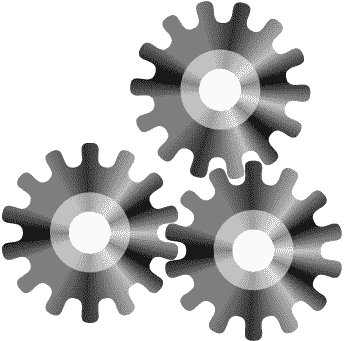

# 使用云调度程序在 GCP 上运行无服务器批处理工作负载——将 Docker 和容器注册添加到组合中

> 原文：<https://medium.com/google-cloud/serverless-batch-workload-on-gcp-adding-docker-and-container-registry-to-the-mix-558f925e1de1?source=collection_archive---------0----------------------->

本快速入门指南是一个系列的一部分，展示了如何利用 Google 云平台组件以更简单的方式运行批处理工作负载。

如果您在开始之前需要一些背景知识，[请看看本系列的第一部分](/google-cloud/running-a-serverless-batch-workload-on-gcp-with-cloud-scheduler-cloud-functions-and-compute-86c2bd573f25)，我描述了让批处理工作负载运行的架构。

首先，让我介绍一下我们这次使用 **GCP** 组件来运行批处理工作负载的解决方案:

图一。预定批处理体系结构

> 如果你读了第一部分，你会注意到我们有两个新的玩家，容器注册和 Docker。

本文的亮点将是容器注册和 Docker，它将使我们能够运行更复杂的批处理作业，我们将在后面详细讨论它…

图二。海绵宝宝盯着一个容器

有很多文章都在讨论使用容器注册表…你为什么要读这篇文章呢？
与其展示命令行和比较方法，我想向您展示一个工作示例，展示如何围绕您的批处理工作负载构建一个持续集成并自动化一切！

图 3。巴斯光年告诉伍迪自动化一切

本帖涵盖的主题将是:

1.  批处理工作量
2.  连接到源存储库
3.  设置批处理工作负载入口点
4.  批处理工作量执行说明

事不宜迟，我们走吧！

> 您将获得一个带有工作示例的 github 存储库。

# 1-批处理工作负荷

作为更复杂的批处理工作负载的候选，我选择了一个组合[**behavior**](https://github.com/behave/behave)，这是一个用于运行 BDD 技术的 python 库，以及 [**alphavantage**](https://www.alphavantage.co/) :一组用于股票、外汇(FX)和数字/加密货币的实时和历史数据的免费 API。

GitHub 仓库的代码是: [alpha_vantage_bdd](https://github.com/mesmacosta/alpha_vantage_bdd)

那么，让我们来看看将要执行的场景:

图 4。具有将被执行的场景的特征文件

通过在目录的根目录下运行命令:

`behave features/ --tags=-wip`

我们应该会看到以下输出:

图 5。显示行为执行结果的终端

这真的很酷，但这是一个本地执行，我们如何将这些代码发送到我们的 Google Cloud 项目并在那里运行批处理工作负载？

图 6。一个处于守势的人，说代码在他们的机器上工作

# 2-连接到源存储库

我们将使用源代码库将我们的 git 工作流扩展到 GCP。

*“云资源存储库是功能齐全的私有 Git 存储库，托管在 Google 云平台上。* *通过连接到其他 GCP 工具，包括云构建、应用引擎、Stackdriver 和云发布/订阅，扩展您的 Git 工作流。”*

转到[该页面](https://source.cloud.google.com/)启动您的源存储库配置。一旦你选择了你的库名，在这个例子中是 alpha_vantage_bdd，从本地 Git 库中选择 Push code，那么将会有 3 个选项来推送你的代码，我选择了 Google Cloud SDK。
按照显示的说明进行操作:

图 7。源 Repo UI —将代码添加到存储库中

我们所做的是将我们的 Github 存储库: [alpha_vantage_bdd](https://github.com/mesmacosta/alpha_vantage_bdd) 推送到一个云资源存储库，它位于我们的 Google Cloud 项目中。云源回购作为我们的原始回购的远程回购。

您键入了类似下面的命令:
`git remote add google https://source.developers.google.com/p/my_project/r/alpha_vantage_bdd
git push google master`

推送至源存储库后，您将能够看到以下内容:

图 8。源存储库 UI —显示创建的存储库

> 按照这个[指南](https://cloud.google.com/source-repositories/docs/mirroring-a-github-repository#connect_to_github)，你可以直接镜像你的 github，而不是把它作为一个远程存储库，但是我还是更喜欢把它作为一个远程存储库来使用，看看那些公开的问题: [73122477](https://issuetracker.google.com/issues/73122477) 和 [133100479](https://issuetracker.google.com/issues/133100479) 。

# 3 —设置批处理工作负载入口点

现在我们已经有了 GCP 内部的代码，我们将为它构建一个 Docker 映像。这是 Dockerfile 文件:

重要的文件是将在 Docker 的入口点执行的脚本:

每当 Docker 容器运行时(在我们的例子中是在计算引擎创建时)，这个入口点将执行 behave 命令，然后将输出发送到 Stackdriver Logging。完成后，虚拟机将被删除。

> 很有趣…但是自动化，自动化一切的行话呢？我们如何自动构建这个 Docker 映像？

我们将为此使用云构建，这就是容器注册将加入游戏的地方！

*“云构建让你可以快速构建跨所有语言的软件。全面控制自定义工作流的定义，以便在虚拟机、无服务器、Kubernetes 或 Firebase 等多种环境中进行构建、测试和部署。”*

让我们看看云构建的构建流程:

图 9。更新批处理代码架构

1 —代码被推送到云源代码库。每当对我们之前配置的原始 repo 执行`git push google master`时，就会发生这种情况。

2 —云构建由主分支上的提交触发。

3 —云构建将 docker 映像打包并存储在云存储中。

4 —图像在**容器注册表**中被标记为最新版本。

为此，请转到[页面](https://console.cloud.google.com/cloud-build/)开始云构建配置:

图 10。云构建 UI，显示图像名称

选择已创建的源存储库，这就很简单了，我们将所有字段保留默认值，但保留图像名称。我们使用 Dockerfile 作为构建配置，并用`:latest`标签对其进行标记，因此我们总是可以获得代码的最新图像。

> 不要担心，Cloud Build 会为您存储以前的映像，以防您需要快速回滚。

一旦我们按下创建触发器，云构建将连接到我们的源存储库:

图 11。构建触发器 UI，显示成功创建的触发器

我们可以通过按下 Run trigger 来测试触发器，一旦完成，我们的 Docker 图像将显示在容器注册表上:

图 12。容器注册 UI，显示创建的 Docker 图像

如您所见，它标有**最新**，这将保证我们在计算引擎虚拟机上始终拥有最新的 Docker 映像！

# 4 —批处理工作负载执行说明

现在我们已经有了容器注册表中的 Docker 映像，这是小菜一碟，还记得我们在[第一篇文章](/google-cloud/running-a-serverless-batch-workload-on-gcp-with-cloud-scheduler-cloud-functions-and-compute-86c2bd573f25)中使用的云函数吗？我们将再次使用它！我们将只更改计算引擎配置，但首先让我向您展示执行流程:

图 13。详细执行

1 —云功能由发布/订阅触发，并调用计算引擎 API 来创建虚拟机

2 —计算引擎从容器注册表中检索最新映像，并启动虚拟机

3—VM 入口点启动批处理进程，运行 Alpha Vantage API 的自动化测试

一旦自动化测试完成，输出就被发送到 Stackdriver Logging。

为了更新上一篇文章中的云功能，让我们改变计算引擎的配置，进入[这一页](https://console.cloud.google.com/compute)。

图 14。计算引擎 UI，显示配置

选择“将容器映像部署到此虚拟机实例”复选框，如果您有兴趣，可以单击“了解更多信息链接”。
对于容器图像，我们将使用在前面步骤中创建的图像，它存储在容器注册表中。这很重要，记得使用语法`:latest`以便我们检索最新的图像。

在 UI 的底部，单击等价的 Rest 链接，这样我们就可以获得将在我们的云功能中使用的配置。

图 14。等效的 Rest 请求弹出窗口，显示虚拟机配置

一旦我们有了它，转到[云函数](https://console.cloud.google.com/functions) UI，并更新`vmConfig`变量，用新的**GCE-container-declaration**配置替换启动脚本，这就是我们的代码看起来的样子:

之后，点击部署按钮，我们就准备好了！

如果我们现在回到我们的[云调度作业](https://console.cloud.google.com/cloudscheduler)，并手动触发它，我们可以看到一切都在一起工作。

> 请记住，这样做将发布到我们的发布/订阅主题，这将启动我们的执行流程。

图 15。引擎运行

按“立即运行”按钮:

图 16。云调度程序 UI，显示“立即运行”按钮

几秒钟后转到计算引擎[页面](https://console.cloud.google.com/compute)，您会看到一个新的虚拟机正在运行，前缀为 **batch-job-executor** 后跟执行时间，这是一个小技巧，因此我们总是有一个唯一的名称，如果我们需要在以后跟踪问题的话。

图 17。计算引擎用户界面。在左侧创建了虚拟机。右边的虚拟机逐渐消失

几秒钟后，您会看到虚拟机名称前的图标发生了变化，这是因为虚拟机正在被删除，一旦删除完成，虚拟机将从实例页面中消失。

最后，为了确保它确实做了一些事情，我们将进入 Stackdriver Logging [页面](https://console.cloud.google.com/logs)，当我们过滤虚拟机名称时，我们可以看到带有**容器注册表**映像的虚拟机的结果！👌🏻

图 18。Stackdriver 日志记录 UI，显示执行结果

最后一件事！为了展示我们持续的集成工作，每当我们做一个`git push google master`，云构建将运行并为我们创建一个新的容器注册表映像，用 latest 标记它。在下图中，您可以看到只有最新的图像标记为最新，这意味着下次云调度程序运行时，它将获得新版本！

图 19。容器注册用户界面，显示 3 个图像，最近的一个标记为最新的

# 今天就到这里吧！

这是展示如何使用 Google 云平台以更简单的方式运行批量工作负载的系列文章的第二篇。

在这篇文章中，我们展示了一个更复杂的批处理工作负载来帮助您开始，为了能够轻松地更新批处理工作负载，我们使用了 Google Source Repositories、Cloud Build、Container Registry 和 Docker 的组合。

感谢您的宝贵时间！请继续关注下一篇文章，我们将再次连接 Pub/Sub，以分离我们的批处理工作负载结果，并向您展示如何向 Google Chat 发送通知！干杯！

# 参考

*   **Github 资源库**:[https://github.com/mesmacosta/alpha_vantage_bdd](https://github.com/mesmacosta/alpha_vantage_bdd)
*   **谷歌源代码库**:[https://cloud.google.com/source-repositories/](https://cloud.google.com/source-repositories/)
*   **谷歌容器注册表**:[https://cloud.google.com/container-registry/](https://cloud.google.com/container-registry/)
*   **谷歌云构建**:[https://cloud.google.com/cloud-build/](https://cloud.google.com/cloud-build/)
*   **阿尔法 Vantage Python**:[https://github.com/RomelTorres/alpha_vantage](https://github.com/RomelTorres/alpha_vantage)