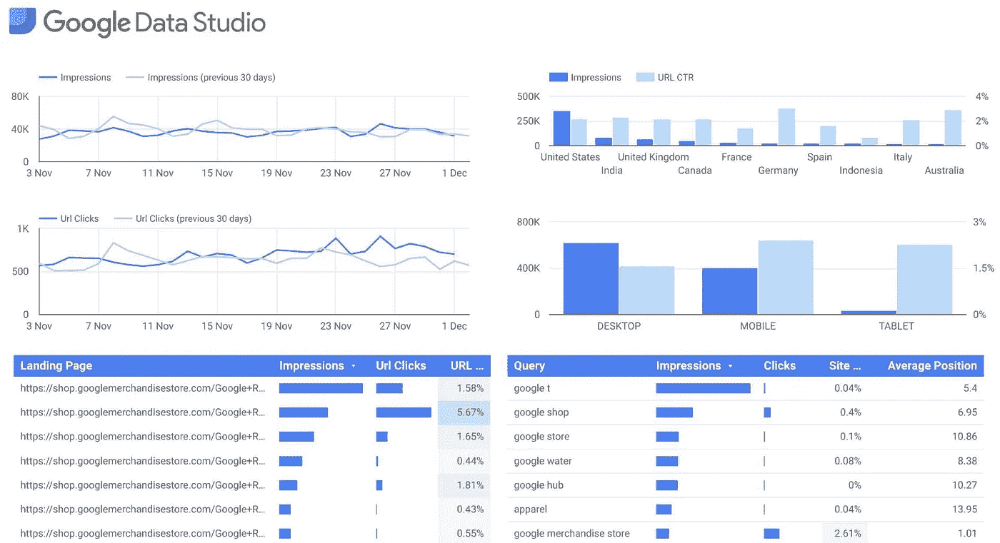

# GCP 的无服务器 Chrome 自动化

> 原文：<https://medium.com/google-cloud/serverless-chrome-automation-with-gcp-849e5c7b16f4?source=collection_archive---------1----------------------->

来自样本图库的谷歌数据工作室报告

谷歌[数据工作室](https://datastudio.google.com/)是一个令人惊奇的*免费*工具，它允许任何人用几乎任何种类的[数据源](https://datastudio.google.com/data)快速构建漂亮且易于共享的仪表板。但它有一个令人沮丧的限制:报告不是实时的。

加载报表的第一个读者将获得最新的数据，但即使数据源中有更新的数据，数据也会被缓存长达 12 个小时