# 无服务器计算变得简单

> 原文：<https://medium.com/google-cloud/serverless-computing-made-easy-40e534ae410e?source=collection_archive---------0----------------------->

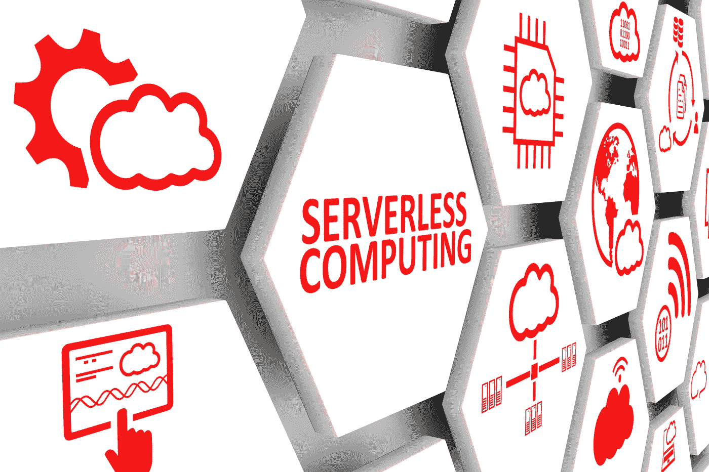

谷歌云平台的云功能是一种无需服务器的便捷方式

谷歌云平台(GCP)具有强大的无服务器计算功能。云函数不仅允许按需进行函数式编程，它们还可以作为云范围内的事件处理程序。

将我们的讨论缩小到一个常见的用例，我们可以从 Stackdriver 中记录的事件触发云功能。在这种情况下，我们将使用一个我们可以轻松控制的事件；将外部 IP 连接到虚拟机。当检测到静态 IP 更改时，受影响的虚拟机将在 GCP 环境中迁移。这样做的实际目的是修复无法注册新静态 IP 地址的虚拟机。

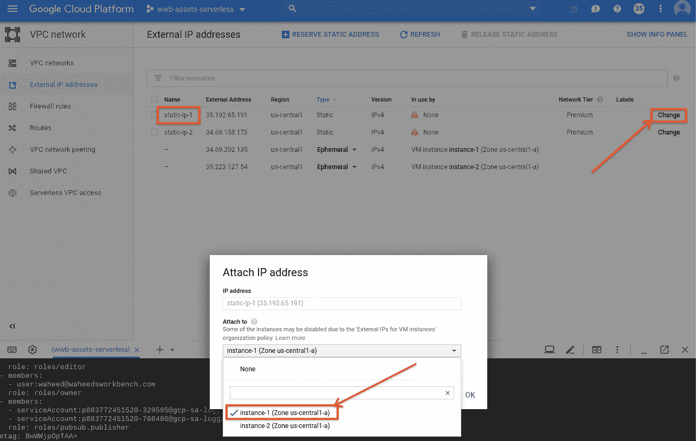

将静态外部 IP 连接到虚拟机会创建堆栈驱动程序日志记录事件

这篇博文的源代码可以在 Github 的[这里找到。提供了一个安装脚本(](https://github.com/waheedbrown/serverless) [gcloud_script.sh](https://github.com/waheedbrown/serverless/blob/master/gcloud_script.sh) )，以及自述文件中的说明。安装脚本将为读者配置所有必需的 GCP 资源。请注意安装脚本开始时的 Linux shell 脚本变量。您至少需要为您自己的 GCP 项目添加 PROJECT_ID。

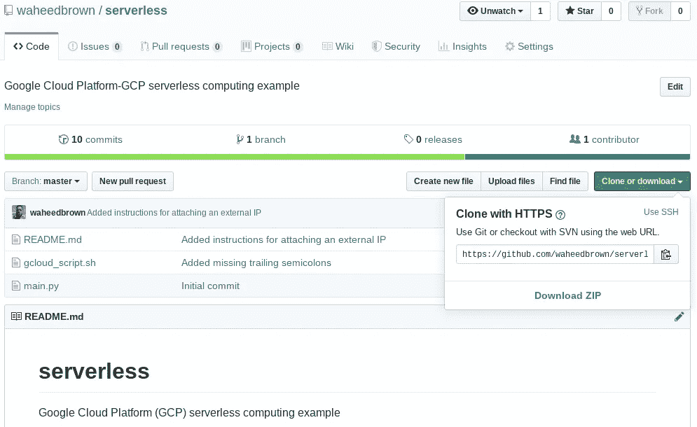

Github 上的源代码([点击这里](https://github.com/waheedbrown/serverless))

浏览安装脚本，有一系列 gcloud 命令。这些命令的应用通常对 GCP 工具箱是有用的。特别感兴趣的是创建日志接收器和 GCP 云函数的命令:

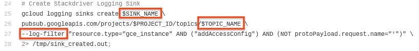

日志接收器将 Stackdriver 连接到 Pub/Sub

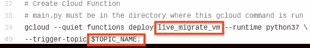

云功能由发布/订阅主题触发，由日志接收器写入

日志接收器实际上是为云功能连接一切的东西。Stackdriver 日志过滤器实时捕获匹配的日志记录条目。这些条目随后被日志接收器捕获，然后发布到发布/订阅主题。关于发布/订阅的深入讨论超出了这篇博文的范围，这也是提供安装脚本的原因。同样，安装脚本创建了云函数。

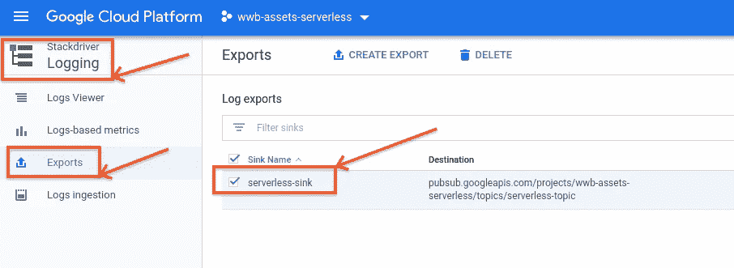

Stackdriver 日志记录接收器的目的地是一个发布/订阅主题，在 GCP 控制台中可见

云功能是存在于临时可用的 VM 资源上的代码片段。这不是由用户控制的虚拟机，在 GCP 控制台中也不可见。可见的是专门执行云功能的 Google Cloud App Engine 服务账号。

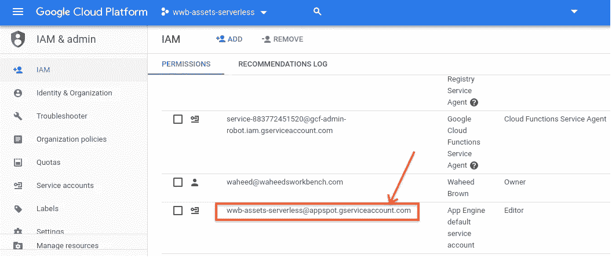

App Engine 服务帐户代表用户执行云功能

云函数的主体包含在 Github 存储库中的 main.py 中。这个名称很重要，因为 gcloud 在创建云函数本身时会查找这个特定的名称。gcloud 还会将 main.py 上传到您的 GCP 项目中的云函数工作区。然后，该函数被赋予您指定的名称。虽然云函数创建的机制超出了本文的范围，但是重要的是创建语法。使用安装脚本中的语法是创建云函数的一种可靠方式。存在其他方法，但是它们经常提供非描述性的错误。

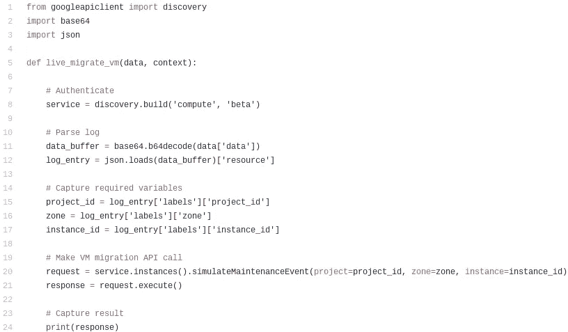

main.py 包含云函数体，在本例中是用 Python 编写的

仔细看看云函数体，最重要的一步是第 8 行。在这里，云函数根据 Google Cloud 进行认证。由于 App Engine 服务帐户已经拥有必要的权限，因此这一步非常简单。相比之下，如果我们编写一个在云功能之外执行的脚本，认证将需要更多的劳动。

第 11 行说明 Stackdriver 日志是 base64 编码的。第 12 行说明了以 JSON 格式保存的 Stackdriver 日志。第 15 到 17 行访问 JSON 树中的各种元素，每组括号代表树的深度。

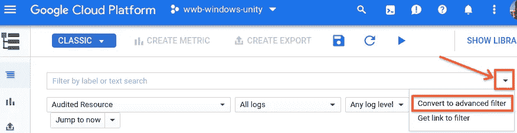

在云控制台的 Stackdriver 日志记录页面上，单击小三角形并进入高级过滤模式

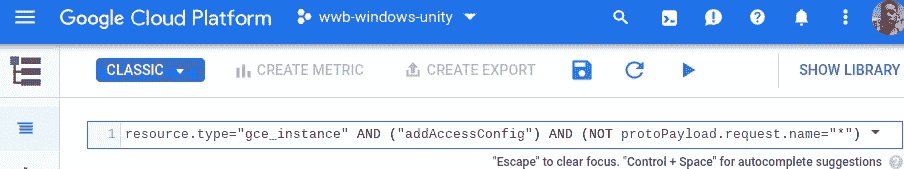

从 gcloud_script.sh 安装文件中输入高级日志过滤器(去掉引号)

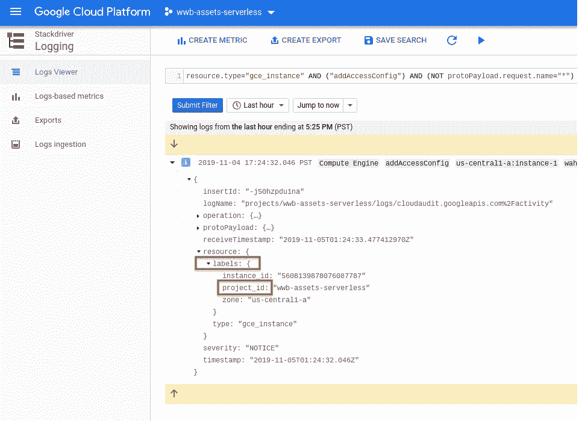

resource 是 JSON 根节点，labels 和 project_id 是一层和两层

云函数中的第 20 行触发了虚拟机迁移。

了解了所有这些，就可以将一个静态 IP 附加到一个虚拟机上来触发云功能。gcloud_script.sh 安装脚本创建了两个静态 ip，static-ip-1 和 static-ip-2。将其中任何一个分配给脚本创建的虚拟机都会触发云功能。

在 GCP 控制台的“VPC 网络，外部 IP 地址”部分，可以手动将静态 IP 分配给虚拟机

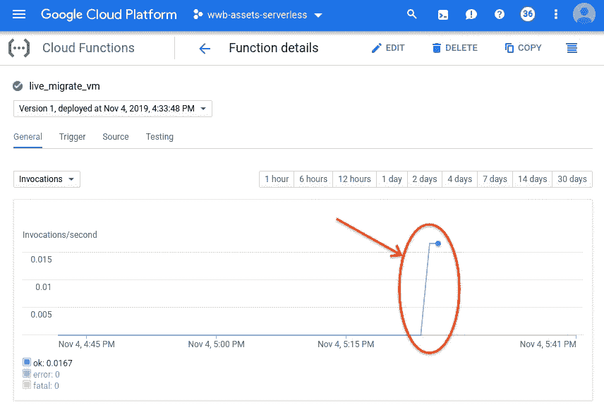

调用了云函数，如调用图上的尖峰所示

最后，云函数本身会创建一个 Stackdriver 事件。这有助于确认云功能是否确实有效。对于应用引擎服务帐户，包含“GCE_OPERATION_DONE”的日志条目将提供此确认。为了方便起见，本文中使用的 Stackdriver 日志过滤器也在 Github 存储库中。

**注意:**云函数的执行和它在 Stackdriver 中的日志记录之间偶尔会有滞后。如果你怀疑有一个合理的错误，向下滚动到调试文章的链接。

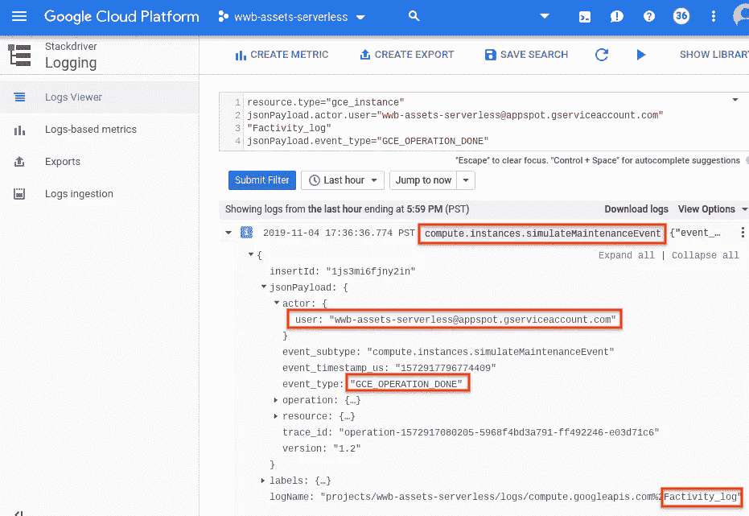

下一篇文章将介绍[调试无服务器功能](/google-cloud/debugging-serverless-functions-53f99a7f3cb2)，这将使您自信地走向无服务器。