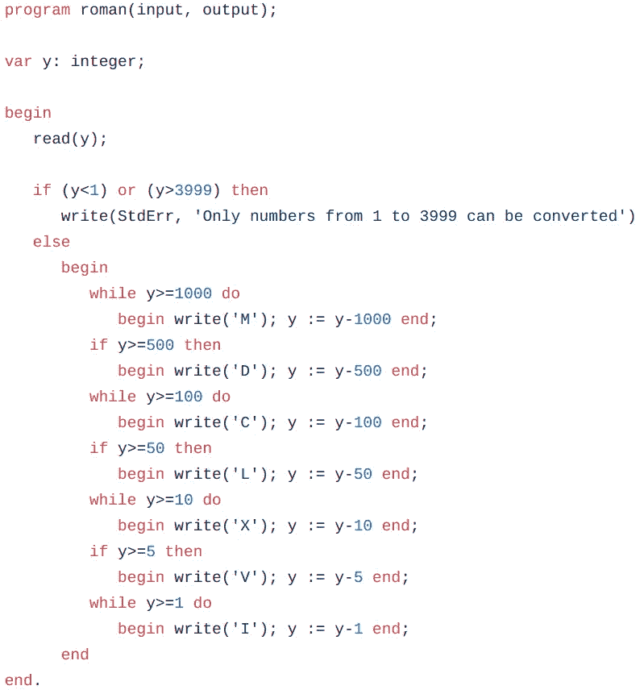

# 用 Pascal 进行无服务器计算？

> 原文：<https://medium.com/google-cloud/serverless-computing-with-pascal-d7a16633db44?source=collection_archive---------1----------------------->

对无服务器计算感兴趣，但不想使用一些新奇的编程语言，如 Python、JavaScript 或 Go？那么为什么不用 Pascal 语言编写你的无服务器 web 应用呢？让我们回到 20 世纪 70 年代，从 1974 年出版的权威 [Pascal 用户手册和报告](https://www.springer.com/gp/book/9780387976495)中取出一个 Pascal 程序，并将其部署到谷歌[云运行](https://cloud.google.com/run/)无服务器平台。哦，这里有一个 20 世纪 70 年代的背景音乐播放列表让你集中注意力。

> 那是什么？**你没有运行无服务器 Pascal 的需求？然后，也许你有一些其他的仅可执行形式的遗留软件，或者一种不被无服务器平台广泛支持的语言，或者由几个不同的应用构建而成。这里展示的技术也可以解决这些问题。**

## 一些背景

[Google Cloud Functions](https://cloud.google.com/functions/) 和类似的无服务器解决方案使得将功能部署到云上变得极其容易。您只需编写您的应用程序代码，将其上传到服务，他们就会为您处理部署、供应、基础架构、扩展、日志记录和安全性。它们很棒，但需要权衡。他们只接受一个用他们支持的语言编写的程序。而帕斯卡不是(还不是？)支持的语言之一。

但是[云运行](https://cloud.google.com/run/)提供了类似的功能，但权衡稍有不同。可以用其他语言(比如 Pascal！)、可执行文件或多个程序，但您需要提供一个[容器](https://www.docker.com/resources/what-container)，而不仅仅是源代码。这要多做一点工作，但比您想象的要少，因为[云构建](https://cloud.google.com/cloud-build/)会为您完成这项工作。您还可以获得所有正常的无服务器优势，如自动伸缩(甚至在代码不运行时为零)。让我们看看怎么做。

## TL；灾难恢复:一键式部署

示例[项目存储库在 GitHub](https://github.com/engelke/cloud-run-pascal) 上。看一看它。显示 README 文件，靠近顶部有一个大按钮:

如果你有一个谷歌云账户，比如 Gmail 账户，你可以点击那个按钮，回答它显示的任何提示，几分钟后你就会有一个运行中的 web 服务，它是由库中的 Pascal 程序构建的。该 URL 将在部署服务时显示。

您可以派生这个存储库，并将其更改为运行您自己的 Pascal 代码(或者稍微调整一下，运行任何其他代码)，并以同样的方式启动您自己的新服务。甚至有可能让服务在你自己的域名上运行。

## 它是如何工作的

我把一个 Pascal 程序作为一个 web 服务部署到云上。它接受一个数字并返回相同的数字，但用的是罗马数字。想看看用罗马数字表示的 1974 年(我正在使用的程序出版的那一年)是什么样子吗？只需通过[https://roman.engelke.dev/1974](https://roman.engelke.dev/1974)打电话给 RESTful 服务了解一下。或者您可以在 URL 中输入不同的数字进行转换。这个程序不使用罗马数字快捷键(如 IX 代表 9)，所以一行中可以有四个字母。

要自己从头开始构建，首先创建一个新文件夹来保存所有的部分，或者使用下面的命令将 GitHub 存储库克隆到一个新文件夹中:

`git clone https://github.com/engelke/cloud-run-pascal.git`

该文件夹将包含 Pascal 程序和任何其他需要的部分，以使它在云上运行。首先是[帕斯卡程序](https://github.com/engelke/cloud-run-pascal/blob/master/roman.pas)本身:

罗曼.帕斯

简洁明了，请看:子句用分号分隔，程序以句号结尾！较新的语言没有很好的标点符号。这个程序所做的就是从标准输入中读取一个整数，并写出等同于标准输出的罗马数字。这不需要现代网络技术。这很好，因为 Pascal 比 web 早了几十年。它甚至比互联网协议 IP 还要古老。

Pascal 程序不理解 web，但是容器必须包含 web 服务器。当一个 web 请求进入 Cloud Run 时，它将运行容器并将请求发送到容器中的 web 服务器。这个 web 服务器是由一个 [Python 包装程序](https://github.com/engelke/cloud-run-pascal/blob/master/app.py)提供的。包装程序不理解应用程序，它是一个胶水软件，监听一个 web 请求，从 URL 的末尾提取数字，并以该数字作为输入运行 Pascal 程序。如果 Pascal 程序崩溃，包装器返回一个`500 Server Error`消息。如果程序写了一个错误消息，包装器返回一个`400 Bad Request`消息。否则，包装器获取 Pascal 程序的输出，并将其作为响应的主体返回。

除了 Python 包装程序，还有一个 [requirements.txt 文件](https://github.com/engelke/cloud-run-pascal/blob/master/requirements.txt)，它指定了程序需要哪些 Python 库。同样，这只是需要包装我们需要运行的真正的程序，它是用 Pascal 语言编写的。

唯一需要的其他东西是 Dockerfile ，一个告诉如何构建容器的文本文件。让我们来看看吧。

*   `FROM python:3.7-slim`
    在名为 **python:3.7-slim** 的标准容器之上构建容器。
*   `ENV APP_HOME /app
    WORKDIR $APP_HOME
    COPY . ./`
    指定在容器中的什么地方放置代码，并将文件复制到当前目录那里。
*   `RUN pip install -r requirements.txt` 作为构建容器的一部分，运行这个命令来安装 Python 包装程序所需的库。
*   `RUN apt-get update -y -q
    RUN apt-get install -y -q fpc
    RUN fpc roman.pas`
    Pascal 源代码不能直接运行，必须先编译(转换成二进制可执行文件)。所以，在构建容器时，这些行表示运行命令来安装一个名为 **fpc** 的 Pascal 编译器，然后用它来编译 **roman.pas** 程序。容器内生成的二进制可执行文件将被称为**罗马**。
*   `CMD exec gunicorn --bind:$PORT --workers 1 --threads 8 app:app`
    在构建和部署容器后，无论何时运行它，它都应该调用这个命令，这将启动 Python 包装程序，并让它在容器提供的网络端口上监听 web 请求。

如果你看一看基本的[云运行快速启动教程](https://cloud.google.com/run/docs/quickstarts/build-and-deploy)，你会在其中看到大部分内容。运行 Pascal 代码所需的唯一新部分是安装并运行 Pascal 编译器的三行代码，它将 Pascal 源代码转换为可执行文件。

## 构建和部署

一旦您创建或克隆了包含四个所需文件的文件夹: **roman.pas** 、 **app.py** 、 **requirements.txt** 和 **Dockerfile** ，您就可以将它部署到云运行。你需要一个谷歌账户(比如 Gmail 账户)，你可以[安装谷歌云 SDK](https://cloud.google.com/sdk/install) 或者你自己的电脑，或者从你的浏览器内部使用[云外壳](https://cloud.google.com/shell/)(已经安装了 SDK)来运行必要的命令。

准备好了吗？以下是步骤:

1.  在你的浏览器中进入[谷歌云控制台](https://console.cloud.google.com/)，如果你还没有登录的话，请登录。如果这是你第一次使用该控制台，你可能必须同意条款和条件。
2.  创建一个新项目，方法是单击页面顶部的下拉菜单(会显示“选择一个项目”或显示一个选定的项目)，然后单击“新建项目”并输入您想要的名称。等待几分钟以创建项目，然后从页面顶部的下拉列表中选择它。
3.  回到你电脑上的命令行，或者在 Cloud Shell 中，让 Google Cloud 构建你的容器:
    `gcloud builds submit --tag gcr.io/PROJECT-ID/my-program-name`
    (其中`PROJECT-ID`是你创建项目时创建的那个，`my-program-name`是你想用来描述它的任何名字)。回答任何提示——选择应该是清楚的。这将构建您的容器，并将其保存在您控制下的云容器存储库中。
4.  现在将容器部署到云运行:
    `gcloud beta run deploy \
    --image gcr.io/PROJECT-ID/my-program-name \
    --platform managed`
    您可以将命令放在一个很长的行中。如果需要，请删除反斜杠。再次回答显示的任何提示。
5.  几分钟后，命令行将显示服务 URL。你可以在你的浏览器中打开它，但是记住在它后面加上`/number`，对于某个十进制数，得到罗马数字版本。

你现在有一个 45 岁的 Pascal 程序作为一个无服务器的云应用程序运行。也许你不需要，但是有一天你可能需要一些其他的东西，这些东西有点超出了大多数无服务器平台的支持，但是你可以在容器中完成。那时，云运行将为您带来回报。

## 最后的想法

您部署的应用程序的 URL 将由 Google 提供，但您可能想要一个更友好的选项。如果你愿意，你可以[将你的应用连接到你拥有的域名](https://cloud.google.com/run/docs/mapping-custom-domains)上的一个 URL。这有点棘手，但如果你已经建立了自己的域名，这应该不成问题。我做到了，我的罗马数字服务可以在 roman.engelke.dev 获得，例如[https://roman.engelke.dev/2345](https://roman.engelke.dev/2345)。

在这个例子中，构建容器最慢的部分之一是安装 Pascal 编译器。我本可以在自己的计算机上编译 Pascal 程序，并在构建时使用可执行文件而不是文件夹中的源代码。这将让我跳过在容器中安装编译器的步骤。但是因为构建容器很少发生，所以我决定通过编译来确保我的最新源代码总是被使用。

本教程使用完全托管的云运行，让谷歌为你处理所有的工作。但是你也可以部署到在 GKE 上运行的[云上，无论是在谷歌云平台上还是在你自己的地方，如果这对你的应用程序很重要的话。](https://cloud.google.com/run/docs/gke/setup)