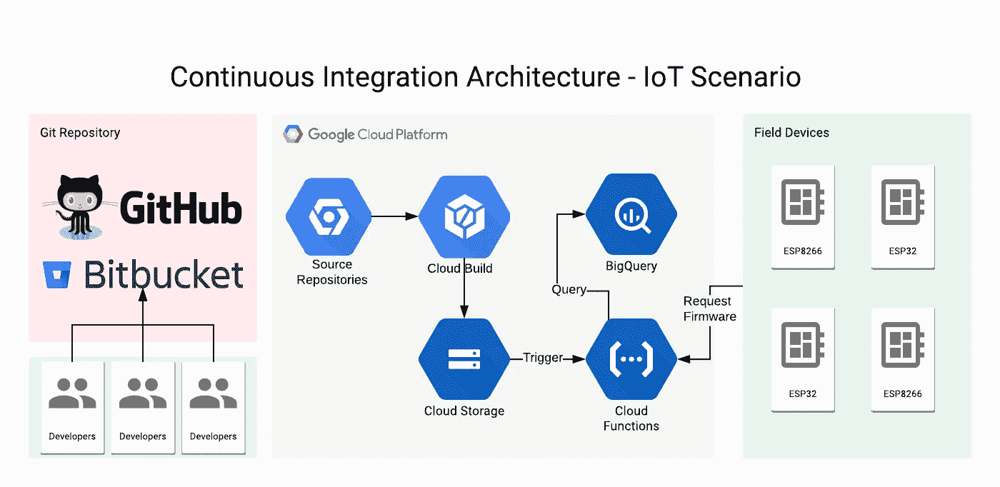
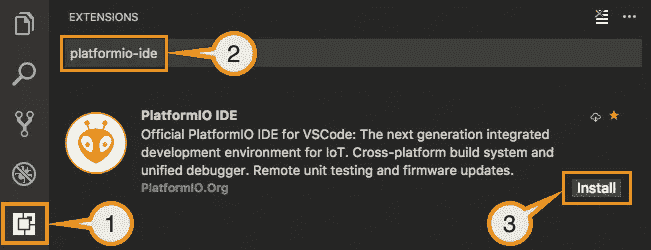
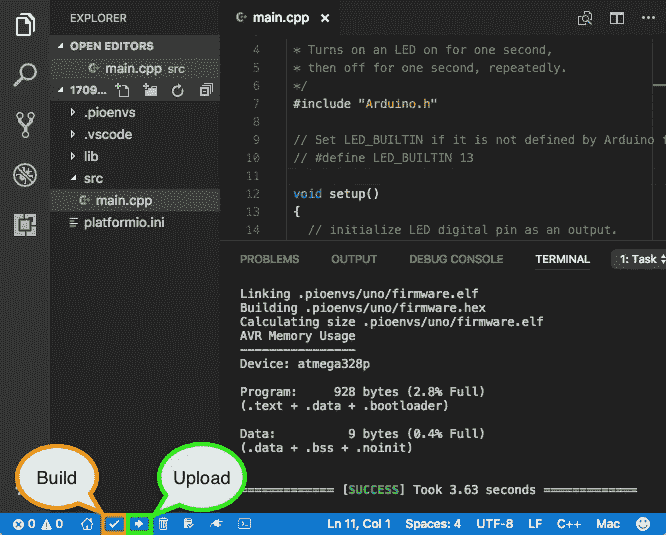
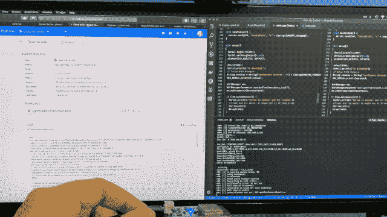

# 使用 Google Cloud Build 和 Arduino 的物联网设备的无服务器持续集成和 OTA 更新流程

> 原文：<https://medium.com/google-cloud/serverless-continuous-integration-and-ota-update-flow-using-google-cloud-build-and-arduino-d5e1cda504bf?source=collection_archive---------0----------------------->

## 如何在云中持续构建您的固件并自动发送到您的设备。



项目架构

空中添加(OTA)更新是物联网应用成功的重要因素。这是一种确保设备始终保持最新的新设置、安全修复以及向硬件添加新功能的机制，让带来设备的客户对硬件改进感到满意，同时感到更安全。

OTA 架构有两个重要部分:

*   **远程设备**:负责检查更新，下载新版本并应用于自身。
*   **云服务器**:负责构建、分发和管理连接设备的更新。

在这里，我将展示如何使用一些**谷歌云**工具设置初始 OTA 机制，使用 **Arduino** 平台将更新部署到 **ESP8266** 和 **ESP32** 板。

**PlatformIO** 将用于构建映像，因为它有一套命令行工具，使我们能够自动为设备生成二进制映像。在 Google Cloud 上，我们将使用 **Google Cloud Build** ，这是一个托管的**持续集成**环境， **Google Cloud Storage** 用于在云上存储二进制映像， **Cloud Functions** 用于处理 HTTP 请求，查询当前固件版本并管理它们。


项目架构

# PlatformIO 入门

PlatformIO 是一套用于嵌入式设备开发的跨平台工具。它支持许多不同的物联网开发平台和框架，也支持社区制作的大量库，可以轻松用于您的项目。

我建议安装 Visual Studio 代码(VSCode) IDE 和 PlatformIO 插件来开始使用它。只需按照下面链接中的步骤操作:

[](https://platformio.org/platformio-ide) [## PlatformIO:面向物联网开发的开源生态系统

### 跨平台构建系统和库管理器。跨平台 IDE 和统一调试器。远程单元测试和…

platformio.org](https://platformio.org/platformio-ide) 

安装 PlatformIO VSCode 插件

这个项目的代码可以在下面的 Github 链接中找到。克隆或下载项目代码，并在 IDE 上打开它。

[](https://github.com/alvarowolfx/gcloud-ota-arduino-update) [## alvarowolfx/g cloud-OTA-arduino-更新

### 在 GitHub 上创建一个帐户，为 alvarowolfx/g cloud-OTA-arduino-update 开发做贡献。

github.com](https://github.com/alvarowolfx/gcloud-ota-arduino-update) 

`platformio.ini`文件包含在 ESP32 和 ESP8266 板上构建项目的所有配置。此外，这里还列出了项目依赖关系。一个重要的配置是构建标志`VERSION`，它在项目代码上编译，以标记设备当前运行的版本。因此，每次我们创建一个新的固件版本时，这段代码都应该被删除，以便设备能够正确检查是否需要下载新版本。

设备代码向后端发出 HTTP 查询，发送当前版本，检查是否应该下载新版本。此外，还有一个设备内部 HTTP 处理程序来显示当前版本。为了处理 WiFi 连接，该项目使用了 **WifiManager** 库，它创建了一个接入点来在设备上设置 Wifi。

要部署到主板，您可以使用 PlatformIO 工具栏上的“构建”和“上传”按钮:



图片来自 PlatformIO 快速入门[https://docs.platformio.org/en/latest/ide/vscode.html#id2](https://docs.platformio.org/en/latest/ide/vscode.html#id2)

# 设置云构建和 Git 存储库

要开始使用谷歌云，你可以在云控制台 web 界面上做所有的事情，但命令行工具是一个更强大的工具，我们需要稍后部署云功能。要使用`gcloud`命令行工具，[按照这里的说明下载并安装](https://cloud.google.com/sdk/downloads)。

[](https://console.cloud.google.com/projectcreate) [## 谷歌云平台

### Google 云平台让您可以在同一基础设施上构建、部署和扩展应用程序、网站和服务…

console.cloud.google.com](https://console.cloud.google.com/projectcreate)  [## 安装 Google Cloud SDK | Cloud SDK 文档| Google Cloud

### 编辑描述

cloud.google.com](https://cloud.google.com/sdk/downloads) 

此外，在此之后，您应该验证并创建一个在本教程中使用的项目，用您想要的名称替换`YOUR_PROJECT_NAME`:

```
# Authenticate with Google Cloud:
gcloud auth login
# Create cloud project — choose your unique project name:
gcloud projects create YOUR_PROJECT_NAME
# Set current project
gcloud config set project YOUR_PROJECT_NAME
```

现在让我们创建云构建配置和存储二进制文件的存储桶。遵循以下步骤:

**云构建设置:**

*   打开[云构建页面](https://console.cloud.google.com/cloud-build)。
*   启用**云构建 API** 如果尚未启用。
*   选择**触发器选项卡**。
*   点击**创建触发器**。
*   现在您可以选择您的 Git 存储库并向您的提供者进行认证。我用了 Github。
*   在最后一步，**触发器设置**，让我们通过 git 标签创建一个触发器。
*   将其命名为“由构建标签触发”。
*   选择**标签**作为**触发类型**。
*   选择 **cloudbuild.yaml** 作为**构建配置**类型。
*   点击**创建触发器**。

**云存储设置**:

*   现在打开[云存储页面](https://console.cloud.google.com/storage/browser)
*   选择**浏览器标签**。
*   点击**创建存储桶**。
*   创建一个名为`YOUR_PROJECT_NAME-firmwares`的桶，并选择其他值作为默认值。在我的例子中，这个桶的名字是`gcloud-ota-update-firmwares`。
*   点击**创建**。

我们的存储库包含一个 cloudbuild.yaml 文件，该文件包含构建固件和推送到云存储的所有配置。Cloud Build 使用 Docker 来构建工件，所以我使用了一个包含所有 PlatformIO 工具的映像，使用我们的`platformio.ini`文件来构建嵌入式项目。

云构建文件。

现在，每当您将新的标签推送到您的存储库时，它将触发一个基于云构建的构建。您可以在 git 提供程序的 UI 上创建标记，也可以使用下面的 git 命令来完成。

```
git tag -a v1.0.0 -m "First build"
git push -u origin --tags
```

如果一切正常，当您推送新标签时，您应该会在云构建页面的历史标签上看到一些构建。我们将在文章的最后再次讨论这个问题，看看如何推出新版本。

# 部署云功能

为了控制 OTA 过程，我们基本上需要两件事情:将固件元数据存储在数据库中，以便我们可以稍后查询最新版本，以及检查是否给定了当前设备版本的方法，检查是否有更新设备的需要。为此，我构建了两个云函数:

*   **insertFirmwaresOnBigquery**:当有新文件上传到云存储时触发该功能。通过这种方式，我们将这些元数据存储在 BigQuery 上，以便以后可以通过设备变体和固件版本进行查询和过滤。

*   **getDownloadUrl** :这是一个 HTTP 函数，它接收当前设备版本及其变体(在本例中是 esp32 或 esp8266)。然后，它向 BigQuery 查询最新版本，并将设备版本与最新固件版本进行比较。

现在您将需要我们在开始时安装的`gcloud`工具来部署这些功能。修改文件`deploy-prod.sh`上的项目 ID，并运行它来部署这两个功能。第一次，它可能会要求启用云函数 API。确认一下，然后继续这个过程。

```
./deploy-prod.sh
```

使用这个命令，所有的功能都将部署到我们的架构中，并对事件做出反应。

# 推出新版本

推送和构建一个可以被设备下载的新版本很简单，只需几个 git 命令，我们就可以触发一个新的持续集成构建。所以，让我们假设你给设备增加了一个新的功能，比如循环函数上的一个闪烁。

小代码添加到我们的新固件版本。

现在要创建一个新的版本，更改`platformio.ini`文件的版本，例如从 v1.1.0 到 v1.2.0，提交更改的文件，标记新的提交，并将所有文件推送到存储库。以下是命令:

```
# Commit the files
git add src/main.cpp platformio.ini
git commit -m "[feat] Add blink feature"
# Tag this commit
git tag -a v1.2.0 -m "Add blink feature"
# Send to the repository with the tags
git push -u origin master --tags
```

这将触发我们的所有进程，当这一切都完成后，您可以使用旧版本重置您的设备，并在日志中看到它将下载新版本并自行重置。如果一切正常，你应该开始看到你的 LED 闪烁。



项目构建和接收新固件的设备。

# 结论

我希望本教程能够让您大致了解如何实现这一过程的自动化，以实现更好的物联网部署。我们经历了 OTA 部署过程中的许多环节，但当然，这还太简单了。我们可以通过添加更多功能来改进，例如:

*   发布渠道:不同的设备检查不同的渠道，如生产，测试和阿尔法渠道。通过这种方式，我们可以限制内部设备只能接收公司测试的新版本，然后将该版本推送给所有客户。
*   使用设备上的私钥来验证设备是否可以接收这些更新，并使整个过程更加安全。
*   在一定时间范围内检查更新，并提供用户反馈:当更新到来时，用户可以使用设备，我们应该处理这个问题，并等待用户确认更新过程。这样，我们就不会因为新的更新到来就阻止用户与设备的交互。

参考资料:

*   [https://dzone . com/articles/how-to-approach-OTA-updates-for-IOT](https://dzone.com/articles/how-to-approach-ota-updates-for-iot)
*   [https://cloud.google.com/functions/docs/writing](https://cloud.google.com/functions/docs/writing)
*   [https://cloud.google.com/functions/docs/tutorials/storage](https://cloud.google.com/functions/docs/tutorials/storage)
*   [http://docs.platformio.org/en/latest](http://docs.platformio.org/en/latest/userguide/cmd_ci.html)