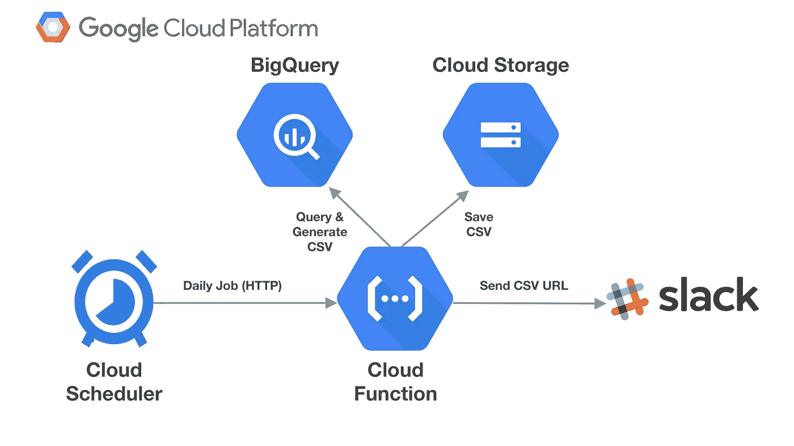
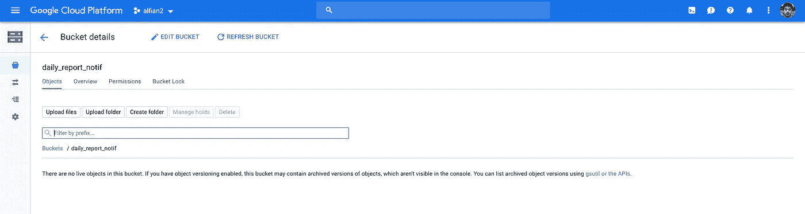
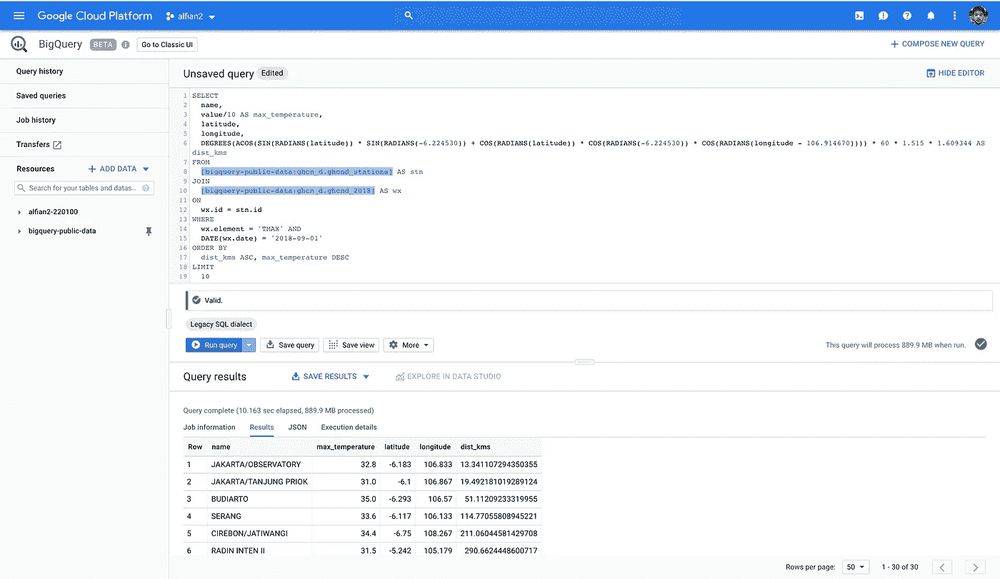
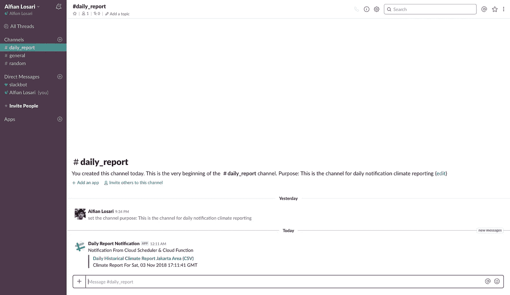
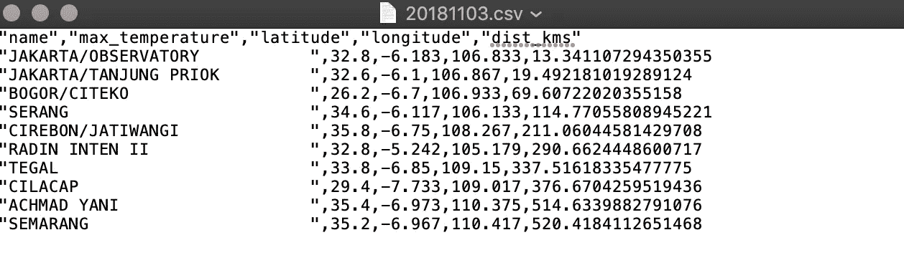
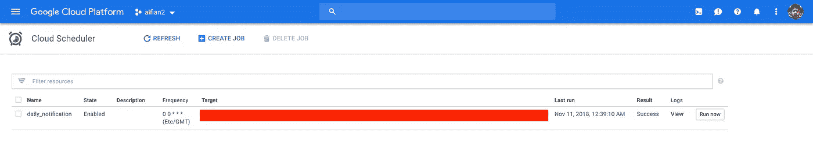
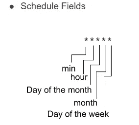

# 无服务器计划的每日数据报告通知服务，具有 Google Cloud Scheduler 和云功能

> 原文：<https://medium.com/google-cloud/serverless-daily-reporting-notification-service-with-google-cloud-scheduler-cloud-functions-d3cc42390006?source=collection_archive---------0----------------------->



无服务器计划每日报告数据架构

你也可以使用下面的链接在我的 Xcoding With Alfian 博客网站上阅读这篇文章。

[](https://www.alfianlosari.com/posts/serverless-reporting-notification-service-with-google-cloud-scheduler-and-functions) [## 无服务器每日报告通知服务与谷歌云调度和云功能|…

### 任务调度是开发人员在系统中运行各种自动化任务的一个非常重要的工具

www.alfianlosari.com](https://www.alfianlosari.com/posts/serverless-reporting-notification-service-with-google-cloud-scheduler-and-functions) 

任务调度是开发人员在系统中运行各种自动化任务的非常重要的工具，例如执行数据库维护、执行日常大数据批量操作以及整体系统维护。

构建执行任务调度的基础架构是一项具有挑战性的任务，有几件重要的事情需要仔细考虑，例如:

1.  扩展和管理基础设施。
2.  监视作业状态的当前状态。
3.  正常重试失败的作业。
4.  记录作业并监控性能。

2018 年 11 月初，谷歌云平台终于发布了 Cloud Scheduler，这是一个完全托管、可扩展、容错的 cron 作业调度程序，允许开发者在一个地方自动化他们所有的计划任务。它们提供了许多令人惊叹的功能，例如:

1.  全面管理并保证至少交付一次。
2.  支持许多目标，如云发布订阅，应用引擎，HTTP 端点。
3.  用于分析性能的堆栈驱动程序日志记录。
4.  可配置的重试策略。

[](https://cloud.google.com/scheduler/) [## 云调度器|谷歌云

### 完全托管的 cron 服务，用于调度几乎任何作业，包括批处理、大数据作业、云基础架构…

cloud.google.com](https://cloud.google.com/scheduler/) 

在本文中，我们将构建一个简单的通知服务，使用几个 Google 云服务设置每日计划数据报告，并使用 Slack HTTP Webhook 设置通知。

# 我们将建造什么

*   Google 云存储:创建 bucket 来保存生成的 CSV blob 以供公共 URL 访问。
*   全球历史气候网络公共数据集查询。生成雅加达 GHCN 站周围位置半径内上周最高温度的数据，按公里距离和最高温度排序。
*   Google Cloud Functions:一个 node.js 函数，从 BigQuery 中查询数据，转换成 CSV 格式保存到 Cloud 中，然后通过 Webhook 发送 URL 通知 Slack Channel。
*   Google Cloud Scheduler:每天 UTC 午夜触发云功能端点的计划作业。

**！！！完成教程后，请确保清除并删除所有创建的资源，以避免在 GCP 的重复成本！！！**

您可以在下面的 GitHub 资源库链接中下载项目源代码。

[](https://github.com/alfianlosari/gcp-serverless-cron-job) [## alfianlosari/GCP-无服务器-cron-job

### 使用 Google 云平台的无服务器计划每日报告通知服务…

github.com](https://github.com/alfianlosari/gcp-serverless-cron-job) 

# 创建谷歌云存储桶

首先，我们需要在 Google 云存储中创建一个新的 bucket。这个 bucket 将用于存储数据的 CSV 文件，稍后我们将在云函数内部的 BigQuery 中查询这些数据。我们将使用控制面板来创建存储桶:

1.  打开[谷歌云存储控制台](https://console.cloud.google.com/storage/browse)
2.  键入存储桶的名称
3.  将地区留给多地区，地点留给美国
4.  单击创建



确保将 bucket 名称存储在某个地方，因为稍后在保存 CSV 时，将在云函数中使用它来引用 bucket。

# 使用 BigQuery 查询公共全球历史气候网络数据集

我们将用作每日报告的每日数据是来自 BigQuery 内全球历史气候网络(GHCN)的公共数据集。该查询将检索雅加达 Blok M 半径区域内 GHCN 站点上周的最高温度。您可以尝试使用 BigQuery 仪表板和硬编码值来查询数据:

1.  打开 [BigQuery 控制台](https://console.cloud.google.com/bigquery)。
2.  在查询编辑器中解析该查询

```
SELECT
  name,
  value/10 AS max_temperature,
  latitude,
  longitude,
  DEGREES(ACOS(SIN(RADIANS(latitude)) * SIN(RADIANS(-6.224530)) + COS(RADIANS(latitude)) * COS(RADIANS(-6.224530)) * COS(RADIANS(longitude - 106.914670)))) * 60 * 1.515 * 1.609344 AS dist_kms  
FROM
  [bigquery-public-data:ghcn_d.ghcnd_stations] AS stn
JOIN
  [bigquery-public-data:ghcn_d.ghcnd_2018] AS wx
ON
  wx.id = stn.id
WHERE
  wx.element = 'TMAX' AND
  DATE(wx.date) = '2018-11-09'
ORDER BY
  dist_kms ASC, max_temperature DESC
LIMIT
  10
```

3.点击更多并查询设置。

4.将 SQL 方言设置为传统。

5.运行查询。



# 使用谷歌云功能进行计算

之前一定要创建自己的 Slack 工作空间、频道、app。然后，创建一个与工作区通道相关联的传入 webhook URL。您可以遵循下面的文档:

[](https://api.slack.com/) [## 松弛 API

### Slack APIs 允许您将复杂的服务与 Slack 集成，超越我们提供的现成集成。

api.slack.com](https://api.slack.com/) 

这是最有趣的部分，我们将创建运行 node.js 8 的云函数。我们将使用几个 npm 依赖项:

1.  @ Google-cloud/big query:big query node . js 客户端我们用来查询公共 GHCN 数据集。
2.  @ Google-Cloud/Storage:Cloud Storage node . js 客户端我们用来将 CSV 文件存储到我们之前创建的 bucket 中。
3.  json2csv:将我们从 BigQuery 获取的 json 数据转换成 csv。
4.  node-fetch:用于向包含 CSV 的 URL 的 Slack Webhook 端点发出 POST HTTP 请求，并在通道内触发通知。

在我们的 index.js 文件中，我们将执行以下关键的重要操作:

1.  导入所有需要的模块。
2.  声明**桶名、slack url 端点、纬度、经度和密钥**的所有必需常量。(请在生产中使用环境变量初始化此变量，而不是硬编码😋).
3.  导出将使用 HTTP 触发器调用的函数。
4.  检查请求 url 参数 secret，并将其与密钥进行匹配。(这用于保护我们的 http 端点，以确保我们自己触发它)。
5.  获取当前日期，然后将该日期减去 7，得到上周的日期。创建变量来存储年、月、日文本。
6.  为 BigQuery 创建 SQL 查询，在这里我们从变量中提供日期和纬度、经度。
7.  使用`await`异步查询 SQL Legacy 选项设置为 true 的 BigQuery
8.  使用 json2csv 传递我们想要检索的字段，将 rows json 数组转换为 CSV。
9.  使用 YYYYMMDD 格式创建文件名，然后使用云存储传递桶名和文件名。
10.  保存 CSV 并在云存储中公开。
11.  创建 Slack Webhook HTTP JSON 请求，其中包含我们希望在通道中交付的文本和链接。
12.  使用 fetch 执行包含 JSON 作为 HTTP 主体的 HTTP POST。
13.  通过发送 200 作为 HTTP 状态响应成功结束请求。务实贸易(Labor Exchange)ˌ低爆速炸药(Low Explosive)ˌ职业介绍所(Labour Exchange)

为了将该功能部署到云功能，我们将使用云功能仪表盘:

1.  打开[云功能控制台](https://console.cloud.google.com/functions/)。
2.  单击创建函数。
3.  键入名称。
4.  留出 256 MB 用于内存分配。
5.  将触发器设置为 HTTP。
6.  将源代码设置为内联编辑器。
7.  将 Runtime 设置为 node.js 8 Beta。
8.  将 index.js 复制到 index.js 选项卡文本区域。
9.  将 package.json 复制到 package.json 选项卡文本区域。
10.  键入要执行的导出函数的名称
11.  单击“更多”,将“区域”保留为“美国-中心 1 ”,然后将超时设置为 120
12.  单击创建。

复制部署的 url 的端点，然后打开您的浏览器或终端，导航到提供密钥作为 url 参数的 url

```
[https://YOUR_CLOUD_FUNCTION_URL/dailyReportNotification?secret=](https://us-central1-alfian2-220100.cloudfunctions.net/dailyReportNotification?secret=haJpg58bIYoJlu3ZnJo2koQaOfLdPnCI)YOUR_SECRET_KEY
```

这将触发函数，并将通知发送到 Slack 通道！。您可以打开 CSV url 链接下载 CSV。



# 使用 Google Cloud Scheduler 实现自动化和计划

最后，我们将创建一个云调度程序作业，该作业将被安排在每天 00:00:00 UTC 运行，以达到我们的云功能端点。

1.  打开[云调度控制台](https://console.cloud.google.com/cloudscheduler)。
2.  单击创建作业。
3.  键入名称。
4.  将频率设置为 0 0 * * *。
5.  将时区设置为世界格林威治标准时间。
6.  将目标设置为 HTTP。
7.  将 HTTP 方法设置为 GET
8.  使用您的云函数 URL 和密钥设置 URL 作为 URL 参数
9.  单击创建



创建作业后，单击“立即运行”按钮手动测试作业。您可以使用 unix cron 语法自定义作业的计划频率。



**！！！完成教程后，请确保清除并删除所有创建的资源，以避免在 GCP 的重复成本！！！**

# 结论

我们最终构建并部署了无服务器每日报告通知服务，而无需自行管理基础架构。作为开发人员，我真的很喜欢无服务器，因为它将所有的基础设施管理抽象到一个界面中，我们可以轻松地自动化部署我们的应用程序，而不用担心可扩展性和分布。我们可以专注于我们喜欢的事情，写代码和解决问题。这真的是云计算新时代的开始，我非常渴望用所有这些技术创造解决现实世界中问题的解决方案😋。