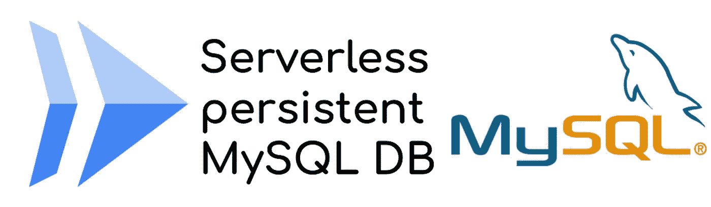
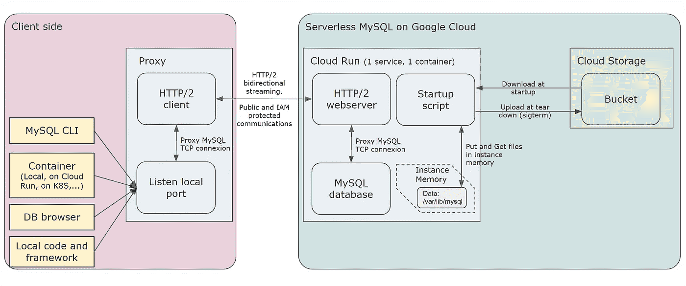

# 云上运行的无服务器数据库

> 原文：<https://medium.com/google-cloud/serverless-database-on-cloud-run-1a930eb00618?source=collection_archive---------0----------------------->

托管服务是一种新模式，让**云提供商为您管理基础设施和网络**。你只需要**关注商业价值**来建立它，你**只支付为你管理的实例**。

在其**的完美形式中，托管服务变成了无服务器服务**，一种按使用付费的解决方案。您不必担心基础设施和成本:**如果您不使用它，就不用为它付费。**

# 谷歌云提案

谷歌云提出了大量的无服务器产品，有些是独一无二的，在其他云提供商平台上没有任何对等物。

*   **2008 年发布的 App Engine** ，是第一批无服务器产品之一，远早于广受欢迎的 AWS Lambda。到目前为止，竞争对手还没有真正等同于 App Engine(按使用付费模式)的产品
*   **云运行**，一个无服务器的容器即服务平台，也没有任何等价物(按使用付费模式)
*   一个全球性的信息服务，你永远不用担心位置问题，它就是全球性的！
*   **BigQuery** ， **Firestore** ，**云调度器**，**云工作流**，**云任务**，…等等

> 还有一个无服务器的关系数据库，类似 AWS Aurora 的东西？没什么！！！

什么？？没有关系数据库？想要一个，就得**用云 SQL，别的什么都不用**。
它不是按使用量付费，而是**“唯一”托管**，最小实例(1vCPU，3.75Gb 内存)约为 **$50 每月**！

*我* ***在过去的几年里多次询问谷歌云*** *关于一个按使用量付费的关系数据库服务，得到的答案总是* ***没有*** *，与强大且难以克服的论点相关联，但是……*

# 使用案例

但是，当你有**大型开发团队**，每个开发人员一个谷歌云项目**时，你真的**愿意每个开发人员**每月支付 50 美元来测试每天/每周的一些部署吗？
你真的**想让服务器继续运行**，为了每天/每周的几次测试**消耗电能**和**产生二氧化碳**吗？**

对于大公司和开发团队来说，50 美元也许不算多，但是对于一个无用的用例来说，50 美元就太多了。
但是对于其他公司来说，**像协会**，有很多志愿者，**预算低/没有预算，每月 50 美元太多了**！

## 共同的期望

那些用例导致省钱，并且**有相同的期望**，或者更确切地说是“非期望”:

*   服务**有时会失败**
*   服务**性能可能很低**，至少在启动时是如此(当您激活实例时，即“冷启动”)

# 云运行解决方案

云运行是一种灵活的服务，可以托管几乎任何东西。您部署一个容器，并按使用量付费；如果你不使用它，你什么也不用付，如果你有很多流量，它**可以扩展到数百个并行实例。**

然而，它伴随着那些约束条件:

*   云运行**仅服务 HTTP 流量**
*   云润是**无国籍**

> 云运行真的是解决方案吗？？

当您查看关系数据库引擎(如 MySQL)时，您会有这些需求:

*   对 **TCP 通信**的服务请求
*   你的**数据保存了**。

***完美的云跑对面！！***

# 云运行丰富

云运行是基于容器的，提供了很大的灵活性。但是**真正的丰富性是它强大的功能**。有了它们，你可以**超越通常的无服务器限制**，释放你的想象力。

要使用云运行，我们必须**解决两个问题**:

*   持久存储
*   TCP 网络通信

# 云运行上的持久存储

仍然在预览中，gen2 执行运行时提供了很好的特性

*   非沙盒运行时环境
*   **挂载网络卷**的容量。

这个最新的特性**允许在云上运行新的用例**。*即使它有局限性，并且不会在解决方案中真正使用，当您的用例需要它时，了解它并尝试一下也是值得的*

因此，对于无服务器数据库，想法是**通过 GCSFuse 挂载点使用云存储存储**，或者使用**云文件存储**，这是 Google Cloud 上的一个托管 NFS 解决方案。

## GCSFuse 限制

云存储是 blob 存储，**其功能和容量不同于块存储** ( *任何计算机中的普通磁盘*)。另外，云存储**只能由 API** (JSON 或 XML)访问。

但是， [GCSFuse](https://github.com/GoogleCloudPlatform/gcsfuse) 是**将 linux 系统盘访问包装成 HTTP 调用**的工具。就像这样，可以在 linux 环境中安装一个 bucket，并把它作为一个普通的目录使用。

包装器**将块存储访问转换成 blob 存储**，当然，还有**限制和不支持的特性**。

首先，**延迟低**，因为 GCSFuse 执行 HTTP API 调用，而且比原生文件系统调用长很多。
*但是非关键或测试数据库的低性能不是问题。问题在别处*

这个问题来自于 MySQL 优化存储文件读写所需的一个特定特性，比如**保持文件打开并在其中进行流读/写。**
云存储**不可能**，你**不能部分更新一个文件**。GCSFuse 不支持这种用法

MySQL 日志很清楚:`Storage is not usable`。它错误地退出。 ***认为解决方法不对。***

## 云文件存储显示停止器

在第二代云上装载存储系统的另一个选项是文件存储。这是一个受管理的 NFS 系统，运行良好。**磁盘访问速度快**并且**文件存储实例可以通过** [**快照**](https://cloud.google.com/filestore/docs/snapshots) 来备份数据。

然而，有 **2 个主要问题**:

*   首先，**云文件存储实例只能在项目 VPC 的私有 IP** 上访问。所以，没问题，你可以使用一个[无服务器 VPC 连接器](https://cloud.google.com/vpc/docs/configure-serverless-vpc-access)来桥接云运行实例和你的项目 VPC。然而，**它每月花费大约 17 美元，而且它不是无服务器的(永远在线)**
*   其次， **Filestore 价格并不贵，每 Gb 0.2 美元**。完全公平。问题来自于**文件存储实例的最小容量:1Tb，因此每月 200 美元。**

这个伟大的解决方案**在财务上是不可持续的**(每月最低 217 美元)，不能被选择来省钱！
*不过，我还是发布了带那个选项的容器版本。*

## 最终的选择

最后，**在云上安装文件系统并不是一个成功/可持续的解决方案**。后备解决方案是**一个老派的解决方案:**

*   启动时，**从云存储**下载数据，**加载到内存**
*   关机时，当[云运行实例优雅地停止](https://cloud.google.com/blog/topics/developers-practitioners/graceful-shutdowns-cloud-run-deep-dive)，**将数据上传到云存储**。

*为了提高效率，数据被压缩并存储在云存储的一个文件中*

该解决方案的优势在于**可以与第一代和第二代运行时环境**一起工作。此外，可以激活云存储上的 [**版本控制**](https://cloud.google.com/storage/docs/object-versioning) **来保持数据库**的不同版本，如快照，并具有恢复它们的能力。

然而，**异步数据持久性意味着边缘情况**和**更高的数据丢失风险**

*   如果**容器**崩溃(例如内存不足)，数据库引擎在内存中更新的数据将会丢失。
*   当您**部署新版本的云运行无服务器数据库**时，使用新版本创建的新实例将从云存储中下载数据，而在先前版本上更新的数据仍在云运行实例内存中，尚未上传到云存储中。

这些问题在未来的版本中会有所缓解。

# 云环境下的 TCP 通信

另一个需要克服的障碍是通信协议。**MySQL 数据库使用 TCP，云运行只有 HTTP。**

但是，云运行支持 [HTTP/2 双向流](https://cloud.google.com/blog/products/serverless/cloud-run-gets-websockets-http-2-and-grpc-bidirectional-streams)。这是解决问题的关键，但需要将 TCP 通信包装成 HTTP/2 协议。

在服务器端，MySQL 实例驻留在后台的云运行服务，一个 **HTTP 服务器被暴露**。当一个连接进来时，它**创建一个与 MySQL 数据库的 TCP 连接，并通过 HTTP/2 传输通信。**

在客户端，在开发者环境或其他服务上(在云运行或其他地方)，**需要一个代理将客户端的 TCP 通信包装成 HTTP/2 请求。**
第一个请求打开连接，然后流量被 HTTP/2 流式传输。这个第一个请求还可以**包括一个安全头，以到达 IAM 安全云运行**，并因此将对数据库的访问限制为只有授权的帐户。

# 打包和启动

云运行提供了配置容器运行时的灵活性。这种灵活性允许组装所有的部件，并使用脚本**控制容器启动**(在 GCS 模式下)

*   **从云存储中下载**数据
*   *(* ***配置 SigTerm****(*[*云运行的优雅停止*](https://cloud.google.com/blog/topics/developers-practitioners/graceful-shutdowns-cloud-run-deep-dive) *)函数回调到* ***压缩数据库文件*******发送回云存储*** *)**
*   ***提取数据**和**并将它们**加载到容器存储器中*
*   ***后台启动 MySQL***
*   ***启动网络服务器***

*这是解决方案的全球架构*

**

# *我能用它吗？*

*最终的解决方案是**可在开源**中获得。您可以在 Cloud Run 上部署一个容器，进行一些配置，并尝试云存储或文件存储解决方案。*

*你可以看看我的 GitHub 库上的[代码，没有真正的逻辑，**主要是网络通信包装**和**容器技巧**用](https://github.com/guillaumeblaquiere/serverless-sql) [dumb-init](https://github.com/Yelp/dumb-init) 来管理 sigterm 对云运行的优雅停止通知。*

*您可以使用它**,同时牢记您的数据可能存在的限制和风险**。对于大多数非关键用例，不会有问题。如果您开始遇到太多问题或困难，可能是因为**是时候切换到真正的托管解决方案:云 SQL***

*无论如何，MySQL **无服务器和持久数据库可以在 Google Cloud** 上实现，我仍然有这个无服务器的梦想…*

> ***如果我来做，Google Cloud 可以做得更好！***

*我让“[谷歌云”的开发变得像馅饼一样简单，绝对没有**赢得**的野心，只是为了挑战。
看看](https://easyserverless.bemyapp.com/)[我的(好玩的)投稿视频](https://youtu.be/_bGhrNFnbL8)！*