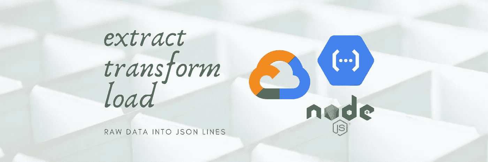
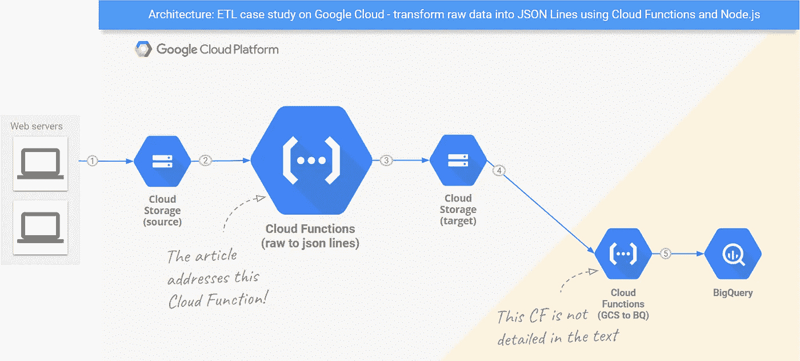

# Google Cloud 上的无服务器 ETL，案例研究:将原始数据转换成 JSON 行

> 原文：<https://medium.com/google-cloud/serverless-etl-on-google-cloud-a-case-study-raw-data-into-json-lines-d20711cd3917?source=collection_archive---------0----------------------->

## 使用 Google 云存储的云函数和 Node.js 客户端构建数据处理管道。不需要设置服务器。



[伊尔泽·卢塞罗](https://unsplash.com/@ilzelucero?utm_source=unsplash&utm_medium=referral&utm_content=creditCopyText)在 [Unsplash](https://unsplash.com/@ilzelucero?utm_source=unsplash&utm_medium=referral&utm_content=creditCopyText) 拍摄的背景照片

我正在做的一项任务是用 **Tomcat** 和 **Nginx** 访问日志数据填充 BigQuery 表。每天，web 服务器都会向 GCS 上传新的日志文件，其中包含前 24 小时的原始数据。数据需要被转换成能够被 [BigQuery 作业](https://cloud.google.com/bigquery/docs/jobs-overview)理解的格式，以便加载到表中。

由于我要处理的数据的性质，我决定将 [JSON 行](http://jsonlines.org/)或*换行符分隔的 JSON* 作为目标格式，而不是 CSV。由于我们无法预测在这个 ETL 过程中将被转换的数据(例如，URL 可以包含几个 UTF-8 字符，包括逗号)，我决定不依赖逗号作为分隔符来避免问题。

因此目标已经确定:**给定 web 服务器生成的标准访问日志，需要将它们转换成换行符分隔的 JSON 文件，以便适合 BigQuery 作业的输入参数。此类作业在数据仓库过程的后期运行。**

例如，Tomcat 日志以通用的日志格式生成:

```
127.0.0.1 - userid [29/Dec/2019:23:55:27 -0200] "GET /index.html HTTP/1.0" 200 950
```

这意味着:

```
remoteHost - remoteUser [datetime] "request" httpStatus bytesSent
```

BigQuery 作业需要它们作为 JSON 行格式的输入:

```
{"remoteHost":"127.0.0.1","remoteUser":"userid","datetime":"2019-12-30T01:55:27.000Z","request":"GET /index.html HTTP/1.0","httpStatus":200,"bytesSent":950}
```

我将在本文中描述我是如何设计和编码一个解决方案来实现这个目标的，这个解决方案使用了云函数和 Google 云存储的 Node.js 客户端。**虽然处理访问日志是我的主要目标，但总体策略可能适合更广泛的 ETL 过程——主要在*转换*阶段进行特定的更改。**我将解释这个解决方案，并评论我为解决这个问题而编写的代码中最重要的部分。GitHub 上提供了源代码和链接。

# 架构概述

请看看下图，它说明了设计的工作流程。使用了两个存储桶，以及两个云功能。



架构:Google Cloud 上的 ETL 案例研究——使用云函数和 Node.js 将原始数据转换成 JSON 行

1.  分配给步骤 3 的功能在每次新的原始文件上传到分配给步骤 2 的*源*桶时执行。
2.  这样的执行产生一个 JSON Lines 格式的文件，该文件被上传到分配给步骤 4 的*目标*桶。
3.  然后，分配给步骤 5 的功能被触发。

由于将 JSON Lines 格式的文件加载到 BigQuery 中(步骤 5)是一个[有良好文档记录的过程](https://cloud.google.com/bigquery/docs/loading-data-cloud-storage-json)，所以本文主要关注原始数据到换行符分隔的 JSON 转换(步骤 3)。

*源*存储桶—旨在长期存储—具有[标准存储类别](https://cloud.google.com/storage/docs/storage-classes)，但其文件的存储类别在两天后会自动更改为存档，以降低成本。*target*bucket——短期存储——也有标准的存储类，但是文件在两天后就会被删除，因为在加载到 BigQuery 后不再需要它们。

# 提取原始内容

日志文件由几行— 组成，每一行代表一个 HTTP 服务器交付的资源。Google 云存储客户端允许我们将给定文件中的所有内容下载到内存中，以供进一步处理，如下所示:

使用 Node.js 从 Google 云存储中下载一个文件

当调用中没有参数时，`file.download()`返回一个*承诺*。 *promise* 用一个缓冲区数组解析，第一个元素包含所有文件内容。在继续之前，我们需要把它转换成一个字符串。由于日志是用 UTF-8 编码的，在这种情况下调用`toString()`就足够了。

***文件下载提示*** *:* `*download()*` *也可以用来将内容保存到本地文件中。*[](https://googleapis.dev/nodejs/storage/latest/File.html#download)**详见单据。**

****流读提示*** *:从云存储中读取数据还有第二种选择:* `[*createReadStream()*](https://googleapis.dev/nodejs/storage/latest/File.html#createReadStream)` *。如果您有要在流管道上处理的数据，您可以尝试一下。**

# *转换原始内容*

*我处理这个问题的第一步是开发一个 javascript 函数，将原始日志行转换成 JSON 对象。基本上，它使用一个正则表达式来分解值，并将它们分配给 JSON 对象的属性。源代码可以在 [GitHub](https://github.com/ricardolsmendes/tomcat-access-log-js-parser/blob/master/src/tomcat-access-log-parser.js) 上找到。*

**请注意，该函数返回一个 JSON 字符串，而不是一个 JSON 对象。这是预期的行为，因此可以对代码进行* [*调整*](https://github.com/ricardolsmendes/tomcat-access-log-js-parser/blob/master/fallback/tomcat-access-log-parser-nashorn.js) *，以使用* [*云数据流的存储文本到 BigQuery 模板*](https://cloud.google.com/dataflow/docs/guides/templates/provided-batch#gcstexttobigquery) *运行等效的批处理 ETL 流程。**

*现在，让我们看看 ETL 代码的另一个重要部分:*

*使用 javascript 将 JSON 对象转换成换行符分隔的 JSON*

*借助正则表达式，将先前下载的原始内容拆分成一个字符串数组也很简单。*

*每个元素都意味着一个需要转换成换行符分隔的 JSON 的日志条目。我使用了 [ndjson 库](https://github.com/maxogden/ndjson)来帮助解决这个问题。`ndjson.serialize()`返回一个接受 JSON 对象并发出换行符分隔的 JSON 的[转换流](https://nodejs.org/api/stream.html#stream_implementing_a_transform_stream)。转换工作完成了！*

****直通流提示:*** *您可以使用不返回流的转换函数。但是，由于在下一步中拥有一个非常有用，请考虑在继续之前使用内置的类* `*stream.PassThrough*` *对转换后的数据进行装箱。**

> *等等，等等！你用过的那个 `*LogParser*` *级是什么？**
> 
> **—好问题！它只是将原始日志行转换成 JSON 对象的函数的高级抽象，这一点在本节开始时已经提到。源代码可用* [*此处*](https://github.com/ricardolsmendes/access-logs-js-parser/blob/master/src/log-parser.js) *。**

# *加载 JSON 行内容*

*第三步也是最后一步非常简单:将转换后的内容存储到一个新文件中。*

*使用 Node.js 将文件上传到 Google 云存储*

*一旦我们在流中有了可用的 JSON 行，我们需要做的就是读取这样的数据，然后写入 GCS 文件。*

*云存储客户端自带`[file.createWriteStream()](https://googleapis.dev/nodejs/storage/latest/File.html#createWriteStream)`方法。顾名思义，它创建一个流来将内容写入 GCS 文件。作为一个流，它可以嵌套到`ndjsonStream`，如上面的代码片段所示。由于写文件是异步的，将`pipe()`调用包含在 *promise* 范围内可能有助于云函数在进程结束时正确返回，所以我推荐这样做。*

*请注意`createWriteStream()`接受多个[选项](https://googleapis.dev/nodejs/storage/latest/global.html#CreateWriteStreamOptions)。我使用了`resumable: false`,因为我希望目标文件一次完全上传。[鉴于它们的大小通常小于 10MB，该选项使它们上传的性能更好](https://googleapis.dev/nodejs/storage/latest/File.html#createWriteStream)。*

# *结束语*

*本文描述的步骤旨在实现一个由 GCP 云函数和 Javascript 支持的无服务器 ETL 工作流。在这个过程的最后，使用第二个云函数将转换后的数据上传到 BigQuery，如[https://Cloud . Google . com/big query/docs/loading-data-Cloud-storage-JSON](https://cloud.google.com/bigquery/docs/loading-data-cloud-storage-json)中所述。*

*关于性能:一个 256MB 内存的云函数实例平均需要 8 秒来处理一个 1MB 的文件(大约 9000 个日志条目)。在这种情况下，正如我所注意到的，大部分处理时间都被网络操作占用了。*

*我希望这篇文章能帮助有类似需求的开发人员和数据工程师设计他们自己的过程，通过调整或改进我到目前为止所做的工作。*

*参考代码在 GitHub 上有:[https://github.com/ricardolsmendes/access-logs-dw-gcp-js](https://github.com/ricardolsmendes/access-logs-dw-gcp-js)(src/raw-to-nd JSON-GCS-file-converter . js)。使用它的云函数驻留在[https://github . com/ricardolsmendes/access-logs-nd JSON-GCS-GCF](https://github.com/ricardolsmendes/access-logs-ndjson-gcs-gcf)。*

*2020 快乐，仅此而已；)*

## *参考*

*   ***谷歌云功能>存储触发**:【https://cloud.google.com/functions/docs/calling/storage】T2*
*   *【https://googleapis.dev/nodejs/storage/latest】Google 云存储 Node.js 客户端 API 引用:[T4](https://googleapis.dev/nodejs/storage/latest)*
*   ***谷歌云存储的 Node.js 客户端**:[https://github.com/googleapis/nodejs-storage](https://github.com/googleapis/nodejs-storage)*