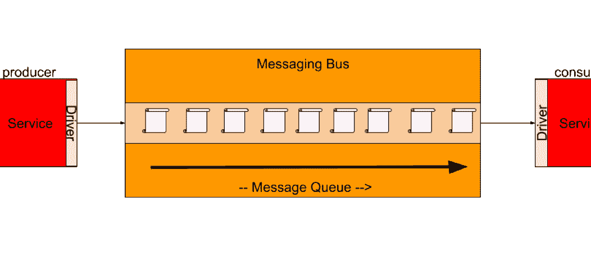
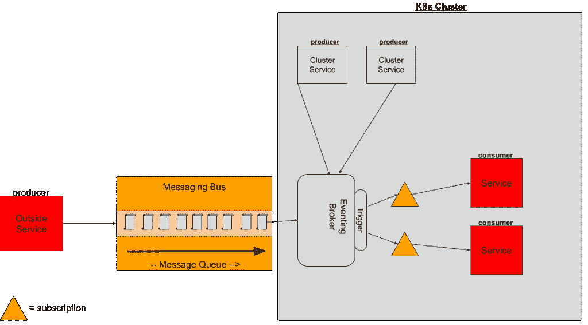

# 无服务器事件—事件图— Jason (Jay) Smith

> 原文：<https://medium.com/google-cloud/serverless-eventing-eventing-diagram-jason-jay-smith-1d198b104d90?source=collection_archive---------2----------------------->


当我写更多关于无服务器事件的内容时，一些人问我它实际上是什么样子。诚然，我更倾向于文字而不是视觉，因为图形从来都不是我的强项。所以在这篇文章中，我决定创建一个图表，试图解释什么是无服务器事件，以及为什么它很重要。

假设你是一个移动应用程序的后端开发人员。你计划拥有数百万的用户，这意味着数百万的事件。您设置了一个 Kafka 集群来处理事件。移动应用程序向一组给定的 Kafka 主题发送多条消息。这是一个非常简单的标准设置。

您的应用程序触及托管在功能即服务(FaaS)平台上的各种端点。然后，这些函数将消息写入给定的主题。通常，这些函数必须导入某种类型的库，以使编写更容易。然后当然，你需要强制性地绑定到主题。这意味着使用我们称之为“驱动程序”的东西来告诉你的代码写什么主题，引导服务器，然后如何认证。

当然，还有接收/消费端。这将是您的后端服务，订阅该主题以获取数据。你会有类似的经历，你正在编写一种“驱动程序”来连接到适当的主题并消费消息。这看起来都像这样:



请记住，这是一个话题，一个消费者，一个生产者。编写连接驱动程序没什么大不了的。但是当你扩展到数百甚至数千个服务、话题或经纪人时会发生什么呢？想象一下，试图管理所有这些不同的连接和凭证。这就是无服务器事件发生的原因。

使用无服务器事件，您不需要替换消息传递总线。如果有的话，你只是让它更容易。还记得我在这篇文章的[中是如何定义无服务器技术的吗？一个简单的总结是，无服务器应用需要无状态、可伸缩、以代码为中心(无基础架构)。最终目标是让无服务器应用程序对开发人员来说变得简单。开发者关心的是代码，而不是代理、服务器、网络等。](https://thejaysmith.com/on-serverless/severless-eventing/serverless-eventing-what-is-it-anyway/)

如果我们可以采用相同的服务和相同的消息传递总线，但是增加一个抽象层，会怎么样？该层将包含连接到适当的代理、主题等的“驱动程序”。然后我们的抽象层([事件总线](https://thejaysmith.com/on-serverless/severless-eventing/serverless-eventing-why-you-need-an-eventing-bus/))将监听来自一个简单 HTTP 请求的流量，然后决定它需要去哪里。

在接收数据方面，这个事件总线将利用触发器向适当的服务发送消息。我们可以创建一个订阅对象来收集消息，然后将它作为 HTTP 对象发送到适当的服务，而不是硬编码订阅我们的服务。简单地创建一个路由/端点，就像您对任何 REST API 所做的那样，您的服务将输入数据。

下面是一个很好的视觉表现:



在本例中，您可能有一个外部服务。这将是一项存在于您的 Kubernetes 集群之外甚至是数据中心之外的服务。它向消息总线的主题发布一个事件。

使用 Knative Eventing，您可以创建一个事件代理，它可以有效地订阅消息总线中的主题。请注意，如果您选择这样做，这个代理也可以消费其他事件。

您将创建一个[触发器](https://knative.dev/docs/eventing/triggers)，它将基于 X 标准收集和路由您的消息，并通过订阅将其路由到一个服务(由黄色三角形表示)。

这种关系可以表示为一个 Kubernetes 对象，允许您用简单的 YAML 来声明它，如下所示。

```
apiVersion: eventing.knative.dev/v1 kind: Trigger metadata: name: my-service-trigger spec: broker: default subscriber: ref: apiVersion: v1 kind: Service name: my-service uri: /my-custom-path
```

这里的网网是无服务器事件有助于将事件从它们的来源中分离出来。您获得了一个额外的层，允许您以声明方式将事件从源绑定到接收器。您可以将代理的管理卸载到您的数据管理团队，而开发人员可以专注于编写执行标准出入的应用程序。

在以后的文章中，我们将更深入地探讨如何大规模实现这一点，并使用 CLI 工具进行绑定。

*原载于 2021 年 1 月 22 日*[*【https://thejaysmith.com】*](https://thejaysmith.com/on-serverless/severless-eventing/serverless-eventing-eventing-diagram/)*。*