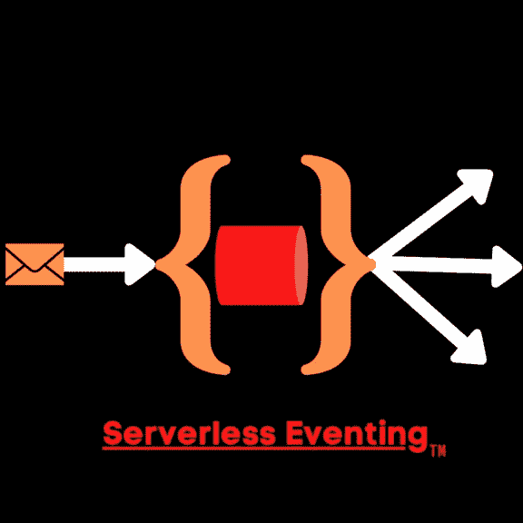

# 无服务器事件:Google Native 和 PubSub——Jason(Jay)Smith

> 原文：<https://medium.com/google-cloud/serverless-eventing-google-native-with-pubsub-jason-jay-smith-95276a574cc7?source=collection_archive---------0----------------------->

在这个无服务器事件系列中，我们一直在讨论使用[事件总线](https://thejaysmith.com/titles/serverlessjay/severless-eventing/serverless-eventing-why-you-need-an-eventing-bus/)。我们已经看到使用[卡夫卡](https://thejaysmith.com/titles/serverlessjay/severless-eventing/serverless-eventing-modernizing-legacy-streaming-with-kafka/)和 [NATS](https://thejaysmith.com/titles/serverlessjay/severless-eventing/serverless-eventing-cloud-native-messaging-with-nats-streaming-server/%22) 作为事件总线的例子。两者都是很好的解决方案，但是你知道我的观点，工具箱里有很多工具。

我为[谷歌云](https://cloud.google.com)工作已经不是什么秘密了。我喜欢它，因为我可以帮助用户探索一些伟大的云原生技术。一个非常适合我的无服务器事件范例的非常酷的产品是[Cloud publibsub](https://cloud.google.com/pubsub/)。

那么什么是 PubSub 呢？顾名思义，它是一个利用了[发布-订阅模式](https://en.wikipedia.org/wiki/Publish%E2%80%93subscribe_pattern)的消息总线。这使得能够传输异步消息(事件)；允许开发人员分离生产和处理服务。根据描述，这似乎非常适合无服务器微服务。

PubSub 实际上非常适合无服务器事件。首先，它是真正无服务器的。当您注册使用 PubSub 时，您不需要提供最小或最大数量的经纪人，也不需要考虑地区。PubSub 将基础设施从用户那里抽象出来。

现在也有缺点。最主要的一点是它是谷歌云的专利。目前还没有真正的方法在您自己的数据中心运行它。虽然这在未来可能会改变，但它也不是 OSS。如果您对开源软件有业务或技术需求，这将无法满足您的需求。然而，那也就罢了。

正如我一直说的，我们想探索所有的选择。我永远不会说一个事件总线优于另一个。这真的取决于您的需求、您的开发文化和您的要求。无服务器事件的想法是*简化和改进*事件驱动软件，而不是取代整个系统。稍后我可能会做一个大的表格来显示 5 种不同的赛事巴士的利弊，给每个人一个简单的评估。

和往常一样，我会把你重定向到我的 GitHub Repo [这里](https://github.com/TheJaySmith/serverless-eventing/tree/master/tutorials/pubsub)。在这里你可以看到我的代码和一步一步的演示，这将让你设置和准备去。我在那边等你，然后我们回这里。

现在我们回来了。正如你所看到的，我们能够轻松地提供一个 Google PubSub 主题，使用 [AlphaVantage](https://alphavantage.co) 和他们的金融 API 部署一个金融服务应用程序，并使用我们的实时货币兑换信息，同时使用无服务器事件模型。

*原载于 2020 年 9 月 17 日 https://thejaysmith.com***。**