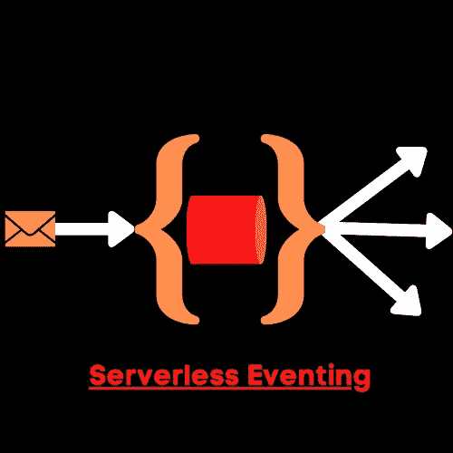

# 无服务器事件:用 Kafka 实现传统流媒体的现代化

> 原文：<https://medium.com/google-cloud/serverless-eventing-modernizing-legacy-streaming-with-kafka-cf07b82067b2?source=collection_archive---------0----------------------->

无服务器事件

[Knative Eventing](https://knative.dev/docs/eventing/) 提供了多种事件源，用于构建无服务器事件平台。在我的[上一篇博文](https://thejaysmith.com/titles/blogroll/serverless-eventing-sinkbinding-101/)中，我谈到了 [SinkBinding](https://github.com/TheJaySmith/serverless-eventing/tree/master/tutorials/twitter-sink-binding) ，我们用这个概念创建了一个事件源来获取 Twitter 数据。

但是，当您有一个遗留系统时会发生什么呢？仅仅为了用“最新最棒的”来替代一个正常运行的系统，通常是没有实际意义的。此外，软件解决方案很少适合“一刀切”的方法。你也可能会发现自己处于“混合”或“棕色地带”的情况。

例如，您可能有一个遗留消息总线，它不仅用于您的无服务器应用程序，还用于物联网设备。这是一个关于何时拥有“混合环境”的完美例子。仅仅为了改进后端而拆除一个工作系统是没有意义的。我们仍然可以用无服务器事件更新我们的应用程序。

我是[阿帕奇卡夫卡](https://kafka.apache.org/)的粉丝。诚然，我在谷歌工作之前对卡夫卡了解不多。通过我的互动，我认识了[汇合](https://www.confluent.io/)的人，他们教会了我卡夫卡的来龙去脉。Scalyr 有一篇令人惊叹的博文[深入探讨了卡夫卡的好处。Confluent 也有一些关于 Kafka 的企业用例的信息。](https://www.scalyr.com/blog/kafka-use-cases-message-brokering/)

我的 TL；DR 认为 Kafka 是一个开源的流处理平台，具有高吞吐量、低延迟和可靠的发送。对于那些希望确保消息按照接收顺序实时可靠发送的人来说，这是非常理想的。这可能就是为什么很多财富 100 强公司使用它们的原因。

在这个演示中，我们将使用[融合云操作符](https://docs.confluent.io/current/tutorials/examples/kubernetes/gke-base/docs/index.html)。还有许多其他的操作符，比如 Strimzi，但是我选择合流操作符有几个原因。

1)更成熟一点。Strimzi 仍然被视为一个 CNCF 沙盒项目，而 Confluent 操作符目前被用于生产开发。
2)更大的社区
3)附带一些有趣的工具，如[控制中心](https://www.confluent.io/confluent-control-center/)
4)我玩它已经很久了

因此，让我们来看看我的[教程在这里](https://github.com/TheJaySmith/serverless-eventing/tree/master/tutorials/kafka)。我会等你完成

**做实验室**

**回来**

那很有趣，不是吗？我们基本上创建了一个应用程序，它将提取货币兑换信息，并将其发送给 Kafka 生产者。虽然这个简单的例子看起来不太像，但想象一下，有 100 个微服务，它们都使用货币进行自己的处理，并且需要将它们发送到 Kafka。让开发人员将连接器硬编码到每个微服务中，让 Kafka 管理员诊断许多故障点，这有意义吗？支持多个库怎么样，因为有些服务是用 NodeJS 写的，有些是用 Go 写的，有些是用 Python 写的？

您可以创建一个服务，简单地将数据输出到容器之外，并让 SinkBinding 决定这些消息应该去往何处。然后，您可以使用通道、代理和触发器连接到事件接收器，事件接收器可以是一个服务或多个服务。你可以想象有一个代码库来处理 Kakfa 事件生产，同时支持多个微服务。

下一次，我们将学习如何使用无服务器事件。

*原载于 2020 年 5 月 1 日 https://thejaysmith.com***。**