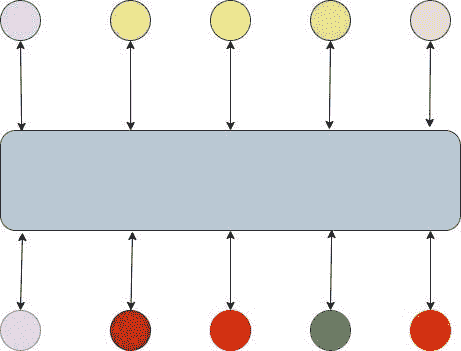

# 无服务器事件:为什么你需要一个事件总线！

> 原文：<https://medium.com/google-cloud/serverless-eventing-why-you-need-an-event-bus-1b69fc68ff41?source=collection_archive---------3----------------------->

无服务器事件

当我们谈论无服务器事件时，我们谈论的不仅仅是产品和技术。我们谈论的是平台和最佳实践。我在博客中没有提到的一件事是**“Eventing Bus”**的重要性。

一个**“事件总线”**是一个发布者-订阅者风格的通信系统。它的主要目的是作为服务之间的联系，而不是让它们直接通信。许多人称之为“消息总线”或“消息队列”，但既然我们在谈论事件，我们就称之为**“事件总线”**。使用事件总线有很多好处，因为我完全相信它对*无服务器事件哲学*很重要。

前面我们将无服务器事件描述为一个利用微服务架构的平台(相对于单片)。这种架构使我们能够让我们的开发人员为他们的服务使用正确的工具，并通过分离服务来加速开发。副作用是你会有几十个，如果不是几百个或者几千个单独的服务。

假设你和十个朋友去东京度假两周。每个人都分散在白天，做他们自己的事情，但你想在晚上和每个人一起去居酒屋。你原来想去的地方已经关门了，所以你需要找一个新的地方。现在你的工作是传达结束，确定一个新的见面地点，并找出每个人都在哪里，这样你就可以找到一些中心的东西。最好的沟通和计划方式是什么？

我们是否希望每个人都给其他人发一条短信，并试图以这种方式进行协调？想象一下，给 Sally 发短信看她想去哪里，然后给 Jimmy 发短信说 Sally 想去这里，Jimmy 说他更想去这里，但是然后你给 Laura 发短信，她在东京的另一边，宁愿在酒店和她所在的地方之间买些东西。然后，劳拉给鲍勃发短信，看看他是否收到了你的来信，以及你的想法。你明白了。这些文字看起来有多疯狂？大概是这样的:

不可避免地，在交流中会丢失一些东西，有人会出现在错误的餐馆，在错误的时间到达，等等。我敢打赌，今天你们很多人都有这样的应用程序。

如果您简单地使用 REST 或 gRPC 与服务通信，这可能就是您的服务。每个服务都直接与另一个服务通信，并来回发送消息。许多人选择这个选项，在某些情况下，这是一个很好的选择(稍后会详细介绍)。然而，如果你以这种方式设计你的现代应用程序，你将会失败。

首先，您如何保证消息被发送和接收？默认情况下，如果接收者无法接收消息，许多服务将会出错。它还可能发送一条消息，假设接收者在那里，但它不在，这条消息就永远丢失了。

另一个概念是分配的规模。这个例子让我给九个人(客户)发短信。当客户端扩展到 100 或 1000 个时会发生什么？您的服务能够处理发送和接收这种规模的消息所需的工作负载吗？它将如何处理阻塞？你能保证收到吗？你能保证消息的不变性吗？

顺序也很重要。当我们处理实时事件时，事件的顺序非常重要。以居酒屋为例，如果我们在谈论一个地方，然后 20 分钟后商定一个新的地方，重要的是在旧信息之后获得最新信息。

一定有更好的方法！当然是**《Eventing Bus》**。让我们换个角度来看这个问题。我们不是直接给人发短信，而是在 WhatsApp 之类的聊天应用中创建群聊。每个人都加入(订阅)群聊(“Eventing Bus”)。你发一次信息，每个人都会收到。当邮件被接收和阅读时，您很少收到通知。回复被发送到房间。每条消息都有时间戳。现在我们的交流是这样的:

我们的微服务应该以类似的方式构建。我们应该使用一辆公共汽车。现在，我要说事件总线不是解决消息传递问题的灵丹妙药。REST 或 gRPC 仍然是有效的解决方案。以下是您应该在 HTTP 上使用 REST 或 gRPC 的关键时刻。

*   *紧耦合*:服务需要知道其他服务的存在。这通常意味着一个服务隐式地发送给另一个服务。
*   *面向公众的 API*:你想要创建一个可通过互联网访问的 API。类似于 [OpenID](https://openid.net/) 的东西。
*   *同步消息传递*:如果您需要在处理消息 B 之前完成消息 A，以此类推，这是一个很好的选择。

否则，在创建松散耦合的服务时，您绝对应该使用事件总线。一辆多事的公共汽车应该给你这些好处。

*   *松耦合*:您的服务不需要明确知道其他服务的存在。该服务执行其任务，将其输出作为消息发送到总线，然后您编写另一个服务从总线进行消费。
*   *异步消息传递*:您不需要在处理新消息之前等待响应。这允许更有效地使用资源。
*   *交付保证*:许多消息总线都有内置的协议，以确保消息至少被预期的接收者接收一次。
*   *弹性*:由于服务正在向总线发送消息，如果接收服务中断，这不会立即导致消息丢失。消息存储在总线中，接收方服务返回什么，它就可以读取消息并继续。
*   *可伸缩性*:使用事件总线允许您更有效地将接收方服务/客户端添加到更少量的发送方服务中。您只需将新服务作为订阅者添加到事件总线中。

现在，我在这里不是要支持一种特定的技术或品牌。我的政策是“合适的工作工具”。取决于您团队的舒适程度、现有投资、业务需求等。您将选择适合这些需求的工具。

我已经公开了我最喜欢的第三方工具是 [Apache Kafka](https://kafka.apache.org/) ，甚至[在过去还写过关于它的博客](https://thejaysmith.com/titles/serverlessjay/serverless-eventing-modernizing-legacy-streaming-with-kafka/)。不过还有很多工具，比如 [Google Cloud Pub/Sub](https://cloud.google.com/pubsub) ，[Apache come](http://camel.apache.org)l， [Redis](http://redis.io) ， [RabbitMQ](https://www.rabbitmq.com/) 等等。

好消息是 Knative Eventing 允许你使用许多现有的总线作为事件源。正如在之前的一篇文章中提到的，你也可以使用 [SinkBinding](https://knative.dev/docs/eventing/samples/sinkbinding/) 来定义你的事件源。你也可以写一个[自定义事件源](https://knative.dev/docs/eventing/samples/writing-receive-adapter-source/)。这允许您将遗留的消息队列/总线转变为**事件总线**，为无服务器事件做好准备。

因此，如果今天你正在构建一个应用程序，并希望获得无服务器事件的自由，请慎重考虑使用这些应用程序。

*原载于 2020 年 5 月 29 日 https://thejaysmith.com**[*。*](https://thejaysmith.com/titles/blogroll/serverless-eventing-why-you-need-an-event-bus/)*