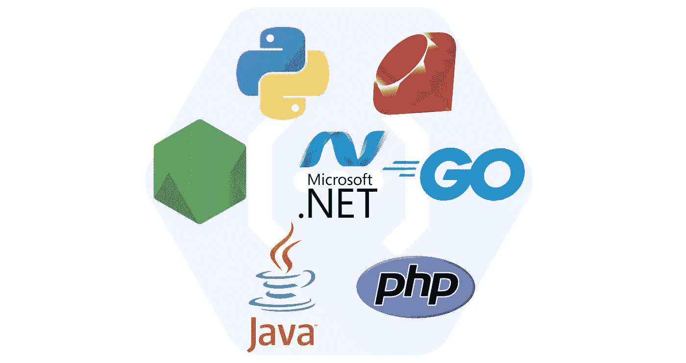

# 任何语言的无服务器功能

> 原文：<https://medium.com/google-cloud/serverless-functions-in-any-language-b44401c40859?source=collection_archive---------1----------------------->

7 种编程语言

Google Cloud Functions 是一款可扩展的现收现付功能即服务(FaaS)，无需服务器管理即可运行您的代码。去年，无服务器团队开源了 7 个功能框架(库),支持 7 种语言的云功能。

王从希介绍了每种语言的功能框架，并展示了 7 个演示。

让我们简单介绍一下:

## 节点[🔗](https://github.com/GoogleCloudPlatform/functions-framework-nodejs)

`npm i @google-cloud/functions-framework`

*   使用快速'`(request, response)`'模式
*   支持承诺，非常适合非阻塞 I/O

## Python [🔗](https://github.com/GoogleCloudPlatform/functions-framework-python)

`pip install functions-framework`

*   使用 Flask，Gunicorn 作为 HTTP 服务器

## 开始[🔗](https://github.com/GoogleCloudPlatform/functions-framework-go)

`import "github.com/GoogleCloudPlatform/functions-framework-go/funcframework"`

*   使用 Go 的本地 HTTP 包
*   通过 CloudEvent SDK 支持 CloudEvents

## Java [🔗](https://github.com/GoogleCloudPlatform/functions-framework-java)

`mvn install -DgroupId="com.google.cloud.functions" -DartifactId="functions-framework-api" -Dversion="1.0.2"`

*   使用 Java 和 Maven
*   支持其他 JVM 语言，如 Kotlin、Groovy 和 Scala

## 红宝石[🔗](https://github.com/GoogleCloudPlatform/functions-framework-ruby)

`gem install functions_framework`

*   使用标准的 Ruby 机架接口
*   文本设备的内置助手

## 。净芯(私人预览)[🔗](https://github.com/GoogleCloudPlatform/functions-framework-dotnet)

`dotnet new -i Google.Cloud.Functions.Templates::1.0.0-beta02`

*   基于 ASP.NET 核心构建，带有依赖注入
*   入门和测试模板

## PHP 7.4(私人预览版)[🔗](https://github.com/GoogleCloudPlatform/functions-framework-php)

`composer require google/cloud-functions-framework`

*   可用于 PHP 的内置服务器
*   支架`symfony/http-foundation`

—

这些框架内置于 Google Cloud 功能中，但是完全可以在 Cloud Run 上使用，用 localhost 进行测试，或者在其他环境中使用。

# 了解更多信息

感谢阅读！这些框架是开源的，接受问题和贡献。也欢迎对问题的反馈和评论。

喜欢这篇文章的人可能也会喜欢这些资源:

*   [🦕云运行时的噪声](/google-cloud/deno-on-cloud-run-89ae64d1664d)
*   [📄职能框架合同](https://github.com/GoogleCloudPlatform/functions-framework)