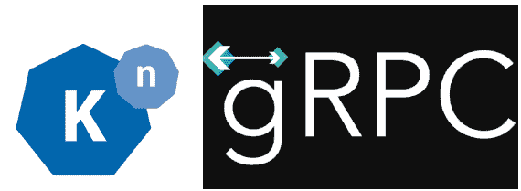

# 无服务器 gRPC +带 Knative 的 ASP.NET 核心

> 原文：<https://medium.com/google-cloud/serverless-grpc-asp-net-core-with-knative-b37ce09ea067?source=collection_archive---------1----------------------->



我最近在查看 ASP.NET 的核心更新。网芯 3.0 预览版 3 帖子，这一节得到了我的关注: *gRPC 模板。*

显然，。NET Core 3.0 有了一个新的 gRPC 模板，可以很容易地用 ASP.NET 核心构建 gRPC 服务。我测试了 gRPC 和。NET 之前，我有一些样品在我的 [grpc-samples-dotnet](https://github.com/meteatamel/grpc-samples-dotnet) 回购。即使 gRPC 和。NET 以前工作过，安装起来并不那么简单。我很想尝试一下新的 gRPC 模板，看看它有什么帮助。

此外，我想超越一个简单的 gRPC 服务，看看如何将它变成一个无服务器的 Knative 服务，拥有 Knative 的所有好处，如自动缩放、修订等。

如果你想亲自尝试一下，我的 Knative 教程中有一个新的章节:[带 Knative 的无服务器 gRPC](https://github.com/meteatamel/knative-tutorial/blob/master/docs/07.5-grpc.md)有详细的说明。在这篇博客文章中，我想强调一下在 Google Kubernetes Engine (GKE)上部署无服务器、支持 gRPC 的 ASP.NET 核心服务的一些主要步骤。

# 使用新模板创建 gRPC 服务

使用创建 HelloWorld gRPC 服务。有了 gRPC 模板，NET Core 3.0 再简单不过了。这是命令:

```
> dotnet new grpc -o GrpcGreeter
```

该命令在后台执行一些操作:

*   创建一个包含所有 gRPC 依赖项的 ASP.NET 核心项目。
*   创建名为`greet.proto`的 gRPC 服务定义文件。
*   根据服务定义文件自动生成所有 gRPC 存根。
*   基于自动生成的 gRPC 存根创建 gRPC 服务(`GreeterService.cs`)。
*   配置`Startup.cs`中的 gRPC 管道映射到`GreeterService.cs`

最终结果是，您已经处理好了 gRPC 的所有细节，并且您可以简单地开始运行服务:

```
> dotnet run 
info: Microsoft.Hosting.Lifetime[0] Now listening on: [http://localhost:50051](http://localhost:50051)
```

这比我以前必须做的要简单得多。干得好。网核心团队！

# 将 gRPC 服务容器化

下一步是将 gRPC 服务容器化，这样它就可以部署到 Knative。`Dockerfile`看起来是这样的:

```
FROM mcr.microsoft.com/dotnet/core/sdk:3.0

WORKDIR /app
COPY *.csproj .
RUN dotnet restore

COPY . .

RUN dotnet publish -c Release -o out

ENV PORT 8080

ENV ASPNETCORE_URLS http://*:${PORT}

CMD ["dotnet", "out/GrpcGreeter.dll"]
```

我在用。NET Core 3.0 作为基本映像，并确保该服务运行在端口 8080 上，而不是默认的 gRPC 端口 50051 上。没什么特别的。

# 部署 Knative 服务

一旦构建并推送了映像，就在一个`service.yaml`文件中定义 Knative 服务:

```
apiVersion: serving.knative.dev/v1beta1
kind: Service
metadata:
  name: grpc-greeter
  namespace: default
spec:
  template:
    spec:
      containers:
        # Replace {username} with your actual DockerHub
        - image: docker.io/{username}/grpc-greeter:v1
 **ports:
          - name: h2c
            containerPort: 8080**
```

这是一个指向图像的简单的 Knative 服务定义。唯一特殊的部分是**端口**部分，在这里我们定义了一个 **h2c** 端口 8080。这告诉 Knative 容器正在端口 8080 上期待 HTTP/2 流量。

部署 Knative 服务:

```
> kubectl apply -f service.yaml
```

确保带有 gRPC 服务的 pod 正在运行:

```
> kubectl get pods NAME grpc-greeter-5tpwl-deployment-6fb423289c5-r5qmt
```

# 测试一下

要测试 gRPC 服务，您需要相应的支持 gRPC 的客户端。你可以参考我的教程中关于如何创建一个`GrpcGreeterClient.cs`的[创建一个 gRPC 客户端](https://github.com/meteatamel/knative-tutorial/blob/master/docs/07.5-grpc-csharp.md#create-a-grpc-client)部分。一旦你有了客户，只要指出你的服务。您应该会看到运行在 Knative 中的 gRPC 服务的回复:

```
> dotnet run
Greeting: Hello GreeterClient Press any key to exit...
```

从表面上看，这看起来像是普通 gRPC 服务的响应。然而，这是一个 Knative 托管服务，这意味着你有 0-n 自动缩放，修订和所有其他在 Knative 中运行服务的好处。

。NET Core 3.0 使 gRPC 的入门变得非常容易，Knative 将普通的 gRPC 转换成无服务器风格的服务，可以自动伸缩和响应事件。这是一个强大的组合，希望这篇博文和相应的教程能让你一窥如何使用。NET 核心与 gRPC 和 Knative。

*原载于 2019 年 7 月 24 日*[*http://meteatamel.wordpress.com*](https://meteatamel.wordpress.com/2019/07/24/serverless-grpc-asp-net-core-with-knative/)*。*