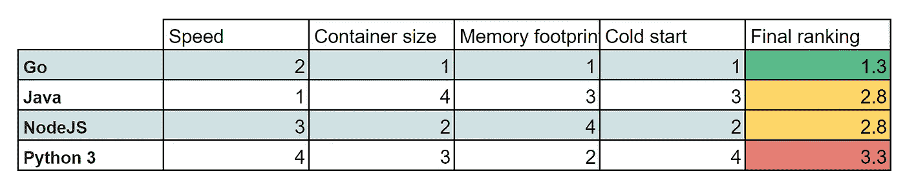

# 无服务器性能比较:语言重要吗？

> 原文：<https://medium.com/google-cloud/serverless-performance-comparison-does-the-language-matter-c72a7191c799?source=collection_archive---------0----------------------->

对于[云运行、云函数](/google-cloud/cloud-run-and-cloud-functions-does-the-region-change-the-performances-b967e5cee0cc)和 [BigQuery](/google-cloud/bigquery-tell-me-your-region-i-will-tell-you-your-speed-41dcf42b8cc) 的不同区域之间的无服务器比较**是执行选择**的第一维度。但是云开发者也需要选择和使用语言来实现他们的应用。有**很多选择**，一些产品限制了可能性，但是**所有开发者都有他们的偏好和观点。**
*几个月前我就开始了这个比较，在比较了结果之后，* ***我从来没有想过写这篇文章来避免一场无用的语言战争*** *。然而，在与 Henrique Joaquim 讨论了我以前关于无服务器计算性能的文章对他的论文的有用性之后，我选择完成并发布它来帮助他的论文。*

> 所以，如果产品和地区很重要，语言也很重要吗？

# 测试协议

我选择比较大多数产品支持的 4 种最流行的语言:

*   NodeJS
*   Python 3
*   Java 语言(一种计算机语言，尤用于创建网站)
*   戈朗

当然，**我并不擅长所有这些**，我将测试限制在斐波那契算法上(在递归模式下)。
我还选择了**在云功能和云运行上比较性能。**

协议很简单:

*   **在同一个区域部署**云运行和云功能服务(在我的例子中为`us-central1`),并使用相同的 2Gb 内存/1 个 vCPU
*   运行虚拟查询**以避免冷启动**
*   连续运行 **3 次，相同的斐波纳契复杂度(在我的例子中是 43)**
*   收集和**编译结果**

*要在您这边重现测试，您可以简单地遵循* `[*README.md*](https://github.com/guillaumeblaquiere/cloudrun-cloudfunction-compare/blob/master/README.md)` *文件，它解释了如何部署、运行测试和清理您的环境。*

# 测试结果

经过 2 次性能测试，我得到了这些结果*(原始数据在* `[*result.csv*](https://github.com/guillaumeblaquiere/cloudrun-cloudfunction-compare/blob/master/results.csv)` [*文件*](https://github.com/guillaumeblaquiere/cloudrun-cloudfunction-compare/blob/master/results.csv) *)*

我们可以观察到 **2 个意想不到的事情**

*   云运行总是比云函数略快(如预期)。**然而在 Java 中却不是这样。**
    *我怀疑有些* ***JVM 标志默认添加*** *在云函数容器创建期间(由 Google Cloud 和 Buildpacks 自动生成)那个* ***我还没有添加到*** `***Procfile****.*`
*   **NodeJS 结果从简单到双精度**不等。云功能 1 倍快 2 倍慢，云运行 2 倍快 1 倍慢。我运行了几次测试，总是得到这个结果。 ***我无法解释，*** *尤其是因为 Nodejs 是我在 4 种语言中较弱的一种。* ***请建议！***

除了这两件意想不到的事情，我们可以**毫不惊讶地得出结论，编译语言** (Golang，Java) **比解释语言** (Python，NodeJS)更快。

然而**性能差异对我来说是意想不到的**:

*我保留了 NodeJS 的 2 个值，不知道哪个最现实*

*   一开始就没想到 **Java！**
*   没想到 **Python 比 Java** 慢 100 倍！！！

# 其他比较输入

处理性能**并不是我们可以在语言之间进行比较的唯一点**。由于**只关注云运行**，我们可以比较:

*   容器尺寸
*   内存占用
*   冷启动持续时间

## 集装箱尺寸比较

容器**大小不影响云运行服务启动**，但影响**部署时间**。其他容器编排服务也是如此，比如 Kubernetes 和 GKE。

它对成本也有影响，因为存储更大的图像需要更多的空间，因此成本更高！

自动构建的容器**保持一个 100Mb** 的大小，除了 Java 需要**整个(和重)JVM** 。

*这里我比较了由云运行自动创建的默认容器和没有定制优化的默认容器。您可以通过定制* *来轻松地* ***缩小(或增大)容器的大小，例如使用* `*Dockerfile*` *创建。***

你可以得到 Cloud Run 自动构建的容器镜像，在工件注册表->在`cloud-run-source-deploy`目录下

选择您想要的图像并查看其大小。

## 内存占用比较

**内存对于大型应用来说至关重要**。在这里，它只是一个非常基本的小应用程序，几乎没有依赖关系。
然而，**服务的内存占用越大，它就越贵**。

*我采用了 95%的云运行指标图*

有了他的高效编译，**围棋很轻**。
**在内存使用上口碑很差的 Java**，在不使用库或框架的情况下，也没那么差。
NodeJS 和 Python **都没那么差。**

## 冷启动持续时间比较

大多数情况下，冷启动**对于实际工作负载**来说并不重要，但有时却很重要！如果**服务太慢，无法启动一个新的实例**，需要提供额外的功能，如 [**最小实例**](https://cloud.google.com/run/docs/configuring/min-instances) **来解决；当然，**对服务成本**也不是没有影响。
*我已经在云上运行* *进行了一次* [*Java 冷启动比较，尤其是有框架和无框架的比较。这里的测试没有框架。*](/google-cloud/java-frameworks-performances-on-cloud-run-eb243fd84a5c)**

*结果已经从云日志中获得，这是部署后的第一个请求。我部署了 3 次，每次都通过 Fibonacci(1)计算得到了前 1 个请求。*

**围棋最快**，而 **NodeJS 也有很棒的表现**。
不出意外， **Java 在 1.5s 以上，**
但是**的惊喜来自 Python** 。也许是`gunicorn`库导致了这种延迟。 ***请建议！***

# 最后的比较

最后，如果我们得到所有的排名(**没有任何优先考虑**)，我们就有了那个结果

**Go 是一种在云中开发的现代语言**，对于云和我们可以看到它**非常适合无服务器环境**和**微服务架构。**
**Java 和 NodeJS** 各有优缺点，**有待认真考虑。**
**Python 是我最大的惊喜**，在排名中垫底。

> 考虑到 Python 在世界范围内的吸引力和它糟糕的性能，我想知道计算效率、节能和全球变暖…

然而，**我无法解释这个 Python 糟糕的排名**，我将很高兴**从 Python 专家**那里了解更多，也许会更新这篇文章并进行一些修复。

无论如何，我认为在选择开发语言时，除了这些结果之外，考虑其他几个方面也很重要:

*   **开发者的知识**、**技能和偏好**
*   **开发人员可用性**和**雇佣**新资源/人才来发展开发团队的能力
*   **库**到期和**文档**
*   **开发循环**的效率和可靠性

一种尺寸并不适合所有人，这取决于你的背景。因此，**明智地选择**，牢记这一点！