# 由 GCP 气流编排的无服务器 Spark ETL 管道

> 原文：<https://medium.com/google-cloud/serverless-spark-etl-pipeline-orchestrated-by-airflow-on-gcp-199efbf9a9f3?source=collection_archive---------0----------------------->

大数据 Spark 工程师平均仅花费 40%在实际数据或 ml 管道开发活动上。他们的大部分时间通常用于管理集群或优化 spark 应用程序变量。

作为这种整体集群设置的替代方案，是基于云的无服务器、无操作平台，如基于 GCP 的 BigQuery(基于 SQL)或 Data Fusion(无代码、基于 UI)。虽然工程师真的很喜欢这些无服务器分析解决方案，但他们也更喜欢将管道放在 pyspark 或 scala 中，以便在需要时方便移植。


火花工程师期望从他们的新 Q(火花季度主)一个巨大的火花集群

作为一种中庸之道，将 spark 工程师从非分析活动中解放出来，同时能够保留或继续编写 Spark 原生应用，这就是 GCP 的 ***无服务器 Spark*** 解决方案。


q 用无服务器 Spark 让 Spark 工程师大吃一惊！！我们真的不喜欢新世界中的集群:-)

这是业界首款无需任何手动基础架构配置的自动扩展无服务器 Spark。它启用于，

> Vertex AI 笔记本，供数据和 ML 工程师发布 Jupyter 笔记本和编写 spark 代码(现已正式发布)

> BigQuery，数据分析师可以编写和执行 pyspark 代码以及 BigQuery SQL(私有预览)

>可以使用 Airflow 或 Cloud Composer(现已正式发布)将它们编排为完整的数据和 ML 管道

在本文中，我将讨论如何在 GCP 上以完全无服务器的模式执行 Spark ETL 管道。

首先让我们在无服务器模式下运行一个简单的 Spark Pi 应用程序。

导航到 GCP 的 Dataproc 控制台，向下滚动到无服务器批处理并点击‘创建’，

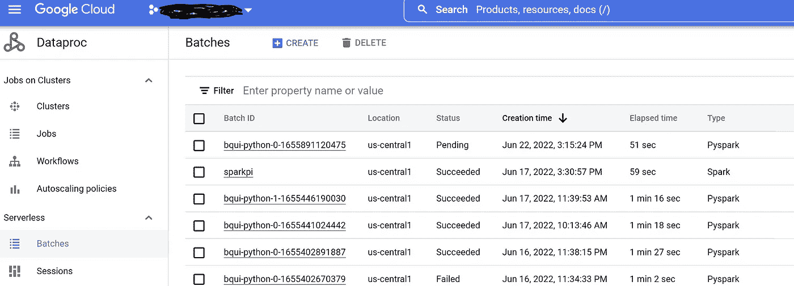

如下所示输入批次详细信息，您可以将其他选项保留为默认选项，然后单击提交。

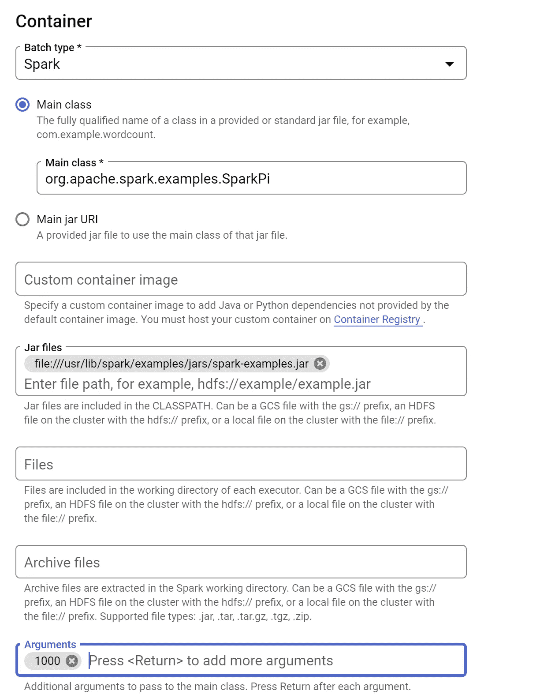

批处理作业将在 30 秒内启动并从挂起状态变为运行状态，*(设置一个 Dataproc 集群大约需要 90 秒，而设置一个 Hadoop 集群则是一个未知数)*

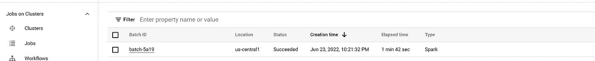

Spark 作业的输出如下所示:

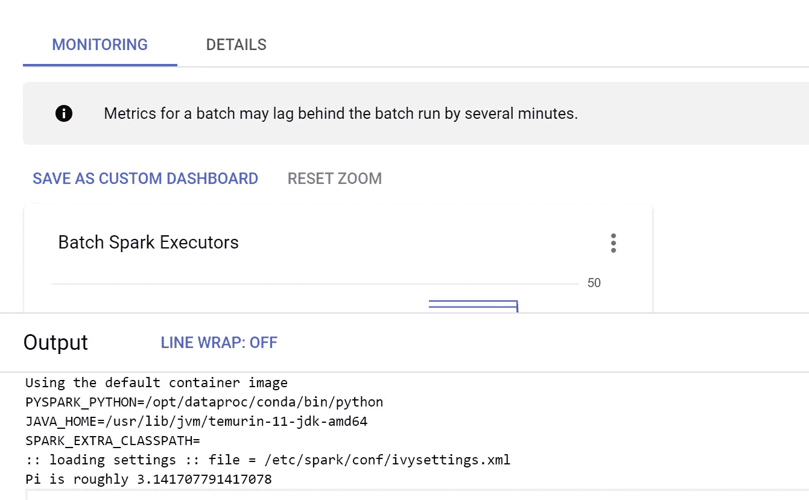

在“监控”部分可以看到执行者的状态

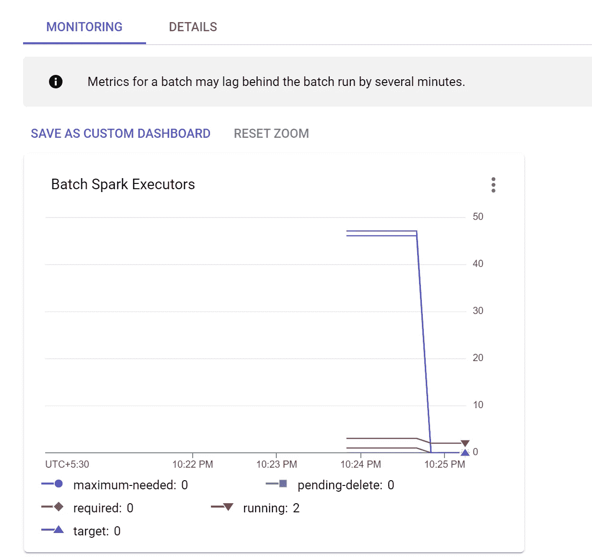

正如现在可以看到的，没有要创建或管理的集群，所有计算都是自动创建和删除的。

既然我们已经看到了无服务器 Spark 的“Hello World”示例，现在让我们继续在由 Cloud Composer(托管 Apache 气流)编排的无服务器 Spark 上构建 ETL 管道。

ETL 管道的解决方案架构如下:

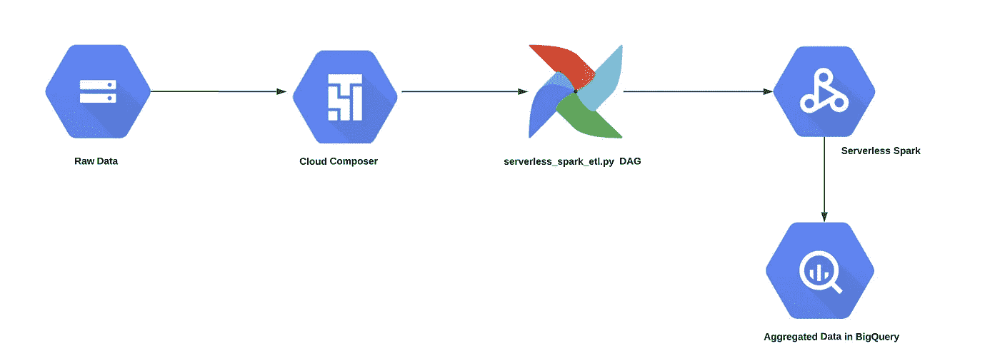

对于这个管道，我们可以考虑一个简单的聚合示例。可以在 GCS 存储桶中写入和存储一个文本文件，该文件只有很少的记录，其中包含人员的姓名和年龄。pyspark 代码应该计算每个人的平均年龄，并将数据写入 BigQuery 表。

Cloud Composer 中的 Dag(GCP 的 managed Apache Airflow)将以无服务器模式在 Dataproc 上启动批处理操作符。dag 将查找每个人的平均年龄，并将结果存储在 BigQuery 数据集中。

GCS 存储桶中的原始数据:

```
name,age
Brooke,20
Denny,31
Jules,30
TD,35
Brooke,25
TD,45
Jules,69
```

云作曲家 DAG:

```
import os
from airflow.models import Variable
from datetime import datetime
from airflow import models
from airflow.providers.google.cloud.operators.dataproc import (DataprocCreateBatchOperator,DataprocGetBatchOperator)
from datetime import datetime
from airflow.utils.dates import days_ago
import string
import random # define the random module
S = 10  # number of characters in the string.
# call random.choices() string module to find the string in Uppercase + numeric data.
ran = ''.join(random.choices(string.digits, k = S))
project_id = models.Variable.get("project_id")
region = models.Variable.get("region")
subnet=models.Variable.get("subnet")
phs_server=Variable.get("phs") ## create a Spark Persistent history server
code_bucket=Variable.get("code_bucket")
bq_dataset=Variable.get("bq_dataset")name=<<your username>>dag_name= "serverless_spark_etl"
service_account_id= <<enter your service account>>avg_age_script= "gs://"+code_bucket+"/00-scripts/avg_age.py"BATCH_ID = "avg-age-"+str(ran)BATCH_CONFIG1 = {
    "pyspark_batch": {
        "main_python_file_uri": avg_age_script,
        "args": [
          project_id,
          bq_dataset,
          code_bucket,
          name
        ],
        "jar_file_uris": [
      "gs://spark-lib/bigquery/spark-bigquery-with-dependencies_2.12-0.22.2.jar"
    ]
    },
    "environment_config":{
        "execution_config":{
              "service_account": service_account_id,
            "subnetwork_uri": subnet
            },
        "peripherals_config": {
            "spark_history_server_config": {
                "dataproc_cluster": f"projects/{project_id}/regions/{region}/clusters/{phs_server}"
                }
            },
        },
}
with models.DAG(
    dag_name,
    schedule_interval=None,
    start_date = days_ago(2),
    catchup=False,
) as dag_serverless_batch:
    # [START how_to_cloud_dataproc_create_batch_operator]
    create_serverless_batch1 = DataprocCreateBatchOperator(
        task_id="Avg_Age",
        project_id=project_id,
        region=region,
        batch=BATCH_CONFIG1,
        batch_id=BATCH_ID,
    )create_serverless_batch1
```

Pyspark 代码来计算作者的平均年龄，

```
from pyspark.sql import SparkSession
from pyspark.sql.functions import avgproject_name =<<enter your project id>>
dataset_name='serverless_spark'
# Create a DataFrame using SparkSession
spark = SparkSession.builder.appName("ETL").config('spark.jars', 'gs://spark-lib/bigquery/spark-bigquery-with-dependencies_2.12-0.22.2.jar').getOrCreate()input_data="gs://"+<<enter your bucket name>>+"01-datasets/Authors.csv"#Reading the Input Data
data_df = spark.read.format("csv").option("header", True).option("inferschema",True).load(input_data)
data_df.printSchema()
# Group the same names together, aggregate their ages, and compute an average
avg_df = data_df.groupBy("name").agg(avg("age"))
# Show the results of the final execution
avg_df.show()
# extract columns to create country table
avg_table = avg_df.selectExpr("name").dropDuplicates()
avg_table.write.format('bigquery') .mode("overwrite").option('table', project_name+':'+dataset_name+'._avgage') .save()
```

将 dag 文件放在 GCS 中气流桶的 dags 文件夹下后，dag serverless_spark_etl 应该会显示在气流 UI 中，

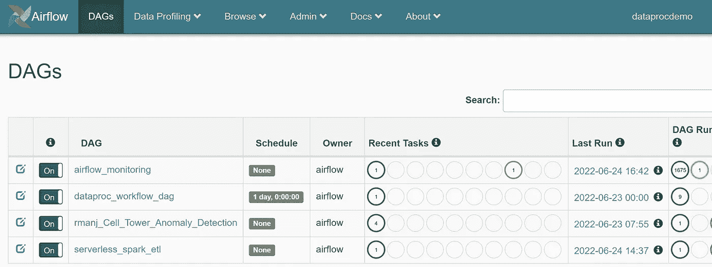

然后您可以触发 dag，

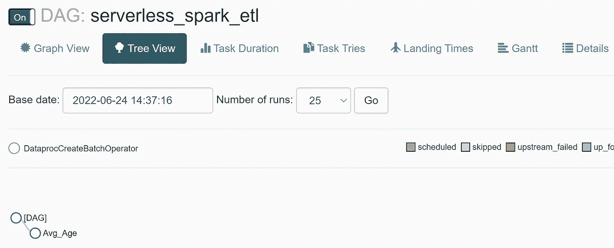

从 Composer 触发无服务器批处理操作符，并在 Dataproc 中启动无服务器批处理执行，

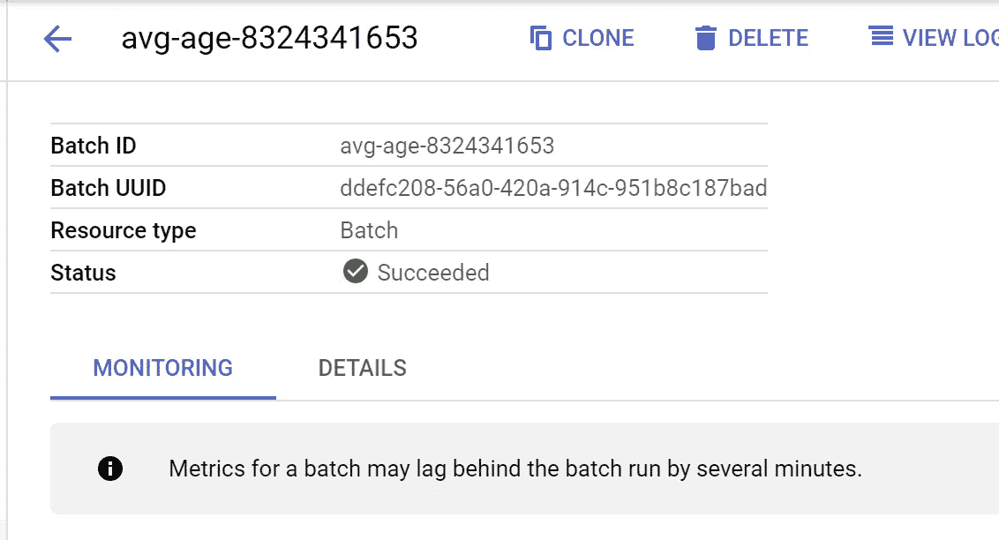

火花执行历史:

您可以从永久历史服务器访问 Spark 历史服务器，

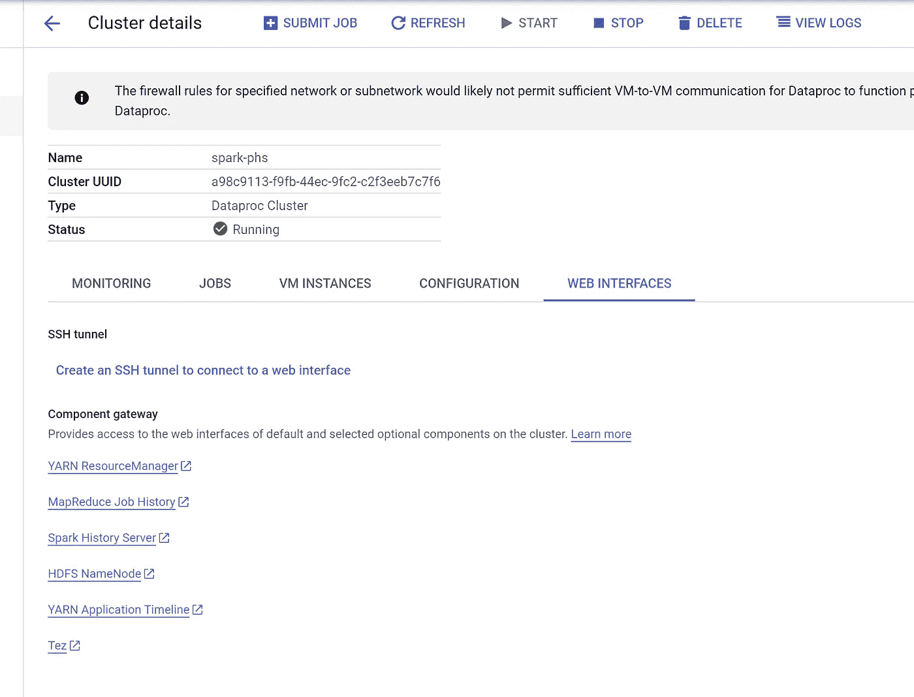

BigQuery 中的数据输出:

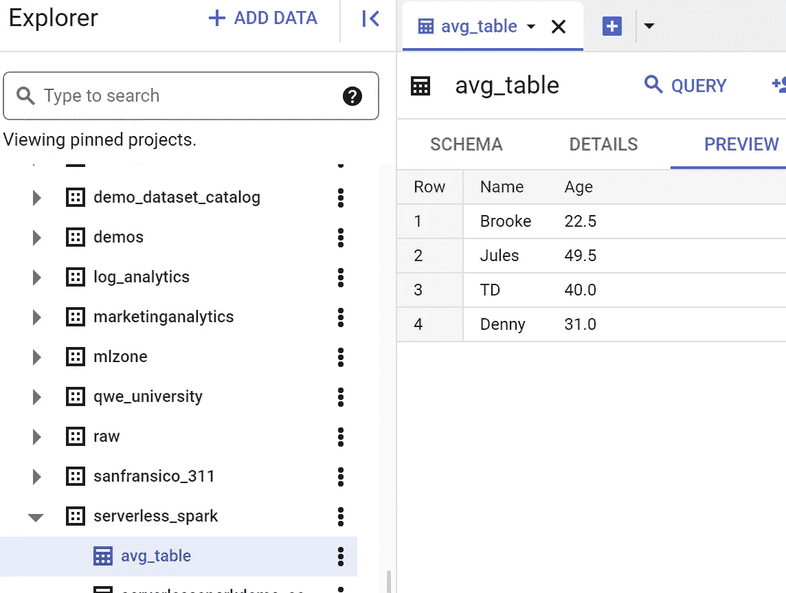

计费:对于所有无服务器 Spark 运行的成本，您可以在计费报告中跟踪 SKU，如下所示:

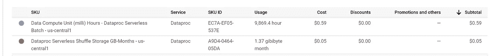

在下一篇文章中，我将讨论如何启动无服务器 Spark Jupyter 笔记本，以及如何通过 Cloud Composer 构建和编排 ML 管道。