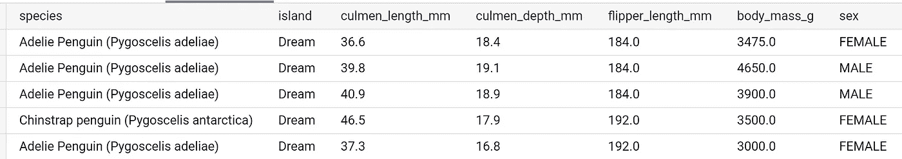
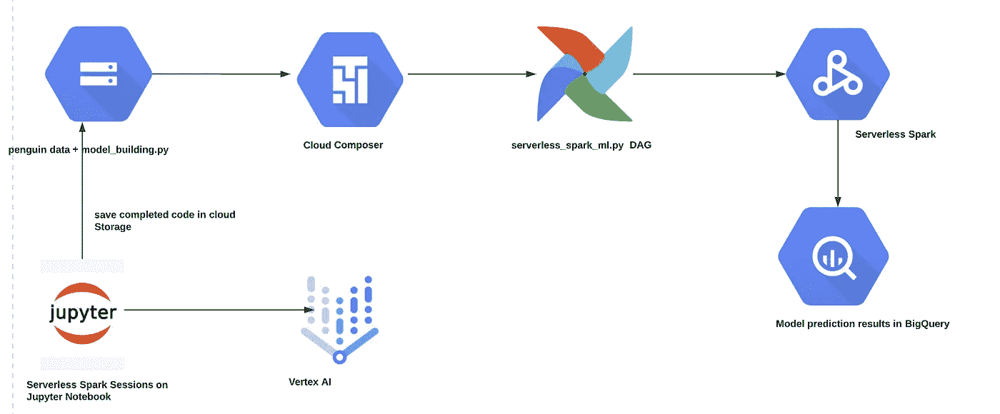
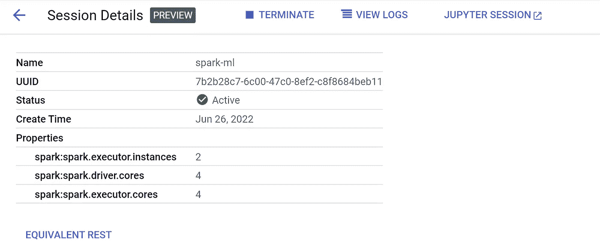
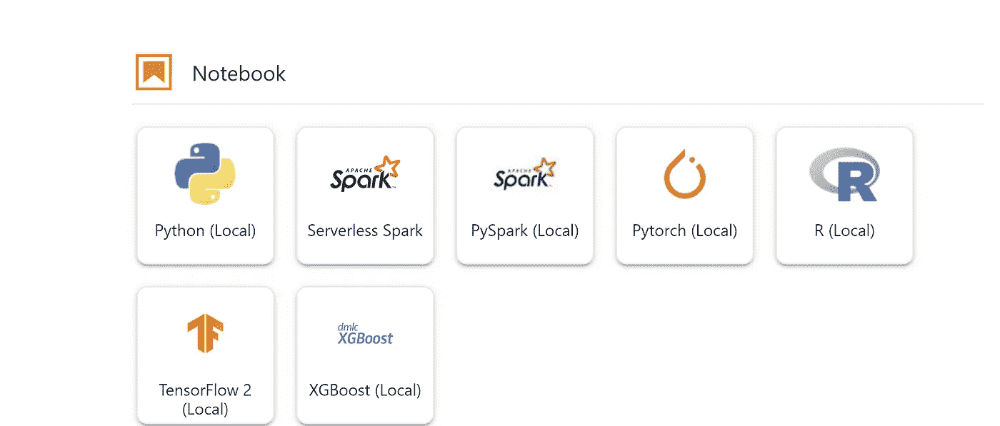
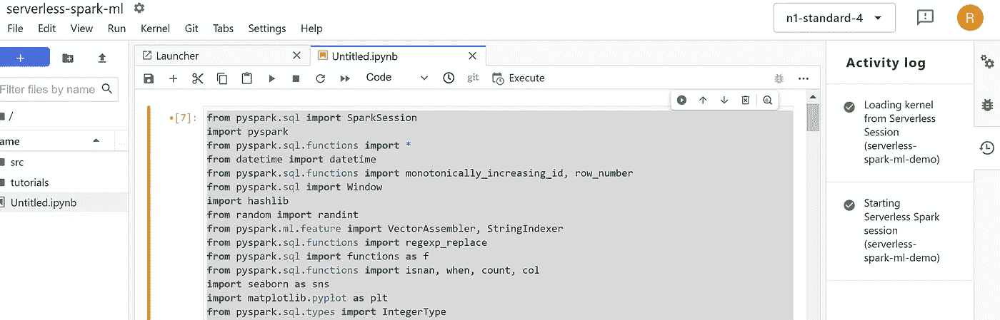
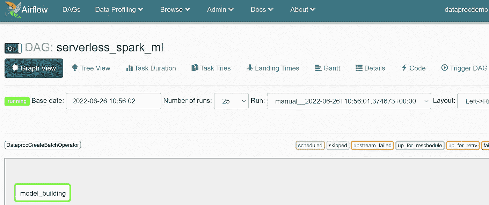
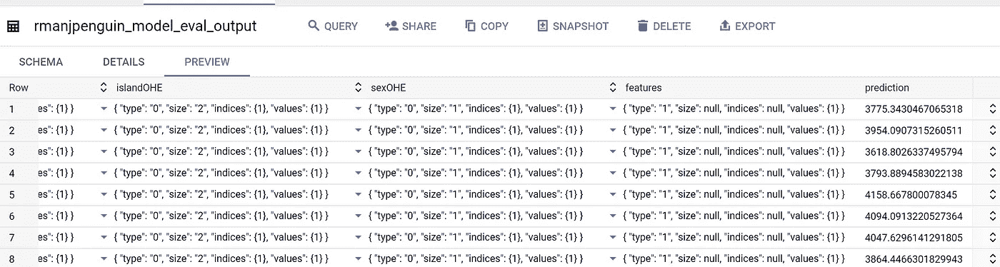
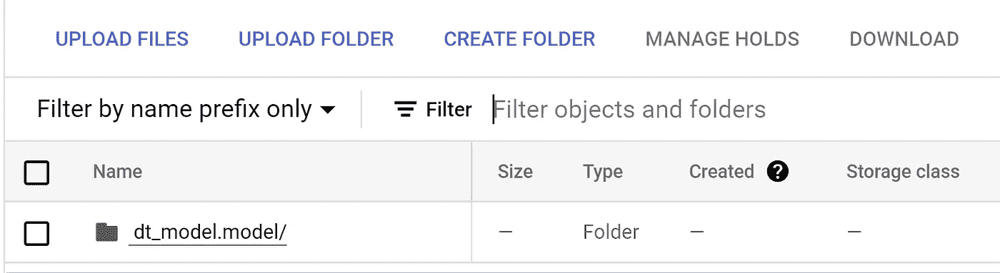

# GCP 的无服务器 Spark ML 管道

> 原文：<https://medium.com/google-cloud/serverless-spark-ml-pipeline-in-gcp-4bc28d178ed0?source=collection_archive---------1----------------------->

在关于无服务器 Spark 系列的上一篇文章中，我们描述了如何开发一个示例 ETL 管道。在本文中，我们将对此进行扩展，以进一步了解如何开发 ML 管道并以无服务器 Spark 方式进行编排。

我们将建立一个简单的回归模型来预测企鹅的体重。此解决方案的数据集可在 BigQuery 公共数据集中找到，位于，**big query-public-data . ml _ datasets . penguins .**我们将根据企鹅的物种、和性别来预测企鹅的体重。

样本数据集可以在这里查看，



整个管道的解决方案架构如下:



要开始以交互方式处理无服务器 Spark 会话，请导航到 Cloud Dataproc 控制台>创建新会话>打开 Jupyter 会话



在笔记本>新启动器>无服务器 Spark >中，您可以选择创建的会话并开始编写 pyspark 代码。



**数据集**:企鹅数据在**bigquery-public-data . ml _ datasets . penguins 中可用。**为了模拟生产管道，我们将假设数据在 GCS 中，因此我们将把这个数据从 big query 导出到 GCS bucket，作为 penguins.csv

**model_building.py :** 我们将使用 Linearregressor 模型建立一个回归模型来预测企鹅的体重。回归模型的代码如下所示，

```
from pyspark.sql import SparkSession
import pyspark
from pyspark.sql.functions import *
from datetime import datetime
from pyspark.sql.functions import monotonically_increasing_id, row_number
from pyspark.sql import Window
import hashlib
from random import randint
from pyspark.ml.feature import VectorAssembler, StringIndexer
from pyspark.sql.functions import regexp_replace
from pyspark.sql import functions as f
from pyspark.sql.functions import isnan, when, count, col
import seaborn as sns
import matplotlib.pyplot as plt
from pyspark.sql.types import IntegerType
from pyspark import SparkContext
from pyspark.sql import SQLContext
from pyspark.ml.feature import VectorAssembler
import pandas as pd
from pyspark.sql.functions import isnan, when, count, col
from google.cloud import bigquery
from pyspark.ml import PipelineModel
from pyspark.ml import Pipeline
from pyspark.ml.feature import OneHotEncoder, StringIndexer
from pyspark.ml.feature import RFormula
from pyspark.ml.regression import LinearRegression
from pyspark.ml.evaluation import RegressionEvaluator#Building a Spark session to read and write to and from BigQuery
spark = SparkSession.builder.appName('pyspark-penguin-ml').config('spark.jars', 'gs://spark-lib/bigquery/spark-bigquery-with-dependencies_2.12-0.22.2.jar').enableHiveSupport().getOrCreate()#Reading the arguments and storing them in variables
project_name=<< replace your project id>>
dataset_name=<< replace your dataset id>>
bucket_name=<< replace your bucket name>>
user_name=<< replace your username>>#Reading the penguins source data
p_df = spark.read.option("header",True).csv("gs://"+bucket_name+"/01-datasets/penguins.csv")
p_df.printSchema()p_df.select("species", "island", "culmen_length_mm", "culmen_depth_mm",
 "flipper_length_mm", "body_mass_g","sex").show(5)## Convert columns of type string to float
p_df=p_df.withColumn('culmen_length_mm',p_df['culmen_length_mm'].cast("float").alias('culmen_length_mm'))
p_df=p_df.withColumn('culmen_depth_mm',p_df['culmen_depth_mm'].cast("float").alias('culmen_depth_mm'))
p_df=p_df.withColumn('flipper_length_mm',p_df['flipper_length_mm'].cast("float").alias('flipper_length_mm'))
p_df=p_df.withColumn('culmen_length_mm',p_df['culmen_length_mm'].cast("float").alias('culmen_length_mm'))
p_df=p_df.withColumn('culmen_depth_mm',p_df['culmen_depth_mm'].cast("float").alias('culmen_depth_mm'))
p_df=p_df.withColumn('body_mass_g',p_df['body_mass_g'].cast("float").alias('body_mass_g'))p_df.printSchema()## Split the data into train and test in the ration 80:20
p_trainDF, p_testDF = p_df.randomSplit([.8, .2], seed=42)
print(f"""There are {p_trainDF.count()} rows in the training set,
and {p_testDF.count()} in the test set""")## VectorAssembler takes a list of input columns and creates a new DataFrame with an additional column, which we will call features. It combines
##the values of those input columns into a single vector
vecAssembler = VectorAssembler(inputCols=["culmen_length_mm", "culmen_depth_mm",
 "flipper_length_mm"], outputCol="features")
vecTrainDF = vecAssembler.transform(p_trainDF)
vecTrainDF.select("species", "island", "culmen_length_mm", "culmen_depth_mm",
 "flipper_length_mm","sex","features", "body_mass_g").show(10)## We will identify columns which are categorical and one-hot-code them
categoricalCols = [field for (field, dataType) in p_trainDF.dtypes
 if dataType == "string"]
indexOutputCols = [x + "Index" for x in categoricalCols]
oheOutputCols = [x + "OHE" for x in categoricalCols]
stringIndexer = StringIndexer(inputCols=categoricalCols,
 outputCols=indexOutputCols,
 handleInvalid="skip")
oheEncoder = OneHotEncoder(inputCols=indexOutputCols,
 outputCols=oheOutputCols)
numericCols = [field for (field, dataType) in p_trainDF.dtypes
 if ((dataType == "float") & (field != "body_mass_g"))]
assemblerInputs = oheOutputCols + numericCols
vecAssembler = VectorAssembler(inputCols=assemblerInputs,
 outputCol="features")##we put all the feature preparation and model building into the pipeline, and
##apply it to our data set
lr = LinearRegression(labelCol="body_mass_g", featuresCol="features")
pipeline = Pipeline(stages = [stringIndexer, oheEncoder, vecAssembler, lr])pipelineModel = pipeline.fit(p_trainDF)
predDF = pipelineModel.transform(p_testDF)
predDF.select("features", "body_mass_g", "prediction").show(5)
predDF.show(5)## Evaluate the Model 
regressionEvaluator = RegressionEvaluator(
 predictionCol="prediction",
 labelCol="body_mass_g",
 metricName="rmse")
rmse = regressionEvaluator.evaluate(predDF)
print(f"RMSE is {rmse:.1f}")
r2 = regressionEvaluator.setMetricName("r2").evaluate(predDF)
print(f"R2 is {r2}")
pipelineModel.write().overwrite().save('gs://'+bucket_name+'/'+user_name+'_dt_model/dt_model.model')#Writing the output of the model evaluation to BigQuery
spark.conf.set("parentProject", project_name)
bucket = bucket_name
spark.conf.set("temporaryGcsBucket",bucket)
predDF.write.format('bigquery') .mode("overwrite").option('table', project_name+':'+dataset_name+'.'+user_name+'penguin_model_eval_output') .save()print('Job Completed Successfully!')
```

模型保存在 GCS 中，模型预测结果写入 BigQuery。

代码“model_building.py”保存在 GCS 文件夹中。

**server less _ spark _ ml . py:**我们将使用 cloud composer dag 来编排这个过程。虽然这是一个包含从 GCS 到 pandas dataframe >模型构建&评估>将模型结果导出到 BigQuery 的 3 步流程，但生产 ML 管道可能有额外的步骤，尤其是围绕数据准备、CI/CD 和模型服务，因此需要使用 Cloud Composer 等编排工具。

dag 代码如下所示，

```
import os
from airflow.models import Variable
from datetime import datetime
from airflow import models
from airflow.providers.google.cloud.operators.dataproc import (DataprocCreateBatchOperator,DataprocGetBatchOperator)
from datetime import datetime
from airflow.utils.dates import days_ago
import string
import random # define the random module
S = 10  # number of characters in the string.
# call random.choices() string module to find the string in Uppercase + numeric data.
ran = ''.join(random.choices(string.digits, k = S))
project_id = models.Variable.get("project_id")
region = models.Variable.get("region")
subnet=models.Variable.get("subnet")
phs_server=Variable.get("phs")
code_bucket=Variable.get("code_bucket")
bq_dataset=Variable.get("bq_dataset")
umsa=Variable.get("umsa")name="rmanj"dag_name= "serverless_spark_ml"
service_account_id= <<enter your service account>>penguin_model= "gs://"+code_bucket+"/00-scripts/penguin_model.py"BATCH_ID = "penguin-weight-"+str(ran)BATCH_CONFIG1 = {
    "pyspark_batch": {
        "main_python_file_uri": penguin_model,
        "args": [
          project_id,
          bq_dataset,
          code_bucket,
          name
        ],
        "jar_file_uris": [
      "gs://spark-lib/bigquery/spark-bigquery-with-dependencies_2.12-0.22.2.jar"
    ]
    },
    "environment_config":{
        "execution_config":{
              "service_account": service_account_id,
            "subnetwork_uri": subnet
            },
        "peripherals_config": {
            "spark_history_server_config": {
                "dataproc_cluster": f"projects/{project_id}/regions/{region}/clusters/{phs_server}"
                }
            },
        },
}with models.DAG(
    dag_name,
    schedule_interval=None,
    start_date = days_ago(2),
    catchup=False,
) as dag_serverless_batch:
    # [START how_to_cloud_dataproc_create_batch_operator]
    create_serverless_batch1 = DataprocCreateBatchOperator(
        task_id="model_building",
        project_id=project_id,
        region=region,
        batch=BATCH_CONFIG1,
        batch_id=BATCH_ID,
    )

    create_serverless_batch1
```

一旦您将它保存在 dags 文件夹中，它应该会出现在 Composer UI 中。然后，您可以触发管道，



执行后，您可以在 BigQuery 中看到模型预测结果，



GCS 中的模型，



<<make sure="" to="" delete="" the="" resources="" especially="" composer="" after="" pipeline="" runs="">></make>

您可以通过云构建进一步扩展这一渠道，以包括 CI/CD。通过这种方式，您可以将 spark 工作负载迁移到 GCP，获得 Spark on GCP 的自动扩展、无服务器功能的全部优势，同时仍然保留非粘性或非锁定实施的优势。