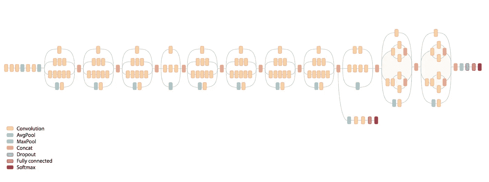
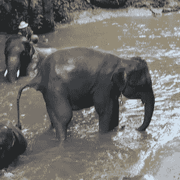
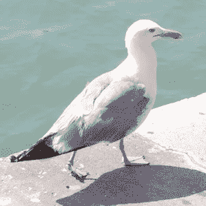
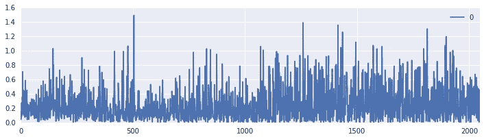
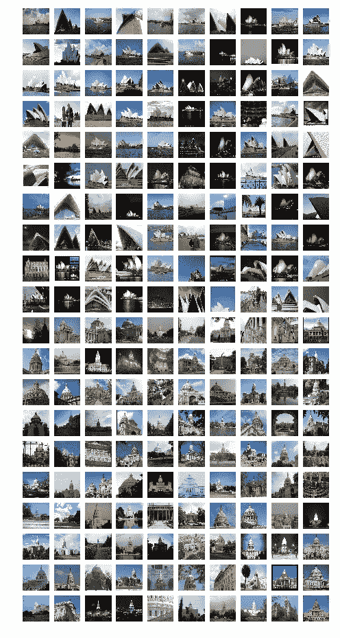
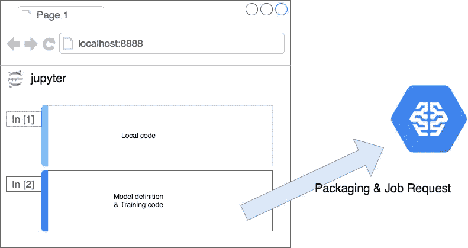

# 使用云 ML 引擎和 Keras 的无服务器迁移学习

> 原文：<https://medium.com/google-cloud/serverless-transfer-learning-with-cloud-ml-engine-and-keras-335435f31e15?source=collection_archive---------0----------------------->

使用深度学习的图像分类在今天广为人知，但你只听到少量图像分类成功的消息。我想这是因为它需要大量的数据和时间来获得好的结果。

**迁移学习**以一种成熟的方式解决了这样一个问题。
迁移学习是一种使用预先训练好的网络并在网络末端稍加改变的技术，因此您只需重新训练改变的部分。该网络仍然具有提取图像特征的能力，并且可以针对专用图像分类进行微调，还需要更少的时间和更少的数据集来重新训练。然而，在培训和操作方面仍然存在许多麻烦，因此本文将向您展示如何在[云 ML 引擎](https://cloud.google.com/ml-engine/)上轻松使用迁移学习。

**TL；**博士看我的[笔记本](https://github.com/hayatoy/cloudml-magic/blob/master/examples/Keras_Fine_Tuning.ipynb):)

# 使用 Keras 进行迁移学习

[Keras](https://keras.io/) 是构建迁移学习模型最简单的方法。如上所述，迁移学习模型使用预训练网络，Keras 已经有一些很棒的[预训练模型](https://keras.io/applications/)。

**Keras 中的 Inception-v3** 在 Keras 中使用预先训练好的模型相当容易，只有下面两行。

```
**from** keras.applications.inception_v3 **import** InceptionV3
model **=** InceptionV3(weights**=**’imagenet’)
```

这个模型是用 ImageNet 的数据集预先训练的，它有一百万张图像和 1000 个类。



通过谷歌研究博客发布的《盗梦空间-v3》图表

让我们用这个模型对下面两幅图像进行分类。因为 Inception-v3 模型接受 RGB 299x299 图像作为输入，所以您必须在分类之前转换您的图像。Keras 也有一些有用的模块可以做到这一点。

```
**from** keras.preprocessing **import** image
**from** keras.applications.inception_v3 **import** preprocess_input, decode_predictions
**import** numpy **as** np

*# Make input data from Jpeg file*
img_path **=** 'seagull.jpg'
img **=** image**.**load_img(img_path, target_size**=**(299, 299))
x **=** image**.**img_to_array(img)
x **=** np**.**expand_dims(x, axis**=**0)
x **=** preprocess_input(x)

*# Classify image*
preds **=** model**.**predict(x)

*# Print predicted classes*
**print**('Predicted:')
**for** p **in** decode_predictions(preds, top**=**5)[0]:
    **print**("Score {}, Label {}"**.**format(p[2], p[1]))
```

要分类的图像和结果；



```
Predicted:
**Score 0.965535342693, Label Indian_elephant**
Score 0.0246694963425, Label tusker
Score 0.000626200810075, Label African_elephant
Score 0.000182053816388, Label Mexican_hairless
Score 0.000138055766001, Label hippopotamus
```



```
Predicted:
**Score 0.278156191111, Label albatross**
Score 0.0422638729215, Label drake
Score 0.0255650430918, Label goose
Score 0.0211290325969, Label red-breasted_merganser
Score 0.019902639091, Label lakeside
```

该模型对大象进行了正确的分类，但未能对海鸥进行分类。原因很简单，因为用于训练模型的[数据集](http://image-net.org/challenges/LSVRC/2012/browse-synsets)不包括“gull ”,所以它将相似的候选分类。你永远得不到清单之外的结果，这就是为什么需要迁移学习。

**可视化中间层输出**
在进行迁移学习之前，让我们来可视化中间层输出。要显示图层列表，请运行下面的代码。

```
**import** pandas **as** pd
pd**.**DataFrame(model**.**layers)**.**tail()
```

输出如下。

```
308  <keras.layers.merge.Concatenate object at 0x7f...
309  <keras.layers.core.Activation object at 0x7fb7...
310  <keras.layers.merge.Concatenate object at 0x7f...
311  <keras.layers.pooling.GlobalAveragePooling2D o...
312  <keras.layers.core.Dense object at 0x7fb7a1a5b...
```

我们想要可视化层 311 的输出，`GlobalAveragePooling2D`，所以让我们构建一个模型来输出中间层的输出。

```
**from** keras.models **import** Model

*# The model which outputs intermediate layer features*
intermediate_layer_model **=** Model(inputs**=**model**.**input, 
                                 outputs**=**model**.**layers[311]**.**output)
```

要提取要素并进行可视化，请运行以下代码。

```
features **=** intermediate_layer_model**.**predict(x)
pd**.**DataFrame(features**.**reshape(**-**1,1))**.**plot(figsize**=**(12, 3))
```



`GlobalAveragePooling2D`的输出是 2048 尺寸特征。Inception-v3 模型在网络末端使用密集层对 1000 个类进行分类，密集层使用这些特征作为输入。但是现在，我们想分类“其他”类。所以我们去掉这一层，再放一层。

**添加密集层进行微调**
让我们添加密集层，如果我们想分类两个类，代码应该是这样的。

```
**from** keras.layers **import** Dense

*# Connect Dense layers at the end*
x **=** intermediate_layer_model**.**output
x **=** Dense(1024, activation**=**'relu')(x)
predictions **=** Dense(2, activation**=**'softmax')(x)

*# Transfer Learning model*
transfer_model **=** Model(inputs**=**intermediate_layer_model**.**input, outputs**=**predictions)
```

此时，模型会训练其所有变量。但是我们只想训练我们添加的密集层，所以让我们冻结未训练的层。

```
*# Freeze all layers*
**for** layer **in** transfer_model**.**layers:
    layer**.**trainable **=** False

*# Unfreeze last dense layers*
transfer_model**.**layers[312]**.**trainable **=** True
transfer_model**.**layers[313]**.**trainable **=** True

transfer_model**.**compile(loss**=**'categorical_crossentropy',
                       optimizer**=**'adam',
                       metrics**=**['accuracy'])
```

搞定了。现在，我们可以针对专用的两类分类对该模型进行微调。

两类分类的微调
让我们对下面的图片进行分类。我制作的数据集名为**歌剧院-国会大厦**数据集，包括歌剧院和国会大厦各 100 张图片。您可以下载代码来创建这个数据集。
https://github.com/hayatoy/deep-learning-datasets



**加载数据集**
数据集被压缩为 NumPy 格式，存储在 GitHub 中，可以如下使用。

```
**import** requests

url **=** 'https://github.com/hayatoy/deep-learning-datasets/releases/download/v0.1/tl_opera_capitol.npz'
response **=** requests**.**get(url)
dataset **=** np**.**load(BytesIO(response**.**content))

X_dataset **=** dataset['features']
y_dataset **=** dataset['labels']
```

让我们将数据集分为训练数据集和测试数据集，这里我将 80%的数据集分为训练数据集，20%的数据集分为测试数据集。

```
**from** keras.utils **import** np_utils
**from** sklearn.model_selection **import** train_test_split

X_dataset **=** preprocess_input(X_dataset)
y_dataset **=** np_utils**.**to_categorical(y_dataset)
X_train, X_test, y_train, y_test **=** train_test_split(
    X_dataset, y_dataset, test_size**=**0.2, random_state**=**42)
```

顺便问一下，如果正常的 Inception-v3 模型对数据集进行分类会是什么结果？让我们看看进展如何。

```
x **=** X_dataset[0]
x **=** np**.**expand_dims(x, axis**=**0)

preds **=** model**.**predict(x)
**print**('Predicted:')
**for** p **in** decode_predictions(preds, top**=**5)[0]:
    **print**("Score {}, Label {}"**.**format(p[2], p[1]))
```

数据集的第一幅图像是歌剧院。这是结果..残骸。同样，因为原始 ImageNet 数据集不包括歌剧院。

```
Predicted:
**Score 0.110657587647, Label wreck**
Score 0.0671983659267, Label lakeside
Score 0.0309968702495, Label seashore
Score 0.0249739717692, Label breakwater
Score 0.0229569561779, Label fountain
```

**微调模型为 Opera-Capitol**
训练转移学习模型，只需调用`fit` 函数即可。之后，让我们来评估一下这个模型是如何正确预测的。

```
transfer_model**.**fit(X_train, y_train, epochs**=**20,
                   validation_data**=**(X_test, y_test))
loss, acc **=** transfer_model**.**evaluate(X_test, y_test)
**print**('Loss {}, Accuracy {}'**.**format(loss, acc))
```

测试数据的评估结果为..

```
Loss 0.112133163214, Accuracy 0.975
```

准确率达到了 97.5%！

# 在云 ML 引擎上训练模型

迁移学习模式大约需要。如果您在云 ML 引擎上运行，在没有 GPU 的本地机器上进行 10 到 20 分钟的培训..只有一分钟。(加上几分钟的准备时间)

**制作包**
要在 Cloud ML 引擎上训练你的模型，你必须先把你的代码做一个包。在本例中，我们使用 **keras** 、 **h5py** 和 **Pillow** 作为外部库，因此您必须将这些库包含在您的`setup.py`中。

```
**from** setuptools **import** setup
**if** __name__ **==** '__main__':
    setup(name**=**'trainer',
          packages**=**['trainer'],
          install_requires**=**['keras','h5py','Pillow'])
```

**云 ML 引擎从 Jupyter 笔记本**
打包，上传到 Google 云存储，运行 ML 引擎的工作真的很累。你不想在 ML 引擎上运行你的 Jupyter 笔记本代码吗？我为此做了扩展！
[https://github.com/hayatoy/cloudml-magic](https://github.com/hayatoy/cloudml-magic)



# 云 ML 引擎的在线预测

现在你想为你训练过的模型服务，怎么做呢？实现 HTTP 服务器，在服务器上设置 TensorFlow 或 Keras，负载平衡等..那是触摸工作。在 Cloud ML Engine 上，你只需要把你的模型上传到 GCS (Google 云存储)上。它服务于您的模型，接受 REST API 的预测请求，当然还有自动缩放。

**构建一个转换图像的图形**
由于 Keras 模型只接受原始图像数组作为输入，我们应该将 Jpeg 或 Png 格式转换为原始图像数组，否则 REST API 请求的有效负载会太大。

```
**with** tf**.**Graph()**.**as_default() **as** g_input:
    input_b64 **=** tf**.**placeholder(shape**=**(1,),
                               dtype**=**tf**.**string,
                               name**=**'input')
    input_bytes **=** tf**.**decode_base64(input_b64[0])
    image **=** tf**.**image**.**decode_image(input_bytes)
    image_f **=** tf**.**image**.**convert_image_dtype(image, dtype**=**tf**.**float32)
    input_image **=** tf**.**expand_dims(image_f, 0)
    output **=** tf**.**identity(input_image, name**=**'input_image')

*# Convert to GraphDef*
g_input_def **=** g_input**.**as_graph_def()
```

接下来我们将 Keras 模型转换为`tf.GraphDef`，这样我们就可以连接上图了。

```
sess **=** K**.**get_session()

**from** tensorflow.python.framework **import** graph_util

*# Make GraphDef of Transfer Model*
g_trans **=** sess**.**graph
g_trans_def **=** graph_util**.**convert_variables_to_constants(sess, 
                      g_trans**.**as_graph_def(),
                      [transfer_model**.**output**.**name**.**replace(':0','')])
```

这是组合图，它接受 base64 编码的 Jpeg 或 Png 文件，然后输出迁移学习模型的分类结果。

```
**with** tf**.**Graph()**.**as_default() **as** g_combined:
    x **=** tf**.**placeholder(tf**.**string, name**=**"input_b64")

    im, **=** tf**.**import_graph_def(g_input_def,
                              input_map**=**{'input:0': x},
                              return_elements**=**["input_image:0"])

    pred, **=** tf**.**import_graph_def(g_trans_def,
             input_map**=**{transfer_model**.**input**.**name: im,
             'batch_normalization_1/keras_learning_phase:0': False},
             return_elements**=**[transfer_model**.**output**.**name])
```

在将模型上传到 GCS 之前，我们必须将模型转换成`SavedModel`格式。下面的代码将图形转换成`SavedModel`格式，并直接保存到 GCS。

```
**with** tf**.**Session() **as** sess2:
  inputs **=** {"inputs": tf**.**saved_model**.**utils**.**build_tensor_info(x)}
  outputs **=** {"outputs":tf**.**saved_model**.**utils**.**build_tensor_info(pred)}
  signature **=**tf**.**saved_model**.**signature_def_utils**.**build_signature_def(
            inputs**=**inputs,
            outputs**=**outputs,
  method_name**=**tf**.**saved_model**.**signature_constants**.**PREDICT_METHOD_NAME
        )

  *# save as SavedModel*
  b **=** tf**.**saved_model**.**builder**.**SavedModelBuilder('gs://{BUCKET}/mdl')
  b**.**add_meta_graph_and_variables(sess2,
                  [tf**.**saved_model**.**tag_constants**.**SERVING],
                  signature_def_map**=**{'serving_default': signature})
  b**.**save()
```

让我们将模型注册到 ML 引擎。只需键入以下两个命令。这可能需要几分钟..所以喝杯茶就完事了。

```
gcloud ml-engine models create OperaCapitol
gcloud ml-engine versions create v1 \
          --model OperaCapitol \
          --runtime-version 1.2 \
          --origin gs://**{**BUCKET**}**/mdl
```

# 通过在线预测对图像分类

要通过在线预测对一个图像进行分类，只需调用它的 REST API 即可。如果您在 Python 环境中请求，使用 discovery api 库要容易得多。下面是如何初始化在线预测的发现 api。

```
**from** oauth2client.client **import** GoogleCredentials
**from** googleapiclient **import** discovery
**from** googleapiclient **import** errors

PROJECTID **=** 'PROJECTID'
projectID **=** 'projects/{}'**.**format(PROJECTID)
modelName **=** 'OperaCapitol'
modelID **=** '{}/models/{}'**.**format(projectID, modelName)

credentials **=** GoogleCredentials**.**get_application_default()
ml **=** discovery**.**build('ml', 'v1', credentials**=**credentials)
```

让我们对一个图像进行分类。转换器图形没有任何调整大小的功能，你必须自己调整图像到 299x299。另外，不要忘记将图像编码为 base64。

```
**with** open('opera.jpg', 'rb') **as** f:
    b64_x **=** f**.**read()
**import** base64
**import** json

b64_x **=** base64**.**urlsafe_b64encode(b64_x)
input_instance **=** dict(inputs**=**b64_x)
input_instance **=** json**.**loads(json**.**dumps(input_instance))
request_body **=** {"instances": [input_instance]}

request **=** ml**.**projects()**.**predict(name**=**modelID, body**=**request_body)
**try**:
    response **=** request**.**execute()
**except** errors**.**HttpError **as** err:
    **print**(err**.**_get_reason())
response
```


下面是网上预测的回应。“输出”清单分别代表歌剧院和国会大厦的信心。
99.7%为歌剧院，没错！

```
{u'predictions': [
    {u'outputs': [0.9974665641784668, 0.00253341649658978]}
]}
```

你可以在这里找到这篇文章的代码；
[https://github.com/hayatoy/cloudml-magic](https://github.com/hayatoy/cloudml-magic)

享受云 ML 引擎！