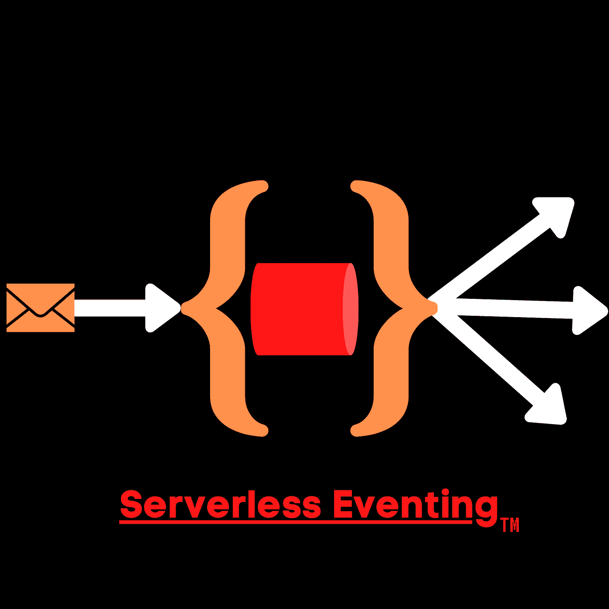

# 无服务器事件:谷歌事件介绍——杰森·史密斯

> 原文：<https://medium.com/google-cloud/serverlesss-eventing-intro-to-eventing-at-google-jason-jay-smith-8cd458d0eae8?source=collection_archive---------0----------------------->



完全托管云运行的 EventArc

对于那些熟悉我们名为 Cloud Run 的完全托管无服务器产品的人来说，你会很高兴地知道我们推出了 [Eventarc](https://cloud.google.com/blog/products/serverless/build-event-driven-applications-in-cloud-run) 。这是目前在“预览”状态，但它现在可供所有人使用。它允许你通过[云审计日志](https://cloud.google.com/logging/docs/audit)接收来自 *60+谷歌云资源*的事件。你需要更多吗？你可以通过使用 [Google PubSub](https://cloud.google.com/pubsub) 作为你的[事件总线](https://thejaysmith.com/blogroll/on-serverless/severless-eventing/serverless-eventing-why-you-need-an-eventing-bus/)来进一步定制。

不再有 YAML 的城墙来连接这些事件。你自己去试试吧。你可以在[你的云账户](https://console.cloud.google.com/run)中使用我们的 [GitHub 演示](https://github.com/meteatamel/cloudrun-tutorial/blob/master/docs/image-processing-pipeline-eventarc.md)，我们的 [CodeLab。](https://codelabs.developers.google.com/codelabs/cloud-run-events#0)

Anthos 的云运行事件

现在，如果你有一个托管在 GKE 的 Kubernetes 集群会怎么样？对你来说是个好消息。我们现在有针对 Anthos 的云运行的[事件。您将获得与使用 Eventarc 相同的好处，但是是在您的 GKE 集群上。人们不想完全接受管理的原因有很多。有时环境太固执己见，因此限制。有时，您希望通过使用开源平台来扩展您的经验。这里没有正确或错误的答案。好的一面是，不管你的理由是什么，你都可以选择在 GKE 使用可控的 Knative Eventing。](https://cloud.google.com/kuberun/docs/events/anthos/quickstart)

不再有 YAML 的城墙来连接这些事件。你自己去试试吧。您可以在[您的云帐户](https://console.cloud.google.com/run)快速警告中完成，您需要在您的集群中启用事件以便使用该功能。我们在*下[解释](https://cloud.google.com/kuberun/docs/events/quickstart)为 Anthos* 初始化云运行事件。

快速设置的方法是运行以下命令:

```
gcloud beta events init --platform gke
```

然后出现提示时，选择您的 GKE 集群。您还需要回答所有提示的`Y`,以创建和投标合适的服务帐户。要验证这是否有效，只需运行以下代码行:

```
kubectl get pods -n cloud-run-events kubectl get pods -n knative-eventing
```

完成此操作后，您将需要创建一个事件代理。首先，创建一个`events`名称空间(确保您已经对您的集群进行了身份验证):nn`bashnkubectl create namespace eventsn`nn 然后用默认密码对其进行初始化:n`bashngcloud beta events namespaces init events u002du002dcopy-default-secret u002du002dplatform gken`nn 最后，创建事件代理:n`bashngcloud beta events brokers create default u002du002dnamespace events u002du002dplatform gken`nn 您可以通过运行以下命令来检查您的工作:n`bashnkubectl get brokers -n eventsn`nn 您还可以使用 BigQuery 来使用这个 [GitHub 演示](https://github.com/meteatamel/cloudrun-tutorial/blob/master/docs/bigquery-processing-pipeline-gke.md)。如果你不想使用你的我们的项目，你可以使用 [CodeLabs](https://codelabs.developers.google.com/codelabs/cloud-run-events-anthos#0) 。n

给你两个选择

这两个选项都是在应用程序中实现无服务器事件的好方法。两者都利用了 [CloudEvents](https://cloudevents.io) 规范，并且都与 Google 云服务无缝集成。

当然，最终的好处是，它简化了用简单的事件触发器将服务绑定到事件的过程。要了解更多信息，我建议查看来自 Google Cloud Next 2020 的[视频](https://www.youtube.com/watch?v=0N82S5fXpQEu0026feature=emb_logo)

*原载于 2020 年 12 月 31 日 https://thejaysmith.com**的* [*。*](https://thejaysmith.com/on-serverless/severless-eventing/serverlesss-eventing-intro-to-eventing-at-google/)