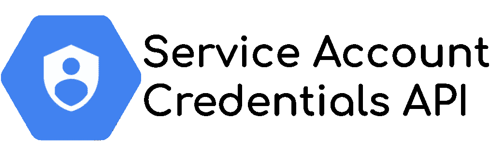

# 服务帐户凭证 API:不同问题的解决方案

> 原文：<https://medium.com/google-cloud/service-account-credentials-api-a-solution-to-different-issues-dc7434037115?source=collection_archive---------0----------------------->



**IAM** (身份和访问管理)是**谷歌云**的支柱。它验证并授权帐户(用户帐户或服务帐户)访问资源。我[已经提到了这个服务](/google-cloud/the-2-limits-of-iam-service-on-google-cloud-7db213277d9c)的一些局限性，特别是当**你想避免服务账户密钥文件的使用**，从而为**避免重大安全风险**。

为了帮助解决这个问题，Google Cloud 引入了一个新的 API: [服务帐户凭证 API](https://cloud.google.com/iam/docs/reference/credentials/rest) 。实际上，**并不是真正的新**(2018 年 6 月公测发布)，而是**鲜为人知或了解的**。然而，它可以在两个典型的用例中有所帮助。

*   **不使用元数据服务器生成** `**id_token**`(例如本地)
*   **生成云存储签名 url** 无服务账户私钥

# 元数据服务器不可用

[**元数据服务器**](https://cloud.google.com/compute/docs/storing-retrieving-metadata) **提供运行平台上的上下文信息**。它**只在所有谷歌云服务**上可用，并且对于查找服务上下文信息(项目 ID、位置)或**从服务的服务帐户**获取凭证信息很有用。

*例如，要从云运行中执行“服务对服务”调用，您必须按照文档中描述的* [*来使用它。*](https://cloud.google.com/run/docs/authenticating/service-to-service)

然而，元数据服务器**只能从 Google Cloud** 服务访问，基本 URL 是明确的`http://metadata.google.internal`

> 如何用元数据服务器**在本地**测试代码？

*为了确保本地和云上的相同行为，约束是* ***在所有环境*** *上拥有完全相同的代码。*

为了实现这一点，你**需要避免使用**元数据服务器，至少要生成**所需的** `**id_token**` **来访问私有的无服务器服务**比如:

*   私有云运行
*   私有云功能
*   IAP 背后的应用引擎

## 访问要求

要访问这些私有的无服务器服务，您需要**拥有有效的** `**id_token**` **和正确的受众**。您只能在服务帐户上**生成:**

*   使用服务帐户密钥文件，这是一个糟糕的安全想法
*   对于元数据服务器，当**可用时** *(即不在本地)*
*   使用**服务账户凭证 API**

*不可能用一个用户凭证* *生成一个有效的* `***id_token***` ***，正如我在上一篇文章* 中解释的[](/google-cloud/the-2-limits-of-iam-service-on-google-cloud-7db213277d9c)**

*另一方面，要**访问 Google API** ，比如服务账户凭证 API、存储 API，甚至 GMail API (…)，你**需要一个** `**access_token**`，而不是一个`id_token`。这个区别很重要，因为**可以用**生成一个 `**access_token**`*

*   ***通过元数据服务器使用密钥文件或**的**服务帐户*******
*   ***一个**用户帐户**，因此在本地具有 ADC(应用程序默认凭证)***

> ****综上所述，你* ***可以在任意条件下*** *生成一个* `***access_token***` ***。******

## ***避免元数据服务器请求***

***所以现在，您必须用服务帐户凭证 API 替换元数据服务器调用，以构建一个合适的替代方案***

1.  *****获取访问令牌**以执行对服务帐户凭证 API 的安全请求***
2.  *****获取您想要生成`id_token`的服务账户电子邮件*****
3.  *****使用正确的受众调用服务帐户凭证 API** 来生成`id_token`***

***要做到这一点，下面的代码示例中 Python 生成的`id_token`
`*google-auth*` *和* `*requests*` *依赖项需要安装****

```
***import google.auth
from google.auth.transport.requests import AuthorizedSession
import json# IAP audience is the ClientID of IAP-App-Engine-app in 
# the API->credentials page
# Cloud Function and Cloud Run need the base URL of the service
audience = 'YOUR AUDIENCE'# **#1 Get the default credential to generate the access token**
credentials, project_id = google.auth.default(
            scopes='https://www.googleapis.com/auth/cloud-platform')

# **#2 To use the current service account email**
service_account_email = credentials.service_account_email
# Don't work with user account, so define manually the email
# service_account_email = 'MY SERVICE ACCOUNT EMAIL'# **#3 prepare the call the the service account credentials API**
sa_credentials_url =  f'https://iamcredentials.googleapis.com/' \
                      f'v1/projects/-/serviceAccounts/'  \
                      f'{service_account_email}:generateIdToken'headers = {'Content-Type': 'application/json'}

# **Create an AuthorizedSession** that includes 
# automatically the access_token based on your credentials
authed_session = AuthorizedSession(credentials)# **Define the audience in the request body**
# add the parameter "'includeEmail':true" for IAP access
body = json.dumps({'audience': audience})# **Make the call** 
token_response = authed_session.request('POST',sa_credentials_url,
                                        data=body, headers=headers)

jwt = token_response.json()id_token = jwt['token']***
```

***现在**已经有了** `**id_token**`，您可以调用您想要的私有无服务器服务 API，例如***

```
***import requestsheaders = {'Authorization': f'bearer {id_token}'}
service_response = requests.get(service_url, headers=headers)***
```

*****现在，你有了！**这段代码**在本地工作，在云中*几乎*无缝**。*的确，在本地，有了用户凭证，你需要定义要使用的服务帐户。****

## ***角色和权限***

***当您执行此操作时，您需要设置正确的权限，因为***

> ***您要求帐户(由`*access_token*`标识)代表服务帐户电子邮件生成一个 ID 令牌***

***因此，请求者(由`access_token` ) **需要在服务帐户**上拥有 `**Service Account Token Creator**` **角色。*****

## ***特殊情况:元数据服务器部分可用***

***关于栈溢出， [Fabian](https://medium.com/u/6d75218cbac2?source=post_page-----dc7434037115--------------------------------) 发表了一个关于云构建的[问题。云构建的**行为不是标准的**:它允许你基于元数据服务器生成`access_token`，而不是`id_token`。*类似技术限制的东西*。
和 Fabian **需要在构建**期间调用私有云函数，因此，他需要在请求头中添加一个`id_token`！](https://stackoverflow.com/questions/64252736/google-cloud-build-fetch-identity-token/64268716)***

***因此，通过重用此解决方案和**避免为** `**id_token**` **代**使用元数据服务器 **，他已经能够实现他的私有云功能调用！*****

# ***创建不带私钥的签名 url***

***第二个用例也是一个安全问题。的确，当你想**生成一个** [**云存储签名的 url**](https://cloud.google.com/storage/docs/access-control/signed-urls) **时，需要一个服务账号私钥。*****

> ***但是，这个私钥的用途是什么呢？***

***私钥可用于***

*   *****在非对称加密的情况下，解密加密数据**(用公钥加密)；*这不是用例****
*   *****签署数据以证明签署者身份**(根据公钥验证签名)***

***这样，服务帐户凭证 API [允许您代表](https://cloud.google.com/iam/docs/reference/credentials/rest/v1/projects.serviceAccounts/signBlob)在 [服务帐户](https://cloud.google.com/iam/docs/reference/credentials/rest/v1/projects.serviceAccounts/signBlob) [上签署数据。**用起来吧**！](https://cloud.google.com/iam/docs/reference/credentials/rest/v1/projects.serviceAccounts/signBlob)***

***这次，**我就不重写 SignedUrl 方法**了，但是如果你在 Python 库中深潜，就能看到这个 [*(摘录自*](https://github.com/googleapis/python-storage/blob/fcd1c4f7c947eb95d6937783fd69670a570f145e/google/cloud/storage/_signing.py#L623)`[*_signing.py*](https://github.com/googleapis/python-storage/blob/fcd1c4f7c947eb95d6937783fd69670a570f145e/google/cloud/storage/_signing.py#L623)`[*)*](https://github.com/googleapis/python-storage/blob/fcd1c4f7c947eb95d6937783fd69670a570f145e/google/cloud/storage/_signing.py#L623)***

```
***...
if access_token and service_account_email:
   signature = _sign_message(string_to_sign, access_token,
                                             service_account_email)
...***
```

> ***如果**提供了`generate_signed_url`参数中的** `**access_token**` **和** `**service_account_email**`，则`**_sign_message**` **称为*****

***而且，如果你沿着`[_sign_message](https://github.com/googleapis/python-storage/blob/fcd1c4f7c947eb95d6937783fd69670a570f145e/google/cloud/storage/_signing.py#L671)` [走，你会看到这个](https://github.com/googleapis/python-storage/blob/fcd1c4f7c947eb95d6937783fd69670a570f145e/google/cloud/storage/_signing.py#L671)***

```
***url = "https://iamcredentials.googleapis.com/v1/projects/-/serviceAccounts/{}:signBlob?alt=json".format(service_account_email)***
```

*****正是我们需要的！**所以现在，我们只需要正确调用初始的`generate_signed_url`方法***

```
***from google.cloud import storage
from datetime import datetime, timedelta
import google.auth
from google.auth.transport import requests **# Get the default credential on the current environment**
credentials, project_id = google.auth.default()

**# Perform a refresh request to get the access token** 
# of the current credentials (Else, its value is 'None')
r = requests.Request()
credentials.refresh(r)

**# Create your storage object to sign**
client = storage.Client()
bucket = client.get_bucket('MY_BUCKET')
blob = bucket.get_blob('my_path/my_file.txt')
expires = datetime.now() + timedelta(seconds=86400)

**# In case of user credential usage**, you have to define manually 
# the service account to use **(for development purpose only)**
service_account_email = "YOUR DEV SERVICE ACCOUNT"
**# If you use a service account credential, you can use it directly**
if hasattr(credentials, "service_account_email"):
    service_account_email = credentials.service_account_email

url = blob.generate_signed_url(expiration=expires,
                   service_account_email=service_account_email, 
                   access_token=credentials.token)
print(url)***
```

*****嘣，你生成了一个没有任何私钥的签名 URL**本地存储！您使用**相同的云存储功能，并且增加了您的安全性**(没有秘密需要管理)。***

****该云存储客户端库容量* ***可通过 Python 获得。在 Go*** *中还没有。检查您最喜欢的语言的客户端库中的 signedUrl 代码，以验证这种能力。****

# ***尽可能使用它！***

***该**服务帐户凭据应用编程接口可以在许多情况下**帮助您，在这些情况下，您需要的操作只有使用服务帐户密钥文件才有可能。您**通过执行一个简单的 API 调用**来增加您的应用程序安全性！太棒了，不是吗？***

***除了这两个有用的特性和用例之外，您还可以，例如，用这个 API**模拟一个服务帐户或者签署一个 JWT 令牌**。***

*****我希望这个 API 现在不再那么神秘了**因为它真的很有帮助！***