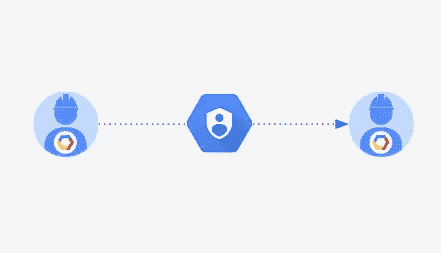
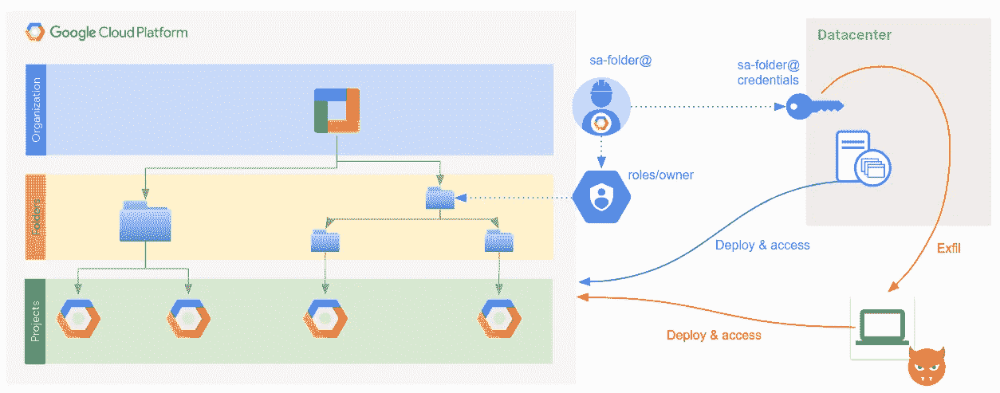
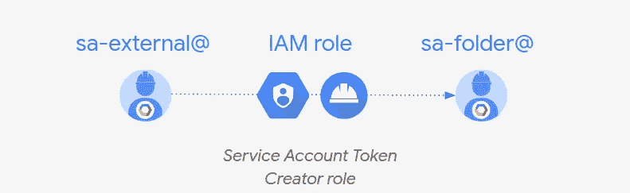
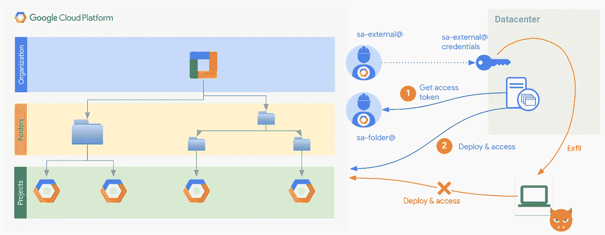
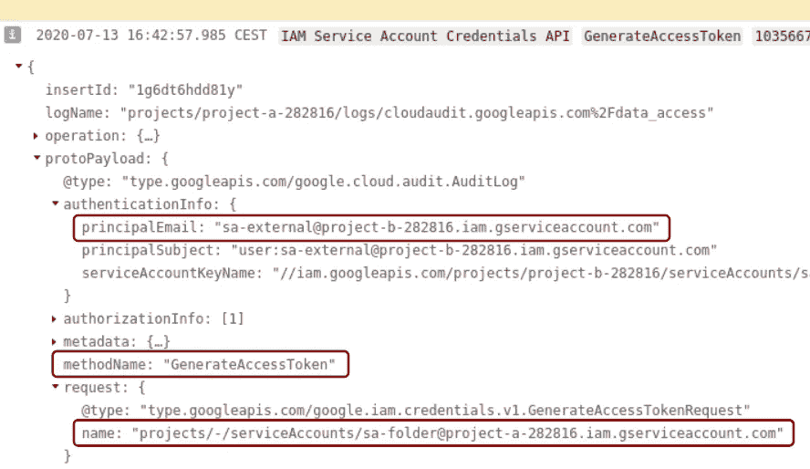
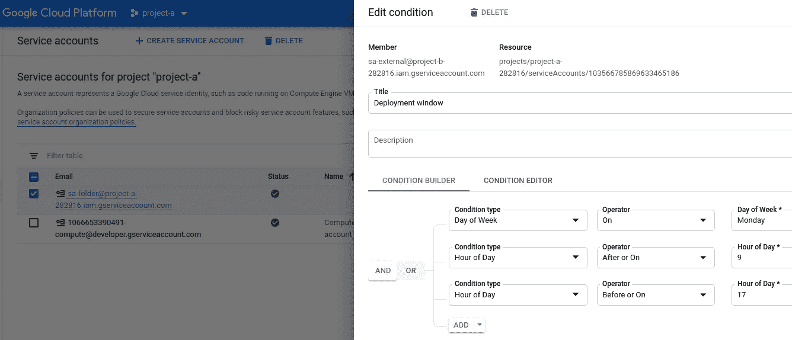

# 服务帐户凭证管理:如何改善您的安全状况

> 原文：<https://medium.com/google-cloud/service-account-credentials-management-how-to-improve-your-security-posture-663bca03a52?source=collection_archive---------0----------------------->



# 背景

当你想调用一个 API，比如创建一个 [GCS bucket](https://cloud.google.com/storage) ，你使用你的谷歌云平台(GCP)账户进行授权。那个账户就是你的身份，它有电子邮件地址的格式，就像 username@yourdomain.com。如果您有适当的角色/权限，您的通话将会成功。

服务帐户是应用程序使用的另一种帐户，而不是人类，用来进行授权的 API 调用。服务帐户也使用一个电子邮件地址来标识它们，格式如下:*sa-name*@*project-id*. iam . gserviceaccount . com

服务帐户与用户帐户在几个方面有所不同，特别是他们不使用密码来验证 Google。相反，他们使用公钥和私钥 RSA 密钥对。与管理密码相比，这似乎很麻烦，但确实是更适合应用程序身份验证的机制。谷歌云负责管理这些密钥的所有细节:生成、轮换、删除、托管。

但是，在某些情况下，您需要自己管理这些密钥。例如，如果调用 Google APIs 的应用程序不是在云中的虚拟机上运行，而是在数据中心或笔记本电脑中的机器上运行，那么您需要下载包含私有 RSA 密钥的相应服务帐户的凭证，以便能够向 Google 进行身份验证。然后，您负责管理这些凭证并保证它们的安全。这不是一个简单的任务，你应该考虑使用一个秘密管理解决方案，比如 [HashiCorp Vault](https://www.vaultproject.io/) 。

# 渗漏问题

然而，并不是每个公司都有能力使用秘密管理解决方案。即使你使用它，这些凭证仍然有可能被泄露到你公司之外。可能的情况是，这些凭证存储在许多开发人员可以访问的存储库中(希望不是公共的)。或者，您可能需要将这些凭据传递给合作伙伴，从而失去对它们的可见性和控制。

例如，一家公司的常见情况是在内部运行 CI/CD 管道来部署云基础架构。他们使用高特权服务帐户来创建项目、VPC、虚拟机、防火墙规则和所有类型的资源，通常使用像 [Terraform](https://www.terraform.io/) 这样的配置工具。供应工具需要服务帐户凭证来调用 API。如果凭据泄露，攻击者可以使用它们来访问您的资源和数据，从而使您的业务面临风险。



凭据泄漏

# 降低风险

如我所说，一旦你从 GCP 下载了凭证，你就有责任保证它们安全。尽管如此，如果泄漏风险很高，让您睡不好觉，或者如果您想有一个 B 计划以防万一，您可以利用 Cloud IAM 来降低风险并改善您的安全状况。

当然，服务帐户的特权越多，风险就越高。如果你能减少它的权限，你会处于一个更好的境地，因为现在有人访问你的系统并造成损害的风险会更低。但是您仍然需要完全访问权限，那么，如何同时实现这两个目标呢？

那是你可以通过*冒充*服务账号得到的东西。模拟的想法是使用一个身份 A 充当另一个身份 B，但不能访问 B 的凭据。这是通过授予身份 A 获取身份 b 的访问令牌的能力来实现的。这是我们将授予身份 A 的唯一权限，每当它想要访问任何资源时，它都必须提供访问令牌。在 Google Cloud 中，该权限是通过*服务帐户令牌创建者*角色授予的。它允许您为 Google 用来授权 API 调用的服务帐户创建 OAuth2 访问令牌(这个角色有更多的权限，我不会在本文中讨论)。

让我们以通过 Terraform 从内部部署云基础架构为例。 *sa-folder@* 是一个高特权服务帐户，您可以使用它来访问代表环境(如生产)的文件夹中的资源。其凭据不应离开 GCP，因此我们创建了另一个服务帐户 *sa-external@* 用于我们的 CI/CD。我们授予此服务帐户 sa-folder@上的令牌创建者角色:



通过服务帐户令牌创建者角色进行模拟

以下示例显示了如何通过*“g cloud”*命令实现这一点:

```
# Create the highly privileged service account
$ gcloud iam service-accounts create sa-folder --project ${PROJECT_A_ID}# Assign roles on production folder. Using just '*owner*' for simplicity
$ gcloud resource-manager folders add-iam-policy-binding ${PROD_FOLDER_ID} \
 --member=serviceAccount:sa-folder@${PROJECT_A_ID}.iam.gserviceaccount.com \
 --role=roles/owner# Create the external service account
$ gcloud iam service-accounts create sa-external --project ${PROJECT_B_ID}# Assign '*token creator'* role on sa-folder@
$ gcloud iam service-accounts add-iam-policy-binding [sa-folder@](mailto:sa-folder@project-a-282816.iam.gserviceaccount.com)${PROJECT_A_ID}[.iam.gserviceaccount.com](mailto:sa-folder@project-a-282816.iam.gserviceaccount.com) \
 --project ${PROJECT_A_ID} \
 --member=serviceAccount:[sa-external@](mailto:sa-external@project-b-282816.iam.gserviceaccount.com)${PROJECT_B_ID}[.iam.gserviceaccount.com](mailto:sa-external@project-b-282816.iam.gserviceaccount.com) \
 --role=roles/iam.serviceAccountTokenCreator
```

现在，您可以下载 sa-external@的凭据来访问 GCP，发出调用以获取 sa-folder@的访问令牌。

你可能会想，这怎么比原来的情况好？仍然可以使用 sa-external@来访问资源！当然是，否则我们无法满足自己的要求。然而，现在有了一个间接层，sa-external @不允许直接访问我们项目中的资源，因此任何 API 调用都将失败，除了为 sa-folder@创建令牌。这是除了凭据之外，攻击者需要的另一条信息，增加的间接性将允许我们进行更多的安全控制。



减轻凭证泄漏

的确，这个过程现在有点复杂了。它需要多一个服务帐户和两步授权。然而，增加安全性的好处超过了增加的复杂性。我将在接下来的章节中详细阐述这一点。

关于认证的额外步骤，它仅在开始时发生一次，并且软件流程没有实质性改变。例如，Google Terraform 提供者包含了这个[特性](https://www.terraform.io/docs/providers/google/d/datasource_google_service_account_access_token.html)，并使它非常容易使用。以下代码显示了所需的步骤:

*   首先，声明一个 Terraform *数据源*来获取高特权服务帐户 sa-folder@的 OAuth2 访问令牌。该脚本使用 sa-external@的凭据运行。

```
provider "google" {
  alias = "initial"
}data "google_service_account_access_token" "default" {
  provider               **=** google.initial
  target_service_account **=** "sa-folder@${PROJECT_A_ID}.iam.gserviceaccount.com"
  scopes                 **=** ["cloud-platform"]
  lifetime               **=** "3600s"
}
```

> 请注意，令牌是不可刷新的，最长生存期为 1 小时。

*   然后使用新的访问令牌定义一个提供者，并使用这个提供者生成任何资源。

```
provider "google" {
  access_token **=** data.google_service_account_access_token.default.access_token
}resource “google_compute_network” “vpc_network” {
  provider = google
  name  = “vpc-test”
}
```

# 审核访问

使用模拟时，审计也得到简化和增强。例如，审核 sa-folder@的访问权限意味着您必须审核服务帐户可以访问的每个可能的资源。假设这个服务帐户可以访问多个资源，那么它的日志将会非常多，并且分布在多个项目中。但是，获取服务帐户的访问令牌的 API 调用会生成审计日志。这样，您就可以很容易地发现何时使用了模拟来访问任何资源，而无需搜索所有项目。来自任何被访问资源的每个审计日志还将包括模拟服务帐户(如果使用了的话),作为身份验证信息的一部分。



模拟 API 调用的审核日志

在某些情况下，此功能可用于增强您的安全性。假设您有几个合作伙伴需要对您的系统进行相同的访问。您可以拥有一个特权服务帐户，并为每个合作伙伴创建模拟服务帐户和相应的凭据。这样，如果其中一个凭据被泄露，您可以准确地指出应该改进其安全控制的特定合作伙伴。此外，通过 IAM，您可以禁用该伙伴的模拟权限，而不会影响其他伙伴。获取访问令牌的审计日志包括其他信息，如*调用者 IP* 和*调用者用户代理*，因此您可以开发编程解决方案来进一步加强您的安全性。

如果你试图在不使用模仿的情况下获得类似的结果，你会发现这是多么痛苦。特别是，如果您想为同一个服务帐户创建几个凭据以分发给您的合作伙伴，这是没有用的。每个凭据都有一个密钥标识符，但该密钥 id 不会记录在审核日志中。

# 多一层

我们已经看到了模拟如何以多种方式帮助降低泄漏风险，同时还改进了凭据管理。我们可以更进一步，在某些情况下，增加另一层安全性。Cloud IAM 为您提供了另一种机制，您可以利用这种机制单独或结合模拟来提高您的安全状况: [Cloud IAM Conditions](https://cloud.google.com/iam/docs/conditions-overview) 。

使用 IAM 条件，您可以指定条件来对 IAM 授权实施基于属性的访问控制。这意味着授予资源上的身份的角色可以根据资源的某些属性(如类型)或请求的属性(如发出 API 调用的 IP)进行调整。您可以使用哪些属性取决于谷歌云服务，但支持它们的属性和服务的数量正在增长。

让我们以在内部运行 CI/CD 管道为例。您使用 sa-folder@上的令牌创建者角色创建了 sa-folder@和 sa-external@。假设您只在星期一部署到生产环境中，在审查提交的变更并让您的 SRE 团队为意外事件做好准备之后。在这种情况下，sa-folder@上的 sa-external@的永久授权实际上是不需要的，也是不必要的安全风险。但是反复授予和取消访问权限是不实际的。你可以开发一个程序化的解决方案，但是 IAM Conditions 提供了一个更好的方法。有了它，您可以定义自己的*部署窗口*，仅在周一工作时间授予模拟权限:



应用 IAM 条件创建部署窗口

通过创建此部署窗口，您可以减少攻击者访问您系统的机会。你的 SecOps 团队会很欣赏这一点，并在周末感到轻松一些。从该窗口进行的任何访问都会生成一个审计日志，您可以对其进行操作。

如果静态部署窗口不符合您的需求，而您需要按需访问，您可以创建一个基于[云功能](https://cloud.google.com/functions)的解决方案，只需按一下按钮，即可配置 IAM 条件，在特定时间段内授予临时访问权限。

# 结论

应该避免下载服务帐户的凭证，凭证的管理是一项很难正确完成的危险任务。但有时你别无选择。为了帮助减轻相关的风险，我解释了一些技术和机制，您可以很容易地应用它们来改善您的安全状况。管理秘密要尽职尽责，希望这篇文章对你有帮助！