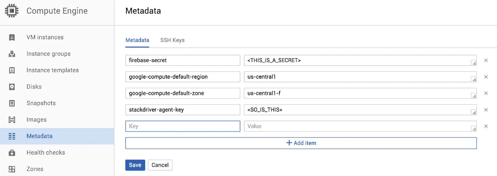

# Google 云平台上的服务发现和配置——剧透:它是内置的！

> 原文：<https://medium.com/google-cloud/service-discovery-and-configuration-on-google-cloud-platform-spoiler-it-s-built-in-c741eef6fec2?source=collection_archive---------0----------------------->

几乎所有分布式云架构都需要服务发现和配置。您不需要硬编码服务的 IP 地址，也不需要将您的客户端秘密压入 git(这都是可怕的事情)，而是依靠一个安全、一致和分散的系统来管理这些配置和环境变量。

许多不同的服务提供这种功能；想到的前三名是[动物园管理员](https://zookeeper.apache.org/)、 [etcd](https://github.com/coreos/etcd) 和[领事](https://www.consul.io/)。所有这些真的很棒，有些甚至提供额外的服务，如基于 DNS 的发现，但它们需要您在您的项目中维护和运行它们，更不用说它们以 CPU 时间和磁盘空间的形式花费金钱了！

让我让你大吃一惊。你知道谷歌云基本上免费给你这个服务吗？是的，你没听错，它就内置在你的谷歌云项目中！最棒的是，你可以在我们所有的计算平台上使用它:应用引擎、计算引擎和容器引擎。

叫[元数据服务器](https://cloud.google.com/compute/docs/metadata?hl=en)，挺[牛逼的](https://ahmetalpbalkan.com/blog/comparison-of-instance-metadata-services/)。

# 那么怎么用呢？

元数据有两种类型，**实例元数据**和**项目元数据**。

**实例元数据**主要用于计算引擎。它提供了关于实例的信息，如 IP 地址、区域、机器类型、网络等。您还可以在创建实例时设置一些自定义元数据。这些环境数据对你的应用非常有用。

**项目元数据**可以被任何 app 使用；甚至不需要运行在谷歌云平台上！它为您的应用程序(或多个应用程序)提供了一组共享的环境变量和配置，它们可以以安全的方式访问。它使用您已经在 App Engine、Compute Engine 和 Container Engine 上使用的内置 OAuth 和服务帐户，因此它超级容易使用！这是我将在这篇文章的剩余部分关注的。

# 设置项目元数据:

设置元数据最简单的方法是使用 gcloud 命令行工具或 web 上的[开发者控制台](https://console.cloud.google.com/compute/metadata)。如果你想自动化这些东西，你也可以使用[计算引擎 API](https://cloud.google.com/compute/docs/api/libraries?hl=en#google_api_client_libraries) 。

[开发者控制台](https://console.cloud.google.com/compute/metadata)不言自明:



下面是使用命令行的方法:

## 添加或更新:

```
$ gcloud compute project-info add-metadata --metadata <KEY>=<VALUE>
```

## 删除:

```
$ gcloud compute project-info remove-metadata --key <KEY>
```

# 获取项目元数据:

# 计算引擎、容器引擎和托管虚拟机

借助计算引擎、容器引擎和托管虚拟机，您可以通过一个神奇的 URL 来获取元数据。身份验证是透明的！你只需要记住设置“Metadata-Flavor”头。

```
$ curl “http://metadata/computeMetadata/v1/project/<KEY>/" \
     -H “Metadata-Flavor: Google”
```

这意味着您可以使用任何能够调用 REST API 的编程语言(即所有的调用)来查询元数据服务器！

# 应用引擎和其他一切

神奇的 URL 仅适用于计算引擎、容器引擎和托管虚拟机。如果在 App Engine 中运行或者进行本地开发，需要使用 OAuth 安全地连接到元数据服务器。

最简单的方法是使用一个[计算引擎 API](https://cloud.google.com/compute/docs/api/libraries?hl=en#google_api_client_libraries) 库。对于运行在 Google Cloud 上的所有东西，您应该能够使用应用程序默认凭证来连接到服务。否则，您可以下载一个 JSON 密钥文件(称为服务帐户)并使用它进行身份验证。

[这里有一个关于连接和验证 Google APIs 的很好的资源，你可以参考。](https://developers.google.com/identity/protocols/OAuth2)

[我还在 Go](https://github.com/thesandlord/samples/tree/master/app-engine-metadata) 中编写了一些示例代码，演示了 App Engine 应用程序如何访问元数据服务器。只需使用 *getMetadata* 函数获取所有元数据！

# 但是等等！还有呢！

在我结束之前，我想谈谈一个超级酷的特性:“等待改变”。这使您能够在元数据值改变时获得更新！点击查看详情[。由于应用引擎的性质，这可能不会在那里工作得很好，但它将在计算引擎、容器引擎和托管虚拟机上工作得很好。](https://cloud.google.com/compute/docs/metadata?hl=en#waitforchange)

我希望这条信息对你有用。这绝对是谷歌云平台的一颗隐藏的宝石，也是我们不太谈论的东西！