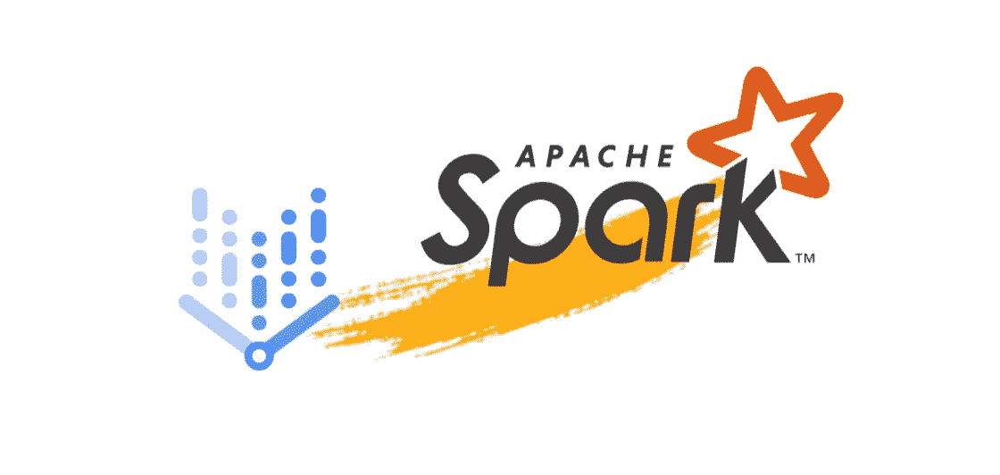
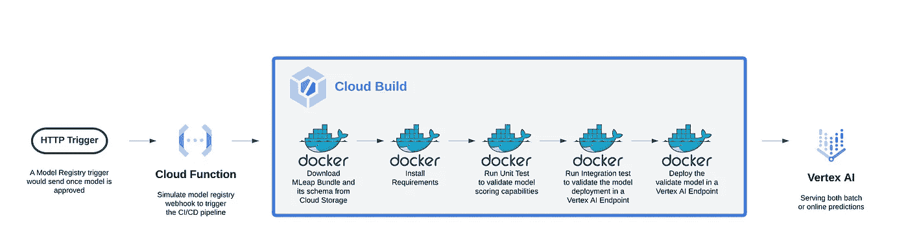

# 使用具有云构建和云功能的 CI/CD 管道在 Vertex AI 上提供 Spark ML 模型

> 原文：<https://medium.com/google-cloud/serving-a-spark-ml-model-on-vertex-ai-using-a-ci-cd-pipeline-with-cloud-build-and-cloud-function-e659e00dc7c4?source=collection_archive---------1----------------------->

## 银行应用程序



图一。闪耀顶点 AI

## 好吧，你说，我听！

你对 Google Cloud 上的[数据科学有什么想看的想法吗？请通过填写](https://cloud.google.com/data-science)[这张表格](https://forms.gle/H89eNLTVtCdpP1ro6)让我知道。这对我以后的博文会有帮助=)

## 放弃

本文有[关于](https://github.com/GoogleCloudPlatform/vertex-ai-samples/blob/main/notebooks/official/pipelines/google_cloud_pipelines_dataproc_tabular/google_cloud_pipeline_components_dataproc_tabular.ipynb)[顶点 AI 流水线](https://cloud.google.com/blog/topics/developers-practitioners/announcing-serverless-spark-components-vertex-ai-pipelines)无服务器 Spark 组件的公告后续内容。它代表了在[解决方案参考](https://cloud.google.com/architecture/spark-ml-model-with-vertexai#import-the-model-into-vertex-ai)中描述的关于使用顶点 AI 服务 Spark ML 模型的应用。

我们假设你熟悉 MLeap，顶点 AI 预测和 Docker。如果您不是，请查看以下资源。

*   [MLeap Spark 集成](https://combust.github.io/mleap-docs/spark/)将 Spark 模型序列化为 MLeap 包
*   顶点人工智能预测文档创建一个[定制容器，用于从导出的模型中提供预测](https://cloud.google.com/vertex-ai/docs/predictions/use-custom-container)。

## 你将学到什么

如果你对 Google Cloud 上的“如何用 Pyspark 模型实现部署管道”或“MLOps 对于 MLlib 模型是什么样子”有疑问，请继续阅读。

> 如何在 Vertex AI 上实现部署管道来服务 Spark MLlib 模型？

在本文中，我将带您浏览上一篇文章的 ML 场景，展示如何在 Vertex AI 上操作 Pyspark 模型。特别是，我将展示一个持续部署 Spark MLlib 模型的解决方案，以获得在线和批量预测。

你和我在一起吗？开始吧！

## 场景

为了设置场景，假设您是一家金融服务机构的数据科学团队的一员，负责支持银行业务。

您的公司希望使用 ML 自动确定客户贷款资格。

理想情况下，利益相关者希望有一个数据驱动的贷款资格引擎，对于每个贷款请求，该引擎根据客户的财务历史和贷款要求来确定客户是否有资格。

根据行业法规，决策必须是可解释的，并监控偏差。该解决方案必须是云本地的，因为该项目是该银行在谷歌云上更广泛的数字化转型之旅中的第一个 ML 解决方案。

为了使该项目取得成功，主要利益相关方希望通过降低与当前手动流程相关的财务风险，更快地做出贷款资格决策并改善结果。

为了满足这些要求，你和你的团队决定在 [Vertex AI](https://cloud.google.com/vertex-ai/docs/start/introduction-unified-platform) 上实施贷款资格解决方案——谷歌云的托管 ML 平台，旨在处理所有数据科学& MLOps 用例。该平台有几个构建模块，覆盖了整个 ML 生命周期(从数据接收到模型监控)，允许数据科学团队根据在 Google Cloud 上实施 ML 的[最佳实践构建数据产品。](https://cloud.google.com/architecture/ml-on-gcp-best-practices#machine-learning-workflow-orchestration)

## 贷款资格数据集

在这个场景中，数据集是[贷款资格数据集](https://datasetsearch.research.google.com/search?src=0&query=Loan%20Eligible%20Dataset&docid=L2cvMTFsajJrM3EzcA%3D%3D)的预处理版本。

原始数据集的信息模式的详细信息:

## 使用具有云构建的 CI/CD 部署管道在 Vertex AI 上提供 Spark 模型

假设您已经跟随[阅读了原始帖子](https://cloud.google.com/blog/topics/developers-practitioners/announcing-serverless-spark-components-vertex-ai-pipelines)，让我们假设您已经训练了一个 PySpark MLlib 随机森林模型，并且您使用顶点 AI 管道在顶点 AI 元数据中注册了它。下面是您将在 Vertex AI UI 中看到的管道定义的执行图示例。


图二。顶点 AI UI 中管道定义的执行图。

为了这篇博文的目的，我们假设团队和利益相关者对模型的结果感到满意，并且已经为生产它开了绿灯。

一旦获得批准，下一步就是将你的 Spark 模型部署到一个[顶点 AI 端点](https://cloud.google.com/vertex-ai/docs/predictions/getting-predictions)。并且，根据期望的自动化水平，您和您的团队可以决定实现一个事件驱动的 CI/CD 模型部署管道，如图 2 所示。



图 3。云构建 ML 部署管道(点击放大)。

正如博文的[MLOps 奖金部分](/google-cloud/boost-up-a-helpdesk-chatbot-with-dialogflow-cx-tfx-and-vertex-ai-4999c26eef13)所述，模型部署在上线前需要一系列测试和验证步骤。这些步骤将由使用 webhooks 的模型注册中心事件触发。

您可以使用一个[云函数](https://cloud.google.com/functions)来模拟 webhook，当一个 HTTP 请求被发送到这个函数的 URL 时，这个云函数就会被触发。

```
curl -X POST "https://{REGION}-{PROJECT_ID}.cloudfunctions.net/deploy" \
-H "Authorization: bearer $(gcloud auth print-identity-token) Content-Type:application/json" \
--data '{data_str}'
```

注意，HTTP POST 请求主体中的 *data_str* 包含了 CI/CD 管道所需的构建参数——比如模型的状态(staged、validated 等)。)或顶点 AI 端点的定义来部署模型。

一旦被触发，云功能提交云构建运行，以覆盖您使用 [google-cloud-build](https://pypi.org/project/google-cloud-build/) SDK 定义的 CI/CD 步骤。下面是一个构建函数的例子:

```
def get_build_job(bucket: str, source: str, artifact_uri: str,      project_id: str, mleap_runtime_image: str, image_tag: str, mleap_bundle_file_path: str, region: str, mleap_bundle_name: str,
serving_image_uri: str, predict_route: str, health_route: str, endpoint_name: str, timeout: int):"""
   An utility function to get a build object
   Args:
       project_id: The name of the project
       region: The name of the region
       bucket: The name of the bucket
       source: The GCS uri of the source code
       model_uri: The GCS uri of the model
       model_path: The path of the model
       serving_signature: The default signature to deploy the model
       model_name: The model name
       serving_image_uri: The serving image uri
       endpoint_name: The name of endpoint
       timeout: The timeout of cloud build

   Returns: The build resource for the Cloud Build job

   """
   build = cloudbuild_v1.Build()
   build.source = Source(storage_source=StorageSource(bucket=bucket,
                                                    object_=source))
   build.steps = [

       # Download target model
       {'name': 'gcr.io/google.com/cloudsdktool/cloud-sdk',
        'args': ['gsutil', '-m', 'cp', '-r', 
                 '${_ARTIFACT_URI}',  '.'],
        'dir_': 'serving_bundle',
        'id': 'Download model'},

       # Install dependencies
       {'name': 'gcr.io/${_PROJECT_ID}/${_MLEAP_RUNTIME_IMAGE}:${_IMAGE_TAG}',
        'entrypoint': 'pip',
        'args': ['install', '-r',
        './build_spark_serving_runtime/requirements.txt','--user'],
        'id': 'Install requirements',
        'wait_for': ['Download model']},

       # Run unit test
       {'name': 'gcr.io/${_PROJECT_ID}/${_MLEAP_RUNTIME_IMAGE}:${_IMAGE_TAG}',
        'entrypoint': 'python',
        'args': ['-m', 'pytest', '-s',
        './build_spark_serving_runtime/src/test_model.py'],
        'env':['MLEAP_BUNDLE_FILE_PATH=${_MLEAP_BUNDLE_FILE_PATH}'],
        'id': 'Run unit test',
        'wait_for': ['Install requirements']
        },

       # Integration test with the endpoint
       {'name': 'gcr.io/${_PROJECT_ID}/${_MLEAP_RUNTIME_IMAGE}:${_IMAGE_TAG}',
           'entrypoint': 'python',
           'args': ['-m', 'pytest', './build_spark_serving_runtime/src/test_endpoint.py'],
           'env': ['PROJECT_ID=${_PROJECT_ID}', 
                   'REGION=${_REGION}',
                   'MLEAP_BUNDLE_NAME=${_MLEAP_BUNDLE_NAME}',
                   'ARTIFACT_URI=${_ARTIFACT_URI}',         
                   'SERVING_IMAGE_URI=${_SERVING_IMAGE_URI}',
                  'SERVING_PREDICT_ROUTE=${_SERVING_PREDICT_ROUTE}',
                  'SERVING_HEALTH_ROUTE=${_SERVING_HEALTH_ROUTE}',
                  'ENDPOINT_NAME=${_ENDPOINT_NAME}'],
           'id': 'Run integration test',
           'wait_for': ['Run unit test']
       },

       # Deploy the model
       {
           'name': 'gcr.io/${_PROJECT_ID}/${_MLEAP_RUNTIME_IMAGE}:${_IMAGE_TAG}',
           'entrypoint': 'python',
           'args': ['./build_spark_serving_runtime/src/deploy.py'],
           'env': ['PROJECT_ID=${_PROJECT_ID}', 'REGION=${_REGION}',
                   'MLEAP_BUNDLE_NAME=${_MLEAP_BUNDLE_NAME}',
                   'ARTIFACT_URI=${_ARTIFACT_URI}',
                   'SERVING_IMAGE_URI=${_SERVING_IMAGE_URI}',
                  'SERVING_PREDICT_ROUTE=${_SERVING_PREDICT_ROUTE}',
                   'SERVING_HEALTH_ROUTE=${_SERVING_HEALTH_ROUTE}',             
                   'ENDPOINT_NAME=${_ENDPOINT_NAME}'],
           'id': 'Deploy the validated model',
           'wait_for': ['Run integration test']
       }

   ]

   build.substitutions = {'_ARTIFACT_URI' : artifact_uri,
                          '_PROJECT_ID': project_id,
                          '_MLEAP_RUNTIME_IMAGE':
                           mleap_runtime_image,
                          '_IMAGE_TAG' : image_tag,
                          '_MLEAP_BUNDLE_FILE_PATH':
                           mleap_bundle_file_path,
                          '_REGION': region,
                          '_MLEAP_BUNDLE_NAME' : mleap_bundle_name,
                          '_SERVING_IMAGE_URI': serving_image_uri,
                          '_SERVING_PREDICT_ROUTE': predict_route,
                          '_SERVING_HEALTH_ROUTE' : health_route,
                          '_ENDPOINT_NAME': endpoint_name} build.timeout = Duration(seconds=timeout)
   return build
```

基本上，在您下载了模型工件并安装了需求之后，您已经:

*   验证模型评分能力的单元测试
*   集成测试，以验证模型部署在顶点人工智能端点

它将在部署模型之前运行。对于这两个测试场景，您可以使用定制的容器映像[作为构建器来重现数据科学团队用于模型实验和形式化的相同 Spark 运行时环境。在下面的代码块中，有一个 docker 文件的示例:](https://cloud.google.com/build/docs/configuring-builds/use-community-and-custom-builders#creating_a_custom_builder)

```
FROM python:3.7-stretch# Set Environment variables
ENV SPARK_VERSION=3.1.2 \
   HADOOP_VERSION=3.2 \
   OPENJDK_VERSION=8# Basic Java Installation
RUN apt-get update --yes && \
   apt-get install --yes --no-install-recommends \
   'openjdk-$OPENJDK_VERSION-jdk-headless' && \
   apt-get clean && rm -rf /var/lib/apt/lists/*
ENV JAVA_HOME='/usr/lib/jvm/java-$OPENJDK_VERSION-openjdk-amd64'# Basic Spark Installation
WORKDIR /tmp
RUN wget -q '[https://archive.apache.org/dist/spark/spark-$SPARK_VERSION/spark-$SPARK_VERSION-bin-hadoop$HADOOP_VERSION.tgz'](https://archive.apache.org/dist/spark/spark-$SPARK_VERSION/spark-$SPARK_VERSION-bin-hadoop$HADOOP_VERSION.tgz') && \
   tar xzf 'spark-$SPARK_VERSION-bin-hadoop$HADOOP_VERSION.tgz' -C /opt && \
   mv '/opt/spark-$SPARK_VERSION-bin-hadoop$HADOOP_VERSION' /opt/spark && \
   rm 'spark-$SPARK_VERSION-bin-hadoop$HADOOP_VERSION.tgz'
ENV SPARK_HOME=/opt/spark
ENV PYSPARK_PYTHON=python
ENV PYTHONPATH=$PYTHONPATH:$SPARK_HOME/python# Build
WORKDIR build
COPY src src
COPY model model# Define default command for building the MLeap bundle
CMD ['python', './src/build_mleap_bundle.py']
```

对于单元测试，您可以使用如下测试函数:

```
def test_model():# Set logger
 logger = set_logger()# Initiate spark session
 logger.info('Initiate Spark session')
 spark = (SparkSession.builder\
       .master('local[*]')\
       .appName('spark go live')\
       .config('spark.jars.packages', 
               'ml.combust.mleap:mleap-runtime_2.12:0.19.0') \
       .config('spark.jars.packages',
               'ml.combust.mleap:mleap-base_2.12:0.19.0') \
       .config('spark.jars.packages', 
               'ml.combust.mleap:mleap-spark_2.12:0.19.0')\
       .config('spark.jars.packages', 
              'ml.combust.mleap:mleap-spark-extension_2.12:0.19.0')\
       .getOrCreate()) # Create a testing sample
 test = spark.createDataFrame(TEST_SAMPLE, DATA_SCHEMA)
 test.show(truncate=False)
  # Is the model a pyspark.ml.tuning.CrossValidatorModel instance
 logger.info('Test Model instance')
 deserializedModel = PipelineModel.deserializeFromBundle(f'jar:file:{MLEAP_BUNDLE_FILE_PATH}')
 assert isinstance(deserializedModel, PipelineModel)# Are predictions a dataframe
 logger.info('Test predictions type')
 model_predictions = deserializedModel.transform(test)
 assert isinstance(model_predictions, DataFrame)# Does the model generates predictions
 logger.info('Verify predictions')
 is_empty = model_predictions.rdd.isEmpty()
 assert not is_empty
 model_predictions.show(truncate=False)
```

在上面的示例中，您使用一个测试样本来验证 spark 模型在被正确反序列化后是否会生成预测。

对于集成测试，测试功能可以使用 Vertex AI SDK 来:

*   上传顶点人工智能模型
*   创建顶点 AI 端点
*   将模型部署到端点
*   通过传递实例样本来验证模型是否成功地为预测服务
*   摧毁端点
*   删除模型

在下面的代码示例中，我们将这些任务定义为集成测试的一部分:

```
def test_endpoint():
   """
   An utility function to run the integration test
   Returns: None"""# Set logger
   logger = set_logger()# Initiate Vertex AI SDK client
   logger.info('Initiate Vertex AI SDK client.')
   vertex_ai.init(project=PROJECT_ID, location=REGION)# Upload the model on Vertex AI
   logger.info('Upload the model on Vertex AI.')
   model = deploy.upload_model(model_name=MLEAP_BUNDLE_NAME, artifact_uri=ARTIFACT_URI, serving_image_uri=SERVING_IMAGE_URI)# Create the Vertex AI Endpoint
   logger.info('Create the Vertex AI Endpoint.')
   endpoint = deploy.get_endpoint(endpoint_name=ENDPOINT_NAME, project_id=PROJECT_ID, region=REGION)# Deploy the model
   logger.info('Deploy the model.')
   deployed_model = deploy.deploy_model(model=model, endpoint=endpoint, deployed_model_name=MLEAP_BUNDLE_NAME)# Submit a prediction request.
   logger.info('Submit a prediction request.')
   predictions = deploy.get_prediction(endpoint=endpoint, instances=INSTANCES)
   assert predictions
   print(predictions)# Delete the Vertex AI endpoint
   logger.info('Delete the Vertex AI endpoint.')
   deploy.delete_endpoint(endpoint=endpoint)# Delete the Vertex AI model
   logger.info('Delete the Vertex AI model.')
   deploy.delete_model(model=model)
```

一旦您触发了部署过程，您就可以使用 Cloud Build 中的日志来跟踪执行情况(图 3)。


图 4。UI 中云构建执行的日志(单击可缩放)。

现在，我们经过验证和测试的模型已经部署到端点，并准备好提供在线预测。在下面的代码示例中，我们可以看到使用 Vertex AI SDK 的在线预测请求的结果。

```
endpoint = vertex_ai.Endpoint.list(filter=f'display_name="{ENDPOINT_NAME}"')[0]
endpoint.predict(instances=[[124.0, 'nan', 'Rural', 0.0, 2.41903, 2.09919, 0.0, 0.0, 0.0, 2.83818, 0.0, 0.0, 0.0]])Prediction(predictions=[[[0.9655723725071873, 0.03442762749281267]]], deployed_model_id='856167714316615680', explanations=None)
```

值得注意的是，虽然我们在这篇文章中关注的是在线预测用例，但我们也可以提供批量预测。在这两种场景中，您都可以通过使用解决方案文章中提供的服务容器映像和 Vertex AI 端点来利用托管的可伸缩无火花服务环境。在下面的截图中，Vertex AI 批量预测的 UI 显示了关于批量评分作业的一些细节作为示例(图 4)。


图 5。用 Spark 模型对顶点 AI 预测进行在线和批量预测(点击可缩放)。

最后，这里有一个样本(。jsonl)的批预测:

```
{"instance": [216.0, "360", "Urban", 0.0, 2.41903, 0.0, 0.0, 0.0, 2.09241, 2.83818, 0.0, 0.0, 2.69523], "prediction": [[0.8898546777486088, 0.11014532225139123]]}
```

至此，我们的旅程结束了。让我们总结一些考虑事项和一些潜在的后续步骤。

## 下一步是什么

在本文中，我们使用一个银行贷款资格场景来演示如何在 Vertex AI 上连续部署 Spark MLlib 模型进行在线和批量预测。

在撰写本文的过程中，我遇到了一些挑战，需要一些解决方法。一些关键的知识是围绕 Spark 依赖性和 MLeap 需求的——例如，当我开始研究这个用例时，MLeap 不支持 Spark 3 . 1 . 2(【https://github.com/combust/mleap/issues/805】)并且只支持一些允许的转换([【https://github.com/combust/mleap/issues/784】](https://github.com/combust/mleap/issues/784))。这也很棘手，因为当我最初开始研究这个用例时，Vertex AI 没有可用的 Spark 服务图像。

我与几位同事合作，我们努力为使用 Spark MLlib 在 Vertex AI 上服务其模型的开发人员和从业人员提供这些功能。

可以想象，**这还不是结束。**以下是一些开放点:

*   有没有可能使用[顶点可解释 AI](https://cloud.google.com/vertex-ai/docs/explainable-ai/overview) 用 Spark 模型生成解释？
*   用[顶点 AI 模型监控](https://cloud.google.com/vertex-ai/docs/model-monitoring)监控一个 Spark 模型怎么样？

总的来说，

> 如果能有一个端到端的例子来展示整个 Spark ML 工作流在 Vertex AI 平台上的样子，岂不是很棒？

如果你对以上问题的答案感兴趣，请在 [LinkedIn](https://www.linkedin.com/in/ivan-nardini/) 、 [Twitter](https://twitter.com/IlNardo92) 上或者在下面留言告诉我。

我希望你喜欢这篇文章，直到下一个帖子…

*感谢*[*Win Woo*](https://medium.com/u/2e87ffc46e00?source=post_page-----e659e00dc7c4--------------------------------)*迄今为止我们的合作令人敬畏。以及* [*李*](https://medium.com/u/6cfe83f12e3?source=post_page-----e659e00dc7c4--------------------------------) *对她的宝贵反馈和点评。*

## 参考

1.  [MLlib:主指南— Spark 3.2.1 文档](https://spark.apache.org/docs/latest/ml-guide.html)
2.  [MLeap 文档手册](https://combust.github.io/mleap-docs/)
3.  [Docker 文档](https://docs.docker.com/)
4.  [云函数文档](https://cloud.google.com/functions/docs)
5.  [云构建文档](https://cloud.google.com/build/docs)
6.  [顶点 AI 文档|谷歌云](https://cloud.google.com/vertex-ai/docs)

在我写这篇文章的时候，Spark 模型在 Vertex AI 模型注册表中还不被支持。