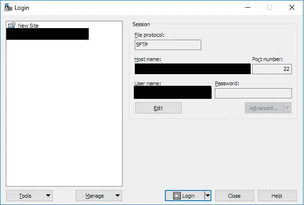

# 如何在 Google Cloud VM 下设置 Anaconda 并在 Windows 上传输文件

> 原文：<https://medium.com/google-cloud/set-up-anaconda-under-google-cloud-vm-on-windows-f71fc1064bd7?source=collection_archive---------0----------------------->


本文将介绍设置 Google Cloud Linux VM 实例的整个过程，以便在 Windows 平台上安装用于 Python 开发和传输文件的 Anaconda。

# 先决条件:

*   谷歌账户(当然你需要这个开始)
*   谷歌云平台项目([查看快速入门教程](https://cloud.google.com/resource-manager/docs/creating-managing-projects))
*   Google Cloud Linux VM ( [查看快速入门教程](https://cloud.google.com/compute/docs/quickstart-linux))
*   [PuttyGen](https://www.chiark.greenend.org.uk/~sgtatham/putty/latest.html) (为虚拟机实例生成 SSH 密钥的工具)
*   [WinSCP](https://winscp.net/eng/download.php) (从/向 VM 实例传输文件的简单 GUI)

> ***注:*** *我假设你已经创建了一个 google cloud 项目，并创建了一个 VM 实例。*

# 安装 Anaconda

首先，我们通过 SSH 启动并连接到 VM 实例


从 Google 云平台通过 SSH 连接到虚拟机

我们应该会看到下面的屏幕。


来自 SSH 终端的系统消息

我们运行以下命令来更新 Anaconda 的系统包和核心依赖项。

*   bzip2，安装迷你/蟒蛇
*   libxml2-dev，安装更多的 Python 库

```
$ sudo apt-get update
$ sudo apt-get install bzip2 libxml2-dev
```

**安装更轻的 Miniconda 分配**

```
$ wget [https://repo.anaconda.com/miniconda/Miniconda3-latest-Linux-x86_64.sh](https://repo.anaconda.com/miniconda/Miniconda3-latest-Linux-x86_64.sh)
$ bash Miniconda3-latest-Linux-x86_64.sh
$ rm Miniconda3-latest-Linux-x86_64.sh
$ source .bashrc
$ conda install scikit-learn pandas jupyter ipython
```

**安装一个完整的 Anaconda 发行版**

我们首先下载 Anaconda 的最新版本。

> 下面的链接是写这篇文章时 Anaconda 的最新版本，请查看最新版本:[https://www.anaconda.com/distribution/#linux](https://www.anaconda.com/distribution/#linux)

```
$ wget [https://repo.anaconda.com/archive/Anaconda3-2018.12-Linux-x86_64.sh](https://repo.anaconda.com/archive/Anaconda3-2018.12-Linux-x86_64.sh)
```

然后运行 shell 脚本。

```
$ bash Anaconda3–2018.12-Linux-x86_64.sh
```

安装完成后，我们可以删除 shell 脚本以节省磁盘空间。

```
$ rm Anaconda3–2018.12-Linux-x86_64.sh
```

现在我们重新初始化 shell 以识别 conda 命令。

> 这将在同一个 shell 上下文中加载和执行它的内容。结果和把`.bashrc`的内容放到`.bash_profile`里是一样的。

```
$ source .bahsrc
```

或者更简短的版本

```
$ . ~/.bashrc
```

验证所有东西都安装正确。

```
$ python --version
$ which python
$ which conda
$ conda list conda$
```


Miniconda 是作为一个例子安装的

我们现在有了一个安装了 Anaconda 的工作 Python 环境:)

# 在 Windows 上传输文件

## 生成 SSH 密钥

启动 PuttyGen，点击**生成。**我们需要在@之前将关键评论改为我们的谷歌用户名(例如**用户名** @gmail.com，那么关键评论就是**用户名**)


生成一个密钥，并将私钥和公钥保存到所需的目录。

进入**谷歌云平台** > **元数据** > **SSH 密钥**

> 您可能会看到一些 SSH 密钥已经存在，这些是默认的 SSH 密钥，允许您从 Google 云平台(浏览器)访问虚拟机实例。


SSH 密钥表

然后我们从 PuttyGen 复制公钥并粘贴到 *<中，输入完整的密钥数据>* ，然后保存。


## 支持虚拟机和 Windows 之间的文件传输

现在我们启动 WinSCP，在登录窗口的用户名字段中输入我们的**虚拟机的外部 IP** **地址**为主机名，输入我们的**用户名**(在@ gmail.com 之前)。点击**高级…**>**SSH**>**认证**上传我们之前保存的私钥文件。



WinSCP 登录窗口

现在我们有了一个 FTP GUI，允许在两个系统之间传输文件。


WinSCP FTP GUI

# 参考

1.  [https://UNIX . stack exchange . com/questions/182219/what-does-bashrc-command-do](https://unix.stackexchange.com/questions/182219/what-does-bashrc-command-do)