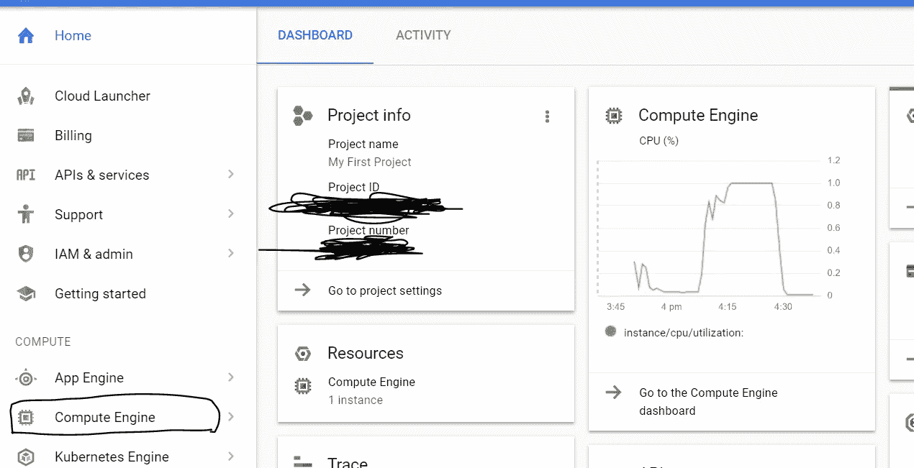
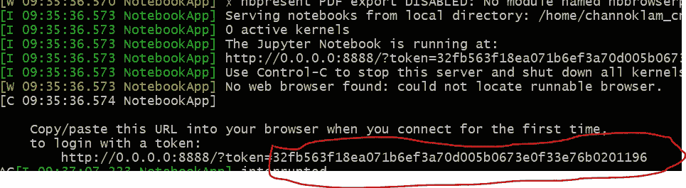

# 为 v1 和 v2 的 fast.ai 设置 Google Cloud GPU

> 原文：<https://medium.com/google-cloud/set-up-google-cloud-gpu-for-fast-ai-45a77fa0cb48?source=collection_archive---------0----------------------->


GCP

这篇博文是为了给这个伟大的课程 [fast.ai](http://www.fast.ai/) 设置 Google Cloud GPU 实例，但是一些实践仍然适用于一般目的。我纠结了几天才让它起作用，所以想写个帖子总结一下这几个步骤。

这个帖子和 [Amulya Aankul](https://medium.com/u/27098dfa58c0?source=post_page-----45a77fa0cb48--------------------------------) 的博客文章[在谷歌云平台上用 15 分钟](https://towardsdatascience.com/running-jupyter-notebook-in-google-cloud-platform-in-15-min-61e16da34d52)运行 Jupyter 笔记本，给了 [Sabastian](http://forums.fast.ai/t/how-to-set-up-env-using-google-cloud/2585/29?u=nok) 很多荣誉。我只是把他们两个结合起来，建立了这个伟大的课程。

完成所有设置不超过 30 分钟，您就可以享受课程了。:)

注意:这篇文章最初是针对 v1 的，但是针对 v2 的设置要简单得多，只需在连接实例之后运行 bash 脚本即可。

# **创建谷歌云 GPU 实例**

1.  **增加额度**

为了有 GPU 可用，需要申请增加 GPU 配额，默认为 0。我花了 5 分钟完成这个过程并获得批准，比 AWS 快多了。

转到配额→您需要升级您的帐户以便拥有可用的 GPU 增加您想要的区域的配额，请在此处[选择您想要使用的区域](https://cloud.google.com/compute/docs/gpus/)。

(尽量不要过于咄咄逼人地要求大量的 GPU 配额，因为从其他经验来看，他们可能会要求你提前支付。我觉得从 1 K80 开始就足够好了)


**2。创建一个谷歌云平台(GCP)实例**

在 GCP 控制台的[主页中，有一些您想要复制到文本文件中的信息。复制您的项目 ID，因为您稍后在 SSH 到您的实例时会用到它。(对我来说，项目 ID 是无尽-火-xxxxxxx)](https://console.cloud.google.com/)



GCP 主页

我们现在可以开始创建实例。单击出现在左侧的“计算引擎”。

1.  单击创建实例


1.  命名您的实例，选择您想要的区域(确保它有可用的 GPU)
2.  选择特斯拉 K80 作为 GPU

找到 GPU 在哪里并不容易，但它们实际上是隐藏的，点击“定制”，你就可以将 GPU 添加到你的实例中。


3.把启动盘换成 Ubuntu 16.04

确保你有正确的图像 Ubuntu 16.04，并使其成为一个固态硬盘，默认是硬盘。价格其实变化不大，选个 SSD 就好！(建议获取至少 25GB，注意后期只能增加 SSD 不能减少 SSD)


选 Ubuntu 16.04，想做 SSD 就做吧(推荐)

4.差不多完成了

您只需要勾选 HTTP 流量，因为稍后我们将在浏览器中使用 Jupyter Notebook 访问该实例。您可能还想取消勾选“删除实例时删除引导磁盘”来保持您的存储活着，即使你杀了你的实例。现在你完成了，点击创建一个实例！


设置 GCP 就是这么简单，如果你想要一个静态 IP，请到[伟大的博客文章](https://towardsdatascience.com/running-jupyter-notebook-in-google-cloud-platform-in-15-min-61e16da34d52)看看你还能做什么。

# 与您的实例连接

现在我们需要在本地机器上连接我们的远程实例。因为我是一个 Window 用户，并且我一直在遵循 Jeremy 的教程，所以我使用 Cygwin 来运行我的 bash 脚本。如果你还没有这样做，请查看[教程](http://course.fast.ai/lessons/aws.html)或者直接安装 [Cygwin](https://www.cygwin.com/) (确保你已经安装了 64 位版本和“wget”！).

**第一步** [**安装 Google Cloud SDK**](https://cloud.google.com/sdk/)

它类似于“aws”包，它是一个与谷歌云交互的命令行界面，我们将需要它来 SSH 我们的实例。

我不会花时间来解释如何安装它。请遵循此处的说明[，文档非常简单。](https://cloud.google.com/sdk/downloads)

**第二步**
SSH 进入实例。打开 Cygwin 或者你可能只是打开谷歌云 SDK 外壳。INSTANCE_NAME 是我之前让你复制下来的，它在你的主页上。

```
gcloud compute ssh INSTANCE_NAME (In my case, it is instance-1)
```


**步骤 2.5**

如果你做的是 v2。请完成这一步并转到第 6 步，您可以忽略其余部分。

最初，您只需运行此脚本，即可完成 Paperspace，但如果您使用的是 GCP 虚拟机，则需要对脚本稍作修改，我已经在 Github 中修改了脚本，因此您可以模仿相同的步骤:

```
**git clone** [**https://github.com/noklam/learning_fastai.git**](https://github.com/noklam/learning_fastai.git) **bash learning_fastai/paperspace**
```

**第三步**

这些步骤是复制自[论坛的帖子](http://forums.fast.ai/t/how-to-set-up-env-using-google-cloud/2585/29?u=nok)，再次感谢 Sabastian。
下载安装 CUDA、Anaconda 等的脚本:
`wget [https://raw.githubusercontent.com/fastai/courses/master/setup/install-gpu.sh](https://raw.githubusercontent.com/fastai/courses/master/setup/install-gpu.sh)`

**第四步**
运行脚本:
`sudo sh install-gpu.sh`
**最后你需要为 jupyter 笔记本选择一个密码**。该脚本还克隆了`[https://github.com/fastai/courses/](https://github.com/fastai/courses/.)` [中的课程材料。](https://github.com/fastai/courses/.)

**步骤 5**
使用重启命令或控制台上的重置选项重启:
`sudo reboot`

**步骤 6**
使用控制台或命令行创建一个防火墙规则，用于从您的本地机器访问端口 8888(您将使用端口 8888 来访问您的笔记本电脑):

PROJECT 是显示在您的控制台主页上的项目 ID，我之前要求您复制下来。

你的 _IP 是你本地机器的 IP，你可以做 cmd.exe→ipconfig 来检查你的本地 IP 是什么，如果你不知道的话。

(似乎他们删除了 beta 命令，我还没有测试它。万一失败了，去控制台，VPC 网络→防火墙规则，添加一个允许 tcp:8888 的规则，在上面添加自己的 ip)

```
export PROJECT="project_name"
export YOUR_IP="enter_the_ip_of_your_local_machine"
gcloud compute --project "${PROJECT}" firewall-rules create "jupyter" --allow tcp:8888 --direction "INGRESS" --priority "1000" --network "default" --source-ranges "${YOUR_IP}" --target-tags "jupyter"(Thanks for Rahul for adding this commands)[gcloud compute instances add-tags <instance_name> — tags jupyter](/@rahulpopuri/hi-nok-ac2615dbdc55?source=post_info_responses---------12----------------)
```

**第 7 步**
检查 CUDA 安装是否正确:

```
sudo modprobe nvidia
nvidia-smi
```


英伟达-smi

**第八步**
运行 jupyter 笔记本:
`jupyter notebook --ip=0.0.0.0 --port=8888`
注意终端中显示的令牌。使用实例的外部 IP 转到笔记本。您可以在控制台中找到实例的外部 IP。

xxx.xxx.xxx.xxx:8888 是你笔记本的链接。


您需要一个令牌来登录您的笔记本。

你的令牌在这里:



代币

我们都完成了设置，您可以使用 GPU 驱动的机器访问笔记本电脑。GCP 最大的好处是你有 300 美元的免费积分，这足够你浏览笔记本了(如果没有，只需再申请一个 gmail，就能多获得 300 美元！)

如果你有任何问题，请告诉我！