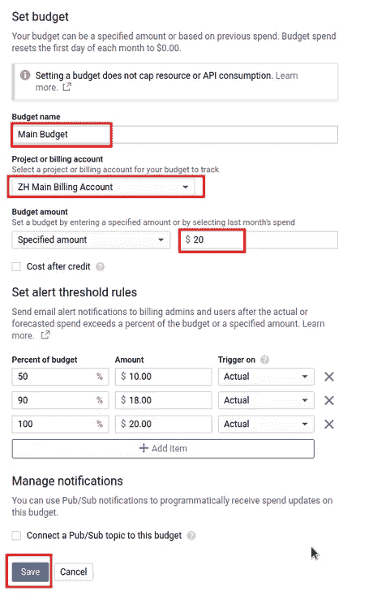

# 为您的谷歌云项目设置预算和提醒

> 原文：<https://medium.com/google-cloud/setting-budget-and-alerts-for-your-gcp-billing-account-4cffa22e3348?source=collection_archive---------0----------------------->

# 也就是注册谷歌云后你应该做的第一件事

对大多数人来说，谷歌云之旅始于注册、设置信用卡信息，然后进入云控制台使用令人敬畏的产品和服务。谷歌很慷慨，它给 start 300 美元的信用，所以你可以自由探索，不用担心从第一分钟起你就要自掏腰包了。

然而，在进入云控制台后，你应该做的第一件事是设置预算和警报规则，通过这篇文章，我想解释更多为什么和如何做到这一点。

> 有设置预算提醒的谷歌云用户，也有还没有设置的用户

计费是一个独立的话题，在这里我想到的是中小型公司，他们开始使用谷歌云，没有复杂的计费结构。

## 为什么要设置预算和预警？

首先，有必要解释一下谷歌云环境下的预算是多少——它是你当前每月账单的金额，基于这个金额可以触发警报通知。使用谷歌云的最高收费是**而不是**。如果你超出预算，你在谷歌云上运行的东西不会停止，它会继续工作，你会继续被收费:)

预算应被视为计费的软限制，当达到预算金额的特定百分比时，它们可以通知警报。实际的警报通知是基于预算金额的百分比触发的，并通过电子邮件发送，或者他们也可以将消息发布到发布/订阅主题。

设置预算和警报是有意义的，因为:

1.  新用户开始使用 Google Cloud spinning 实例，集群认为最初的 300 美元信用足够了，但他们可能忘记删除所有内容，下个月他们会因为意想不到的高账单金额而感到意外。
2.  如果有一些意想不到的开销，你会得到通知，这可能发生在你部署新版本的代码时，由于一些错误，它可能会消耗比预期更多的资源。同样，你不必等到发票才知道。
3.  你不经常去云控制台(因此你可以检查当前成本)，因为你不是开发人员，而是经理，你有其他事情要做，但在某种程度上你要对云账单负责。

换句话说，必须为你的账单账户设定预算。

接下来，我们将完成设置预算和警报的过程，看看有哪些选项。

## 设置预算和警报。

为了使用谷歌云的付费功能，您必须将项目链接到计费帐户(如果您没有任何帐户，请创建它)。账单账户包含支付设置、报告、发票等信息。

要创建预算和警报，请转到帐单帐户详细信息。您可以转到 URL[https://console.cloud.google.com/billing](https://console.cloud.google.com/billing)或从计费菜单上的云控制台菜单链接:

然后转到预算和警报子菜单进行设置。

然后点击按钮创建预算

接下来，我们有一个表单来创建预算和警报。

创建预算和预警

我们将经历所有领域:

**预算名称**

**计费账户**(预算所链接的账户)

**预算金额**:有两个选项设置金额。一种是简单地为你的预算指定固定的金额。另一种选择是根据“上个月的花费”来设置预算金额，这将每月动态变化。当然，这取决于你在谷歌云上的成本性质。如果你在几个月中有相对稳定的成本，基于“上个月的花费”来设置是有意义的，因为如果你在月中得到 50%达到预算的警报，那应该意味着一切正常。如果你正在创建/删除大量的资源，尝试新事物，那么设置一些固定的数量更有意义。

**贷方后成本:**勾选表示预警时不考虑贷方金额。例如，假设你开始使用谷歌云，你有 300 美元的信用，并设置第一个提醒为 10 美元。如果检查信用后的成本，您将在花费 300 美元的信用和 10 美元的信用后收到通知。如果信用后的成本没有检查，你应该在你花第一个 10 美元时得到提醒(无论从什么来源)。我承认我不能 100%确定这是如何工作的，但根据描述，应该是这样的。

**设置预警阈值规则:**当需要发送通知时，您可以根据预算百分比指定多个阈值规则。默认值为 50%、90%和 100%。对于预警，您可以设置预算百分比或金额。无论你输入哪个字段，都会计算另一个。有一个选择触发器的选项，可以基于实际支出金额，也可以基于预测。基于预测的触发是一项新功能，当预测到预算期末支出超过预算金额的百分比时，它会发送警报。

**将发布/订阅主题连接到此预算**。选中此选项后，您可以选择要发布警报的项目和发布/订阅主题。之后，你可以连接云功能，这将由发布/订阅触发，并在那里做一些程序性的事情，例如停止一些资源等。

预算期总是从月初到月末。

警报通知电子邮件看起来是这样的:

警报通知电子邮件

## 我超出预算了，现在怎么办？

这不是世界末日。希望在收到警报和阅读警报之间没有太多的时间间隔，这样您就可以在必要时做出反应。诊断意外成本的最快方法是前往云控制台中的**计费- >报告**。这里有一个漂亮的图表，列出了消耗最多的资源，以及当前每月的成本和预测，这应该会让你知道潜在的问题在哪里。

俗话说:“有设置预算提醒的谷歌云用户，也有还没有设置的用户”