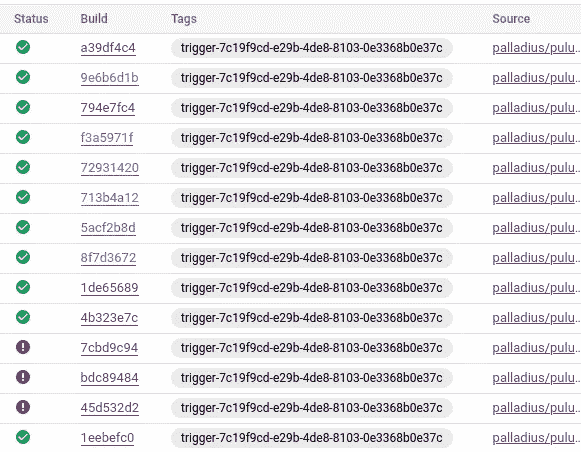
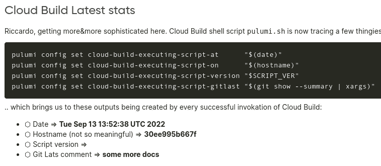
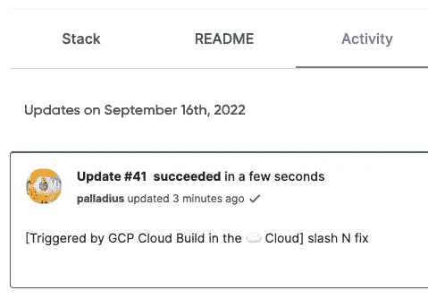

# 在🧹Pulumi 的情况下设置⬣云构建触发器🐍计算机编程语言

> 原文：<https://medium.com/google-cloud/setting-cloudbuild-with-pulumi-in-python-330e8b54b2cf?source=collection_archive---------1----------------------->

几周前，我爱上了**:它拥有我想要的 Terraform 的一切:易于设置，易于配置管理，免费的用户界面，最重要的是…语言支持！普鲁米是继布法罗比萨饼之后最好的发明，它只有一个问题..[没有 Ruby 支持](https://github.com/pulumi/pulumi/issues/132) :/**

****

**这是 MidJourney 如何想象谷歌云上的紫色扫帚**

**无论如何，我非常喜欢⬣ [**GCP**](https://cloud.google.com/) (我不得不承认，它恰好支付我的薪水)[云构建](https://cloud.google.com/build)，[云部署](https://cloud.google.com/deploy)，以及 Google Cloud 上的一般 CI/CD 管道，所以我想尝试一下。Google "*Cloud Build Pulumi*"我得到了这篇 [**的好文章**的 JavaScript](https://www.pulumi.com/docs/guides/continuous-delivery/google-cloud-build/) ，它不在我的和弦中。**

# **代码**

**M y 代码在这里:[https://github . com/palladius/pulumi/tree/main/examples/python-GCP-cloud build-auto-trigger](https://github.com/palladius/pulumi/tree/main/examples/python-gcp-cloudbuild-auto-trigger)**

> **注意:👍代码终于正确构建了。耶！**

****

**代码今天早上开始工作，今晚我可以睡觉了💤紧的😴**

# **代码有什么特别之处？**

**代码允许你在 **GCP** 上拥有任何 **Pulumi** 项目(用 Python🐍)来设置自我更新的触发器。对 git repo 的推送将触发一个构建作业，如果成功的话，这个作业将作为您自己登录到 Pulumi 并发布一个带有新代码的更新。**

**因此，例如，如果您提交一个将 GCS bucket 添加到代码中的更改，几分钟后就会创建 GCS bucket，并且 README.md 将使用构建器参数进行更新:**

****

**以粗体显示，您可以看到由云构建本身更新的 3 个参数！**

**我的代码支持 **Github** (原样)和 **Bitbucket** (代码 99%在那里，因为它首先工作！)暂时。**

**我还根据 [Laura 文章](https://www.pulumi.com/blog/six-things-about-pulumi-service/)定制了消息，在 git 消息前面加上了一个“*【使用云构建构建】】*”(*斜杠 N fix* )，在本例中:**

****

**这是我的云构建脚本调用*“pulumi up”*时的提交消息**

# **普鲁米是什么意思？**

**我一直在尝试谷歌翻译，它看起来可能意味着夏威夷或缅甸(🇲🇲，现在的缅甸)的扫帚柄(🧹)。在那之前，我会用第一个表情符号，直到有人证明我错了。**

****编辑**:我来自普鲁米的朋友 Aaron 确认扫帚，并指向[这篇文章](http://joeduffyblog.com/2018/06/18/hello-pulumi/)。**

# **后续步骤**

**我的📝面向未来包括:**

*   **通过 HSM 或 GCS 在 GCP 上设置正确的密码/状态。**
*   **转换成一个模块，这样无论你有什么样的 pulumi 项目，你都可以用 4-5 个变量(github 用户，github repo，pulumi buidl 目录，凭证，..).
    我仍然需要看看这是否也是可行的跨语言(非🐍).**

# **参考**

**O 原代码(Cloud Build+node . js):[https://www . pulumi . com/docs/guides/continuous-delivery/Google-Cloud-Build/](https://www.pulumi.com/docs/guides/continuous-delivery/google-cloud-build/)**

**我的代码(python):[https://github . com/palladius/pulumi/tree/main/examples/python-GCP-cloud build-auto-trigger](https://github.com/palladius/pulumi/tree/main/examples/python-gcp-cloudbuild-auto-trigger)**