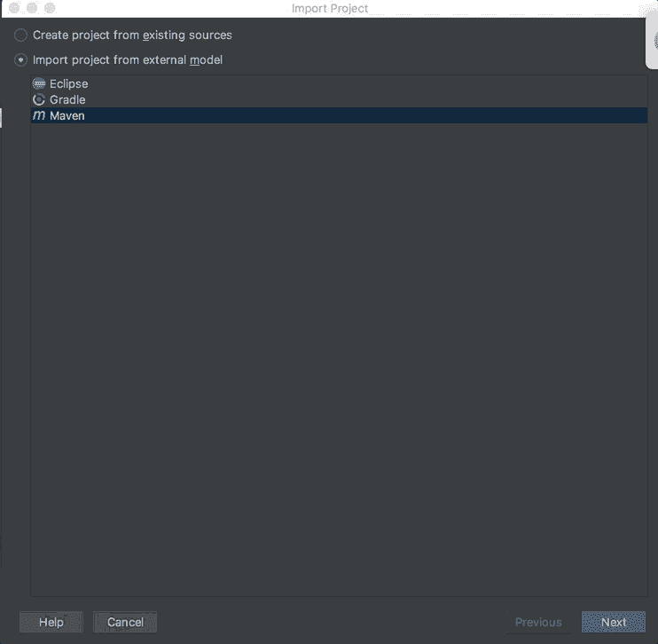
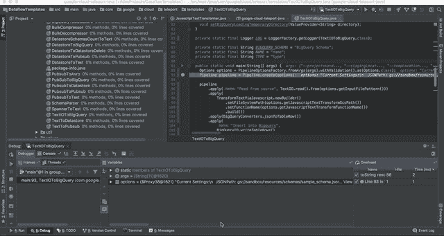

# 在 Google 云平台上为 Apache Beam 搭建 Java 开发环境

> 原文：<https://medium.com/google-cloud/setting-up-a-java-development-environment-for-apache-beam-on-google-cloud-platform-ec0c6c9fbb39?source=collection_archive---------0----------------------->

# 介绍

这些说明将向您展示如何建立并运行开发环境，以开始开发 Java 数据流作业。最终，你将能够以调试模式在本地运行数据流作业，在 [REPL](https://en.wikipedia.org/wiki/Read%E2%80%93eval%E2%80%93print_loop) 中执行代码以加快开发周期，并将你的作业提交给谷歌云数据流。

在旅途中感觉需要 Beam？在你的网络浏览器中检查[编码 Apache Beam 并在云数据流中运行它](/google-cloud/coding-apache-beam-in-your-web-browser-and-running-it-in-cloud-dataflow-c41c275d42c8)。

用 Python 更舒服？在谷歌云平台上为 Apache Beam 检查 [Python 开发环境。](/google-cloud/python-development-environments-for-apache-beam-on-google-cloud-platform-b6f276b344df)

# 什么样的工具可以支撑你的 Java 开发环境？

您将使用以下组件:

*   来自 JetBrains 的 Java IDE。
*   来自 ASF 的项目管理和理解工具。
*   **Google Cloud SDK :** 命令行工具，用于管理您的 Google 云平台项目，并将 Apache Beam 管道作为数据流作业提交给您。

想要更多吗？查看 [IntelliJ](https://www.jetbrains.com/idea/documentation/) 、 [Maven](https://maven.apache.org/) 、 [Google Dataflow](https://cloud.google.com/dataflow/) 的官方文档。

# 你需要什么

*   最近版本的 Chrome 浏览器。
*   Java 8 [JDK](http://www.oracle.com/technetwork/java/javase/downloads/jdk8-downloads-2133151.html)
*   Java 的基础知识
*   你最喜欢的 CLI(即。Mac 终端)
*   现有的谷歌云项目

# 安装适当的软件


适合您环境的开发工具。

## 遵循这些安装指南(按此顺序)

1.  [Java 8 JDK](http://www.oracle.com/technetwork/java/javase/downloads/jdk8-downloads-2133151.html)

确保设置 JAVA_HOME 环境变量。

如果您使用的是 Mac，请将其添加到 bash 配置文件中。您可以在终端中运行这些命令。

```
echo “export JAVA_HOME=/Library/Java/JavaVirtualMachines/jdk1.8.0_xxx.jdk/Contents/Home/” >> ~/.bash_profile
source ~/.bash_profile
```

2.[谷歌云 SDK](https://cloud.google.com/sdk/)

访问 [Cloud SDK 下载页面](https://cloud.google.com/sdk/docs/quickstart-macos)，将 google-cloud-sdk 解压到您的/Applications 目录。

```
Applications/google-cloud-sdk/install.sh
export PATH=/Applications/google-cloud-sdk/bin:$PATH
```

打开一个*新的*终端，运行这个命令，并在随后的提示中输入必要的信息。

```
gcloud init
```

确保您的 SDK 版本是最新的。

```
gcloud components update
```

1.  [IntelliJ(社区版)](https://www.jetbrains.com/idea/download/)

您将在本安装指南中使用 IntelliJ，因为它的[越来越受欢迎](https://zeroturnaround.com/rebellabs/developer-productivity-report-2017-why-do-you-use-java-tools-you-use/)和直观的调试特性。

1.  [阿帕奇 Maven](http://maven.apache.org/install.html)

许多 java 开发人员都熟悉 Maven，它是测试、打包和编译 Java 项目的有用工具。

```
unzip apache-maven-3.5.3-bin.zip -d /opt/apache-maven/
echo PATH=/opt/apache-maven/bin:\$PATH >> ~/.bash_profile
source ~/.bash_profile
```

检查 maven 安装是否成功。

```
mvn -v
```

您应该会看到如下输出:

```
Apache Maven 3.5.3 (138edd61fd100ec658bfa2d307c43b76940a5d7d; 2017–10–18T08:58:13+01:00)
Maven home: /opt/apache-maven-3.5.3
Java version: 1.8.0_45, vendor: Oracle Corporation
Java home: /Library/Java/JavaVirtualMachines/jdk1.8.0_45.jdk/Contents/Home/jre
Default locale: en_US, platform encoding: UTF-8
OS name: “mac os x”, version: “10.8.5”, arch: “x86_64”, family: “mac”
```

[启用 BigQuery、Dataflow 和 Google 云存储 API](https://console.cloud.google.com/flows/enableapi?apiid=dataflow,compute_component,logging,storage_component,storage_api,bigquery)，如果在 API 管理器中尚未启用的话。这需要几分钟时间。

在控制台中，这可以通过左侧菜单手动完成，转到 **API 的&服务- >仪表板**并点击**启用 API 和服务**


# Google 云项目设置

从您的 Google 云平台控制台页面打开云外壳:

将变量设置为等于您的项目 id:

```
export PROJECT=$(gcloud config get-value core/project)
```

## 创建云存储桶

使用 make bucket 命令在项目中的 us-central1 中创建新的区域存储桶

```
gsutil mb -c regional -l us-central1 gs://$PROJECT
export BUCKET=$PROJECT
```

## 创建 BigQuery 数据集

在 BigQuery 中创建数据集。这是 BigQuery 中所有表的加载位置。

```
bq mk DataflowJavaSetup
```

# 配置 IntelliJ

## 克隆数据流模板报告

在这次演练中，您将使用来自数据流模板报告的源代码:

 [## Google cloud platform/dataflow templates

### 数据流模板-大数据 Apache 波束模板

github.com](https://github.com/GoogleCloudPlatform/DataflowTemplates) 

1.  打开 IntelliJ。
2.  选择从版本控制中签出。
3.  选择 Git。
4.  在 URL 中粘贴此回购链接:[https://github . com/Google cloud platform/dataflowtemplates . git](https://github.com/GoogleCloudPlatform/DataflowTemplates.git)
5.  单击克隆。
6.  单击是。

## 设置 Maven 项目



1.  选择 Maven。
2.  单击下一步。
3.  选中“递归搜索项目”。
4.  勾选“自动导入 Maven 项目”。
5.  (在接下来的三个屏幕中单击“下一步”,因为默认设置将满足您的需要)。单击完成。

## 查找管道源代码


1.  按以下顺序遍历文件系统树:
2.  data flow templates/src/main/Java/templates/textiotobigquery . Java

# 运行数据流管道

## 在本地运行 Apache Beam 管道

首先，您将做一些环境设置，然后您将运行[一个数据流模板，它从 GCS 读取并应用一个 javascript UDF，然后写入 BigQuery](https://cloud.google.com/dataflow/docs/templates/provided-templates#gcstexttobigquery) 。

## 设置

1.  打开终端。


为此示例创建一个 BigQuery 数据集。

```
bq mk java_quickstart
```

编译 maven 项目。

```
mvn clean && mvn compile
```

## 为定义这个 Apache Beam 管道的类创建一个运行/调试配置

此配置为 IntelliJ 定义了如何在本地运行代码。这对于测试和调试代码的早期阶段是必不可少的，无需等待(和支付)数据流来启动工人。


1.  在右上角的下拉列表中，选择编辑配置。
2.  单击+按钮并选择应用程序。
3.  为您的配置命名。通常，这与配置运行的类的名称相同，但如果不同的参数有不同的配置，则可能更具描述性。
4.  将程序参数粘贴到指定的文本框中。现在让我们使用 TestDataflowRunner。(参见本节下面的示例参数)

5.在工作目录下拉列表中选择%MAVEN_REPOSITORY%

6.单击应用，然后单击确定

```
--project=sandbox
--stagingLocation=gs://sandbox/staging
--tempLocation=gs://sandbox/temp
--templateLocation=gs://sandbox/templates/GcsToBigQueryTemplate.json
--runner=TestDataflowRunner
--javascriptTextTransformGcsPath=gs://sandbox/resources/UDF/sample_UDF.js
--JSONPath=gs://sandbox/resources/schemas/sample_schema.json
--javascriptTextTransformFunctionName=transform
--inputFilePattern=gs://sandbox/data/data.txt
--outputTable=sandbox:java_quickstart.colorful_coffee_people
--bigQueryLoadingTemporaryDirectory=gs://sandbox/bq_load_temp/
```

## 设置断点并运行调试器

断点将暂停程序的执行，允许您在 REPL 中检查变量或运行代码片段。


1.  在 TextIOToBigQuery.java 的第 93 行设置一个断点，方法是在空白处单击代码的左边。这个区域有时被称为左檐槽。
2.  右键单击>“调试 TextIOToBigQuery”
3.  管道将在到达此行时暂停执行。
4.  在这一点上检查变量。
5.  右键单击并选择“Evaluate expression ”,键入要运行的 Java 代码片段(具有 IntelliJ 的所有语法突出显示和提前键入建议功能),以帮助诊断错误并探索该断点处的执行状态。



更多细节请查看 IntelliJ [调试器介绍](https://www.jetbrains.com/help/idea/debugging-your-first-java-application.html)和[调试器文档](https://www.jetbrains.com/help/idea/debugging-code.html)！

# 在 Google Cloud Dataflow Runner 上运行 Apache Beam 管道

要在 Google Cloud Dataflow workers 上运行这个管道，您需要在 GCS 中存放以下数据文件。

该模板需要带有 BigQuery 模式和 javascript UDF 的 JSON 文件来转换文本。使用[文档](https://cloud.google.com/dataflow/docs/templates/provided-templates#gcstexttobigquery)中的示例。

创建以下两个文件:

**sample_schema.json:**

```
{
 “BigQuery Schema”: [
 {
 “name”: “location”,
 “type”: “STRING”
 },
 {
 “name”: “name”,
 “type”: “STRING”
 },
 {
 “name”: “age”,
 “type”: “STRING”
 },
 {
 “name”: “color”,
 “type”: “STRING”
 },
 {
 “name”: “coffee”,
 “type”: “STRING”
 }
 ]
}
```

**sample_UDF.js:**

```
function transform(line) {
 var values = line.split(‘,’);
 var obj = new Object(); obj.location = values[0];
 obj.name = values[1];
 obj.age = values[2];
 obj.color = values[3];
 obj.coffee = values[4];
 var jsonString = JSON.stringify(obj);

return jsonString;
}
```

**data.txt**

```
US,joe,18,green,late
CAN,jan,33,red,cortado
MEX,jonah,56,yellow,cappuccino
```

将这些文件存放在 Google 云存储中:

```
gsutil cp ./sample_UDF.js gs://$BUCKET/resources/UDF/
gsutil cp ./sample_schema.json gs://$BUCKET/resources/schemas/
gsutil cp ./data.txt gs://$BUCKET/data/
```

这个 Maven 命令在用 templateLocation 指定的云存储位置创建并存放一个模板。创建并暂存模板后，暂存位置包含执行模板所需的其他文件。如果删除临时位置，模板执行将失败。更多信息请查看数据流模板的[文档。](https://cloud.google.com/dataflow/docs/templates/creating-templates#creating-and-staging-templates)

```
mvn compile exec:java -Dexec.mainClass=com.google.cloud.teleport.templates.TextIOToBigQuery -Dexec.cleanupDaemonThreads=false -Dexec.args=” \
--project=$PROJECT \
--stagingLocation=gs://$BUCKET/staging \
--tempLocation=gs://$BUCKET/temp \
--templateLocation=gs://$BUCKET/templates/GcsToBigQueryTemplate.json \
--runner=DataflowRunner”
```

最后，您将使用 gcloud 命令行工具提交一个作业，该作业将运行您的 staged Dataflow 模板。

```
gcloud dataflow jobs run colorful-coffee-people-gcs-test-to-big-query \
--gcs-location=gs://$BUCKET/templates/GcsToBigQueryTemplate.json \
--zone=us-central1-f \
--parameters=javascriptTextTransformGcsPath=gs://$BUCKET/resources/UDF/sample_UDF.js,JSONPath=gs://$BUCKET/resources/schemas/sample_schema.json,javascriptTextTransformFunctionName=transform,inputFilePattern=gs://$BUCKET/data/data.txt,outputTable=$PROJECT:java_quickstart.colorful_coffee_people,bigQueryLoadingTemporaryDirectory=gs://$BUCKET/bq_load_temp/
```

# 去比赛吧！

现在，您已经建立了一个开发环境，可以开始使用 Apache Beam Java SDK 创建管道，并提交它们以在 Google Cloud Dataflow 上运行。

