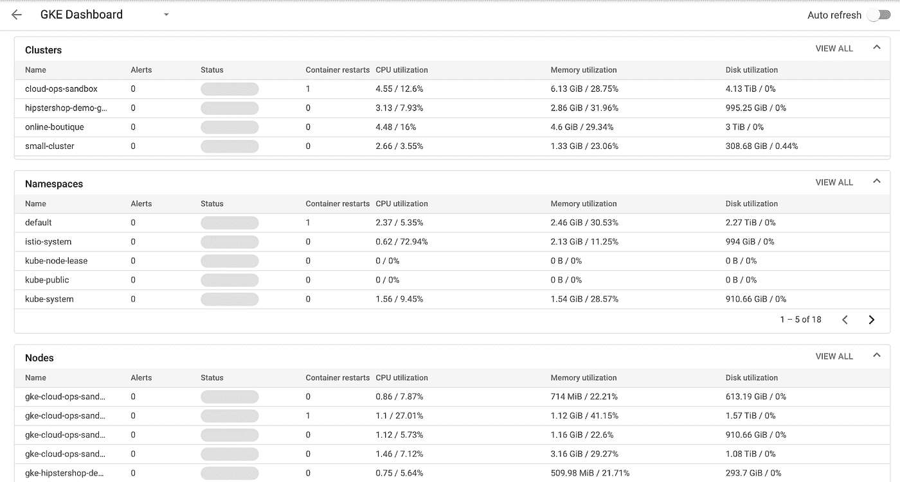
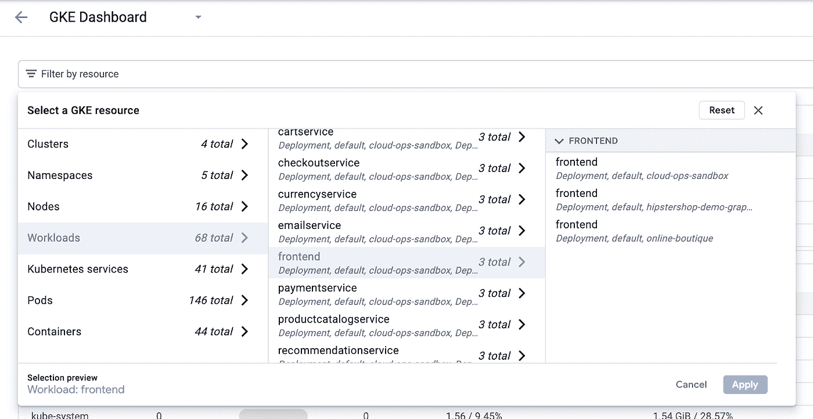
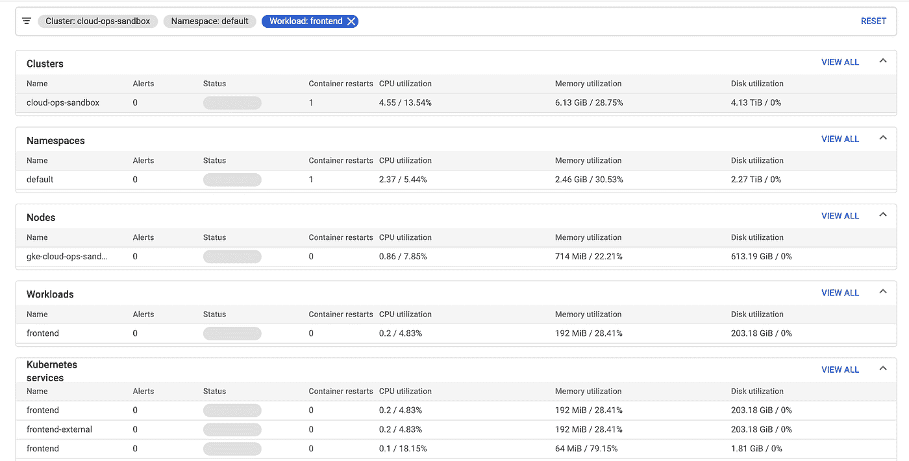
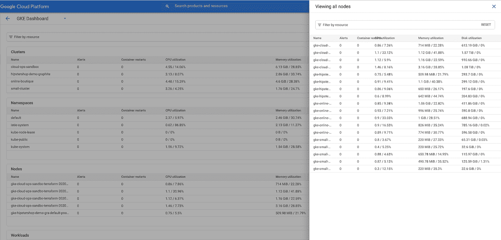
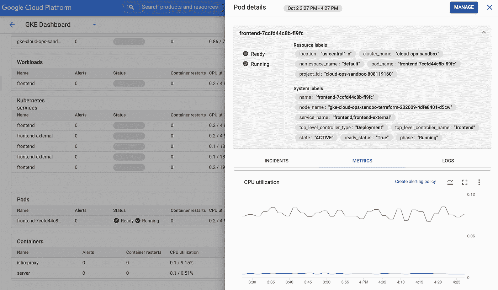
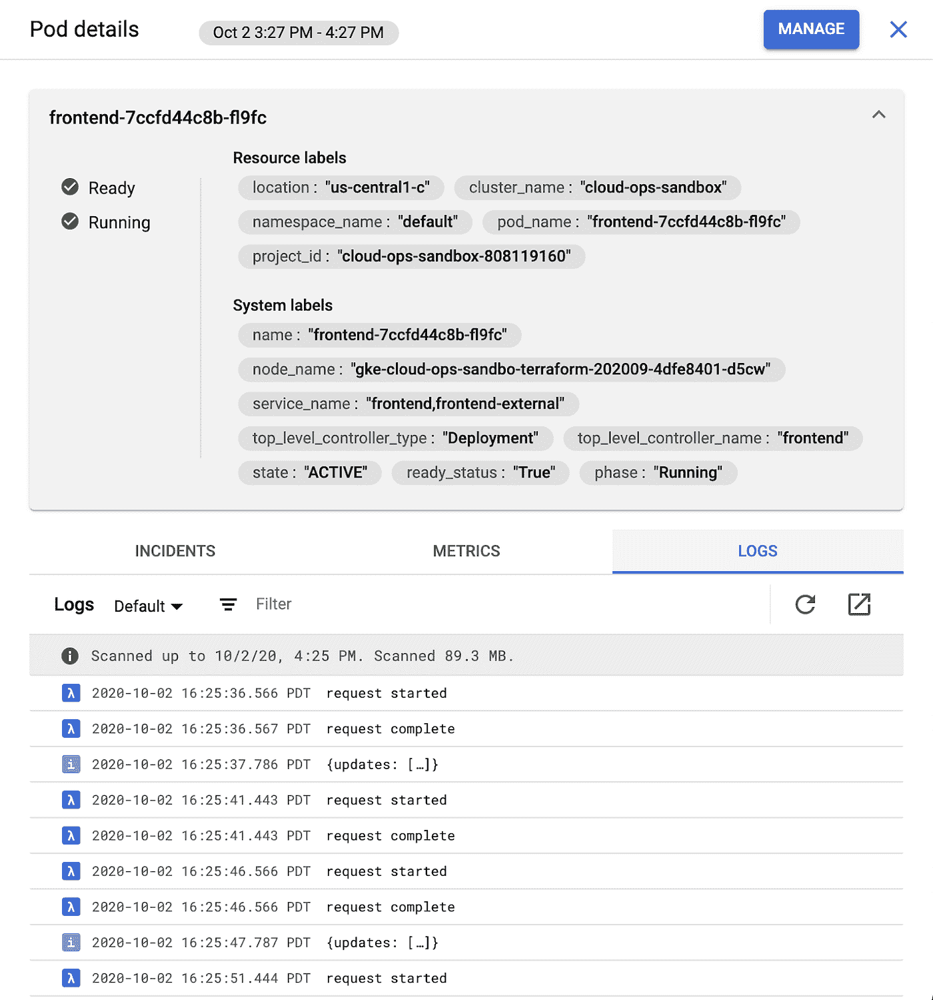
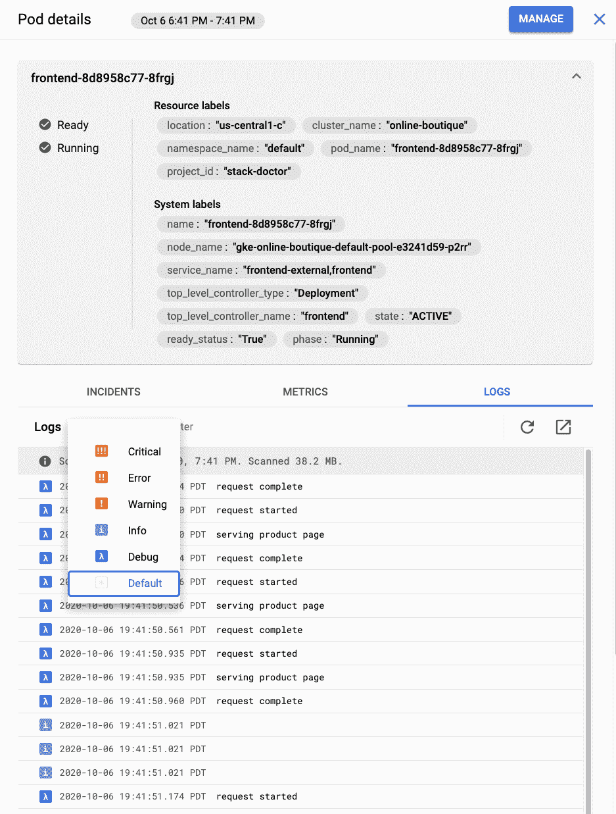
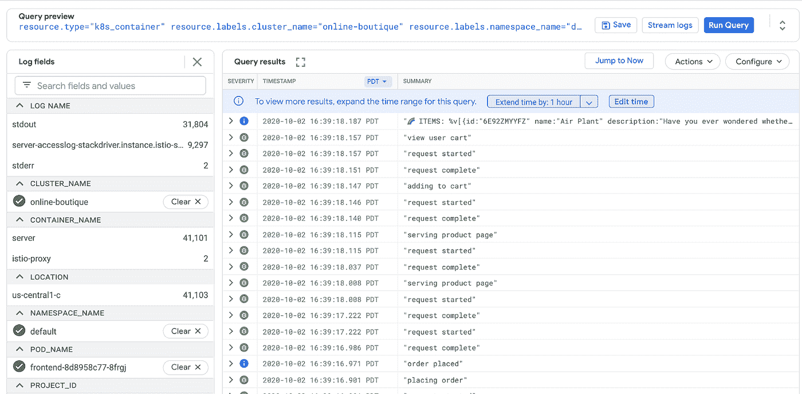

# 为 GKE 设置云运营

> 原文：<https://medium.com/google-cloud/setting-up-cloud-operations-for-gke-a21b49979693?source=collection_archive---------0----------------------->

我对 Google Cloud 可观察性的兴趣很大程度上是在与在 GKE 上运行工作负载的 GCP 客户合作的背景下发展起来的，我在这里的第一批帖子[中有一篇提到了使用 Stackdriver 处理这些工作负载。《T4》的第一集《T2》也展示了当时“新”的 GKE 监控能力。这是两年前的事了，从那以后这些功能有了很大的更新。我认为是时候重新审视 GKE 的云运营了，再看看仪表盘，尝试一下新功能。让我们开始吧！](/google-cloud/new-stackdriver-monitoring-for-kubernetes-part-1-a296fa164694)

# 基础知识

新 GKE 监控仪表板

马上，新的 GKE 监控仪表板看起来与我们看到的 2018 年 5 月在 Kubecon 发布的[非常不同。您现在拥有工作区中所有不同实体的列表，而不是 3 个选项卡(基础架构、工作负载和服务)(您可能](https://cloudplatform.googleblog.com/2018/05/Announcing-Stackdriver-Kubernetes-Monitoring-Comprehensive-Kubernetes-observability-from-the-start.html)[还记得](https://cloud.google.com/monitoring/workspaces)可以从多个项目中汇总监控信息)。当我看到这个的时候，我想到的第一件事是“这很好，但是每个集群都有一个默认的名称空间，我怎么才能找到我需要的呢？”事实证明——已经有人想到了这一点！

有一个非常酷的过滤功能，可以帮助你准确地找到你想要的东西。在本例中，如果您有一个“前端”服务的副本在三个不同的集群中运行，该过滤器允许您选择您想要的那个。应用过滤器后，将过滤整个仪表板以匹配:

过去很难做到的一件事是获得数据的汇总视图。例如，在我的命名空间中，我的资源利用率是什么样的？这种新的视图使得这种聚合变得非常容易——无论聚合了多少资源，它都会扩展，即使您有跨越数百个名称空间的数千个 pod。但是如果您确实想查看所有这些资源，您可以单击“查看全部”。

这将让您看到该类别中的所有实体。如果这个列表太多，你也可以从这里过滤！

您仍然可以选择表中的一行来获取其详细信息。例如，您可以通过单击 pod 来查看其指标，这将打开详细信息面板:

在那里，单击 Logs 选项卡以获取 pod 的日志:

如果需要，您可以按严重性过滤日志:

点按“在记录中打开”按钮:

那就开启([新](https://www.youtube.com/watch?v=8HJDnh8TVOM&list=PLIivdWyY5sqLuKKx4pcdEAkJY1HevjVVm&index=22&t=0s)！)带有查询的日志查看器，用于获取预填充和执行的日志:

我非常喜欢的另一件事是，您可以从详细信息屏幕的 Metrics 选项卡中轻松创建警报策略:

如果您已经关注我有一段时间了，您可能知道我不一定认为对这些类型的基础架构指标发出警报是一个好主意，但是我完全可以想象您可能需要了解的一个用例，例如，达到内存限制或类似的情况。

# 总之…

我真的很高兴看到车队在过去的两年里在这方面取得了很大的进步，我真的很喜欢这种发展。下一次，我想从一个不同的角度来探讨这个问题，方法是强制发出警报/事件，看看它对故障排除有多大用处。

感谢阅读，并保持健康！