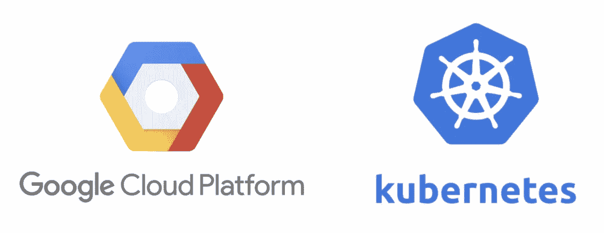

# 使用 Terraform & Helm 设置配置连接器

> 原文：<https://medium.com/google-cloud/setting-up-config-connector-with-terraform-helm-8ce2f45f48a4?source=collection_archive---------2----------------------->



作为代码的基础设施自首次采用以来已经走过了漫长的道路。多个云提供商和 oss 项目已经发布了他们自己的工具，以便从点击式方法转变为声明式方法来设置基础设施和应用程序，而 Terraform 在这场竞赛中处于领先地位。

然而，在处理安全性、最低权限的分配和单独服务帐户的创建时，为了在 Git-repo 中集中控制服务帐户和权限，您必须将帐户的电子邮件作为 Terraform 输出传递给部署脚本。这使得它变得不必要的困难和复杂，并且您可能会最终交叉引用跨项目的资源。

但是，如果您可以创建必要的服务帐户，分配权限，并对其进行注释以无缝处理工作负载身份，并将其作为一个 Helm 版本进行部署，情况会怎样？嗯——向配置连接器问好。

正如谷歌所说，Config Connector 是 Kubernetes 的一个插件，允许你通过 Kubernetes 管理谷歌云资源。它可以很容易地为任何满足最低要求的 GKE 集群启用。在本文中，我们将利用**cluster****scoped**config 连接器，这基本上意味着我们只有一个服务帐户来提供所有名称空间中的所有 GCP 资源。还有一种可能性是使用一个**名称空间作用域的**连接器，利用项目分离的力量来实现更好的 IAM 和资源管理(如果我应该就此发表一篇文章，请告诉我，我很乐意这样做)。

为了启用集群的配置连接器，您必须利用`google-beta`提供程序，声明`addons_config`块，并将`config_connector_config`设置为 enabled:

我们现在准备设置服务帐户，该帐户将运行配置连接器声明的资源的供应。该帐户将需要项目中的 IAM 权限以及一个特定的 IAM 绑定，以允许 config connector 模拟 GSA:

现在我们已经有了一个集群和一个服务帐户，我们需要指示集群内部的 config connector operator 使用那个特定的服务帐户进行配置。如果您使用我创建的 GitHub repo，您必须应用两次基础设施——首先创建集群，然后立即创建剩余的资源。这里，我们通过使用`yamldecode`和`templatefile`函数来应用 kubernetes 清单，以便将清单保存为 yaml，并将服务帐户变量与服务帐户的实际电子邮件地址进行交换:

您可以通过运行`kubectl get crds`和`kubectl get configconnectors`检查已安装的 CRD 来验证安装:

```
> k get configconnectors
NAME                                         AGE     HEALTHY
configconnector.core.cnrm.cloud.google.com   3m50s   true
```

您还会注意到 config connector 控制器已经启动并正在运行。这是确保配置连接器在集群中正常运行所需的所有资源都存在的工作负载。通过研究`configconnector-operator-system`名称空间中`configconnector-operator` StatefulSet 的日志，您可以很容易地看到它执行了什么安装:

```
> kubectl logs configconnector-operator-0 -n configconnector-operator-system
```

运营商负责创建`cnrm-system`命名空间，这是负责供应 GCP 资源的`cnrm-controller-manager`的家。如果你仔细看看控制器管理器的规范，你会注意到它运行的是`cnrm-controller-manager`服务帐户，这个帐户是用我们用 Terraform 创建的 GCP 服务帐户注释的。以下 pod 应该在`cnrm-system`名称空间中启动并运行:

```
> kubectl get po -n cnrm-system
NAME                                            READY   STATUS    
cnrm-controller-manager-0                       2/2     Running
cnrm-deletiondefender-0                         1/1     Running
cnrm-resource-stats-recorder-6dfc78996c-szf25   2/2     Running
cnrm-webhook-manager-778cdd84cb-ncs5q           1/1     Running
cnrm-webhook-manager-778cdd84cb-x4xpk           1/1     Running
```

因为我们的配置连接器已经启动并运行，所以我们可以部署这个奇妙的应用程序，从给定的桶中获取文件内容。为了简单起见，它监听“/”端点，并根据为部署设置的`BUCKET_NAME`和`FILE_NAME`环境变量读取文件内容。我们将从舵图的`values.yaml`文件中传递这些:

我们还将要求 Helm 创建和注释服务帐户，并将服务公开为负载平衡器，以便我们可以从集群外部访问它:

该图表还将提供 3 种谷歌云平台资源:

*   **利用工作负载标识的 GCP 服务帐户**

*   **IAM 政策**授予我们的 Kubernetes 服务帐户作为我们的 GCP 服务帐户的用户的权限— `roles/iam.workloadIdentityUser`

*   **IAM 策略**授予我们的 GCP 服务帐户读取我们之前创建的存储桶中的对象的权限— `roles/storage.objectViewer`

图表将利用`helm`提供者安装，以*项目 id* 和*桶名*作为模板变量；

安装完成后，您应该会注意到集群中的`file-reader`名称空间包含一个副本集、部署、服务帐户和一个公开外部公共 IP 地址的服务。除此之外，图表将部署我们的 GCP 资源。如果您已经正确地设置了一切，它们将最终处于**就绪**状态，这意味着控制器管理器能够成功地供应 GCP 资源:

```
❯ k get IAMServiceAccounts,IAMPolicyMembers
NAME                                                      
iamserviceaccount.iam.cnrm.cloud.google.com/file-readerNAME                                                                     
iampolicymember.iam.cnrm.cloud.google.com/file-reader-app-chart-bucket
iampolicymember.iam.cnrm.cloud.google.com/file-reader-app-chart-wi
```

我们现在可以测试我们的应用程序，以验证我们可以访问这个存储桶:

```
> curl <YOUR_EXTERNAL_IP>
"Two peanuts were walking down the street. One was a salted\n"
```

在控制台中导航时，您应该注意到新的服务帐户`file-reader@<YOUR_PROJECT_ID>.iam.gserviceaccount.com`，它没有项目范围的权限，被允许访问`config-connector-<YOUR_RANDOM_STRING>`桶的对象，并且`<YOUR_PROJECT_ID>.svc.id.goog[file-reader/file-reader]`是该服务帐户的工作负载身份用户。

我相信 Config Connector 是公共基础设施声明和特定于应用程序的组件之间的一座神奇而强大的桥梁。在不久的将来，我一定会在生产中尝试一下。

请务必查看包含所有源代码的 GitHub repo:

[](https://github.com/adriantr/config-connector) [## GitHub-Adrian tr/Config-connector:带头盔和地形的配置连接器演示

### 此时您不能执行该操作。您已使用另一个标签页或窗口登录。您已在另一个选项卡中注销，或者…

github.com](https://github.com/adriantr/config-connector) 

有兴趣了解更多关于我们 Strise.ai 如何从谷歌云平台中获得乐趣以及我们的环境看起来如何？停下来喝杯咖啡或者在 LinkedIn 上联系我们！

是的——我们正在[招聘](https://www.strise.ai/about-us/careers)。