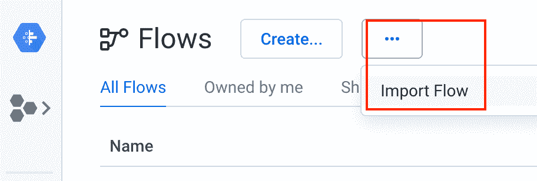
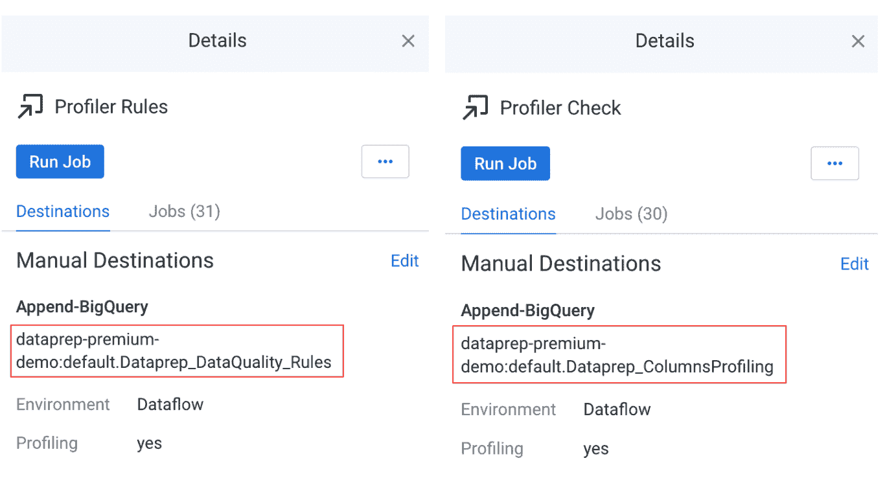

# 为云数据准备管道设置数据质量监控

> 原文：<https://medium.com/google-cloud/setting-up-data-quality-monitoring-for-cloud-dataprep-pipelines-1df6b6521e52?source=collection_archive---------0----------------------->

# 构建数据质量仪表板

构建一个现代化的数据栈来管理分析管道——比如 Google Cloud 和 BigQuery 数据仓库或数据湖——有很多好处。其中一个好处是能够自动监控数据管道的质量。您可以确保准确的数据为您的分析提供支持，跟踪数据质量趋势，并且在出现数据质量问题时，快速做出反应以解决问题。

让我们回顾一下如何创建一个漂亮的 Data Studio 仪表板来监控云 Dataprep 数据质量管道。

对于本文，我们假设您负责管理一个销售云数据仓库(DWH)的数据管道，并且您想要监控这个特定销售 DWH 的数据质量(DQ)。您必须创建两个不同但相关的管道:

1.  **用于加载实际销售 DWH 的管道 1**
2.  **监测 DQ 的 2 号管道**

当销售 DWH 加载时，它将触发 DQ 管道。

从高层次角度来看，解决方案遵循您将在本文中实现的这些原则:

*   为销售 DWH 数据集(销售和广告点击流)打开作业“分析结果”和“数据质量规则”。
*   执行销售数据准备作业以加载销售 DWH。
*   加载销售 DWH 以触发 DQ 管道时，执行 webhook
*   使用 [Google Data Studio](https://marketingplatform.google.com/about/data-studio/) 报告 [Google BigQuery](https://cloud.google.com/bigquery) 表，以跟踪销售 DWH 的数据质量趋势。

这是您将要创建的 Google Data Studio 报告的一个示例。本博客更详细地解释了所提供的内容。

图— Google Data Studio 报告和 Dataprep 数据质量趋势

# 使用云数据准备构建数据质量管道

这里概述了用于捕获云 Dataprep 数据质量统计并将它们加载到 BigQuery 的整个解决方案。自动化部分来自 Dataprep 作业，而 Data Studio 处理报告。

图—监控销售数据仓库数据质量管道的数据准备流程

*   上面的通道表示实际的销售 DWH，它正在将销售和广告数据加载到 DWH 中。
*   一旦 Cloud Dataprep 作业执行完毕，它就会执行一个 webhook(一个任务),触发第二个 Cloud Dataprep 作业。
*   下面通道中的第二个作业将把数据分析和数据质量规则结果(以 JSON 文件的形式)加载到 BigQuery 表中，以便用 Data Studio 对其进行报告。

# 1.先决条件

## **熟悉剖析&数据质量规则:**

对于您想要监控 DQ 的数据集，您必须启用[【分析结果】](https://help.trifacta.com/en/articles/4512275-profile-results)和[【数据质量规则】](https://www.trifacta.com/blog/data-quality-rules/)。请熟悉这些功能。这些是我们将用来构建 DQ 仪表板的基本统计数据。每次使用 Trifacta 运行作业时，都会创建一些数据质量统计数据，可以通过 API 或 JSON 文件访问这些数据。我们将利用 JSON 文件来构建数据质量数据库。您必须在作业和流程中分别启用分析&数据质量规则。如果您还没有要监控的流，不要担心，我们将利用本文下面提供的销售 DWH 流。

## **下载量:**

这个博客的所有资源都在这个 [GitHub](https://github.com/victorcouste/trifacta-flows-examples/tree/main/Profiling%20%20Quality%20Rules%20Processing) 中

[下载](https://github.com/victorcouste/trifacta-flows-examples/raw/main/Profiling%20%20Quality%20Rules%20Processing/flow_Profiling%20%20Quality%20Rules%20Processing.zip)flow _ Profiling Quality Rules processing . zip，这是 DQ 流，用于提取分析和数据质量结果，并将它们加载到 BigQuery 表中

[下载](https://github.com/victorcouste/trifacta-flows-examples/blob/main/Profiling%20%20Quality%20Rules%20Processing/flow_Data%20Quality_Clickstream_and_Sales.zip)flow _ Data Quality _ click stream _ and _ Sales . zip，这是本博客中使用的销售 DWH 流程示例。如果您愿意，您可以使用您自己的 Cloud Dataprep 流来监控数据质量。

[下载](https://github.com/victorcouste/trifacta-flows-examples/blob/main/Profiling%20%20Quality%20Rules%20Processing/Advertising_Clickstream.csv)[Advertising _ click stream . CSV](https://github.com/victorcouste/trifacta-flows-examples/blob/main/Profiling%20%20Quality%20Rules%20Processing/Advertising_Clickstream.csv)和[下载](https://github.com/victorcouste/trifacta-flows-examples/blob/main/Profiling%20%20Quality%20Rules%20Processing/Sales_Data_small.csv) [Sales_Data_small.csv](https://github.com/victorcouste/trifacta-flows-examples/blob/main/Profiling%20%20Quality%20Rules%20Processing/Sales_Data_small.csv) 为销售 DWH 的源示例

您可以制作自己的 [Data Studio 仪表盘](https://datastudio.google.com/reporting/3ed00013-d755-4010-8b00-58da2c69ea81)【PUBLIC】Cloud Data prep Profiling&数据质量仪表盘副本，以根据您的数据质量监控需求进行定制

## **服务访问:**

你将需要一个有效的谷歌帐户和访问云数据准备和谷歌大查询，以便尝试它。你可以去谷歌控制台[https://console.cloud.google.com/](https://console.cloud.google.com/)激活这些服务。

## **调用 API**:

要调用 API，您需要一个访问令牌，可以从 Cloud Dataprep 中的首选项页面生成。

图—从设置菜单中获取访问令牌

# 2.创建云数据准备数据质量流

图—要加载到 BigQuery 中的 Dataprep 流解析分析和 DQ 规则结果

## 在云数据准备中导入 DQ 流

如果还没有完成，[下载](https://github.com/victorcouste/trifacta-flows-examples/raw/main/Profiling%20%20Quality%20Rules%20Processing/flow_Profiling%20%20Quality%20Rules%20Processing.zip)flow _ Profiling Quality Rules processing . zip DQ 流，并将其导入(不解压)到您的 Dataprep 环境中。在 Cloud Dataprep 应用程序中，单击左侧导航栏中的 Flows 图标。然后在流页面中，从上下文菜单中选择 Import。

图—在您的 Dataprep 环境中导入 DQ 流

图—导入的“分析和质量规则处理”流程

这两个流解析 JSON 文件，并将它们转换成列式 BigQuery 表格式，以便在 Data Studio 中简化报告。如果你很好奇，你可以看看“Profiler Rules”和“Profiler Check”来理解其中的逻辑。

## 准备 API 调用

您现在需要获得这个流的 ID。这将用于触发您刚才通过 API 调用导入的 DQ 流中的两个作业。

您可以从流 URL 获取 id:

图—从 Dataprep 流 URL 获取

在我的例子中**<flow _ id>**= 355168

现在，您需要根据您自己的个人 Dataprep 配置和设置来定制这个流程。在下一节中，您将获得作为作业运行的一部分生成的概要分析和数据质量规则输出(在我们的示例中是销售 DWH)。然后，将它们放入 DQ 管道，以便加载到 BigQuery 中。

## 获取分析和数据质量规则结果文件名

当启用概要分析并且定义了数据质量规则时，Dataprep 会在作业执行结束时生成 3 个 JSON 文件，这些文件位于您的 Google Cloud Storage staging bucket 的默认文件夹中:

**/ <用户名>/作业运行/ <输出名> _ <作业 id > /。侧写员**

其中:

*   **<用户名>** =运行 Dataprep 作业的 GCP 用户(帐户电子邮件)
*   **<输出名>** =数据准备输出对象名
*   **<job _ id>**= data prep 作业 id

生成的 3 个(多部分)JSON 文件是:

*   **profilerRules.json** =数据质量规则结果
*   **profilertypecheckhistograms . JSON**=所有列的有效、缺失和不匹配的分析信息
*   **profilervalidvalueshistograms . JSON**=包含前 20 名和所有列的统计信息的分析信息

对于我们当前的例子，我们的**<staging _ bucket _ name>**是“data prep-staging-0 B9 ad 034–9473–4777–98 f1–0 F3 e 643d 0 DCE”，我们使用了默认的**<job run _ folder>**。对于这个例子，我们将只使用前两个 JSON 概要文件。稍后，您可能希望使用包含 doe 额外统计数据的最后一个数据质量文件来扩展解决方案。

图—在 GSC 暂存桶中生成的分析和数据质量 JSON 文件

请注意，本例中使用的默认**<job run _ folder>**可以在您自己的环境中进行更改。回到 Cloud Dataprep 应用程序，从左侧导航栏的用户首选项菜单中，您可以验证您的帐户使用的**<job run _ folder>**。您可以在用户首选项和配置文件信息中找到此设置。

图—检查 Cloud Dataprep 用户首选项中的作业运行目录

## 使用新的参数化输入数据集更新 DQ 流

我们可以使用作业执行中的两个文件(profilerRules.json 和 profilertypecheckhistograms . JSON)作为创建 DQ 流的导入数据集的基础。这些流是通过路径访问的。

使用 Cloud Dataprep，当您创建新的导入数据集时，您可以参数化部分路径，这允许您创建与所有作业运行中的所有此类文件相匹配的导入数据集。这些数据集称为带参数的数据集。

在之前导入的“Profiling & Quality Rules Processing”流程中，您需要用您的**<staging _ bucket _ name>**和 **< jobrun_folder >** 更新两个“Profiler 输入数据集”。

为此，我们建议您第一次运行作业时启用[【概要分析结果】](https://help.trifacta.com/en/articles/4512275-profile-results)和[【数据质量规则】](https://www.trifacta.com/blog/data-quality-rules/)，这样您以后就可以使用现有的路径和概要分析器 json 文件更新流。

图-2 个分析器输入数据集的路径和参数

使用正确的路径编辑 2 个数据集的参数。

首先从输入数据集细节面板，从右侧导航菜单 **'…'** 中选择**“编辑参数…**项。

图-编辑参数

然后通过“Browse”按钮，您可以找到您的 staging bucket，并使用 3 个变量 **< user_name >、< output_name >** 和 **< job_id >** 创建路径来找到您的 Profiler json 文件，如下所示。我建议首先找到一个现有的 profilerRules.json 文件，然后用 3 个变量替换 user、output dataset name 和 job id。

图-定义参数化路径

在您的 2 个输入数据集更新后，检查您是否可以从每个配方的*细节*窗格的*数据预览*中看到一些数据。

图—配方数据预览

如果您看不到任何数据，请验证您的路径是否正确，以及您是否可以看到数据集中的数据。

您还可以编辑这两个配方，以检查输入数据集并研究可能出错的地方。

我们不会在这里详细解释这些食谱，但是你可以编辑和修改它们，使它们符合你的需要。

## 用 BigQuery 输出表更新 DQ 流

最后，您需要更新 2 个配方的输出，以便将概要分析和数据质量规则结果接收(在 Append 模式下)到 2 个 BigQuery 表中。这两个 BigQuery 表将在您第一次运行作业时由 Dataprep 自动创建，然后下一次运行将在这两个表中添加新数据。这样，您将跟踪数据质量历史。

图 BigQuery 表中的输出目标

检查点:您已经成功地导入了数据质量流，使用正确的文件路径定制了它，并运行了两个 DQ 作业来填充 BigQuery 表。

最后，您可以运行作业来产生这两个输出，并检查您的两个 BigQuery 表是否填充了概要分析和数据质量结果。

# 3.创建一个云数据准备流并配置一个 Webhook

图—当销售 DWH 作业完成时，使用 Webhook 调用 DQ 流

好了，我们差不多完成了——但还没有完全完成。我们现在需要创建销售 DWH 流[作为示例](https://github.com/victorcouste/trifacta-flows-examples/tree/main/Profiling%20%20Quality%20Rules%20Processing)，我们将使用它来监控我们的数据质量。您可能更喜欢在您自己的 Dataprep 项目中使用您现有的流程之一。在您选择用来监控数据集数据质量的流中，我们将调用上面提到的 Dataprep DQ 流来将分析和数据质量结果发布到您的 Google BigQuery 表中。

调用数据质量流将通过 Webhook(一个外部任务调用——如果不熟悉 Webhooks，您可以在这里阅读[文档](https://docs.trifacta.com/display/DP/Create+Flow+Webhook+Task))通知来完成，它允许您定义到任何 REST API()的传出 HTTP 消息。

让我们看看它是什么样子的。下面是如何在您的流程中配置一个 Webhook 任务，它将调用您的“Profiling & Quality Rules Processing”流程并运行这两个作业。

图—创建云数据准备流程并在流程上配置 Webhook 任务

Webhook 任务需要配置以下信息:

*   **< url >** :它是 Cloud Dataprep API 端点，运行“概要分析&质量规则处理”流程。

运行一个流的默认云 Dataprep API 端点是[**https://api.clouddataprep.com/v4/flows/<Flow _ id>/run**](https://api.clouddataprep.com/v4/flows/xxxx/run)

其中 **< flow_id >** 是您从上一步中检索到的“Profiling&Quality Rules Processing”流的 id。

*   **头**如下面截图所示，带有 **<内容类型>** 和值 **<应用/json >，<授权>** 和值 **<承载访问 _ 令牌>**

data prep**<access _ token>**用于调用 Dataprep API，参见“入门”章节。

*   **主体**的值如下图所示

> {
> 
> "运行参数":{
> 
> "覆盖":{
> 
> "数据":[
> 
> {"key":"user "，" value ":" vcustopnoble @ tri facta . com " }，
> 
> {"key":"jobid "，" value":"$jobId"}，
> 
> {"key":"output_dataset "，" value ":" Advertising _ click stream " }
> 
> ]
> 
> }}}

注意，对于<user>,您需要输入运行 Dataprep 作业的 GCP 用户帐户(电子邮件),对于<output_dataset>,您需要输入当前流中定义的输出对象的名称。</output_dataset></user>

*   **触发事件**，您可以决定只有当作业成功时才触发 Webhook。
*   **触发对象**，您必须只为流程中的特定输出(您放在**主体**参数中的输出)触发 Webhook。

输入这些信息后，您就可以测试您的 Webhook 任务了。

图—调用“分析和质量规则处理”流程的 Webhook 任务参数

保存 Webhook 任务后，就可以在执行作业时调用它了。

图—创建的 Webhook 任务

不要忘记在输出的发布设置中检查“配置文件结果”。如果不检查这一点，将不会生成概要分析结果，这将违背解决方案的整个目的。

图-检查的轮廓结果

检查点:您已经成功地在销售 DWH 流上配置了一个 Webhook，当作业完成时，webhook 会触发 DQ 流来填充 biqquery DQ 表。

如果您想要获取和监控所有输出的分析和数据质量规则，可以为 DWH 流的每个输出配置一个 Webhook。

# 4.测试端到端流程

现在，您可以通过运行 Dataprep 作业来测试端到端流程，并在 DataStudio 报告中查看数据质量。

例如，在 DW 流程中，在广告点击流输出上运行作业(通过单击“运行作业”按钮)。

图—运行数据准备作业

“广告 _ 点击流”作业完成后，您可以从作业的“Webhooks”选项卡查看作业结果页面，确认 web hooks 已被触发:

图— Dataprep 作业结果和 Webhook 任务完成

您还可以在作业结果页面中检查“Profiler Rules”和“Profiler Check”这两项作业是否已顺利启动:

图—从“分析和质量规则处理”流程运行的数据准备作业

当这两个“探查器规则”和“探查器检查”作业完成时，您可以检查您的两个 BigQuery 表，然后分析和 DQ 规则结果已经很好地插入到表中:

图 Google BigQuery 表中的数据质量规则结果

最后，您可以将 Dataprep UI 中的数据质量规则与 Data Studio 仪表板中的数据质量规则进行比较。应该是相同的价值观。

图 Dataprep UI 中显示的数据质量规则结果

图 Google Data Studio 仪表板中显示的数据质量规则结果

# 结论

通过完成这个逐步指南，您现在可以将 Dataprep 概要分析和数据质量规则结果发布到 Google BigQuery 表，这进一步允许您创建一个 Data Studio 仪表板，该仪表板监视数据质量趋势并向您更广泛的团队显示信息。

您已经学习了一些关于以下内容的云数据准备高级技术:

*   如何利用云数据准备分析和数据质量结果
*   [Cloud Dataprep Webhook](https://docs.trifacta.com/display/DP/Overview+of+Operationalization#OverviewofOperationalization-Webhooks)
*   [云数据准备 API](https://api.trifacta.com/dataprep-premium/index.html)

您可以扩展该解决方案，以监控额外的 Google 云服务，实现端到端的数据质量管道监控。

现在，您可以使用 Cloud Dataprep 自动监控整个数据质量管道了。