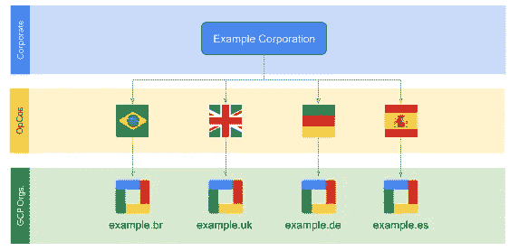
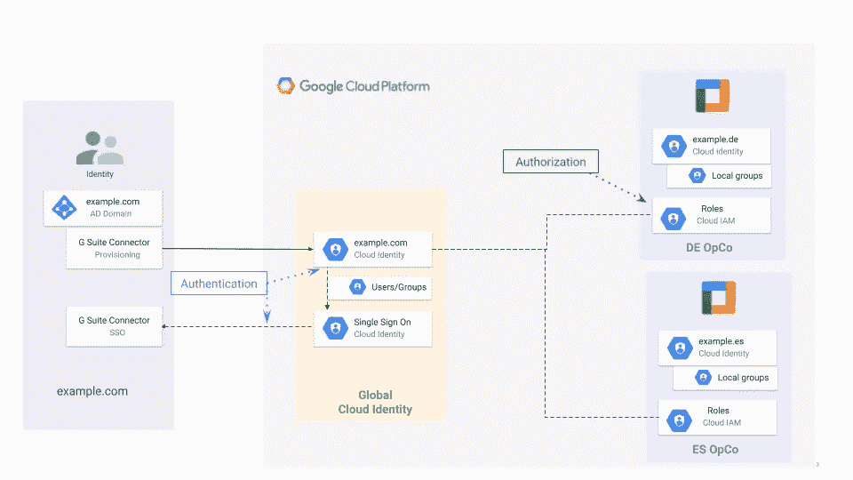

# 为跨国公司设置 Google 云身份

> 原文：<https://medium.com/google-cloud/setting-up-google-cloud-identity-for-multinational-companies-4afcbb18dee1?source=collection_archive---------4----------------------->

在 Google Cloud 中加入企业的第一步是设置 Cloud Identity 或 Google Workspace 来集中管理 Google Cloud。

该流程在[企业入职清单](https://cloud.google.com/docs/enterprise/onboarding-checklist#checklist-title)中有很好的解释，在[云身份架构网站](https://cloud.google.com/architecture/identity)中有最佳实践和参考架构。

为跨国公司设置云身份可能会更加棘手，因为这些公司可能有集中的服务，如电子邮件服务，但另一方面，他们的运营公司(OpCos)可能有足够的自主权来管理自己的 Google 云组织。

# 概观

让我们假设有一家名为“Example LLC”的跨国公司，在巴西、英国、德国和西班牙有四家子公司(或称 OpCos)。



“Example”拥有一组共享服务，包括其所有员工的全球身份和电子邮件服务( <user>@example.com)，由微软 Azure AD 的全球实例提供。在 Azure AD 和 Cloud Identity 之间建立用户联盟的指南可在[此处](https://cloud.google.com/architecture/identity/federating-gcp-with-azure-ad-configuring-provisioning-and-single-sign-on)获得。</user>

另一方面，不同的 OpCo 在技术和运营方面拥有完全的自主权，因此他们决定管理自己的 Google 云组织。

# 问题

组织资源是 Google 云资源层次结构中的根节点，也是项目的层次结构超级节点。一旦设置了 Google Workspace 或 Cloud Identity，组织资源就可用，因此必须验证公司的域。该域在谷歌云认证过程中用于识别用户属于哪个组织，因此**一个域只能属于谷歌云组织**的唯一云身份。

总结:

*   来自不同 OpCos 的所有用户在其电子邮件地址( <user>@example.com)中共享相同的域</user>
*   每个 OpCo 都需要有自己的 Google Cloud 组织(及其相关的域)
*   example.com 域只能与唯一的云身份实例相关联。

来自不同 OpCos 的@example.com 用户如何访问他们对应的 Google Cloud 组织？

# 解决方案

此用例的解决方案包括设置不同的云身份实例:

*   1 个与 example.com 域相关联的全局云身份实例(CI Global ),包含属于不同 OpCos 的所有用户。这个 CI 将负责用户身份验证，并将与 Azure AD 集成，用于用户联合和单点登录。
*   n x 个云身份实例(CI OpCo)与每个 OpCos 域/Google 云组织相关联。这些 CI 实例不包含用户，但是可以包含本地组(例如 gcp-net-admins@example.de)。管理 OpCo 组织中托管的资源的授权由 Cloud IAM 执行，将权限分配给 CI 全局中可用的用户身份。



如果用户在两个不同的组织中拥有权限并访问 Google Cloud Console，则可以在 Google Cloud Console 中选择正确的组织


# 限制允许的身份域

为了限制允许在每个 OpCo 组织的 IAM 策略中使用的身份集，有必要设置 iam.allowedPolicyMemberDomains 组织策略[1]。

iam.allowedPolicyMemberDomain 定义可以添加到云 iam 策略的成员集。允许/拒绝列表必须指定一个或多个云身份或 Google Workspaces 客户 id。

可以使用 Google Cloud 控制台或以下 gCloud 命令设置组织策略:

```
gcloud alpha resource-manager org-policies allow \
--organization 'ORGANIZATION_ID_example_opco' \
 iam.allowedPolicyMemberDomains 'CUSTOMER_ID_example.com' \
 'DOMAIN_ID_example_opco'
```

可以使用以下 gCloud 命令获取域 ID:

```
gcloud organizations list
```

该命令将返回显示名称、ID(组织 ID)和目录客户 ID。Google Workspace 客户 ID 是 DIRECTORY_CUSTOMER_ID。

# 考虑和限制

*   域限制共享(allowedPolicyMemberDomain)可能会干扰某些 Google 云服务，您可能需要为某些 Google 云服务提供例外。[2]
*   外部团体不得成为组织所有项目的所有者。你可以让 [group@example.es](mailto:group@telefonica.es) 做项目负责人，让【group@example.com】的[做](mailto:group@telefonica.com) [group@example.es](mailto:group@telefonica.es) 的成员，或者让[group@example.com](mailto:group@telefonica.com)做项目编辑。[3]
*   [上下文感知访问](https://cloud.google.com/context-aware-access/docs/securing-console-and-apis):不属于您组织的任何人，即使您已将他们添加到应受上下文感知访问限制约束的用户组中，也不受访问约束。[4]

[1][https://cloud . Google . com/resource-manager/docs/organization-policy/restricting-domains](https://cloud.google.com/resource-manager/docs/organization-policy/restricting-domains)

[2][https://cloud . Google . com/resource-manager/docs/organization-policy/restricting-domains # known _ issues](https://cloud.google.com/resource-manager/docs/organization-policy/restricting-domains#known_issues)

[3][https://cloud . Google . com/iam/docs/FAQ # can _ I _ use _ Google _ groups _ with](https://cloud.google.com/iam/docs/faq#can_i_use_google_groups_with)

[4][https://cloud . Google . com/context-aware-access/docs/securing-console-and-API](https://cloud.google.com/context-aware-access/docs/securing-console-and-apis#frequently_asked_questions)