# 使用 Databricks 设置多云(内部)连接

> 原文：<https://medium.com/google-cloud/setting-up-multi-cloud-on-premises-connectivity-with-databricks-19c45f98cb81?source=collection_archive---------1----------------------->

# 介绍

这是一个关于如何建立从您在 GCP 的 [Databricks](https://databricks.com/product/data-lakehouse) 工作区到您的其他云/本地网络的连接的高级指南。对于这里详述的例子，我们将建立从 GCP 上的数据块到 Azure 环境的连接。类似的方法也适用于 AWS 或内部的连接。

本指南基于这篇[博客文章](https://cloudywithachanceofbigdata.com/creating-a-site-to-site-vpn-connection-between-gcp-and-azure-with-google-private-access/)，进行了修改以支持与数据块的连接。本指南可用于将 GCP 上的数据块连接到外部环境(Azure、AWS、内部)中托管的各种数据源，通过直接私有 IP 连接或通过云 DNS 的主机名查找。

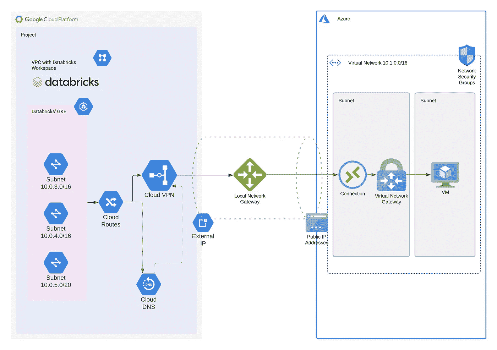

# 清单

*   [Azure]创建以下服务:1 个 VNET、1 个默认子网、1 个网关子网、1 个 NSG、2 个公共 IPs、1 个虚拟网络网关
*   [GCP]创建 Databricks 工作区
*   [GCP]创建以下服务:1 个外部 IP，1 个 VPN 网关
*   [GCP]定义 VPN 流量的转发规则
*   [GCP]创建 VPN 隧道
*   [Azure]创建本地网关
*   [Azure]创建 VPN 连接
*   [GCP]调整数据块网络路由
*   [GCP]调整 Databricks VPC 防火墙规则
*   [Databricks]通过私有 IP 呼叫测试连接性
*   [GCP]设置 DNS 区域
*   [数据块]通过主机名测试连接性

# 第 1 部分:确保您有一个满足先决条件的 Azure 环境

# **所需天蓝色组件**

1.[虚拟网络](#8686)
2。[服务/虚拟机等的子网。即你要连接的](#11f4)到
3。[网关](#d7db)的子网
4。[网络安全组](#8dd6)
5。[公共 IPs(用于虚拟网络网关，用于测试的 VM)](#dda2)
6 .[虚拟网络网关](#5c34)

对于本例，我们将在名为“ [multicloud_vpn_rg](https://portal.azure.com/#@DataBricksInc.onmicrosoft.com/resource/subscriptions/3f2e4d32-8e8d-46d6-82bc-5bb8d962328b/resourcegroups/multicloud_vpn_rg/overview) ”的资源组中托管我们的资源。在此 RG 中，我们定义了一个名为“mc_vnet”的虚拟网络，其 IPv4 地址空间为 10.1.0.0/16。

因为我们将在这个例子中使用 Azure PowerShell，所以第一步涉及身份验证(我们在这里以交互方式进行)。

```
Connect-AzAccount -UseDeviceAuthentication -subscription XYZXYZXYZ
```

然后，我们创建一个 [Azure 虚拟网络](https://docs.microsoft.com/en-us/azure/virtual-network/virtual-networks-overview)，连接 2 个子网——一个“默认”子网，我们将使用它来托管用于 ping 测试的虚拟机，另一个“网关子网”将托管一个[虚拟网关网络](https://docs.microsoft.com/en-us/azure/vpn-gateway/)。

## 服务/虚拟机等的子网。你想连接到 **:**

```
$defaultSubnet = New-AzVirtualNetworkSubnetConfig `
-Name “default” `
-AddressPrefix “10.1.1.0/24”
```

## 网关**的子网:**

```
$gatewaySubnet = New-AzVirtualNetworkSubnetConfig  `
-Name "GatewaySubnet" `
-AddressPrefix "10.1.2.0/24"
```

## **创建虚拟网络和子网:**

```
$vnet = New-AzVirtualNetwork  `
  -Name "mc_vnet" `
  -ResourceGroupName "multicloud_vpn_rg" `
  -Location "West Europe" `
  -AddressPrefix "10.1.0.0/16" `
  -Subnet $gatewaySubnet,$defaultSubnetSubnet 
```

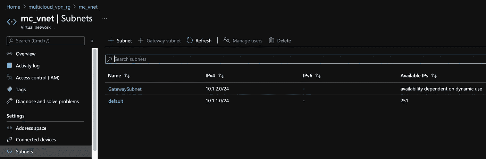

我们已经完成了该部分的 [#1](#8686) 、 [#2](#11f4) 和 [#3](#d7db) 项目的创建。

## NSG

一旦我们有了 VNet，我们还会创建一个[网络安全组](https://docs.microsoft.com/en-us/azure/virtual-network/network-security-groups-overview)，稍后我们将使用它来限制子网中的入站&出站流量。

```
$nsg = New-AzNetworkSecurityGroup `
-ResourceGroupName “multicloud_vpn_rg” `
-Location “West Europe” `
-Name “nsg-vm”
```

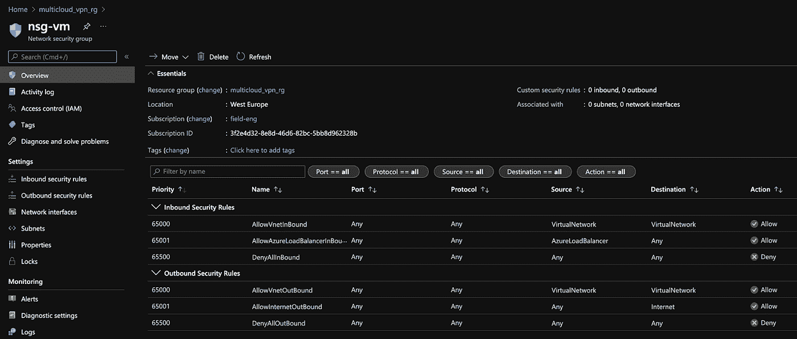

*我们已经完成了项目* [*#4*](#8dd6) *的创建，自定义 Azure 流量限制不在本指南的讨论范围内。*

# 公共知识产权

我们还需要创建两个公共 IP 地址，分别用于我们的 VPN 网关和我们将要创建的虚拟机。

**为虚拟机创建公共 IP 地址:**

```
$vmpip = New-AzPublicIpAddress `
-Name “vm-ip” `
-ResourceGroupName “multicloud_vpn_rg” `
-Location “West Europe” `
-AllocationMethod Dynamic
```

**为 NW 网关创建公共 IP 地址:**

```
$ngwpip = New-AzPublicIpAddress `
-Name “ngw-ip” `
-ResourceGroupName “multicloud_vpn_rg” `
-Location “West Europe” `
-AllocationMethod Dynamic
```

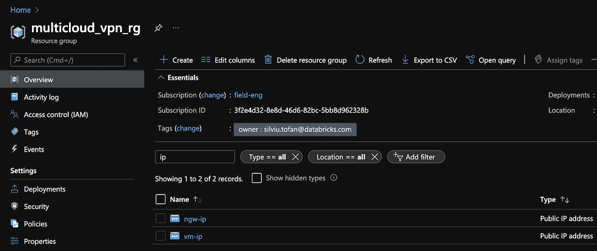

*本节我们已经完成了* [*#5*](#dda2) *项的创建。*

## 虚拟网络网关

接下来，我们部署我们的[虚拟网络网关](https://docs.microsoft.com/en-us/azure/vpn-gateway/vpn-gateway-about-vpngateways)，它将用于创建到我们的 Google 环境的 VPN 隧道。这将被部署到我们在开始时定义的“网关子网”中，它将利用“ngw-ip”公共 ip 地址。

```
$vnet = Get-AzureRmVirtualNetwork -Name mc_vnet -ResourceGroupName multicloud_vpn_rg$gatewaySubnetId = $vnet.Subnets[0].id$ngwpip = Get-AzPublicIpAddress -Name ngw-ip -ResourceGroupName multicloud_vpn_rg
```

**创建虚拟网关:**

```
$ngwipconfig = New-AzVirtualNetworkGatewayIpConfig `
  -Name "ngw-ipconfig" `
  -SubnetId $gatewaySubnetId `
  -PublicIpAddressId $ngwpip.Id
```

这可能需要相当长的时间:

```
$job = New-AzVirtualNetworkGateway -Name “vnet-gateway” `
-ResourceGroupName “multicloud_vpn_rg” `
-Location “West Europe” `
-IpConfigurations $ngwipconfig `
-GatewayType “Vpn” `
-VpnType “RouteBased” `
-GatewaySku “VpnGw1” `
-VpnGatewayGeneration “Generation1” `$vnetgw = Get-AzVirtualNetworkGateway `
  -Name "vnet-gateway" `
  -ResourceGroupName "multicloud_vpn_rg"
```

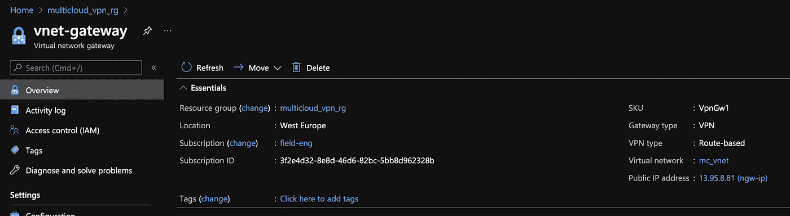

*本节我们已经完成了* [*#6*](#5c34) *项的创建。*

# 第 2 节:在您的 GCP 环境中设置数据块

如果您在 GCP 没有现有的 Databricks 工作区，请按照[文档](https://docs.gcp.databricks.com/getting-started/try-databricks-gcp.html#prerequisites)创建一个新的工作区。请确保[正确地确定了](https://docs.gcp.databricks.com/administration-guide/cloud-configurations/gcp/network-sizing.html)工作区网络的规模。

在本例中，我们将使用专用 GKE 集群部署，并使用以下子网:

*   GKE 节点的主 IP 范围:10.3.0.0/16
*   GKE 节点的辅助 IP 范围:10.4.0.0/16
*   GKE 服务的二级 IP 范围:10.5.0.0/20
*   GKE 主资源的 IP 范围:10.6.0.0/28

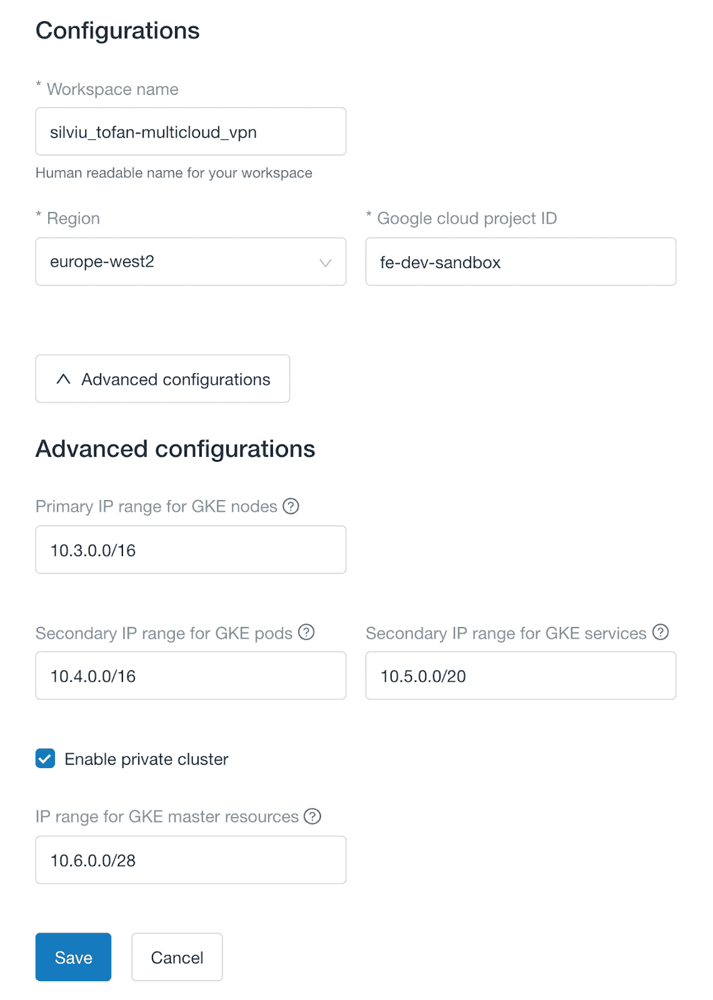

一旦您的工作空间被供应，做一个快速验证测试，启动一个小集群，并确保一切正常。

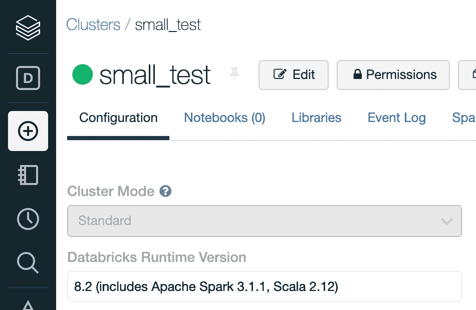

# 查找数据块管理的 VPC /网络

通过在管理控制台上查看您的工作区的 URL(工作区 ID)，并将其与部分 VPC ID 进行匹配，您可以为您的数据块工作区找到相应的数据块管理的 VPC。数据块管理的 VPC 遵循以下命名格式:*数据块-管理- <工作空间 id >。从那里，您还可以查看您的 Databricks 实例使用的所有子网。*

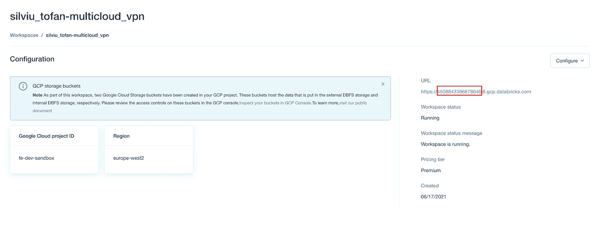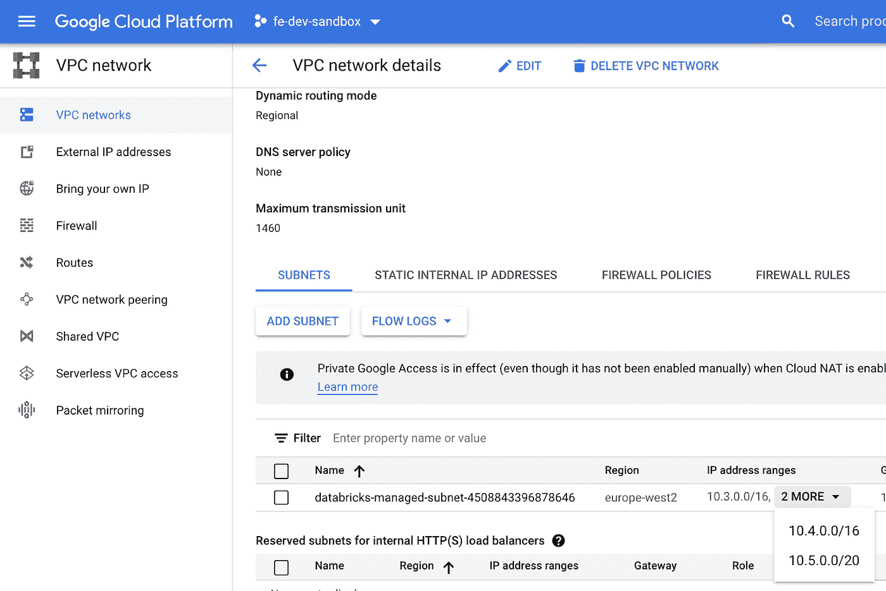

# 第 3 部分:安装程序需要 GCP 组件来确保到 Azure 的 VPN 连接

# 所需的 GCP 组件

1.  [外部 IP(用于虚拟网络网关)](#4dd7)
2.  [虚拟网络网关(及相关转发规则)](#9e2b)

# 外部 IP

我们首先在 GCP 环境中创建一个外部 IP，通过 VPN 网关将 Azure 资源组连接到 GCP。

```
gcloud compute addresses create “ext-gw-ip” \
 — region “europe-west2”
```

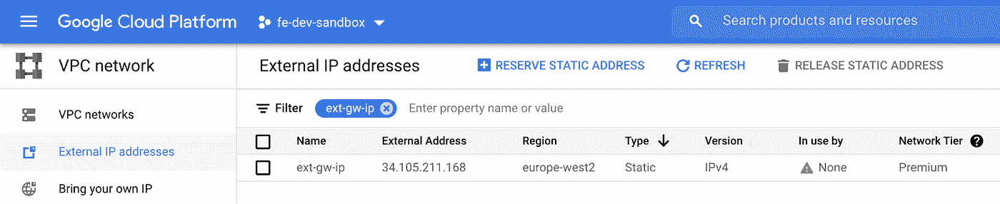

*本节我们已经完成了* [*#1*](#4dd7) *项的创建。*

# 虚拟网络网关

现在我们需要在两个网络(Azure 和 GCP)之间建立一个 VPN 连接。一个连接通常有两个出口。在我们的例子中，一个出口在 Azure 端(我们在那里创建了 Azure 虚拟网络网关)，第二个出口在 GCP 端(因为我们将在后续步骤中创建 VPN 网关)。

为了连接这两个网关，我们需要将 Azure 中的网关链接到 GCP 中的网关。每个网关都像其对应网络的入口一样，这就是为什么我们需要定义来自一个网关(分别为 Azure 虚拟网络网关/VPN 网关)的流量规则，通过第二个网关(分别为 VPN 网关/Azure 虚拟网络网关)到达目标网络(分别为 VPC/VNET)中的资源。

如果您需要提醒自己什么是托管网络，请回顾前面的部分。

**创建云 VPN:**

```
gcloud compute target-vpn-gateways create “vpn-gw” \
 — network “databricks-managed-4508843396878646” \
 — region “europe-west2” \
 — project “fe-dev-sandbox” 
```

仅仅有 VPN 网关是不够的。我们还需要考虑到连通性；流量规则是使用 GCP 端的转发规则定义的。每个转发规则引用一个 IP 地址和一个或多个 VPC 接受流量的端口。

**创建转发规则 ESP:**

```
gcloud compute forwarding-rules create "fr-gw-name-esp" \
 - ip-protocol ESP \
 - address "ext-gw-ip" \
 - target-vpn-gateway "vpn-gw" \
 - region "europe-west2" \
 - project "fe-dev-sandbox"
```

**正在创建转发规则 UDP500:**

```
gcloud compute forwarding-rules create "fr-gw-name-udp500" \
 - ip-protocol UDP \
 - ports 500 \
 - address "ext-gw-ip" \
 - target-vpn-gateway "vpn-gw" \
 - region "europe-west2" \
 - project "fe-dev-sandbox"
```

**创建转发规则 UDP4500:**

```
gcloud compute forwarding-rules create "fr-gw-name-udp4500" \
 - ip-protocol UDP \
 - ports 4500 \
 - address "ext-gw-ip" \
 - target-vpn-gateway "vpn-gw" \
 - region "europe-west2" \
 - project "fe-dev-sandbox"
```

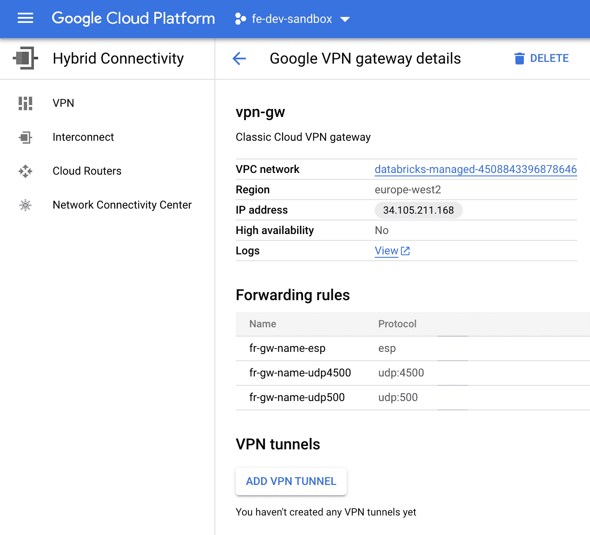

*我们已经完成了本节* [*#2*](#9e2b) *项的创建。*

# 第 4 部分:建立 VPN 连接

我们现在需要在两端设置 VPN 连接:

*   **VPN 连接的 Azure 端** —建立从 Azure 虚拟网络网关($vnetgw)到 Azure 本地网关(由于它链接到 GCP 端的外部 IP，因此其作用类似于远程 GCP 网关)的连接
*   **VPN 连接的 GCP 端—** 建立从 GCP VPN 网关($vpn-gw)到 Azure 端公共 IP 地址($azpubip)的连接

# 必需的步骤

1.  [[GCP]从 GCP VPN 隧道创建连接](#41eb)
2.  [【Azure】创建 Azure 本地网络网关](#b23a)
3.  [【Azure】创建 Azure 虚拟本地网络连接](#19b9)

# GCP VPN 隧道

首先，我们使用 Azure 虚拟网络网关的公共 IP 地址在我们的 GCP 环境(VPN 隧道)中创建一个连接。由于本例使用基于路由的 VPN，流量选择器值需要设置为 0.0.0.0/0。需要提供一个 [PSK(预共享密钥)](https://cloud.google.com/network-connectivity/docs/vpn/how-to/generating-pre-shared-key)，该密钥与我们在隧道的 Azure 端配置 VPN 连接时使用的密钥相同。

*如果您忘记了您的 Azure 公共 IP，您可以在您的 Azure 环境中运行以下命令:*

**获取 Azure 网关的对等公共 IP 地址:**

```
$azpubip = Get-AzPublicIpAddress `
-Name "ngw-ip" `
-ResourceGroupName "multicloud_vpn_rg"
```

当您准备好开始时，您可以生成您的 PSK，然后在您的 GCP 环境中创建 VPN 隧道:

```
openssl rand -base64 24
```

> 保存这个密钥。在这个过程的后面，您将需要它。

**创建 VPN 隧道:**

```
gcloud compute vpn-tunnels create "vpn-tunnel-to-azure" \
 - peer-address $azpubip.IpAddress \
 - local-traffic-selector "0.0.0.0/0" \
 - remote-traffic-selector "0.0.0.0/0" \
 - ike-version 2 \
 - shared-secret <<Pre-Shared Key>> \
 - target-vpn-gateway "vpn-gw" \
 - region "europe-west2" \
 - project "fe-dev-sandbox"
```

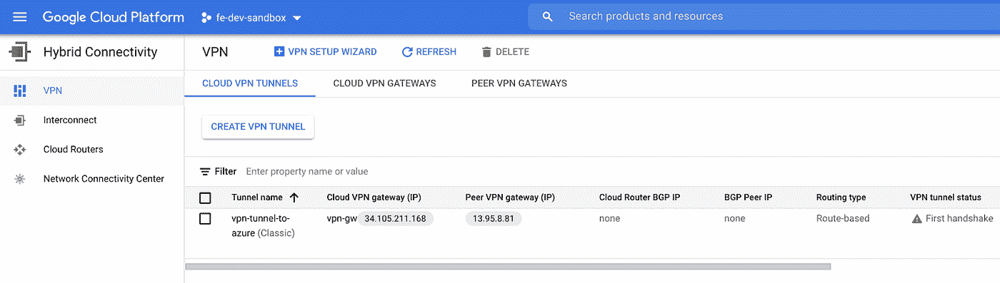

*本节我们已经完成了* [*#1*](#41eb) *项的创建。*

# Azure 本地网关

我们现在创建一个 Azure 本地网关，充当 GCP 的远程网关。为此，我们需要:

*   GCP 对外知识产权
*   您在设置 Databricks 工作区时输入的 GCP VPC IP 地址范围

请查看第 [2](#be4e) 部分，以检索有关您的数据管理 VPC 的信息。

```
$azlocalgw = New-AzLocalNetworkGateway `
-Name "local-gateway" `
-ResourceGroupName "multicloud_vpn_rg" `
-Location "West Europe" `
-GatewayIpAddress $gcp_ipaddr `
-AddressPrefix @("10.3.0.0/16","10.4.0.0/16","10.5.0.0/20")
```

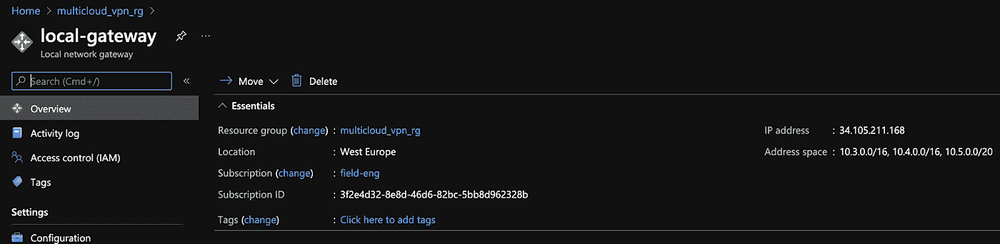

*本节我们已经完成了* [*#2*](#b23a) *项的创建。*

# Azure VPN 连接

接下来，我们通过将 Azure 虚拟网络网关与本地网络网关相关联，在我们的 Azure 环境中创建一个连接(VPN 连接)。需要提供一个 PSK(预共享密钥)，它与用于 GCP VPN 隧道的密钥**相同。**

```
$azvpnconn = New-AzVirtualNetworkGatewayConnection `
-Name "vpn-connection" `
-ResourceGroupName "multicloud_vpn_rg" `
-VirtualNetworkGateway1 $vnetgw `
-LocalNetworkGateway2 $azlocalgw `
-Location "West Europe" `
-ConnectionType IPsec `
-SharedKey << Pre-Shared Key >> `
-ConnectionProtocol "IKEv2"
```

几分钟后(大约 5 分钟)，您应该会看到 Azure 连接状态更改为“已连接”，以及 GCP VPN 隧道状态更改为“已建立”

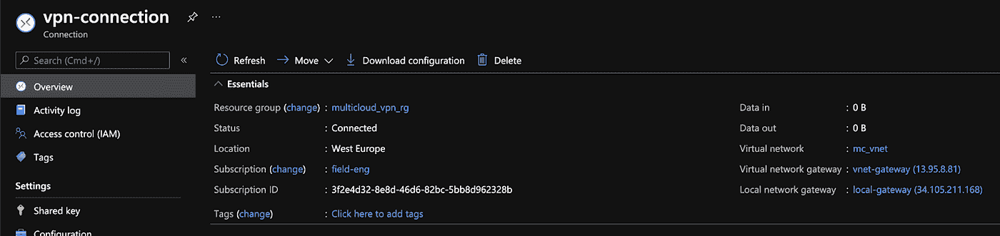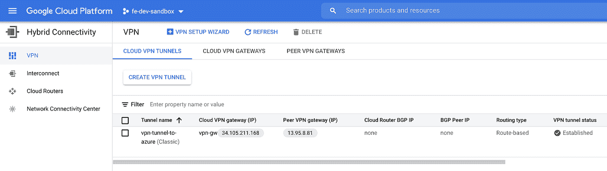

*本节我们已经完成了* [*#3*](#19b9) *项的创建。*

# 第 5 部分:调整数据块环境以利用 VPN 连接

您需要定制在部署 Databricks workspace 时自动创建的 Databricks 环境(主要是 Databricks 管理的 VPC ),以利用 VPN 连接。为此，您还需要您的 Databricks 管理的 VPC ID。

由于这是一个外部连接，我们需要通过定义流量应该如何流入我们的 GCP 网络(路由)，然后允许此流量进入我们的 GCP 网络(防火墙规则)来确保其安全。

*请注意，我们将仅在托管 Databricks 的 GCP 环境中处理有限的数据泄露规则。有关使用数据块设置防火墙的更多详细信息，请查阅专用文档。*

# 必需的步骤

1.  [【GCP】设置静态路由](#d23e)
2.  [【GCP】设置防火墙规则](#a283)

# 静态路由

既然我们在两端都有网络资源(Azure 中的 VNET，以及由 GCP 的 Databricks 创建和管理的 VPC)，我们需要通过为 Azure 网络的传出流量设置[路由](https://cloud.google.com/vpc/docs/routes)来在 GCP 端路由流量。

```
gcloud compute routes create "route-to-azure" \
 - destination-range "10.1.0.0/16" \
 - next-hop-vpn-tunnel "vpn-tunnel-to-azure" \
 - network "databricks-managed-4508843396878646" \
 - next-hop-vpn-tunnel-region "europe-west2" \
 - project "fe-dev-sandbox"
```

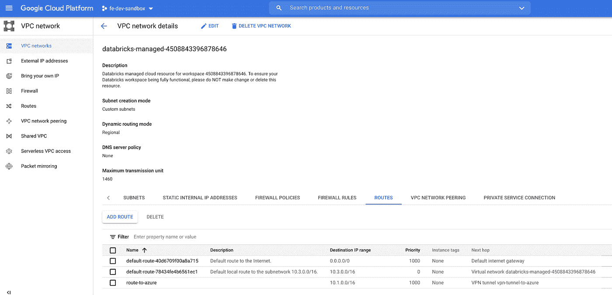

*本节我们已经完成了* [*#1*](#d23e) *项的创建。*

# 防火墙规则

为了加强安全性，现在我们已经定义了流量(GCP → Azure)的路由(即方向)，我们还需要指定[防火墙规则](https://cloud.google.com/vpc/docs/firewalls)以允许该流量流出 Databricks 管理的 VPC(即允许 VPN 流量)。

```
gcloud compute firewall-rules create "vpn-rule1" \
 - network "databricks-managed-4508843396878646" \
 - allow tcp,udp,icmp \
 - source-ranges "10.1.0.0/16"​​
```

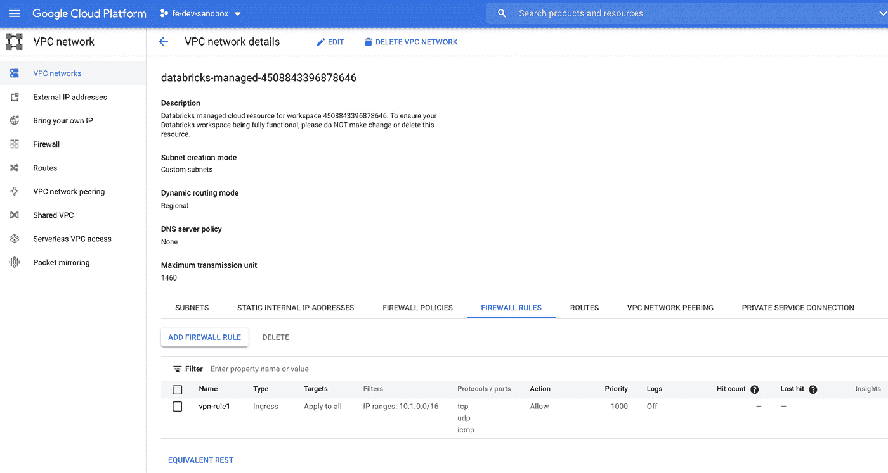

*本节我们已经完成了* [*#2*](#a283) *项的创建。*

# 第 6 部分:测试 GCP 的数据块和 Azure VM 之间的连通性

在本节中，我们通过 Azure 控制台快速创建了一个 VM，设置如下。我们验证了我们可以使用我的本地计算机 RDP 到机器中。

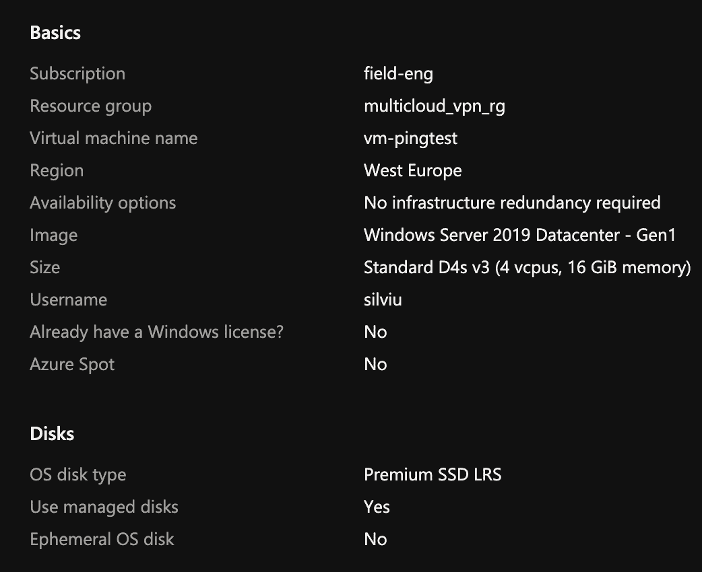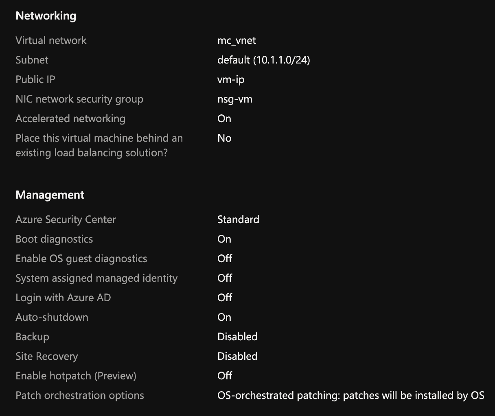

一旦我们远程连接到 Azure VM，我们就可以启动一个命令提示符并 ping 互联网，以确保它正常工作。

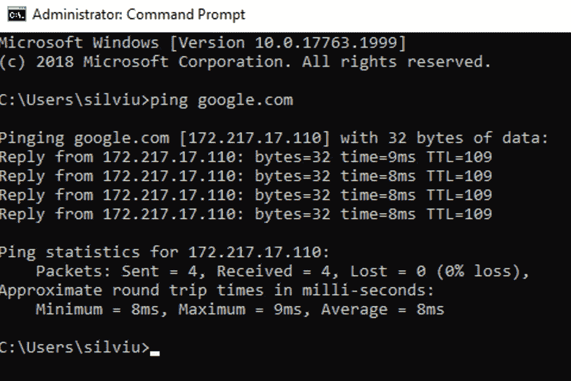

我们现在在 GCP 的数据块中建立了一个集群。我们从 Databricks 内部向 Azure VMs 私有 IP 地址发出 ping 命令。

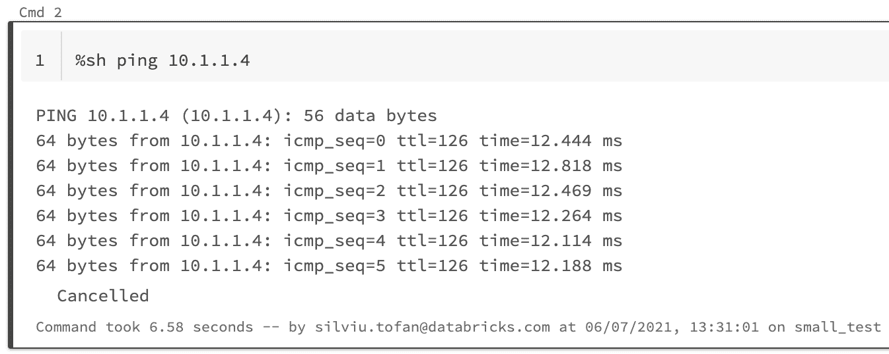

# 第 7 部分[可选]:设置专用 DNS 区域，以便能够使用主机名连接到 Azure 服务

如果我们想要使用私有 DNS，以便通过自定义名称而不是直接 IP 地址来调用其中的一些服务，我们可以在项目级别创建一个云 DNS 区域，并将其应用到我们的托管 Databricks 网络。

```
gcloud beta dns - project=fe-dev-sandbox managed-zones create dns-azurevm \
 - description="Translation of hostname to Azure VM private IP in multicloud setup" \
 - dns-name="azurevm.databricks.com." \
 - visibility="private" \
 - networks="databricks-managed-4508843396878646"
```

然后，我们可以为该区域定义记录集。在下面的例子中，我们将 vm1.azurevm.databricks.com 定义为我们的 Azure VM 10.1.1.4 的私有 IP 的名称。

```
gcloud dns - project=fe-dev-sandbox \
record-sets transaction start - zone=dns-azurevmgcloud dns - project=fe-dev-sandbox \
record-sets transaction add "10.1.1.4" \
 - name=vm1.azurevm.databricks.com. \
 - ttl=300 \
 - type=A \
 - zone=dns-azurevmgcloud dns - project=fe-dev-sandbox \
record-sets transaction execute \
 - zone=dns-azurevm
```

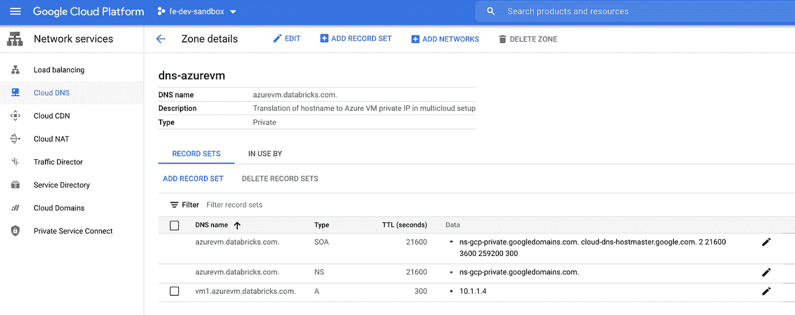

一旦我们完成了上面的步骤，我们就可以返回到 GCP 的 Databricks，发出 ping 命令，这次使用新定义的虚拟机名称。

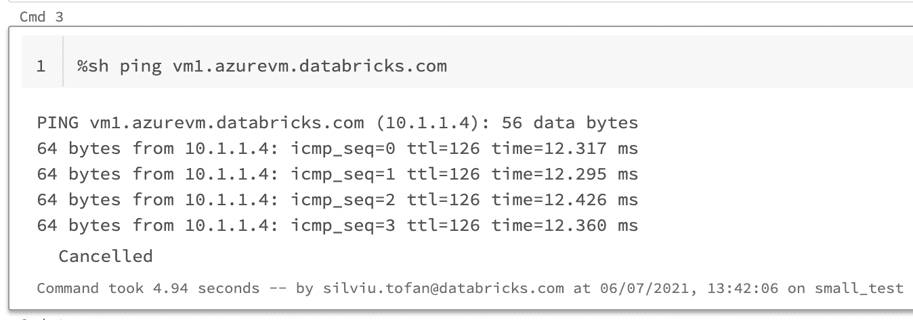

# 结尾部分

我们已经成功地在 GCP 和 Azure 之间建立了多云 VPN 连接，并且能够使用私有流量将来自 GCP 的数据块的请求发送到我们 Azure 环境中的虚拟机。我们还建立了一个 DNS 区域，以方便我们在 GCP 环境的数据库中进行这项工作。

如果您想了解更多关于 [Databricks](https://databricks.com/company/contact) 或 [Google Cloud](https://cloud.google.com/contact) 的信息，请通过链接的联系页面联系。

> ***本文仅代表作者个人观点，不代表谷歌或 Databricks*** 的观点

如果你喜欢这篇文章，请为它鼓掌。更多 google 云端数据科学、数据工程、AI/ML 关注我[***LinkedIn***](https://www.linkedin.com/in/lukasz-olejniczak-1a75a613/)***。***

*非常感谢来自 Databricks 的* ***席尔武托凡*** *和* ***马尔瓦·克鲁玛*** *和* ***克里斯蒂娜·弗洛里亚*** *和* ***彼得·格里夫*** *来自谷歌云* *为本文和 Databricks 提供支持*