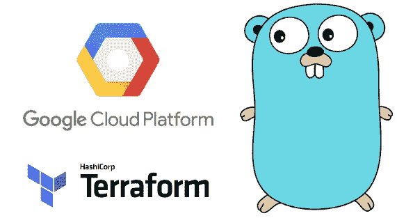
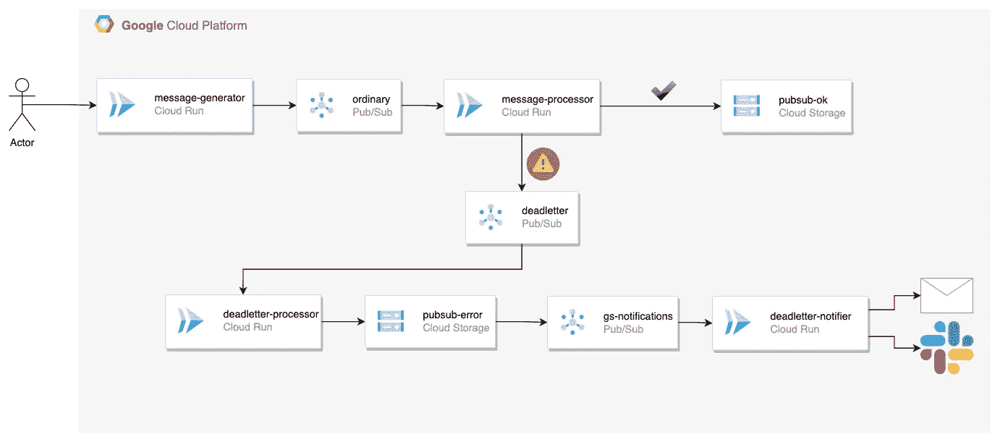
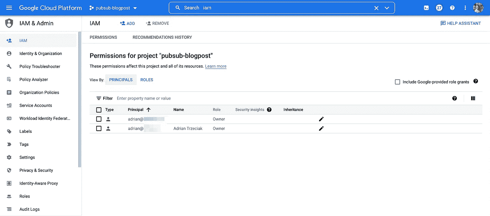

# 使用 Go 和 Terraform 设置安全发布/订阅流

> 原文：<https://medium.com/google-cloud/setting-up-secure-pub-sub-flow-with-go-and-terraform-6b779026a3e1?source=collection_archive---------1----------------------->

本文涵盖了处理错误和通知的完全托管的消息处理管道。代码库实现了最小特权原则，把重试和死锁逻辑留给了 GCP。

假设我有一个用例，我的零售公司希望接收更新产品信息的事件。在这种情况下，我将设置一个 API 端点，将其公开给信息提供者，以确保身份验证和授权。对于每次更新，我都希望将这些信息处理到我公司的数据库中。如果出现故障，我会将每条消息保存到数据库中，以便通过适当的渠道通知我们的开发团队进行调试。

可以使用云运行(API 层和消息处理)、处理消息流的发布/订阅(确保调用定义的云运行实例)和充当数据库的云存储的组合来解决上述场景。要发送通知，我们将使用 Mailgun。Mailgun API 密钥将存储在 Google Secret Manager 中，只能由通知 API 的服务帐户访问。

流程图

让我们简单地浏览一下流程:

*   ***消息生成器*** 接收 HTTP 请求生成 10 条消息。那些消息都是发布到 ***普通*** Pub/Sub 主题
*   在这 10 条消息中，有一条被硬编码为失败，在 ***消息处理器*** api 中返回 406 状态代码。剩余的消息将存储在 ***pubsub-ok*** 桶中。
*   **失败**的消息在发布到 ***死信*** 主题之前，会进行五次指数退避处理
*   ***deadletter-GS-saver***订阅的处理器将消息存储在 ***pubsub-error*** 桶中。通过在错误桶内创建一个文件，另一个消息将被 GCS 触发并发布到 ***通知*** 主题。
*   GCS 触发的消息将由 ***通知*** 服务处理，并发送带有文件链接的电子邮件。

解决方案的所有部分都以确保职责分离和最小特权原则的方式编码。发布者的服务帐户仅具有允许应用程序将消息发布到一个特定主题的权限。处理器有权将文件写入各自的存储桶。当查看 Google Cloud Console 中的 IAM 页面时，您不会看到分配给任何服务帐户的任何项目范围的权限，因为每个必要的权限都应用在资源级别，这极大地限制了攻击面:

# 好玩！关于解决方案的部分

该解决方案实现了 Google 推荐的几个巧妙的技巧:

*   每个云运行实例使用单独的服务帐户运行，该帐户被分配了资源级别(主题、订阅、存储桶)的最小权限集。例如，普通处理器的服务帐户没有 IAM 角色来写入 **pubsub-error** bucket，反之亦然。
*   处理处理和通知的云运行实例仅限于内部入口。
*   云运行通知程序实例正在从 Secret Manager 获取 Mailgun 令牌，并自动将其作为环境变量注入。
*   通过利用 docker 文件中的多阶段构建，我们的映像大小只有大约 12Mb，因此云运行几乎不需要时间。

# **自己部署！**

随意克隆[这个](https://github.com/adriantr/pubsub-push-flow) repo，使用 docker-compose 构建映像，将它们推送到 GCR，并在运行 Terraform 命令时通过提供必要的变量来应用 Terraform 配置。

有兴趣了解更多关于我们 Strise.ai 如何从谷歌云平台中获得乐趣以及我们的环境看起来如何？停下来喝杯咖啡或者在 LinkedIn 上联系我们！

是的——我们正在[招聘](https://www.strise.ai/about-us/careers)。