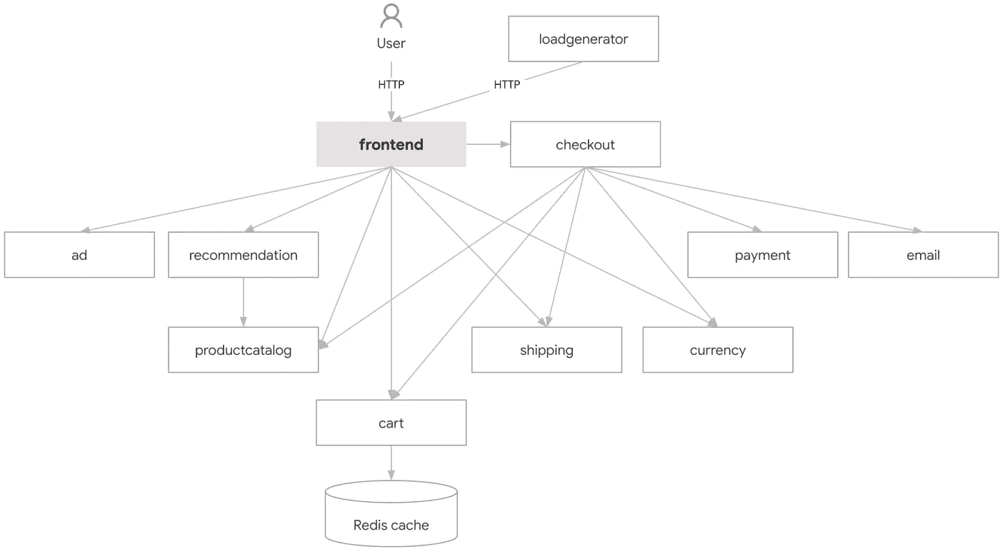
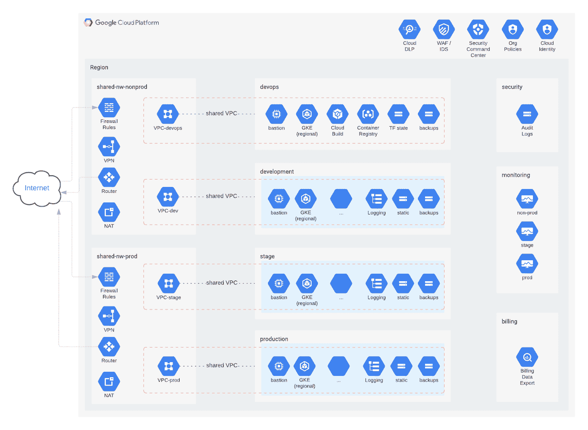

# 通过 Terraform 建立您的 GCP 基金会—第 1 章—简介和第一步

> 原文：<https://medium.com/google-cloud/setting-up-your-gcp-foundations-through-terraform-chapter-1-introduction-first-steps-33bd11e949e5?source=collection_archive---------0----------------------->

# 简介:

当我在大学时，我被介绍参加了[棉花糖挑战](https://www.commonsense.org/education/lesson-plans/the-marshmallow-challenge#:~:text=The%20CHALLENGE%3A,to%20hold%20it%20in%20place.)——挑战是在 18 分钟内用不超过 20 根意大利面条、一码胶带、一码绳子和一个棉花糖建造最高的独立结构。棉花糖必须放在上面，不能变形来固定它。—通常，只有大约 50%的团队在这项挑战中获得成功。

这个练习的关键发现是:原型制作很重要——孩子们比大学生做得更好的原因是他们花更多的时间玩耍和制作原型。他们很自然地从棉花糖开始，然后粘在棍子上。大学生花了大量的时间计划，然后执行计划，一旦他们把棉花糖放在上面，几乎没有时间来修改设计。

这与我们今天构建软件的方式非常相似——一家公司有一个想法，他们专注于构建该想法的工作原型。从那里，他们继续在原型上扩展，同时积累技术债务，这最终降低了系统的可靠性，减缓了开发和功能速度。

挑战在于您优先考虑什么——交付功能或确保它是根据行业最佳实践构建的，使用 IaC CI/CD 等。—对于刚开始的公司/产品团队来说，这并不是一个真正的决定——你需要尽快交付价值——所以交付特性总是会赢。

本系列的目标是帮助指导您如何通过 Terraform 和 CI/CD 最佳实践建立贵公司的 GCP 基金会，此外，我们还将遵循 GCP 最佳实践和 [GCP 架构框架](https://cloud.google.com/architecture/framework)构建一个开源示例 GCP 基金会/登陆区。

希望这将使您能够专注于为您的客户提供价值，同时随着产品的扩展尽可能减少您的技术债务。

为了设定期望，也为了让自己负责，我设定了一个目标，每周一次在欧洲中部时间周三中午 12:00 发布系列的新篇章

# 场景:

*   我们想要推出的产品是 [GCP 微服务演示](https://github.com/GoogleCloudPlatform/microservices-demo)——这是一个在线精品店的演示，旨在运行在 Kubernetes 上。

*   为了支持该产品，我们将按照 [DoiT GCP 安全参考架构](https://github.com/doitintl/secure-gcp-reference)(归功于 Mike Sparr)建立登陆区

# 第一步:

这个过程有两个主要部分。首先，在 cloud identity 中创建您的第一个超级管理员帐户，如果您拥有所有必需的凭据和访问权限，此过程应该不会超过 30-60 分钟；其次，验证您的域，根据 Google 文档，这可能需要几个小时—这将设置您的组织节点。

***在 GCP 需要注意的一些重要事情:***

*   对于云身份，您有免费层和高级层。对于大多数客户来说，从免费层开始，然后根据需要扩展到高级层就足够了，无论是否需要更多用户或更多功能。请注意，云身份的免费层可以通过申请表从 50 名用户扩大到 50 名用户，这取决于谷歌的批准。
*   超级管理员和组织管理员是两种不同的角色。
*   超级管理员管理您的云身份环境，包括设置管理员、添加和删除用户以及添加和删除云身份服务。
*   组织管理员—管理您的 GCP 环境中的访问权限。重要的是要了解，在您的 GCP 环境中，它们不是“上帝模式”权限，它们允许管理员为用户创建和分配角色，例如，如果组织管理员没有为自己提供计费管理员角色，他们就看不到计费数据。

***工作检查表:***

*   如果你还没有域名——买一个——有很多方法可以通过像 [GoDaddy](https://www.godaddy.com/) 、 [Google domains](https://domains.google/) 等注册商来注册。
*   如果您的公司已经有域，请确保您拥有管理员凭据，这是设置您的 GCP 组织和云身份环境所必需的，这是 IAM(身份和访问管理控制)的身份部分
*   阅读[超级管理员帐户最佳实践](https://cloud.google.com/docs/enterprise/setup-checklist#checklist-section-1)(3-5 分钟阅读)
*   按照 [Google Cloud 设置清单](https://cloud.google.com/docs/enterprise/setup-checklist#checklist-section-1)第 1 部分中记录的步骤，设置您的 GCP 组织和第一个超级管理员用户以及恢复电子邮件地址。
*   请注意第 1 章文档末尾的故障排除步骤，通常情况下，客户会尝试验证他们的域，但收到错误消息，因为组织内部的某个人已经验证了该域。

# 下周发布:

*   建立我们的第一个用户组并给他们分配角色。
*   设置 Github 环境以支持协作，并为 CI/CD 渠道奠定基础。

# 资源:

*   [棉花糖挑战——常识教育](https://www.commonsense.org/education/lesson-plans/the-marshmallow-challenge#:~:text=The%20CHALLENGE%3A,to%20hold%20it%20in%20place.)
*   [GCP 微服务演示](https://github.com/GoogleCloudPlatform/microservices-demo)
*   [DoiT GCP 安全参考架构](https://github.com/doitintl/secure-gcp-reference)
*   [谷歌云设置清单](https://cloud.google.com/docs/enterprise/setup-checklist)
*   [GCP 企业组织最佳实践](https://cloud.google.com/docs/enterprise/best-practices-for-enterprise-organizations)
*   [GCP 架构框架](https://cloud.google.com/architecture/framework)