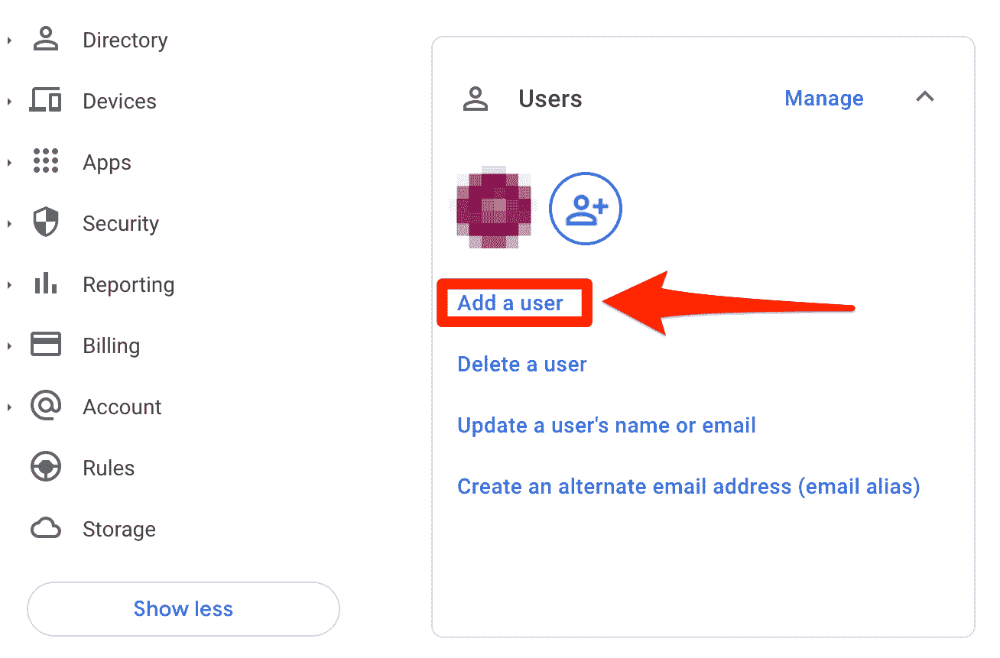
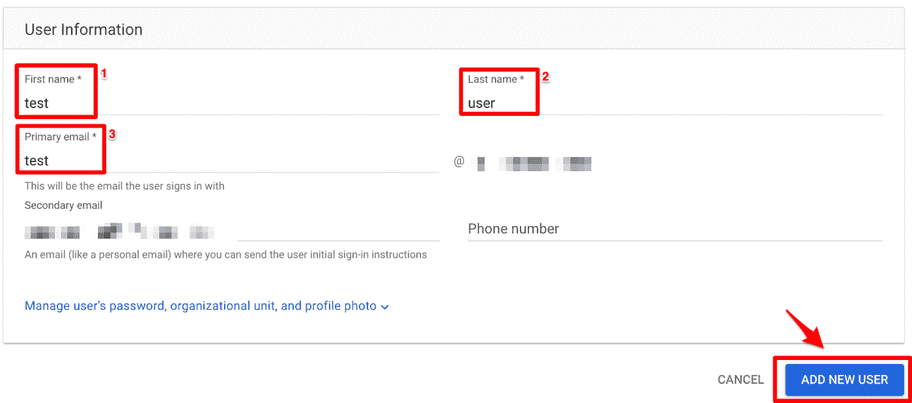
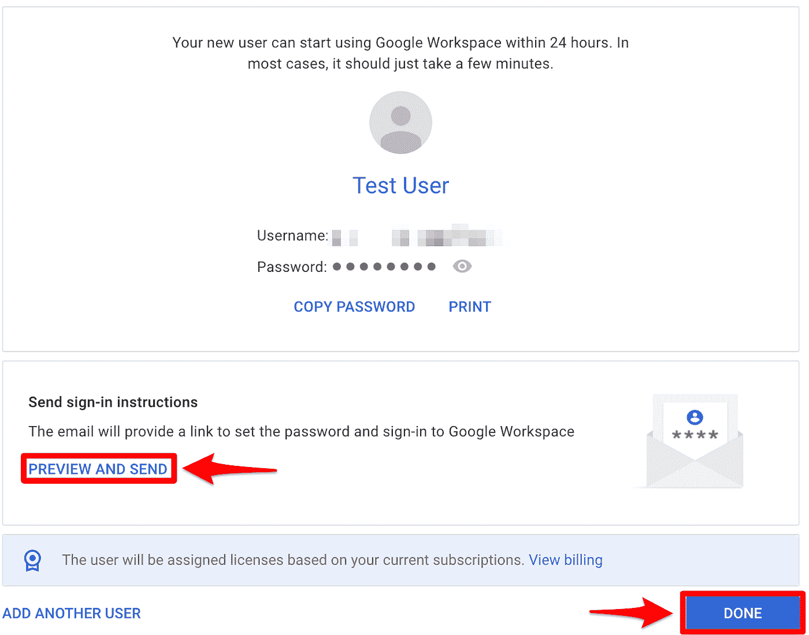
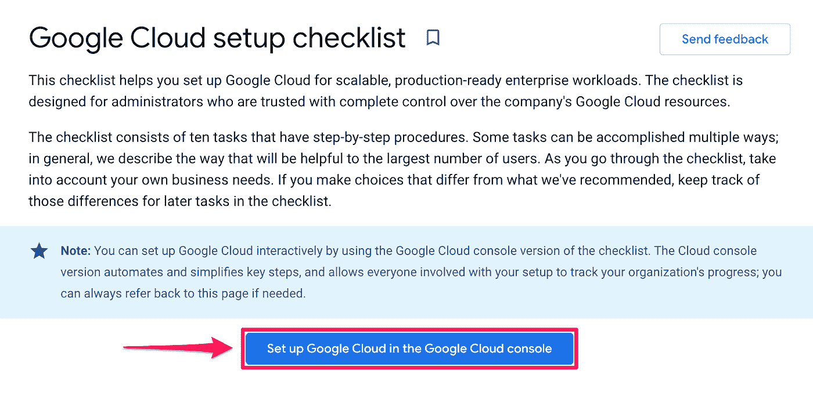

# 通过 Terraform 建立您的 GCP 基金会——第 2 章——访问 GCP、设置计费和准备 Github

> 原文：<https://medium.com/google-cloud/setting-up-your-gcp-foundations-through-terraform-chapter-2-access-to-gcp-setting-up-billing-83203b28131b?source=collection_archive---------0----------------------->

***序言:***

在本章中，我们将继续为访问 GCP 做准备，并为我们的基础设施和应用程序代码构建我们的 Github repo。对我来说不幸的是，决定将这个系列命名为“通过 Terraform 建立你的 GCP 基金会”的家伙，[建立你的 GCP 基金会](https://cloud.google.com/docs/enterprise/setup-checklist)的前 4 个步骤通过管理控制台& GCP 控制台 GUI 更容易完成。

在下一章中，我们将开始使用 GCP Terraform 模块来构建第一个关键部分——我们的引导项目，这是我们将使用的第一个模块的[链接。](https://github.com/terraform-google-modules/terraform-google-bootstrap)

如果你有时间，我也强烈推荐阅读 Yevgeniy Brikman 的书[Terraform Up&Running](https://www.terraformupandrunning.com/)——这是为未来的工作建立基础 terra form 知识的好方法。

如果你以前没有用过 GitHub，我建议你仔细阅读它，或者在 Youtube、ACloudGuru 和其他你可能接触到的学习平台上进行培训。

# 让我们开始工作:

***用户:***

为了简单起见，我将从展示如何添加一个用户开始:

1.  使用您的超级用户帐户登录**admin.google.com**
2.  在**用户**部分下点击**“添加用户”**

3.填写**【名字】****【姓氏】****【主邮箱】** - >点击**【添加新用户】**

4.点击**“预览并发送”** —向新用户发送登录凭证。

5.点击**【完成】**

我建议创建两个独立的用户，一个用于 org-admin，另一个用于用户将在环境中执行的所有操作。遵循与云身份中的超级管理员角色相同的原则，我们希望限制、监控和审计组织管理员角色和权限的使用，因此进行了分离。

对于只有 1-10 名团队成员的小型公司，或者如果我们想要建立一个试点/POC 环境，一对一地添加用户是一个很好的选择。但是这不是一个可维护的选项，对于现有的大中型公司来说也是如此。在第 2 章的“其他资源”部分，有关于一次添加多个用户和组或设置一个包含 Active Directory、Okta 和其他第三方身份提供商的[身份联盟的说明。如果这是一个与您相关的场景，并且您希望看到这个过程的演示，请在文章底部留下评论。](https://cloud.google.com/architecture/identity/reference-architectures#using_an_external_idp)

在我们建立小组之前，我想分享一下为什么我们需要建立小组以及 GCP 在这方面的最佳实践。

1.  创建/导入/联合您的现有用户
2.  如果您有现有的组，则导入/联合它们，如果没有，则相应地创建新的组。
3.  将用户添加到相关组。
4.  将组添加到他们需要权限的组织/文件夹/项目/资源中。
5.  将相关角色分配给该组。

这将允许您通过简单地在组中添加或删除用户来轻松地提供和撤销用户的访问权限。即使公司里只有几个人，也总是建议将权限分配给一个组，而不是单个用户。如果不是将角色分配给组，而是将角色分配给单个用户，就很难大规模地了解谁可以访问什么，以及他们可以对这些资源做什么。—要深入了解这个主题，请阅读— [资源层级访问控制](https://cloud.google.com/iam/docs/resource-hierarchy-access-control)。

**T5 组&管理员权限:**

1.  从 [GCP 设置清单](https://cloud.google.com/docs/enterprise/setup-checklist)中点击**“在谷歌云控制台中设置谷歌云”**

2.第一次登录控制台时，如果您还没有组织节点，设置它可能需要几分钟时间，请等待 GCP 发来的电子邮件，说明组织已经设置好，然后再继续。

3.点击**“继续用户&群组”**

4.点击**“继续用户&组”**

5.选择您想要创建的群组，我个人建议点击**“创建所有群组”**->-**“继续”。**系统会提示您自定义您的群组名称。一个好的命名约定如下:*公司名称云环境区别功能权限级别*

其中:

*   *company_name* —是公司的名称，如果您旗下只有一家公司，这很简单，但如果您旗下有多家公司，这将是一个有用的区分因素。
*   *云环境* —是云环境的名称，例如 GCP/AWS/Azure
*   *distinct _ function*—是组中用户的功能，例如组织管理、计费、安全
*   permissions_level —是授予组的一般权限级别，例如管理员、编辑者、查看者等。

6.让我们继续更新组名，然后单击**“保存&创建”** - > **“继续”**

7.系统将提示您返回管理控制台并设置您的管理用户。由于我们在之前的步骤中已经完成了，您可以继续并点击**“继续”**

在这个屏幕中，我们可以将我们创建的用户添加到相关的组中。让我们将我们的第一个组织管理员添加到我们的 gcp 组织管理员组中。

8.在我们要管理的组旁边，单击**“添加成员”**。

9.输入用户的电子邮件地址->选择他们在该群上的权限级别(成员/管理员/所有者)->点击**“保存”**

*****随着我们的发展，我们将通过 terraform 或通过云 GUI 向其他组添加额外的用户，尝试尽可能多地通过 Terraform*** *。*

10.将成员添加到群组后，点击**“确认用户和群组”**

11.系统将通知您已完成“用户和组”任务。点击**“继续管理访问”`**

***给我们的组授予权限:***

在开始您的 GCP 之旅时，了解您可以使用的 IAM 角色之间的差异非常重要。我强烈推荐阅读 GCP IAM 关于[了解角色](https://cloud.google.com/iam/docs/understanding-roles)的页面。

TL；dr:有三种类型的角色:基本、预定义和自定义。当你开始与 GCP 的旅程时，你应该从使用预先定义的角色开始。基本角色的范围非常广泛，是一个巨大的安全风险。自定义角色可以非常精细，但就像俗话说的“权力越大，责任越大”——如果您创建了自定义角色，您就有责任维护它们，这可能会很快变得非常复杂。

如果你在一个高度监管的行业，你必须有非常细粒度的控制，我会从一个预定义的角色开始，让团队开始工作，然后根据他们的需求将其转变为一个自定义角色，并开始剥夺权限。您还可以使用[角色推荐服务](https://cloud.google.com/policy-intelligence/docs/role-recommendations-overview)，它可以根据用户的动作和使用情况来帮助推荐删除哪些权限。它将总是建议删除权限，从不建议添加权限。

1.  按照**“管理访问”**页面上的说明提供对组织管理员和计费管理员组的访问权限，这将是我们以超级管理员身份登录时执行的最后一步。接下来，我们将注销并再次登录，这次是作为组织管理员。

**** *重要提示——Chrome 有时会在用户之间断开连接和切换上下文时出现问题——我的建议是在 Chrome 配置文件之间切换，或者在用户之间切换时以匿名模式(单独的窗口，而不是单独的标签)工作。***

***Github:***

你一定在对自己说“等等！为什么我们现在不设置计费？”。简单的回答是——如果你是 GCP 的新用户，你可能有资格享受一个 90 天 300 美元的免费试用程序。所以我想尽可能推迟激活此服务。让我们为开发设置 Github 环境，然后，一旦我们准备好开始构建，我们将打开计费。

关于回购的设计决策:

1.  “外面有那么多工具，我们为什么要用 Github？”。简单的回答是，它是免费的，有很好的基础工具来支持 CI/CD，并且与 GCP 的工具集成得很好。就像我说的，还有其他很棒的工具，比如 [Gitlab](https://about.gitlab.com/) 、 [BitBucket](https://bitbucket.org/product) ，以及其他你可能已经拥有的工具。对于本系列的要点，我现在不打算讨论它们之间的区别；-).我将阐述的原则是相同的，如何实现它们以及使用什么工具取决于你。
2.  对于这个项目，我将把它设置为一个单一回购协议，带有[短期特性分支](https://trunkbaseddevelopment.com/short-lived-feature-branches/)，在同一个回购协议中包含基础设施和应用程序代码。像 Dev/Git Ops 世界中的许多事情一样，这可能会成为一个宗教讨论，参见这篇[关于 Monorepo vs Multirepo 的文章](https://kinsta.com/blog/monorepo-vs-multi-repo/#:~:text=The%20monorepo%20approach%20entails%20storing,code%20hosted%20in%20independent%20repositories.)。我认为构建单一回购的决定背后的主要好处是减少了我的运营开销。根据公司的规模，在管理数十到数千个回购时，设置代码测试、安全性和其他回购运营措施可能会变得很麻烦。我更喜欢设置一次，然后在整个环境中维护配置。

清单:

1.  [注册 Github](https://github.com/signup)
2.  创建您的仓库。在这里，您可以选择公共或私有，因为这是针对您的云环境的，我会将其设置为私有存储库。
3.  设置 [Visual Studio 代码](https://code.visualstudio.com/)或者你更喜欢使用的 IDE。
4.  安装[地形](https://www.terraform.io/downloads)。
5.  在 VS 代码中克隆你的回购协议。
6.  创建您的 README.md 文件，有关应该在 README.md 中写入什么的更多信息，请参见此[链接](https://docs.github.com/en/repositories/managing-your-repositorys-settings-and-features/customizing-your-repository/about-readmes)。
7.  建立一个 [codeowners 文件](https://docs.github.com/en/repositories/managing-your-repositorys-settings-and-features/customizing-your-repository/about-code-owners)——这将有助于控制谁可以对你的云基础设施做什么。与大多数权限一样，最佳实践是创建一个所有者组/团队，并将该组分配为代码所有者。
8.  根据需要设置[保护分支](https://docs.github.com/en/repositories/configuring-branches-and-merges-in-your-repository/defining-the-mergeability-of-pull-requests/about-protected-branches)。
9.  完成[为健康贡献建立您的项目](https://docs.github.com/en/communities/setting-up-your-project-for-healthy-contributions) —即使这是一个内部项目而不是开源项目，以书面形式定义健康工作贡献程序将有助于我从[问题和拉请求模板](https://docs.github.com/en/communities/using-templates-to-encourage-useful-issues-and-pull-requests/about-issue-and-pull-request-templates)开始。对于问题模板:我会从为 bug、增强(也就是特性请求)和杂务创建模板开始
10.  创建一个[拉式请求模板](https://docs.github.com/en/communities/using-templates-to-encourage-useful-issues-and-pull-requests/creating-a-pull-request-template-for-your-repository)。
11.  进行你的第一次公关

***设置计费:***

现在，用户被分配到他们的相关组，Github 也准备好了，让我们设置我们的计费管理权限。

1.  遵循 GCP 设置清单第 4 章[中的步骤。](https://console.cloud.google.com/cloud-setup/billing)
2.  您将需要决定是否要设置自助或发票结算，并相应地定义您的帐户。如果您已经是 DoiT International 的客户，您可以联系您的 DoiT 联系人，向他们索要您的账单 ID。
3.  [定义预算，以便在支出达到特定阈值时发出警报](https://cloud.google.com/billing/docs/how-to/budgets)。在本节中，它还将建议设置 BQ 的计费导出，我们将在本系列的稍后部分通过 Terraform 执行此操作。—现在没必要这么做。
4.  我强烈建议通读[计费和管理的最佳实践](https://cloud.google.com/docs/enterprise/best-practices-for-enterprise-organizations#billing_and_management)，并且/或者将此任务分配给贵公司的相关人员。

# 总结:

今天，我们已经完成了通过 Terraform 开发 GCP 着陆区的基础工作。我们已经创建了用户和组，将这些用户分配到组中，并在组织级别授予这些组权限。我们还准备了 Github 开发环境，并为我们的项目建立了账单。

本章到此结束，如果你已经读到这里并且喜欢这个系列，请在文章底部留下掌声和/或在 [Medium](/@goodmanjoel2017) 、 [Linkedin](https://www.linkedin.com/in/thejoelgoodman/) 或 [Twitter](https://twitter.com/JoelGoo86772117) 上关注我，我将在那里分享更多更新和资源！

# 下周发布:

1.  通过 Terraform 部署我们的[引导项目](https://github.com/terraform-google-modules/terraform-google-bootstrap) & CI/CD 管道

# 资源:

*   [谷歌云设置清单](https://cloud.google.com/docs/enterprise/setup-checklist)
*   [GCP 企业组织最佳实践](https://cloud.google.com/docs/enterprise/best-practices-for-enterprise-organizations)
*   [GCP 架构框架](https://cloud.google.com/architecture/framework)
*   [GCP 地形引导模块](https://github.com/terraform-google-modules/terraform-google-bootstrap)
*   [将外部 IDP 联合到云身份](https://cloud.google.com/architecture/identity/reference-architectures#using_an_external_idp)
*   [资源层级访问控制](https://cloud.google.com/iam/docs/resource-hierarchy-access-control)
*   [角色推荐服务](https://cloud.google.com/policy-intelligence/docs/role-recommendations-overview)
*   [90 天 300 美元免费试用计划](https://cloud.google.com/free/docs/gcp-free-tier/#free-trial)