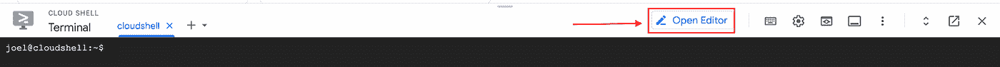
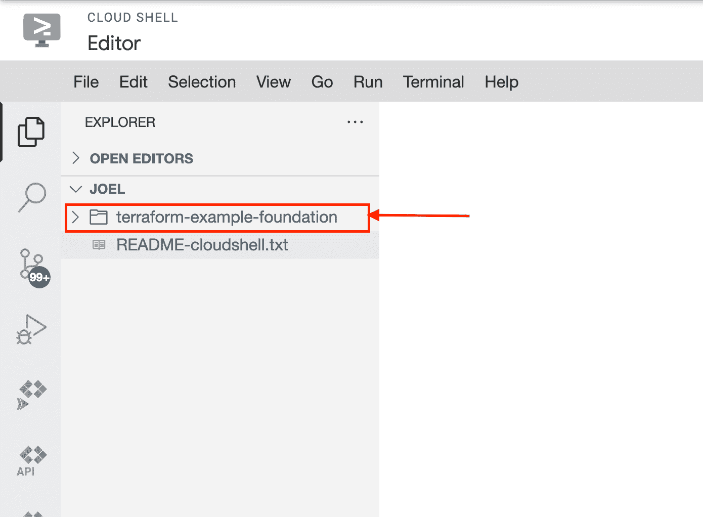
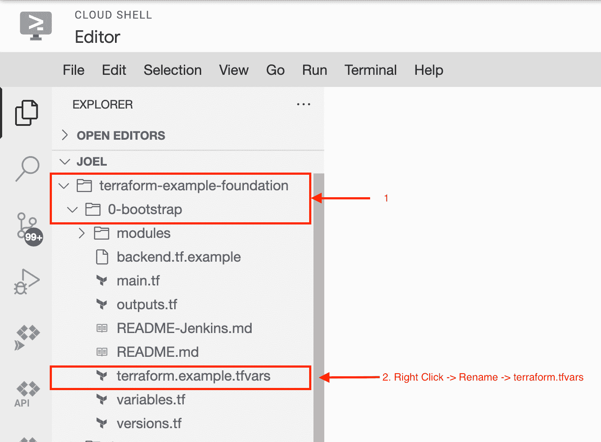

# 通过 Terraform 建立您的 GCP 基础—第 3 章—部署 bootstrap 和 CI/CD 项目

> 原文：<https://medium.com/google-cloud/setting-up-your-gcp-foundations-through-terraform-chapter-3-deploying-the-bootstrap-and-ci-cd-db8db9d3e61a?source=collection_archive---------2----------------------->

# 简介:

在本章中，我们将通过 Terraform 部署 [seed 和 CI/CD 项目](https://github.com/terraform-google-modules/terraform-example-foundation)。这两个项目是基础，允许我们在云中维护 terraform 状态，并开始在 GitOps 模型中工作，以通过 Terraform 部署我们环境的其余部分。

最后，在浏览了 GCP 模块的实现之后，我将讨论一些我认为我们需要实现的改进，这些将是本系列下一篇文章的主题。

如果你喜欢这个系列，并且很高兴继续一起学习和建设，请确保关注和/或订阅[媒体](/@goodmanjoel2017)、[LinkedIn](https://www.linkedin.com/in/thejoelgoodman/)&[Twitter](https://twitter.com/JoelGoo86772117)。

如果您对我们如何使该系列更好有任何问题、意见或建议，请在文章底部留下您的评论——我非常期待您的回复！

# 让我们开始工作:

*这一部分是 Github 页面上的指导，并有一些额外的说明和截图。

1.  确保你已经完成了[先决条件](https://github.com/terraform-google-modules/terraform-example-foundation/blob/master/0-bootstrap/README.md#prerequisites)

2.使用具有所需权限的用户登录到 GCP 控制台->确保您在您的组织节点上->单击云外壳图标以访问您的云外壳环境

3.一旦您的云 shell 环境启动并运行——点击**“打开编辑器”**

4.点击"**终端"**->-**"新终端"**，在您的开发环境中打开一个终端

5.在终端输入 **git 克隆**[**https://github . com/terra form-Google-modules/terra form-Example-Foundation**](https://github.com/terraform-google-modules/terraform-example-foundation.git.)**克隆[GCP-terra form-Example-Foundation。你应该会看到一个新文件夹出现在你的导航栏中。](https://github.com/terraform-google-modules/terraform-example-foundation)**

****

**6.点击下拉箭头，导航至**地形-范例-基础**->-**0-引导****

**7.**右键**点击**上的【terraform . example . TF vars**->点击**重命名**->**teraform . TF vars****

****

**8.点击新编辑的 **terraform.tfvars** 这将在屏幕右侧打开编辑窗口。编辑此文件中的参数以匹配您组织的设置。org_id，billing_account，group_org_admins，group_billing_admins，default_region。
如果您在现有组织中构建此 our，并且不想在根节点级别创建此资源文件夹，您还可以取消对第 32 行“parent_folder”的注释，并提供您的 parent_folder id**

**9.在终端中，通过键入**CD terra form-example-foundation/0-bootstrap**确保您位于 0-bootstrap 文件夹中**

**10.运行**地形初始化****

**11.运行**地形图****

**12.这将打印出将应用于您的环境的所有更改。**我对这个命令的结果有些担心，我们将在指南的后面讨论。****

**13.我将**跳过设置 terraform-validator，**因为我不喜欢在我的生产环境中运行 pre-GA 代码，尤其是不喜欢在文件夹和项目中运行，它们将是我整个组织的基础。**

**14.运行**地形应用****

**15.运行**terra form output terra form _ service _ account**获取管理员的电子邮件地址。在后面的过程中，您需要此地址。**

**16.运行 **terraform 输出 gcs_bucket_tfstate** 从 terraform 的状态中获取你的 Google 云桶名称。**

**17.复制后端:**CP back end . TF . example back end . TF****

**18.用您的云存储桶的名称更新 backend.tf。**

**19.重新运行**地形初始化**。当系统提示您时，同意将状态复制到云存储。**

**20.运行 **terraform apply** 验证状态配置正确。您应该看不到先前状态的变化。**

# **我们建造了什么:**

**按照这个过程，我们已经建立了一个包含两个项目的文件夹。**

*   **其中一个项目是 seed 项目，它包含用于维护我们在云中的 terraform 状态的 GCS bucket、服务帐户和启用的核心 API。**
*   **CI/CD 管道的第二个项目，我们有云构建、我们的云资源存储库和用于云工件的 GCS 存储桶。**

# **建议的改进:**

**虽然谷歌在这方面做了一些惊人的工作，建立了回购协议，以帮助新客户更快地登陆 GCP，但我认为我们可以做一些事情来改善整体流程。**

**我之前在帖子中指出的一点是 terraform plan 命令的输出长度。当一个 terraform 计划长达数百行时，没有人能够真正阅读和理解对环境做了什么，这将导致混乱并最终导致停机。**

**话虽如此，如果你面临一个截止日期，你需要完成一些事情，我建议你继续与 GCP CFT 合作，这是一个很好的资源！**

**基于[重构平台的最佳实践](https://www.doit-intl.com/refactor-terraform-into-modules-the-right-way/)(由前 DoiT 国际工程师 Ami Mahloof 撰写)，这是我认为我们应该做的。**

1.  **构建 repo 本身以匹配 terraform 最佳实践，在环境、模块和资源之间拆分文件夹。**
2.  **重构代码以使用已经存在的用于[文件夹](https://github.com/terraform-google-modules/terraform-google-folders)、[项目-工厂](https://github.com/terraform-google-modules/terraform-google-project-factory)、 [GCS](https://github.com/terraform-google-modules/terraform-google-cloud-storage) & [服务账户](https://github.com/terraform-google-modules/terraform-google-service-accounts)的 GCP 模块**
3.  **使用 Terragrunt 保持 terraform 代码干燥**
4.  **使用 Terratest 构建自动化测试**
5.  **逐步部署架构的各个部分，这样我们就可以学习和理解我们在做什么。**

# **接下来是:**

*   **从头开始构建我们的引导环境，首先创建我们的文件夹，并将所需的权限分配给文件夹上所需的组。**

# **资源:**

*   **[GCP-地形-范例-基础](https://github.com/terraform-google-modules/terraform-example-foundation)**
*   **[重构平台的最佳实践](https://www.doit-intl.com/refactor-terraform-into-modules-the-right-way/)**
*   **GCP 地形模块:[文件夹](https://github.com/terraform-google-modules/terraform-google-folders)、[项目-工厂](https://github.com/terraform-google-modules/terraform-google-project-factory)、 [GCS](https://github.com/terraform-google-modules/terraform-google-cloud-storage) & [服务账户](https://github.com/terraform-google-modules/terraform-google-service-accounts)**