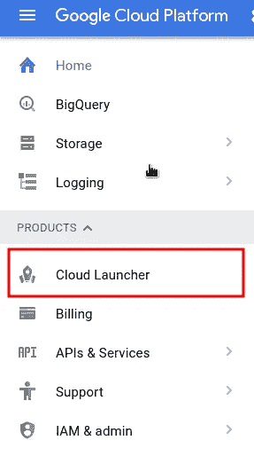
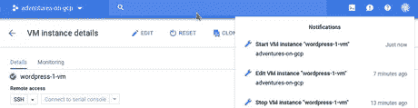

# 在谷歌云平台上设置 WordPress

> 原文：<https://medium.com/google-cloud/setting-wordpress-on-google-cloud-platform-599d77312ae?source=collection_archive---------2----------------------->

WordPress 确实不是我感兴趣的东西，但是我写这篇文章有几个原因:

1.在我的 youtube 视频的评论中，关于 [Google Cloud DNS](https://www.youtube.com/watch?v=pG8nkUq25hA) 人们有不同的问题，以这样或那样的方式，它总是与建立 WordPress 网站(主要是连接域名)有关。

2.在我的文章《谷歌云平台上的[服务账户》中，我无意中开始了一系列文章，主题是“面向非开发人员的谷歌云平台”，即无需编写一行代码即可使用 GCP 的功能，所以这篇文章也是为非技术读者和没有太多谷歌云经验的人写的。](https://www.the-swamp.info/blog/service-accounts-google-cloud-platform/)

3.有了 [GCP 免费层](https://cloud.google.com/free/)，你可以为小流量网站免费提供 WordPress 网站，所以我想把所有的东西放在一个地方，如何用你自己的域名建立可行的 WordPress 网站，并覆盖最重要的东西。

我将经历几个步骤:

1.用 WordPress 创建服务器

[2。设置域名](#part2)

[3。配置 WordPress](#part3)

[4。监控，更改虚拟机类型](#part4)

# 1.用 WordPress 创建服务器

如何在 Google 云平台上部署 Wordpress 网站，有几种方法。一种方法是使用谷歌应用引擎和谷歌云 SQL，手动安装在谷歌计算引擎，使用 Docker 图像，Kubernetes 等。但是我将坚持使用最简单和最快速的方法:使用 Cloud Launcher，只需点击几下鼠标和最少的配置。

登录[云控制台](https://console.cloud.google.com)，如果没有项目，需要创建一个。然后在右边的菜单中，点击云启动器

在 Cloud Launcher 中，有许多产品/解决方案，你只需点击几下就可以部署，所以这就是为什么在搜索栏中键入 word wordpress，就可以获得与 wordpress 相关的内容。

正如你所看到的，Wordpress 部署有很多解决方案。它们由不同的公司提供，并提供额外的功能，但将使用谷歌点击部署(目前它显示在第四行)。

当你点击它，一个新的窗口将被打开，有更详细的描述。

在左栏有详细信息，如什么样的软件和版本将被安装，在右栏(Wordpress，Apache，PHP，MySql)有默认设置的价格(每月 49.35 美元)。在计算引擎上点击蓝色按钮 **LAUNCH，开始启动过程并更改一些设置。**

您可以/应该更改的设置很少:

**部署名称**——如果你想有不同于默认的“wordpress-1”你可以改变它，但这并不重要

**区域**——与你期望你的访问者将要到达的地理区域相关。谷歌现在在各大洲都有数据中心，所以你可以根据自己的喜好选择区域。

**机器类型** —这是一个重要的改变，因为我们将使用免费的最小的机器，称为 micro(或 f1-micro)。幸运的是，如果这台机器对你来说太小，你可以在以后更换机器类型。

**管理员电子邮件** —这是特定于 WP 的，并且是强制性的，因此您需要在那里输入电子邮件

其他设置不需要更改，所以在底部点击**部署**。

之后，您将被重定向到另一个页面，您将看到部署进度。

当显示绿色图标时，表示部署完成。在右边，你有重要的数据，如网站的 IP 地址，管理员和数据库密码。最好把它们放在安全的地方。

当你点击网站地址的 url(在我的例子中是 http://35.206.116.55 的)你可以看到默认的 Wordpress 页面:

所以现在我们有工作 Wordpress 网站在互联网上直播。可以改进的地方很少。

# 2.设置域

建立网站的主要原因是将它与你自己的域名连接起来，所以它不仅仅在[http://35.206.116.55](http://35.206.116.55)下可用。我拥有域名 mytestdomain.net，我将通过这个例子使用。

要连接域名和你的 Wordpress 服务器，你需要去你的域名注册机构，比如 GoDaddy 或者 Google Domains，然后去编辑你的域名的域名系统。我们将添加 2 个 DNS 记录。

一个是 mytestdomain.net 的记录，值是 Wordpress 服务器的 IP 地址，在我的例子中是 35.206.116.55

第二个是 www 子域和 mytestdomain.net 值的 CNAME 记录。这个记录基本上使[www.mytestdomain.net](http://www.mytestdomain.net)为你的网站工作。

形象代表千言万语，这就是我的 DNS 设置。

一段时间(几分钟)后，当你输入[http://mytestdomain.net](http://mytestdomain.net)或[http://www.mytestdomain.net](http://www.mytestdomain.net)时，你应该会看到你的网站。如果这种情况没有发生，尝试使用不同的浏览器或匿名模式，清除缓存等。因为域设置被缓存。

# 3.配置 Wordpress

接下来是与域名设置相关的 Wordpress 配置的最小变化。

在 http://35.206.116.55/wp-login.php 的[或者 http://mytestdomain.net/wp-login.php 的](http://35.206.116.55/wp-login.php)或者[网址上登录 Wordpress admin。你需要使用 Wordpress 管理员用户名(admin)和 Wordpress 管理员密码(在我的例子中是 QHUKg8g2mS+sSV)登录。](http://mytestdomain.net/wp-login.php)

转到设置，然后转到常规。

在我们的例子中，需要改变的最重要的设置是 WordPress 地址(URL)和站点地址(URL)。设置您的域名，而不是 IP 地址。

这些变化是必要的，主要是你的网站上的网址指向你的域名，而不是 IP 地址。

# 4.监控、更改虚拟机类型、额外设置

## 4.1.监视

要查看或更改服务器的详细信息，请在云控制台中，转到计算引擎部分，然后转到虚拟机实例，然后单击您的服务器名称以查看详细信息。

在“详细信息”选项卡下，您可以看到关于服务器的一般信息，如果您向下滚动，您还可以看到在部署期间创建的所有默认密码。

当您切换到 Monitoring 选项卡时，您可以看到不同属性的图表。最重要的是第一个——CPU 图表。

CPU 的使用是与你的网站流量成正比的，因为这台虚拟机是最小的一台，所以即使适度的流量也会使 CPU 供过于求，所以网站的响应速度会很慢。如果您看到使用率接近(或超过)100%，最好更改虚拟机类型。现在，如果您偶尔超过 100%，这是可以的，因为这些虚拟 CPU 旨在处理这一点，但从长远来看，这并不好。

## 4.2.设置静态 IP 地址

如果您计划改变机器类型或出于某种原因只是停止和启动，有可能 IP 地址将改变，您的域连接将中断，除非您也更新域的 DNS 设置中的新 IP，如我们所做的“设置域”部分。为了避免这种情况，您可以将您的 IP 地址从临时改为静态，这意味着该 IP 现在是永久的，或者直到您显式释放它。只要使用 IP 地址，它是免费的。因此，如果你删除虚拟机，不想建立新的虚拟机和使用这个 IP，你需要删除它，否则你将被收费。

转到 VPC 网络(在网络部分下)，然后外部 IP 地址。你会看到 IP 地址列表。您会看到它是短暂的，由您的虚拟机实例使用。

因此，当您单击此处并选择静态时，系统会提示您设置名称和可选描述，然后单击保留。

你可以看到现在的变化。

因此，现在你不必担心网站会被打破，如果你改变一些服务器设置(我将在下一节)。

## 4.3.更改虚拟机类型

为了更改虚拟机类型，您需要首先通过单击“停止”按钮停止虚拟机实例。

虚拟机需要一些时间(半分钟)停止，你会在通知中看到圆圈旋转，当它正在进行中，当它完成时，数字 1。你可以点击它查看更多详情。当然，在虚拟机停止运行的时候，网站是不可用的。

如下图所示，当图标为灰色(而非绿色)时，您也可以看到虚拟机是否真的停止了。

现在，当你点击编辑按钮，你可以改变机器类型。

在顶部，有“机器类型”部分，点击下拉选择

您可以选择新的机器类型。目前您有微处理器(f1-micro)，根据您的流量，您可以选择大小较小的下一个(g1-small)或我选择的 n1-standard-1，它有 1 个虚拟 CPU 和 3.75GB RAM。小型每月约 14 美元，而 n1-standard-1 每月约 25 美元。除此之外，除了虚拟机实例之外，总成本中通常还包括网络流量成本。如果你注册了，你应该得到价值 300 美元的信用，可以在谷歌云平台上使用，有效期为一年，所以基本上你应该可以为你的 WordPress 网站免费运行 n1-standard-1 VM 实例。

点击所需的机器类型，你可以看到它显示改变。

您需要转到页面底部(滚动)并点击保存按钮来保存更改。

保存更改需要几秒钟时间，您可以在右上角查看通知。

最后，您需要通过单击 start 按钮启动 VM 实例，然后再次确认您想要启动。

当机器启动时，你应该看到绿色图标和新的通知。

现在，在监控选项卡和图表上，您应该可以看到 CPU 的消耗降低了，您的网站的响应应该会越来越快。

## 4.4.启用 https (ssl)

如今，网站与用户的安全连接(使用 https 而不是 http)很重要，为了实现这一点，需要证书。有很多公司提供证书，但最受欢迎的服务是免费提供证书的 LetsEncrypt。虽然 LetsEcnrypt 有一些工具可以自动完成很多事情，但是为了在 Google Cloud 上使用它，我在本文中部署了一个例子，这并不那么简单。需要在服务器上执行命令和编辑一些文件，这超出了本文的范围，所以我就不赘述了。我发现了一篇很好的文章，它一步一步地讲述了如何设置它[https://www . onepagezen . com/free-SSL-certificate-WordPress-Google-cloud-click-to-deploy/](https://www.onepagezen.com/free-ssl-certificate-wordpress-google-cloud-click-to-deploy/)。

有很多事情可以提及，例如创建备份，但目的是提供全面的一步一步的教程，以简单快捷地设置网站和连接到域。

我正在发布关于 https://www.gcpweekly.com/[谷歌云平台](https://www.gcpweekly.com/)的每周简讯。如果您想在每周一收到与 GCP 相关的新闻和文章，请订阅