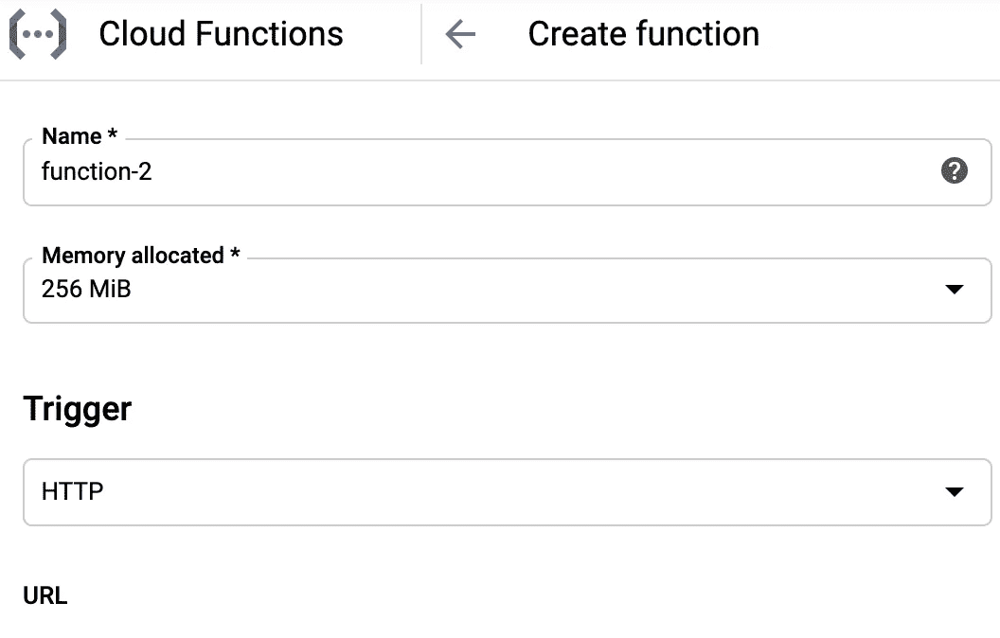

# 使用 Python 设置和调用云函数

> 原文：<https://medium.com/google-cloud/setup-and-invoke-cloud-functions-using-python-e801a8633096?source=collection_archive---------1----------------------->


哦，我学习云函数的乐趣。探索本应使事情变得简单的无服务器服务，这实际上很有趣，但也令人沮丧，而且绝对具有启发性。诚然，我已经经历了足够长的时间，知道总是有斜升，即使它很简单。

Cloud Functions 是一项服务，允许你在谷歌云服务器上运行代码，而无需处理服务器配置或扩展。这是一种“随用随付”的方法，意味着您要为自己使用的东西付费，这有助于优化成本。我已经开始将它用于一些我需要多次运行的功能，这就是它非常有价值的地方。有一个学习曲线，尤其是在连接不同的服务时，这篇文章涵盖了这些主题的关键学习。

*   在云函数中运行之前在本地测试代码
*   使用 HTTP 触发器和 Python 设置云函数
*   从您的笔记本电脑调用云功能
*   错误故障排除和身份验证
*   费用

本文假设您已经在本地安装了 gcloud SDK，并且已经安装了 Google Cloud 项目。我有以前关于这些话题的帖子。我在函数中使用了 Python 3.7，在 Mac 上进行本地开发。

# 本地模拟云功能

如果你想在运行云函数之前测试你的代码，那么你可以用 Python 的函数框架来测试。

## 简单示例|未传递任何参数

在您的机器上安装带有 pip 的功能框架。

```
pip install functions-framework
```

起草一个简单的例子，你可以像下面这样测试，并将其标记为 *main.py* 。

```
def my_function(request):
    return 'Hello World'
```

要模拟云函数，请在终端中运行 functions-framework 命令。

```
functions-framework --target my_function
```

您可以传入一些标志进行调整，例如文件名(— source)和它指向的端口(— port)。并在开发时使用— debug 标志获得更详细的帮助。

然后调用 curl 在本地调用它，查看 HTTP 触发器如何工作，或者在浏览器窗口中运行它。

```
curl [http://localhost:8080](http://localhost:8080)OR for the browserhttp://localhost:8080
```

链接中最上面的[堆栈溢出响应](https://stackoverflow.com/questions/53693987/test-python-google-cloud-functions-locally/53700497)是我提取上面代码的地方。当您引入包并希望了解这些包如何工作以及检查与其他服务的连接时，模拟云功能尤其有价值。此外，这也是一个很好的框架，可以用来测试本地运行的云。

## 传递参数

下面是一个如何向云函数传递参数的例子。

使用这个起始代码进行试验，并将其放入一个 *main.py* 文件中。

```
def hello(request): 
    if request.args:
        return f'Hello' + request.args.get('first') + request.args.get('last')+'\n'
    elif request.get_json():
        request_json = request.get_json()
        return  f'Hello' + request_json['first'] + request_json['last']+'\n'
    elif request.values:
        request_data = request.values
        return  f'Hello' + request_data['first'] + request_data['last']+'\n'
    else:
        return f'Hello World!'+'\n'
```

为了测试它，你可以使用 curl 命令。

```
curl [http://localhost:8080?first=My&last=](http://localhost:8080?first=My&last=)Name
```

或者您可以为 Linux 或 Mac 传递以下参数。

```
curl [http://localhost:8080](http://localhost:8080?first=My&last=) -d ‘{“first”:”My”, “last”:”Name”}’
```

或者您可以在浏览器中用相同的 url 调用它。

```
[http://localhost:8080?first=My&last=](http://localhost:8080?first=My&last=)Name
```

# 设置云功能

如果你想在一个实际的云函数中运行代码，你可以使用谷歌云控制台来设置你要运行的函数。也可以使用 gcloud SDK 发布代码。在这篇文章中，我坚持使用用户界面，但也可以随意查看这个[链接](https://cloud.google.com/functions/docs/quickstart)来获得更多关于从你的终端启动 gcloud 的信息。

转到谷歌云控制台和云功能仪表板。选择*创建功能*。


填写用于 *HTTP 触发器*的 *URL* 中的函数名。还要选择要使用的触发器。还有其他的触发选项，但是对于这个例子，我坚持使用 HTTP*。*

**

*调用该函数的 url 将发布在上图中的 *URL* 下。您可以直接在 UI 中测试它，在您的本地终端中卷曲它，通过浏览器运行它或者通过代码发布请求。*

**认证*框是棘手的部分。如果选中，那么**任何人**都可以调用该函数。这是一种测试它的方法，而不是处理身份验证，但要小心，因为它是开放的，任何人都可以找到 url(包括机器人)来调用它，这可能会变得昂贵，因为它是按需付费。更多关于成本的信息，请见后文。请注意，它会自动被取消选中，如果你忘记了它，那么你可能会掉进兔子洞，我试图找出为什么我不能在没有身份验证的情况下调用。*

**

*在*运行时*中，选择您想要为函数编码的语言，并在 *MAIN 下相应地为您的函数编码。PY* 。当使用 HTTP 和 Python 时，你必须接受一个 r *equest* 对象，这样你就可以传入参数。你还需要填写*要求。TXT* 选项卡，包含您导入的任何需求，这些需求还不是 Python 标准包的一部分。*

*在*要执行的函数中，*将程序运行时需要执行的函数名放入您的代码中。已经有示例代码可以帮助您入门。*

*当你展开*环境变量、联网、超时等等，*你会发现在*联网*下的*入口*设置表明*允许所有流量*。如果您没有选中上面的*允许未认证调用*的复选框，但是确保选择了*允许所有流量*(这是默认设置)，那么它仍然需要认证。这让我有点迷惑，我在下面重申一下。*

**

*还有一个关于*超时*的注意事项是，程序默认为 60 秒，如果在等待响应以完成处理，您最多可以在函数超时前获得 9 分钟。*

*一旦该功能被设置，选择**创建**，并给它几分钟时间让该功能在服务器上启动。当有一个绿色的检查圈时，就可以运行了。*

**

*如果有错误，您可以随时返回并编辑该功能，然后**再次部署**。*

# *调用云函数*

*设置好该功能后，您可以调用/运行该功能。这一步对我来说更具挑战性，因为前面提到的*认证*复选框以及 Python 请求如何处理*数据* vs *json* 术语。*

## ***所有用户访问***

*当授权任何人访问云函数时，您可以在代码中省略传递身份验证参数，下面提供了调用示例。*

***终端
终端**无参数卷曲现有云函数。*

```
*curl [https://[*MYPROJECT*].cloudfunctions.net/[](https://us-central1-w-data-pipelines-may20.cloudfunctions.net/product-func)*FUNC NAME*]*
```

*卷曲一个接受参数的现有云函数。*

```
*curl [https://[*MYPROJECT*].cloudfunctions.net/[](https://us-central1-w-data-pipelines-may20.cloudfunctions.net/product-func)*FUNC NAME*] -H “Content-Type:application/json” -d ‘{“first”:”Mae Carol”, “last”:”Jemison"}’*
```

*将 *MYPROJECT* 替换为您的谷歌云项目 id，将 *FUNC 名称*替换为设置中提到的云函数名称。*

***Python 代码** 在调用 Python 函数内部的 url 时，我使用了 *requests* 包来应用 HTTP 触发器，通过请求传入参数。*

*创造这些变量。*

```
*url = "[https://[*MYPROJECT*].cloudfunctions.net/[](https://us-central1-w-data-pipelines-may20.cloudfunctions.net/product-func)*FUNC NAME*]
param = {“first”:”Mae Carol”, “last”:”Jemison"}*
```

*对云函数 url 进行请求调用。*

```
*r = requests.post(url, **json**=param)*
```

*如果您得到类似*“您的客户端没有访问所请求的 URL 的权限”*的错误，尽管错误上说了什么，也不一定是授权。我发现上面真正的问题是我使用了关键字*数据*并且没有将我的参数转换成 *json* 格式。当我将输入参数从*数据*更改为 *json* 时，它工作了。*

*这是在我切换到 json 之前，我一直坚持使用的代码。*

```
*r = requests.post(url, **data**=param)*
```

*数据不起作用的原因是因为我的原始代码没有解析数据标志下传入的参数的能力。这是我在将它添加到本文开头的示例中之前所缺少的代码。*

```
*request_data = request.values
return  f'Hello' + request_data['first'] + request_data['last']+'\n'*
```

*如果我用 json.dump 将参数转换成 json，或者如果我传入将内容类型阐明为 json 的头，我也可以从我的示例中去掉上面的代码，继续使用 data=param。*

```
*import json
r = requests.post(url, **data**=json.dump(param))*
```

*运筹学*

```
*newHeaders = {'Content-type': 'application/json', 'Accept': 'text/plain'}
headers=newHeaders
r = requests.post(url, **data**=param, headers=newHeaders)*
```

## ***授权访问***

*如前所述，我花了很长时间在认证兔子洞里，因为我一度认为我没有权限。关于这一点，有几件事是我最初实际上没有权限，因为我错过了那个*认证* 复选框，但是我也遇到了一些挑战，让令牌加载到我的 Python 代码中。*

***终端** 我很快发现了下面的示例代码，它可以从我的笔记本电脑上调用我的云功能，并获取我的默认身份令牌，因为我已经配置了 *gcloud* 。*

```
*curl -H “Authorization: Bearer $(gcloud auth print-identity-token)” [https://[*MYPROJECT*].cloudfunctions.net/[](https://us-central1-w-data-pipelines-may20.cloudfunctions.net/product-func)*FUNC NAME*] -H “Content-Type:application/json” -d ‘{“first”:”Mae Carol”, “last”:”Jemison"}’*
```

*当我在 Python 中尝试这一点时，这就是它变得具有挑战性的地方。由于我的 bash 命令有效，它帮助我认识到将令牌加载到代码中是挑战的一部分。*

*我试验了 google-auth 和 google-oauth 包。我甚至使用操作系统和子进程包直接从 bash 调用中提取令牌。我从尝试所有这些事情中学到的是，我无法获得一个令牌来加载 google-auth 和 google-oauth，这是另一个问题。*

*如上所述，我遇到的一个错误是因为我需要在请求调用中用 *json* 交换*数据*或者修改我的参数配置方式。*

*我能够用 os 和子进程解析出我的令牌，这是我最终使用的子进程命令。*

```
*import subprocesstoken = '{}'.format(subprocess.Popen(args="gcloud auth print-identity-token", stdout=subprocess.PIPE, shell=True).communicate()[0])[2:-3]*
```

*这是做这件事的好方法吗？有争议，最有可能是没有。但是它起作用了，我需要继续做其他的事情。反馈总是受欢迎的，如果我找到更好的方法，我会试着回到这里更新。*

*使用此代码通过身份验证令牌向云函数 url 发出请求，并且不带参数。*

```
*r = requests.post(url, headers={"Authorization":"Bearer {}".format(token)})*
```

*使用此代码通过身份验证令牌和 params 向云函数 url 发出请求。*

```
*r = requests.post(url, json=param, headers={"Authorization":"Bearer {}".format(token)})*
```

*在*请求*运行后，您可以检查它的运行情况。以下命令提供了关于令牌是否不正确以及请求是否以 200 或 500 或 400 范围代码中的某个值响应的见解。*

```
*r.headers
r.status_code*
```

# *疑难解答旁注*

## *身份验证|所有用户访问*

*如果您在设置您的功能时第一次错过了*身份验证*复选框，您可以使用[通过 IAM](https://cloud.google.com/functions/docs/securing/managing-access-iam) 管理访问中的这些指示，使任何人都可以使用它。记住要小心这种访问，并考虑使用 it 案例，如测试集成。*

1.  *[转到谷歌云控制台](https://console.cloud.google.com/functions/)*
2.  *单击要授予访问权限的功能旁边的复选框。*
3.  *点击右上角的**显示信息面板**显示**权限**选项卡。*
4.  *点击**添加成员**。*
5.  *在**新成员**字段中，键入`allUsers`。*
6.  *从**选择角色**下拉菜单中选择角色**云功能>云功能调用者**。*
7.  *点击**保存**。*

## *身份验证|元数据令牌*

*如果您正在运行来自 Google 云服务的云函数请求，那么会有一些说明，展示如何通过调用元数据服务来获取令牌。[认证开发者、功能和最终用户](https://cloud.google.com/functions/docs/securing/authenticating)下的文档更详细。下面是你可以在 Python 中使用的一些代码的一个例子。*

```
*REGION = 'us-central1'
PROJECT_ID = [PROJECT ID]
RECEIVING_FUNCTION = [FUNC NAME]function_url = f'[https://{REGION}-{PROJECT_ID}.cloudfunctions.net/{RECEIVING_FUNCTION}'](/google-cloud/{REGION}-{PROJECT_ID}.cloudfunctions.net/{RECEIVING_FUNCTION}')
metadata_server_url = \
    '[http://metadata/computeMetadata/v1/instance/service-accounts/default/identity?audience='](http://metadata/computeMetadata/v1/instance/service-accounts/default/identity?audience=')
token_full_url = metadata_server_url + function_url
token_headers = {'Metadata-Flavor': 'Google'}token_response = requests.get(token_full_url, headers=token_headers)
jwt = token_response.text
function_headers = {'Authorization': f'bearer {jwt}'}
r = requests.get(function_url, headers=function_headers)*
```

*当我试图在本地找出令牌时，我尝试了元数据，但遇到了其他错误，这让我很困惑。*“URL 超过最大重试次数”和“无法建立新连接”。*这让我陷入困惑，认为我需要改变云功能的配置。底线是，你必须在一个你可以像云计算一样调用它的服务上。*

## *故障排除和记录*

*当构建具有多个集成服务的东西时，如果可以的话，最好分解组件并在每个单独的服务上直接测试它们。我在上面分享过，云函数允许直接在 UI 中或者从命令行进行测试。如果你得到不清楚的错误，使用它。此外，尽可能使用日志记录。[谷歌云提供日志](https://cloud.google.com/logging/docs/setup/python)，你可以在平台的操作日志服务中看到更多关于如何设置记录的信息。详细的日志记录是您的朋友，可以帮助跟踪奇怪的错误。*

*如果你读过我以前的任何帖子，你可能知道我喜欢从小处着手，尽可能地在本地进行集成测试。在处理身份验证、配置差异和日志记录细节不足时，这可能是一个挑战。从小处着手，添加日志，单独测试每项服务，然后逐步发展。*

## *减少时间和成本*

*最后但同样重要的是，在使用 HTTP trigger 时，记得在你的云函数中使用 **return** 。这将确保函数在超时前结束运行。如果它能更快地完成功能，你就不想为它超时的时间付费。*

# *费用*

*使用云功能的总成本包括它被调用的次数、运行的时间、提供的资源数量以及是否有任何出站网络请求。所以等式是调用+计算时间+网络。免费层每月提供 2M 调用、100 万秒的免费计算和 5GB 的免费互联网出口流量。此后，调用是每百万 0.4 美元的统一费率，网络是每 GB 0.12 美元的统一费率，计算时间是每 GB 秒 0.0000025 美元或第 1 层每 GHz 秒 0.00001 美元。要了解更多信息，您可以查看[定价文档](https://cloud.google.com/functions/pricing)，其中提供了更具体的示例和成本明细。*

# *包裹*

*我使用 Python 3.7 逐步完成了云函数的设置和调用。我分享了我经历过的陷阱，希望其他可能犯这些错误的人能够发现这一点，并看到如何比我在搜索时更快地解决问题。使用云函数时要记住的一个关键点是，当您需要对该函数进行许多许多调用并且该函数可以在不到 9 分钟的时间内完成时，使用它是很好的；不然你应该看看云跑之类的。*

*探索愉快。*