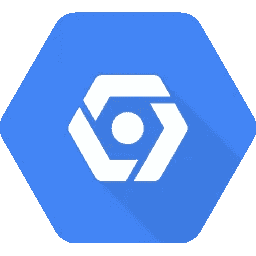

# 在 SDK 中设置和切换 Google Cloud 项目

> 原文：<https://medium.com/google-cloud/setup-and-switch-between-google-cloud-projects-in-the-sdk-885c5000624c?source=collection_archive---------0----------------------->



提供了一个关于如何在一台机器上使用 SDK 设置和切换 Google Cloud 项目的快速概述。这在处理多个项目时(尤其是协作时)很有帮助，并且您正在使用 Cloud SDK。

# 设置和认证

无论是第一次创建项目，还是项目已经存在，并且您是在进行本地开发的计算机上登录的，都需要执行以下步骤。这假设您将从终端运行所有命令。

在您将用来访问它的机器上为您的项目创建一个新的 *gcloud* 配置。

```
gcloud config configurations create [*NAME*]
```

它会自动将其设置为活动帐户，除非您在命令中传递一个标志以不使其活动。将[ *名称*占位符替换为在谷歌云项目之间切换时使用的名称。您可以使用项目 id 作为名称，以保持名称简单，或者使用最合适的名称。

将 Google Cloud 项目 id 设置为活动的 *gcloud* 配置。

```
gcloud config set project [*PROJECT-ID*]
```

如果您还没有获得项目 id，请在 Google Cloud 中设置一个项目。

授权谷歌帐户，有这个项目的某种类型的访问/所有权。

```
gcloud auth login
```

如果您还没有登录，请登录该帐户。请注意，上面和下面的命令将打开一个浏览器窗口，以便您可以登录 gmail 帐户并进行身份验证。如果您没有浏览器，可以通过在命令行中传递-no-launch-browser 标志来实现这一点。

获取新的用户凭据，用于调用 Google APIs 时将使用的应用程序默认凭据。

```
gcloud auth application-default login
```

如果您在类似本地开发环境的环境中开发代码，并且使用用户凭证比设置服务帐户更容易，请使用上面的命令。

向项目添加配额，以避免*配额超过*或 *API 未启用*错误。

```
gcloud auth application-default set-quota-project [*PROJECT_ID*]
```

# 查看并激活

本节中的命令让您可以了解当前的配置，以及如何在一台机器上的不同项目之间进行切换。

检查机器上存在的所有配置。

```
gcloud config configurations list
```

更改激活的默认配置以在项目间切换。

```
gcloud config configurations activate [*NAME*]
```

仅审阅活动项目。

```
gcloud projects list
```

查看当前活动配置的详细信息，如名称、区域、帐户。

```
gcloud config list 
```

设置当前活动配置的属性

```
gcloud config set [*ATTRIBUTE*] [*NAME of ATTRIBUTE*]
```

列出认证用户 id 和当前激活的 id，在终端显示的内容旁边会有一个*号。

```
gcloud auth list
```

上面应该显示当前活动的帐户，你已经配置了当前活动的项目。

# 包裹

这是一个快速参考，分享如何在 *gcloud* SDK 中配置、检查和更改活动的 Google Cloud 项目配置。使用[如何管理 SDK 配置](https://cloud.google.com/sdk/docs/configurations)了解更多详细信息和命令。继续将所有项目添加到您的 SDK 中。