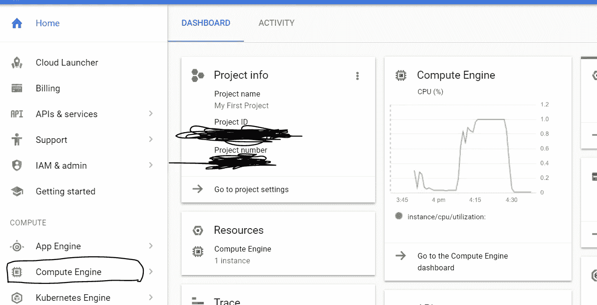
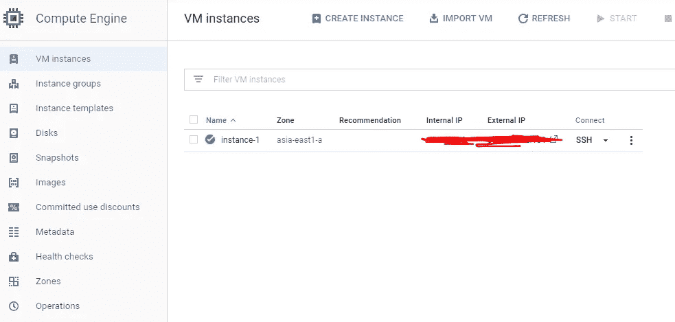
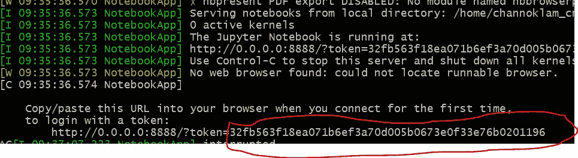

# 谷歌云平台 fastai part1 v3 (fastai 1.0)设置指南，5 分钟 0.2 美元/小时

> 原文：<https://medium.com/google-cloud/setup-guide-for-fastai-part1-v3-fastai-1-0-on-google-cloud-platform-with-0-2-hour-fe92c7ec855d?source=collection_archive---------0----------------------->


> 请注意，这篇文章主要是更新之前关于 [fastai v2 设置的文章，](/google-cloud/set-up-google-cloud-gpu-for-fast-ai-45a77fa0cb48)如果你对如何有效地使用 Jupyter Notebook with extension 感兴趣。请到[这里](/google-cloud/set-up-google-cloud-gpu-for-fast-ai-45a77fa0cb48)。

# 创建一个谷歌云平台账户

您需要填写您的信用卡信息，他们将收取您 1 美元的验证费。之后，你将获得 300 美元的免费信贷，并获得 GPU 的访问权限。

## 创建一个谷歌云平台(GCP)实例

在 GCP 控制台的[主页中，有一些你想复制到文本文件中的信息。复制您的项目 ID，因为您稍后在 SSH 到您的实例时会用到它。(对我来说，项目 ID 是无尽-火-xxxxxxx)](https://console.cloud.google.com/)

在你的 Google Cloud 控制台主页上，你应该可以看到你的项目 ID，现在把它复制到某个地方，稍后你会需要它来设置你的环境。



将项目 ID 复制到某个地方，稍后您将需要它来进行配置。

我们现在可以开始创建实例。单击出现在左侧的“计算引擎”。

1.  **点击创建实例**

这是我找到的唯一一个选项，可以创建一个安装几乎所有东西的虚拟机，包括 Nvidia 驱动程序、anaconda、git 和所有东西。

请在您的 [GCP 控制台](https://console.cloud.google.com)上检查您的 [IP](https://www.google.com/search?q=myip) 和项目 ID，并更改以下脚本中的参数。你还需要选择一个区域，对我来说，我用的是 asia-east1-a，选择一个离你近的。

如果你想的话，CPU 和 RAM 的数量可以在以后更改，所以现在不用担心。

**PROJECT_ID** 是显示在您的控制台主页上的项目 ID，我之前已经让您复制下来了。

```
export IMAGE_FAMILY="pytorch-1-0-cu92-experimental"
export ZONE="asia-east1-a" # put your GCP zone of the instances to create
export INSTANCE_NAME="pytorch-and-fastai-box"
export INSTANCE_TYPE="n1-standard-4" # specifies the machine type used for the instances.
export PROJECT_ID='YOUR_PROJECT_ID,something like endless-fire-1234'
export YOUR_IP='1.2.3.4'gcloud compute instances create $INSTANCE_NAME \
      --preemptible \
      --zone=$ZONE \
      --image-family=$IMAGE_FAMILY \
      --machine-type=$INSTANCE_TYPE \
      --boot-disk-size=50GB \
      --boot-disk-type "pd-ssd" \
      --image-project=deeplearning-platform-release \
      --maintenance-policy=TERMINATE \
      --accelerator="type=nvidia-tesla-k80,count=1" \
      --metadata="install-nvidia-driver=True" \
      --no-boot-disk-auto-delete \
      --preemptible
```

**步骤 1** [**安装 Google Cloud SDK**](https://cloud.google.com/sdk/) **或者在控制台页面使用云壳**

我不会花时间来解释如何安装它。请遵循此处的说明，文档非常简单。

**步骤 2**
使用控制台或命令行创建一个防火墙规则，用于从您的本地机器访问端口 8888(您将使用端口 8888 来访问您的笔记本电脑):

```
# If you run on local shell
gcloud init
# You will need to login to your google account and finish the verification gcloud compute --project "${PROJECT_ID}" firewall-rules create "jupyter" --allow tcp:8888 --direction "INGRESS" --priority "1000" --network "default" --source-ranges "${YOUR_IP}" --target-tags "jupyter"
gcloud compute instances add-tags "pytorch-and-fastai-box" --tags jupyter,https-server,http-server
```

**第三步 SSH 进入实例。打开谷歌云 SDK 外壳或者直接使用云外壳**

**港口转运**

这些命令在本地计算机上设置您的配置，并使用端口转发对您的实例进行 ssh。这允许您使用 localhost:8888 通过端口转发连接到远程虚拟机 jupyter 笔记本

```
export ZONE="your-zone, something like asia-east1-a"gcloud compute instances start "${INSTANCE_NAME}" **# If you are using Google Cloud SDK Shell on your computer**
gcloud compute --project "${PROJECT_ID}" ssh --zone "${ZONE}" **"YOUR_GMAIL_NAME@**pytorch-and-fastai-box" -- -L 8888:localhost:8888**# If you are using the Cloud Shell** gcloud compute --project "${PROJECT_ID}" ssh --zone "${ZONE}" **"YOUR_GMAIL_NAME@**pytorch-and-fastai-box"
```

**第四步**运行 jupyter 笔记本:
`jupyter notebook --ip=0.0.0.0 --port=8888`

请注意终端中显示的令牌。使用实例的外部 IP 转到笔记本。您可以在控制台中找到实例的外部 IP。

xxx.xxx.xxx.xxx:8888 是你笔记本的链接。如果使用的是带端口转发的 Google Cloud SDK Shell，也可以使用 localhost:8888 连接笔记本。



您需要一个令牌/密码来登录您的笔记本。你的令牌在这里:



或者，在您的云终端中，您可以这样做来设置访问密码。

```
jupyter notebook --generate-config
jupyter notebook password
echo "c.NotebookApp.ip = '0.0.0.0'" >> ~/.jupyter/jupyter_notebook_config.py 
echo "c.NotebookApp.open_browser = False" >> ~/.jupyter/jupyter_notebook_config.py
```

**第五步在你的云终端上安装所有东西**

我已经创建了一个 bash 脚本来安装所有东西，它安装 conda，设置 fastai conda env，安装 fastai 库并克隆它们的库。

```
git clone [https://github.com/fastai/fastai.git](https://github.com/fastai/fastai.git)
conda create -n fastai 
source activate fastai
echo 'source activate fastai' >> ~/.bashrc
source ~/.bashrcconda install -c pytorch pytorch-nightly cuda92
conda install -c fastai torchvision-nightly
conda install -c fastai fastai
```

**第六步完成**

记得在不需要的时候**关闭**你的实例，否则你很快就会烧完你的信用。