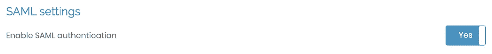

# 使用 SAML 为具有 Google Cloud 身份的 OpenVPN 访问服务器设置 SSO

> 原文：<https://medium.com/google-cloud/setup-sso-for-openvpn-access-server-with-google-cloud-identity-using-saml-e748accf1476?source=collection_archive---------0----------------------->

使用 OpenVPN Access Server 2.11 或更高版本，您可以使用 SAML 设置 SSO。在这篇博文中，我们将使用 Google Cloud Identity 或 Google Workspace 来设置 SSO。

SAML 的优势在于它可以提供单点登录(SSO)体验。这意味着您可以使用相同的 SAML IdP 凭据来访问支持 SAML 身份验证的各种应用程序和服务。这消除了为每个应用程序或服务添加新凭证的需要。

# 先决条件

1.  OpenVPN 接入服务器版本 2.11 或以上([您可以按照这篇博文在 GCP 创建 OpenVPN 接入服务器](/google-cloud/how-to-setup-point-to-site-vpn-in-google-cloud-using-openvpn-66f642ba08c9)
2.  谷歌工作空间或云身份

# 设置

## 第一步

首先，您需要登录到 OpenVPN 访问服务器，以收集关于作为服务提供商的访问服务器的信息。

1.  登录 OpenVPN 访问服务器管理用户界面
2.  点击**认证** > **SAML**
3.  您将需要以下信息:

a.SP 身份

b.SP ACS

## 第二步

捕获信息后，现在登录到谷歌管理控制台。

1.  从菜单中点击**应用>网络和移动应用**
2.  点击**添加应用>添加定制 SAML 应用**
3.  输入应用名称、描述和图标，输入信息后点击**继续**

4.点击选项 1:下载 IdP 元数据下的**下载元数据**

5.保存 XML 文件以便在步骤 3 中使用，并点击**继续**

6.使用我们从 OpenVPN 访问服务器获取的 SP 信息，将以下内容输入 Google app:

a.ACS URL —输入 OpenVPN 访问服务器 SP ACS

b.实体 ID —输入访问服务器 SP 标识

c.开始 URL —为客户端 Web 用户界面输入“cws ”(这将引导您的用户在登录后进入客户端 Web 用户界面)

d.点击**继续**

7.配置属性映射，然后单击完成。可以用“主邮箱”=“邮箱”)。

8.或者，您也可以将此自定义 SAML 应用程序分配给一个组，而不是分配给组织内的每个人。在本演示中，我们将保留默认设置，即组织级别。

## 第三步

现在，让我们将元数据 XML 文件上传到我们在步骤 2 中下载的访问服务器。

1.  登录 OpenVPN 访问服务器管理用户界面
2.  点击**认证> SAML**
3.  点击**通过元数据自动配置身份提供商(IdP)**
4.  点击**选择文件**选择 IdP 元数据文件。
5.  选择 IdP 元数据文件，点击上传

6.文件上传后，点击**更新运行服务器。**更新服务器后，手动配置身份提供者(IdP)下的所有详细信息应可见:

## 第四步

现在我们已经配置了 SAML，我们需要为用户打开服务。

1.  登录谷歌管理控制台。
2.  点击**应用>网络和移动应用**
3.  点击你的 **SAML 应用。**(我已经给 app 起了 OpenVPN 接入服务器名)
4.  点击**用户访问**
5.  为每个人选择**打开**并点击**保存**

6.现在登录到 OpenVPN 访问服务器管理界面。

7.点击**认证> SAML**

8.点击开关打开**启用 SAML 认证**，然后点击**保存设置**和**更新运行服务器**。

9.现在，您可以按用户、按组配置文件或在全局级别启用 SAML。

10.在本演示中，我们将在每个用户级别和组级别启用，但我们还将了解如何在全局级别启用。

## 第五步

现在，我们已经使用 SAML for OpenVPN 配置了 SSO，我们可以将用户添加到 OpenVPN 访问服务器来启用访问。

1.  登录到 OpenVPN 访问服务器管理界面。
2.  分配给用户

a.点击**用户管理>用户权限**

b.点击**更多设置**，选择**认证方式**下的 **SAML**

c.点击**保存设置**和**更新运行服务器**

3.分配到一个组

a.点击**用户管理>群组权限**

b.点击**更多设置**并选择**认证方法**下的 **SAML**

c.点击**保存设置**和**更新运行服务器**

4.现在我们已经为测试用户将**认证方法**改为 **SAML** ，我们可以使用云身份登录 OpenVPN。

5.要对此进行测试，请打开 OpenVPN 访问服务器用户登录。

6.如果 SAML 已启用，您会在登录页面中找到通过 SAML 按钮登录的**。**

7.单击“通过 SAML 登录”按钮，并使用我们在 OpenVPN 访问服务器中为 SAML 身份验证方法添加的用户登录。

8.登录后，您可以下载 OpenVPN 客户端或配置文件。此外，您可以直接从 OpenVPN 客户端登录并完成登录过程。

9.或者，您可以启用 SAML 作为云身份用户的每个用户的默认身份验证方法。

a.登录 OpenVPN 访问服务器管理用户界面

b.点击**认证>设置**

c.在**默认认证系统**下，选择 **SAML**

d.将**默认拒绝访问未列出的账户**设置为**否**

e.点击**保存设置**和**更新运行服务器**。

现在，您已经有了 OpenVPN 访问服务器，它配置了 SAML，可以使用 Google Cloud Identity 进行单点登录。您可以从云身份实施 MFA 以获得额外的安全性。