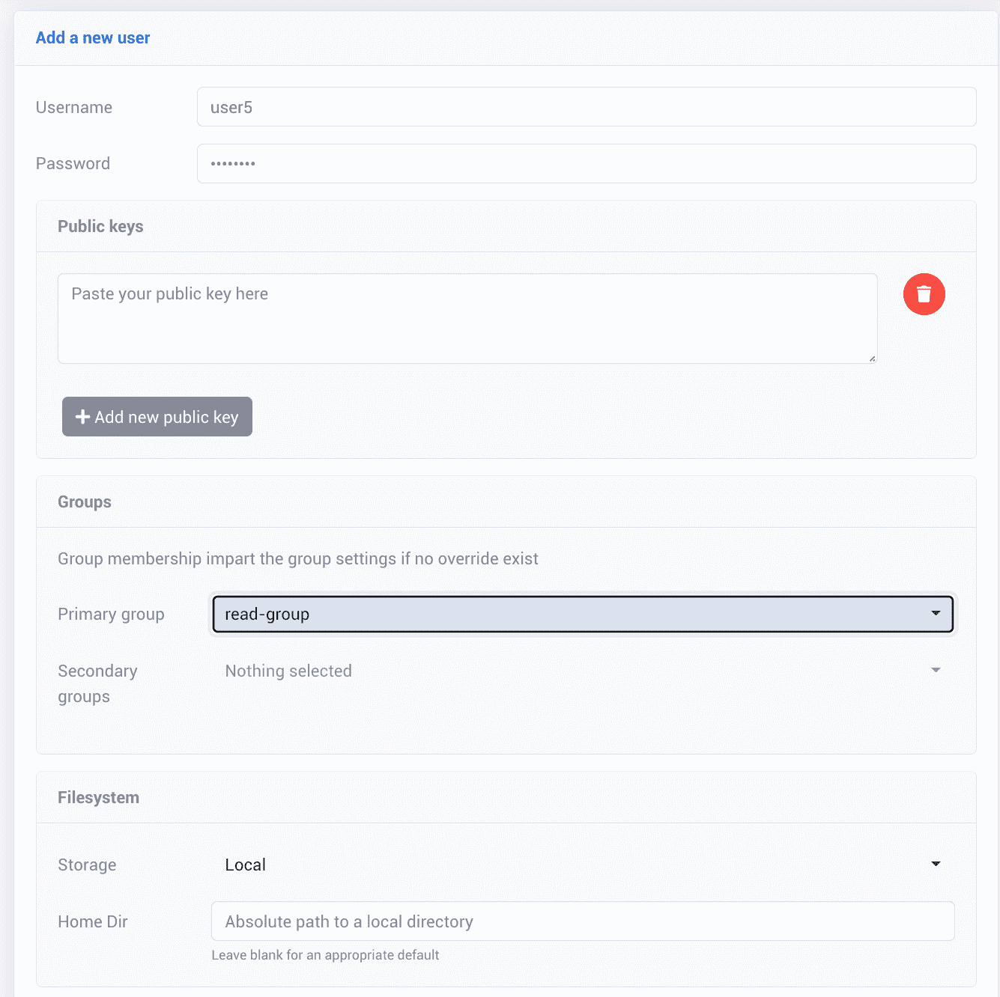

# SFTPGo 通过 SFTP 访问 GCS

> 原文：<https://medium.com/google-cloud/sftpgo-access-to-gcs-via-sftp-e203e0783f6f?source=collection_archive---------0----------------------->


[SFTPGo](https://github.com/drakkan/sftpgo) 是一个 [SFTP](https://en.wikipedia.org/wiki/SSH_File_Transfer_Protocol) 服务器，作为一个开源项目发布，具有访问谷歌云存储(GCS)的内置能力。我们可以使用 SFTPGo 作为通过 SFTP 访问 GCS 的机制。本文将带我们了解一个让它工作的方法，并增加一些使用时的额外考虑。

从整体架构的角度来看，SFTPGo 可以安装在 Google 云计算引擎上。安装后，它运行并维护自己的有状态本地配置。然后，基于浏览器/web 的管理控制台可用于进一步的详细配置。然后，我们将创建 SFTPGo 已知的用户身份。这些用户身份中的每一个都有关联的名称和密码。定义用户时，我们还命名了一个 GCP 存储桶，它将被用作用户通过 SFTP 客户端看到的存储。为了访问 bucket，我们还将提供一些服务帐户凭证，SFTPGo 将使用这些凭证代表用户与 bucket 进行交互。这种配置非常灵活，因为它允许按用户存储桶访问和服务帐户配置，这意味着不同的用户可以对不同的存储桶进行不同的访问。配置完成后，用户就可以连接 SFTP 客户端(或者可选的 web 界面)来浏览、上传和获取存储在云存储中的文件。


在这个故事中，我们将从这样一个想法开始:我们将创建一个托管在具有公共 IP 地址的计算引擎上的 SFTP 服务器。然后，我们将允许客户端访问这个 SFTP 服务器，他们上传和下载的文件将被映射到 GCS 桶。

我们将从一个新创建的运行 Debian 的计算引擎开始。启动后，我使用 SSH 登录。

接下来，我们按照步骤使用 apt 安装它。这些都记录在[这里](https://github.com/drakkan/sftpgo/blob/main/docs/repo.md)。

```
curl -sS [https://ftp.osuosl.org/pub/sftpgo/apt/gpg.key](https://ftp.osuosl.org/pub/sftpgo/apt/gpg.key) | sudo gpg --dearmor -o /usr/share/keyrings/sftpgo-archive-keyring.gpg
CODENAME=`lsb_release -c -s`
echo "deb [signed-by=/usr/share/keyrings/sftpgo-archive-keyring.gpg] [https://ftp.osuosl.org/pub/sftpgo/apt](https://ftp.osuosl.org/pub/sftpgo/apt) ${CODENAME} main" | sudo tee /etc/apt/sources.list.d/sftpgo.list
sudo apt update
sudo apt install sftpgo
```

安装完成后，`sftpgo` 将启动并运行。

接下来，创建一个防火墙规则，允许传入流量通过端口 8080 和 2022 进入您的 VPC。

打开浏览器进入`[http://[COMPUTE_ENGINE_IP]:8080](http://[COMPUTE_ENGINE_IP]:8080)`

您将看到一个面板，提示您输入要创建的 SFTPGo 管理员用户 id。选择安全的密码。


您现在将看到 SFTPGo 管理屏幕。


现在是时候创建用户了。这些用户将被授权登录 SFTP 服务器。然而，在我们创建用户之前，我们需要为 GCS 访问做准备。SFTPGo 的默认功能是作为一个 SFTP 服务器，使用本地文件系统作为数据存储。在我们的故事中，我们希望使用 GCS 作为商店。要与 GCS 交互，我们需要提供 Google Cloud 身份验证证明，证明我们是已知的身份。为此，我们创建一个服务帐户，并检索该帐户的 JSON 凭证。


点击`DONE`，因为我们不需要设置任何其他属性。

接下来，我们想要创建一个 JSON 键


这将被下载到您的计算机上。我建议将其重命名，以匹配服务帐户的名称，这是关键。

创建了服务帐户后，我们需要授予它访问 bucket 的权限。至少，`Storage Object Viewer`角色将允许该帐户获取文件，`Storage Object Creator`将允许用户创建文件，而`Storage Object Admin`将额外允许一切，包括删除现有文件。

剩下的工作就是定义允许访问 SFTP 服务器的用户。当 SFTP 客户端试图连接到 SFTP 服务器时，它必须进行身份验证。它可以使用用户 id/密码对，或者提供 SSH 凭证。我们可以定义 SFTPGo 将通过管理网页识别的用户。


我们首先在选择面板中单击用户。在那里，显示“查看和管理用户”屏幕。如果我们点击“+”，我们将定义我们的用户:


这个面板上发生了很多事情，让我们来分解一下。首先，我们提供用户名和密码。这种组合将允许 SFTP 客户端(或 web 客户端)访问 SFTPGo。这些用户名和密码与谷歌账户等其他身份来源没有任何关系。只有 SFTPGo 使用这些身份。

下一个重要的项目是文件系统条目。当用户连接到 SFTPGo 时，正是这个定义定义了向用户呈现什么文件系统。默认为“本地”,这意味着显示的是计算引擎的本地 Linux 文件系统。在我们的故事中，我们将其更改为 Google 云存储，因为我们想要访问 GCS 存储桶。当我们选择 Storage = Google Cloud Storage 条目时，其他属性会发生变化，以反映特定于 Google Cloud 的条目。我们必须提供另外两种设置。第一个是我们正在处理的 GCS bucket 的名称。第二个是我们之前导出的 GCP 服务帐户凭据 JSON 文件。SFTPGo 上传并存储这个凭证文件。

仅此而已。现在，当我们连接 SFTP 客户端时，系统会提示我们输入用户名和密码，我们可以输入我们创建的信息。然后，我们将能够执行 SFTP 命令，如“ls”来列出文件，“put”来上传文件，以及“get”来获取文件。将使用凭据文件引用的服务帐户来访问 GCS。GCS 还将只允许与服务帐户相关联的 IAM 角色所允许的操作。例如，如果帐户只有存储对象查看器，则不能创建新文件，而如果只有存储对象创建器，则不能检索现有文件。

当我们创建 SFTPGo 用户时，我们可能不希望不断地指定 GCP 凭证和 bucket 细节(但是我们可以这样做)。相反，我们可以在 SFTPGo 组的规范中定义我们的文件系统细节，并将我们创建的用户与这些组相关联。在下文中，我们展示了我们称之为“读组”的新组的定义


现在，当我们创建一个用户时，我们可以引用这个组并放弃用户页面上的特定文件系统定义。组的文件系统定义优先于用户特定的文件系统定义。



我们不仅可以使用 SFTP 客户端连接到 SFTPGo，还可以选择使用其内置的特定于客户端的 Web UI。如果我们使用浏览器访问端口 8080 的计算引擎，系统会提示我们以 SFTPGo 用户身份登录。从那里我们看到了:


请花点时间看看这个屏幕。它的核心是一个文件系统视图，显示文件、它们的大小以及它们上次修改的时间。这些文件是我们从 SFTP 客户那里看到的 GCS 文件。从这里我们可以执行一些重要的操作，包括下载文件，上传文件，删除文件等等。我想指出的一个特性是编辑功能。如果我们单击与文件相关联的编辑图标，我们会立即在基于浏览器的编辑器中看到该文件的内容。我们不仅可以看到内容，还可以更改内容，并将其写回以替换原始文件。实际上，我们有一个 GCS 文件编辑器！

关于 SFTPGo 还有很多可以说的，我会把你引向 GitHub 项目主页以获得更多的细节。由于这是一个开源项目，您可以免费下载和使用它。另一方面是没有正式的支持。如果您发现了问题，您可以提出问题，但是没有解决问题的 SLA。因为源代码也是存在的，所以你有能力自己修复它，但是我们知道，说起来容易做起来难。

除了 SFTPGo，还有各种其他的 SFTP 解决方案和文件浏览器用于 GCS。

# 录像

这里有一个简短的视频，演示了本文的许多概念:

# 排除故障

如果您需要执行一些调试，SFTPGo 会将 SFTPGo 日志记录写入本地`/var/log/syslog`文件。

# 另请参见:

*   [GitHub — drakkan/sftpgo:功能全面且高度可配置的 SFTP 服务器，支持可选的 HTTP/S、FTP/S 和 WebDAV—S3、谷歌云存储、Azure Blob](https://github.com/drakkan/sftpgo)
*   [如何在 Ubuntu 22.04 上安装 SFTPGo](https://www.howtoforge.com/how-to-install-sftpgo-on-ubuntu-22-04/)
*   [文件图像 SFTP/FTP 网关](https://console.cloud.google.com/marketplace/product/filemage-public/filemage-gateway-linux)
*   [Trillo —云存储的文件管理器和 SFTP](https://console.cloud.google.com/marketplace/details/trillo-vm-prod/trillo-platform-vm)
*   [Couchdrop](https://couchdrop.io/)