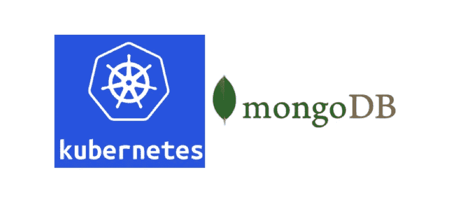

# GKE 的 Kubernetes StatefulSets 中的分片 Mongodb

> 原文：<https://medium.com/google-cloud/sharded-mongodb-in-kubernetes-statefulsets-on-gke-ba08c7c0c0b0?source=collection_archive---------1----------------------->

*最初出版。*

D aemon 博客:[https://sunnykrgupta . github . io/sharded-MongoDB-in-kubernetes-stateful sets-on-gke . html](https://sunnykrgupta.github.io/sharded-mongodb-in-kubernetes-statefulsets-on-gke.html)



这篇博客将展示如何在 Google Kubernetes 引擎上设置分片的 MongoDB 集群。我们将使用 kubernetes StatefulSets 特性来部署 mongodb 容器。

在继续演示之前，我们需要了解一些概念。

# [状态集](https://kubernetes.io/docs/concepts/workloads/controllers/statefulset)

StatefulSets 就像一个部署，它管理 pod 并保证这些 pod 的顺序和唯一性。它为他们的每一个豆荚保持一个粘性的身份。它有助于部署需要持久性、唯一网络标识符(DNS、主机名等)的应用程序，并且是有状态应用程序的手段。如果 pod 被终止或删除，如果由 persistentvolumes 管理，卷数据将保持不变。

# [存储类](https://kubernetes.io/docs/concepts/storage/storage-classes/#gce)

StorageClass 有助于管理人员描述 Kubernetes 提供的存储“类别”。每个存储类都有不同的 provisioner(gcepersistindisk、AWSElasticBlockStore、AzureDisk 等),用于确定使用哪个卷插件来配置存储。

# [持续卷](https://kubernetes.io/docs/concepts/storage/persistent-volumes/)

持久卷(PV)是群集中由管理员调配的一块存储。PV 是可供任何 Pod 使用的资源。任何 Pod 都可以通过 PersistentVolumeClaims (PVC)来声明这些卷，并最终在声明被删除时被释放。

# [无头服务](https://kubernetes.io/docs/concepts/services-networking/service/#headless-services)

无头服务用于配置具有由服务定义的相同选择器的 pod 的 DNS。它通常不用于负载平衡目的。每个配置了标签选择器的无头服务有助于为在状态集中运行的 pod 定义唯一的网络标识符。

让我们开始演示吧。请切换到您的终端并按照说明进行操作。

> N 注意:这个设置与< = mongo 3.2 兼容。

# 1.先决条件

确保您的主机 Linux 系统上已经满足以下依赖关系:

1.  GCP 的云客户端命令行工具 [gcloud](https://cloud.google.com/sdk/docs/quickstarts)
2.  gcloud 认证到一个项目来管理容器引擎。
3.  安装 Kubernetes 命令工具(“kubectl”)，
4.  配置 kubernetes 身份验证凭证。

# 2.创建命名空间、存储类、Google 计算磁盘和持久卷。

我们的 Mongodb 设置如下:

*   1x 配置服务器(k8s 部署类型:“StatefulSet”)
*   2x 分片，每个分片是包含 1x 副本的副本集(k8s 部署类型:“StatefulSet”)
*   2 台 Mongos 路由器(k8s 部署类型:“部署”)

我们将创建一个 kubernetes 名称空间，并将所有上述资源部署在我们定义的名称空间中。我们将定义 statefulset 容器将使用的磁盘。磁盘将通过 StorageClass 和 PersistentVolume 中定义的 API 安装在运行 mongodb 服务器的 pods 上。

## 2.1 创建名称空间

创建一个名为`namespace.yaml`的文件，并用您的句柄名称或任何其他名称替换`NAMESPACE_ID`。我将用`daemonsl`创建一个名称空间。

```
#namespace.yaml
apiVersion: v1
kind: Namespace
metadata:
  name: NAMESPACE_ID #To apply resources to kubernetes, run
sed -e "s/NAMESPACE_ID/daemonsl/g" namespace.yaml > tmp-namespace.yaml
kubectl apply -f tmp-namespace.yaml#To verify namespaces
kubectl get ns
```

## 2.2 创建存储类

创建一个文件为`gce-ssd-storageclass.yaml`。我们将我们的存储类名称定义为`**fast**`，并使用 GCE 持久性磁盘作为我们的 provisioner，并使用`type: pd-ssd`来允许将 SSD 磁盘类型分配给请求者(即这里的 statefulset 容器)。

```
#gce-ssd-storageclass.yaml
kind: StorageClass
apiVersion: storage.k8s.io/v1
metadata:
  name: fast
provisioner: kubernetes.io/gce-pd
parameters:
  type: pd-ssd#To apply resources to kubernetes, run
kubectl apply -f gce-ssd-storageclass.yaml#To verify storageclass
kubectl get sc
```

## 2.3 创建 GCE SSD 磁盘

我们将创建一些磁盘供 mongodb statefulset 容器使用。我们订购了两个`10GB`盘和一个`5GB`类型的`SSD`盘。

```
#For MainDB servers
gcloud compute disks create --size 10GB --type pd-ssd pd-ssd-disk-k8s-mongodb-daemonsl-10g-1
gcloud compute disks create --size 10GB --type pd-ssd pd-ssd-disk-k8s-mongodb-daemonsl-10g-2#For Config servers
gcloud compute disks create --size 5GB --type pd-ssd pd-ssd-disk-k8s-mongodb-daemonsl-5g-1
```

## 2.4 创建持久卷

创建一个文件名为`ext4-gce-ssd-persistentvolume.yaml`的文件。我们将我们的持久卷存储容量`10GB`定义为由`maindb` pod 限定，将`5GB`定义为由`configdb` pod 限定。

```
#ext4-gce-ssd-persistentvolume.yaml
apiVersion: "v1"
kind: "PersistentVolume"
metadata:
  name: data-volume-k8s-mongodb-daemonsl-SIZEg-INSTANCE
spec:
  capacity:
      storage: SIZEGi
  accessModes:
    - ReadWriteOnce
  persistentVolumeReclaimPolicy: Retain
  storageClassName: fast
  gcePersistentDisk:
    fsType: ext4
    pdName: pd-ssd-disk-k8s-mongodb-daemonsl-SIZEg-INSTANCE
```

使用上述模板，按以下顺序修改和应用:

```
#Replace 'SIZE' with 10 and 'INSTANCE' with 1,
**# Ex: data-volume-k8s-mongodb-daemonsl-10g-1, storage: 10Gi,** sed -e "s/INSTANCE/1/g; s/SIZE/10/g" ext4-gce-ssd-persistentvolume.yaml > tmp-ext4-gce-ssd-persistentvolume.yaml
**kubectl apply -f tmp-ext4-gce-ssd-persistentvolume.yaml****#Replace 'SIZE' with 10 and 'INSTANCE' with 2** sed -e "s/INSTANCE/2/g; s/SIZE/10/g" ext4-gce-ssd-persistentvolume.yaml > tmp-ext4-gce-ssd-persistentvolume.yaml
**kubectl apply -f tmp-ext4-gce-ssd-persistentvolume.yaml****#Replace 'SIZE' with 5 and 'INSTANCE' with 1** sed -e "s/INSTANCE/1/g; s/SIZE/5/g" ext4-gce-ssd-persistentvolume.yaml > tmp-ext4-gce-ssd-persistentvolume.yaml
**kubectl apply -f tmp-ext4-gce-ssd-persistentvolume.yaml**#To verify PersistentVolume creation,
kubectl get pv
```

现在，我们已经准备好**存储类、命名空间、磁盘**和**持久卷**作为 statefulset 容器的资源。

# 3.StatefulSet 容器和 Mongos 部署。

## 3.1 Statefulset ConfigDB

创建一个文件为`mongodb-configdb-service-stateful.yaml`并复制以下模板。将`NAMESPACE_ID`替换为`daemonsl`，或者您定义的任何名称，将`DB_DISK`替换为`5Gi`。

我们用 clusterIP `None`创建了一个无头服务，选择器为`role: mongodb-configdb`监听端口`27019`。我们已经用 mongodb 参数和 volumeClaimTemplates 定义了 statefulset 定义。这里，`VolumeClaimTemplates`正在向`storage capacity 5GB`请求存储类`fast`。这个 volumeClaimTemplates 将这个请求注册到 storageclass，storageclass 在`PersistentVolume (PV)`之前完成这个请求，并在`PersistentVolumeClaims (PVC)`中注册声明。

```
#mongodb-configdb-service-stateful.yaml
apiVersion: v1
kind: Service
metadata:
  name: mongodb-configdb-headless-service
  namespace: NAMESPACE_ID
  labels:
    name: mongodb-configdb
spec:
  ports:
  - port: 27019
    targetPort: 27019
  clusterIP: None
  selector:
    role: mongodb-configdb
---
apiVersion: apps/v1beta2  #change this version based on master version
kind: StatefulSet
metadata:
  name: mongodb-configdb
  namespace: NAMESPACE_ID
spec:
  selector:
    matchLabels:
      role: mongodb-configdb # has to match .spec.template.metadata.labels
  serviceName: mongodb-configdb-headless-service
  replicas: 1
  template:
    metadata:
      labels:
        role: mongodb-configdb
        tier: configdb
    spec:
      affinity:
        podAntiAffinity:
          preferredDuringSchedulingIgnoredDuringExecution:
          - weight: 100
            podAffinityTerm:
              labelSelector:
                matchExpressions:
                - key: tier
                  operator: In
                  values:
                  - configdb
              topologyKey: kubernetes.io/hostname
      terminationGracePeriodSeconds: 10
      containers:
        - name: mongodb-configdb-container
          image: mongo
          command:
            - "mongod"
            - "--port"
            - "27019"
            - "--dbpath"
            - "/mongo-disk"
            - "--bind_ip"
            - "0.0.0.0"
            - "--configsvr"
          resources:
            requests:
              cpu: 50m
              memory: 100Mi
          ports:
            - containerPort: 27019
          volumeMounts:
            - name: mongodb-configdb-persistent-storage-claim
              mountPath: /mongo-disk
  volumeClaimTemplates:
  - metadata:
      name: mongodb-configdb-persistent-storage-claim
      annotations:
        volume.beta.kubernetes.io/storage-class: "fast"
    spec:
      accessModes: [ "ReadWriteOnce" ]
      resources:
        requests:
          storage: DB_DISK
```

现在，通过 kubectl 应用资源~

```
**sed -e "s/NAMESPACE_ID/daemonsl/g; s/DB_DISK/5Gi/g" ** mongodb-configdb-service-stateful.yaml > tmp-mongodb-configdb-service-stateful.yaml
**kubectl apply -f tmp-mongodb-configdb-service-stateful.yaml**
```

## 3.2 Statefulset mainDB

创建一个名为`mongodb-maindb-service-stateful.yaml`的文件，复制下面的模板。将`NAMESPACE_ID`替换为`daemonsl`或您定义的任何名称，将`DB_DISK`替换为`10Gi`，将`shardX` & `ShardX`替换为`1`，然后将`2`应用两次模板，以创建两个不同的 statefulsets 配置。在 kubernetes 中部署之后，我们将运行两个名为`mongodb-shard1`和`mongodb-shard2`的状态集

这里，我们再次创建了 headless 服务和请求存储容量为 10GB 的 storageclass `fast`的`VolumeClaimTemplates`。

```
#mongodb-maindb-service-stateful.yaml
apiVersion: v1
kind: Service
metadata:
  name: mongodb-shardX-headless-service
  namespace: NAMESPACE_ID
  labels:
    name: mongodb-shardX
spec:
  ports:
  - port: 27017
    targetPort: 27017
  clusterIP: None
  selector:
    role: mongodb-shardX
---
apiVersion: apps/v1beta2
kind: StatefulSet
metadata:
  name: mongodb-shardX
  namespace: NAMESPACE_ID
spec:
  selector:
    matchLabels:
      role: mongodb-shardX # has to match .spec.template.metadata.labels
  serviceName: mongodb-shardX-headless-service
  replicas: 1
  template:
    metadata:
      labels:
        role: mongodb-shardX
        tier: maindb
        replicaset: ShardX
    spec:
      affinity:
        podAntiAffinity:
          preferredDuringSchedulingIgnoredDuringExecution:
          - weight: 100
            podAffinityTerm:
              labelSelector:
                matchExpressions:
                - key: replicaset
                  operator: In
                  values:
                  - ShardX
              topologyKey: kubernetes.io/hostname
      terminationGracePeriodSeconds: 10
      containers:
        - name: mongodb-shardX-container
          image: mongo
          command:
            - "mongod"
            - "--port"
            - "27017"
            - "--bind_ip"
            - "0.0.0.0"
            - "--replSet"
            - "ShardX"
            - "--dbpath"
            - "/mongo-disk"
          resources:
            requests:
              cpu: 50m
              memory: 100Mi
          ports:
            - containerPort: 27017
          volumeMounts:
            - name: mongo-shardX-persistent-storage-claim
              mountPath: /mongo-disk
  volumeClaimTemplates:
  - metadata:
      name: mongo-shardX-persistent-storage-claim
      annotations:
        volume.beta.kubernetes.io/storage-class: "fast"
    spec:
      accessModes: [ "ReadWriteOnce" ]
      resources:
        requests:
          storage: DB_DISK
```

通过 kubectl 应用资源~

```
#replace 'shardX' & 'ShardX' with shard1 & Shard1.
**sed -e "s/shardX/shard1/g; s/ShardX/Shard1/g; s/NAMESPACE_ID/daemonsl/g; s/DB_DISK/10Gi/g"** mongodb-maindb-service-stateful.yaml > tmp-mongodb-maindb-service-stateful.yaml
**kubectl apply -f tmp-mongodb-maindb-service-stateful.yaml**#replace 'shardX' & 'ShardX' with shard2 & Shard2\. 
**sed -e "s/shardX/shard2/g; s/ShardX/Shard2/g; s/NAMESPACE_ID/daemonsl/g; s/DB_DISK/10Gi/g"** mongodb-maindb-service-stateful.yaml > tmp-mongodb-maindb-service-stateful.yaml
**kubectl apply -f tmp-mongodb-maindb-service-stateful.yaml**#run command to see Pods & Services spinning up
kubectl get svc,po --namespace=daemonsl
```

到目前为止，我们已经完成了与 headless 服务一起运行的 statefulsets 容器，并安装了满足 Pods 要求的 SSD 卷。

```
kubectl get persistentvolumes# Get persistent volume claims
kubectl get persistentvolumeclaims --namespace=daemonsl
```

## 3.3 Mongos 部署

我们已经启动并运行了 configdb 和 maindb pods。我们将启动 mongos 服务器来建立一个分片集群。用`daemonsl`替换`NAMESPACE_ID`，或者任何你定义的名字。

我们已经使用带有 configdb pod 的唯一网络标识符的`--configdb`标志在 mongos 中配置了配置服务器信息。statefulset pods 的 DNS 遵循惯例`<POD_NAME>.<SERVICE_NAME>.<NAMESPACE>.svc.<CLUSTER_DOMAIN>`。

**参考:**[https://kubernetes . io/docs/concepts/workloads/controllers/stateful set/# stable-network-id](https://kubernetes.io/docs/concepts/workloads/controllers/statefulset/#stable-network-id)

```
apiVersion: apps/v1beta1
kind: Deployment
metadata:
  name: mongos
  **namespace**: NAMESPACE_ID
spec:
  replicas: 2
  template:
    metadata:
      labels:
        role: mongos
        tier: routers
    spec:
      affinity:
        podAntiAffinity:
          preferredDuringSchedulingIgnoredDuringExecution:
          - weight: 100
            podAffinityTerm:
              labelSelector:
                matchExpressions:
                - key: tier
                  operator: In
                  values:
                  - routers
              topologyKey: kubernetes.io/hostname
      terminationGracePeriodSeconds: 10
      containers:
        - name: mongos-container
          image: mongo
          command:
            - "mongos"
            - "--port"
            - "27017"
            - "--bind_ip"
            - "0.0.0.0"
            - "--configdb"
            - "mongodb-configdb-0.mongodb-configdb-headless-service.daemonsl.svc.cluster.local:27019"
          resources:
            requests:
              cpu: 50m
              memory: 100Mi
          ports:
            - containerPort: 27017
```

通过 kubectl 应用资源~

```
**sed -e "s/NAMESPACE_ID/daemonsl/g"** mongodb-mongos-deployment-service.yaml > tmp-mongodb-mongos-deployment-service.yaml
**kubectl apply -f tmp-mongodb-mongos-deployment-service.yaml**
```

# 4.配置分片

现在，我们已经启动并运行了`mongos, configdb`和`maindb`。我们需要在 MainDB 服务器中创建 Replicaset，我们打算将它做成 shard。我们将运行`rs.initiate()`命令来制作`PRIMARY`副本。因为我们在每个碎片中都有一个副本成员。我们将在每个`maindb`舱中运行初始化命令。

```
**echo** "Replicaset Init mongodb-shard1-0 "
**kubectl exec** --namespace=daemonsl mongodb-shard1-0 -c mongodb-shard1-container -- mongo --port 27017 --eval "rs.initiate({_id: \"Shard1\", version: 1, **members: [ {_id: 0, host: \"mongodb-shard1-0.mongodb-shard1-headless-service.daemonsl.svc.cluster.local:27017\"} ]** });" **echo** "Replicaset Init mongodb-shard2-0 "  
**kubectl exec** --namespace=daemonsl mongodb-shard2-0 -c mongodb-shard2-container -- mongo --port 27017 --eval "rs.initiate({_id: **\"**Shard2**\"**, version: 1, **members: [ {_id: 0, host: \"mongodb-shard2-0.mongodb-shard2-headless-service.daemonsl.svc.cluster.local:27017\"} ]** });"
```

将使这两个 pod 成为各自复制集的主要。您甚至可以通过运行`rs.status()`命令进入容器来验证复制集的状态。

我们现在正在向 mongos 服务器添加碎片。我们将在任何一个 mongos 舱里听从指挥。Mongos 服务器是无状态的应用程序，它们将配置保存在 configdb 服务器中，我们通过在 statefulset 容器下声明它们来使它们成为有状态的应用程序。

```
**echo** "Adding Shard 1 : Shard1 "
**kubectl** **exec** **--namespace**=**daemonsl** $(**kubectl** **get** **pod** **-l** "tier=routers" **-o** **jsonpath**='{.items[0].metadata.name}' **--namespace**=**daemonsl** ) **-c** **mongos-container** **--** **mongo** **--port** **27017** **--eval** "sh.addShard(\"Shard1/mongodb-shard1-0.mongodb-shard1-headless-service.daemonsl.svc.cluster.local:27017\");"**echo** "Adding Shard 2 : Shard2 "
**kubectl** **exec** **--namespace**=**daemonsl** $(**kubectl** **get** **pod** **-l** "tier=routers" **-o** **jsonpath**='{.items[0].metadata.name}' **--namespace**=**daemonsl** ) **-c** **mongos-container** **--** **mongo** **--port** **27017** **--eval** "sh.addShard(\"Shard2/mongodb-shard2-0.mongodb-shard2-headless-service.daemonsl.svc.cluster.local:27017\");"
```

现在，我们可以进入一个 mongos 容器来验证集群的分片状态。上述所有步骤都可以自动在集群中创建任意数量的分片，因此支持由 GKE 支持的有状态应用程序的概念非常简单。

## 测试分片

要测试分片集群是否正常工作，请连接到运行第一个“mongos”路由器的容器，然后使用 Mongo Shell 进行身份验证，在特定数据库和集合上启用分片，向该集合添加一些测试数据，然后查看分片集群和集合的状态:

```
$ kubectl exec -it **$(**kubectl get pod -l "tier=routers" -o jsonpath='{.items[0].metadata.name}'**)** -c mongos-container bash
$ mongo
> sh.enableSharding("<Database_name>");
> sh.status();
> use admin
> db.admin.runCommand("getShardMap")
```

## 摧毁和清理库伯内特的环境

**重要提示:**这一步是必需的，以确保您不会因为不再需要的环境而被 Google Cloud 持续收费。

运行以下脚本来取消部署 MongoDB 服务& StatefulSets/Deployments 以及相关的 Kubernetes 资源，然后删除 GCE 磁盘。该脚本可从存储库中获得。

```
$ sh teardown.sh   *#To delete all resources provisioned above*
```

# 本演示中涉及的因素

*   在 Google Kubernetes 引擎上部署 MongoDB
*   使用 Kubernetes StatefulSets 和 PersistentVolumeClaims 来确保回收容器时数据不会丢失
*   正确配置 MongoDB 分片集群以实现可伸缩性，每个分片都是副本集以实现完全弹性
*   控制 Mongod 副本的反关联性以避免单点故障

**Github 参考**:[https://github.com/sunnykrGupta/gke-mongodb-shards](https://github.com/sunnykrGupta/gke-mongodb-shards)

**鸣谢:**本博客基于[保罗·多恩](https://twitter.com/TheDonester)的作品

## 必须按顺序阅读以下资源:

*   [https://kubernetes . io/docs/concepts/workloads/controllers/stateful set](https://kubernetes.io/docs/concepts/workloads/controllers/statefulset)
*   [https://kubernetes . io/docs/concepts/services-networking/service/# headless-services](https://kubernetes.io/docs/concepts/services-networking/service/#headless-services)
*   [https://kubernetes . io/docs/concepts/workloads/controllers/stateful set/# stable-network-id](https://kubernetes.io/docs/concepts/workloads/controllers/statefulset/#stable-network-id)
*   [https://kubernetes . io/docs/concepts/storage/storage-classes/# GCE](https://kubernetes.io/docs/concepts/storage/storage-classes/#gce)
*   [https://kubernetes . io/docs/concepts/storage/persistent-volumes/](https://kubernetes.io/docs/concepts/storage/persistent-volumes/)
*   [http://blog . kubernetes . io/2017/03/dynamic-provisioning-and-storage-classes-kubernetes . html](http://blog.kubernetes.io/2017/03/dynamic-provisioning-and-storage-classes-kubernetes.html)
*   [http://blog . kubernetes . io/2017/03/advanced-scheduling-in-kubernetes . html](http://blog.kubernetes.io/2017/03/advanced-scheduling-in-kubernetes.html)