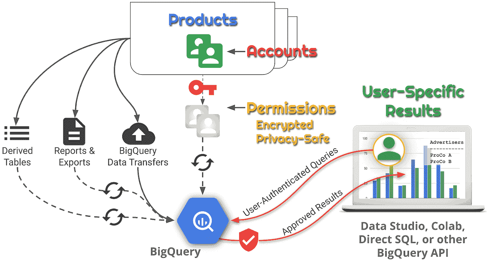

# 放心地共享数据:BigQuery 和 Data Studio 中的单元级访问控制

> 原文：<https://medium.com/google-cloud/share-data-with-confidence-cell-level-access-controls-in-bigquery-and-data-studio-cf753fa173a4?source=collection_archive---------0----------------------->

## 如何将您的数据写在纸上:产品帐户权限强制报告

*合著者* [*阿里夫·卡西姆*](/@arifkasim_12427) *，谷歌同行*

与谷歌在广告和云领域的一些最大客户合作，我们的角色让我们能够灵活地使用几乎任何平台、API 或语言来满足客户的关键业务需求。当我们谈论“数据”时(我们几乎总是在谈论数据)，交付我们的解决方案的一些最常见和最明显的方式包括 CSV 文件、Google Sheets(有时通过 API 动态更新)，以及最近的 Data Studio 仪表板。

最让我害怕的是第一个前提:我们的团队被带来帮助解决 ***业务关键*** 问题，然而，共享结果的典型方法是通过“复制”(例如，CSV 附件)或共享文档。在这些场景中，数据所有者(客户)对于谁拥有他们数据的副本，或者数据在多大范围内被重新共享没有实际控制权；每个人看到的都是相同的全套结果。


我们开发了一种管理访问控制的方法，不仅在文档级别，而且针对单个结果，使用一种我们称为“产品帐户权限强制报告”(PAPER)的方法。PAPER 在按行或列检索结果时应用单个用户权限，然后将结果返回给用户或在数据分析和可视化工具中显示，如 [Data Studio](http://datastudio.google.com) 、 [Colab](http://colab.research.google.com) 和 [Google Sheets](http://sheets.google.com) 。

最大的好处——通常也是最不受重视的——是数据是通过 [BigQuery](https://cloud.google.com/bigquery/) 表传递的。我们最新的解决方案提供了 28tb 的数据，可供来自许多不同组织的数百名用户访问，他们拥有各种个人数据权限。这些用户拥有 BigQuery SQL 的全部能力来提取详细的结果，将这些结果与其他第一方或第三方数据相结合，并将结果汇总到汇总报告中；然而，结果总是根据个人的数据权限进行筛选。用户甚至可以复制和定制他们自己的 Data Studio 报告、Colab 笔记本或 Google Sheets，而不是受限于对默认仪表板的只读访问。在 BigQuery 中直接访问这些数据也为高级数据分析提供了机会，包括使用 TensorFlow (通常使用 Colab 笔记本开发)的[机器学习(ML)和像](https://cloud.google.com/ml-engine/docs/tensorflow/working-with-data) [BigQuery ML](https://cloud.google.com/bigquery/#bigqueryml) 这样的更新的 ML 工具。

# 问题是

*客户数据一旦离开产品的“围墙花园”，就会面临风险*

大多数用户通过他们的网络用户界面与类似 [Google Ads](http://ads.google.com) 和[Google Marketing Platform(GMP)](http://marketingplatform.google.com)的产品进行交互，并且用户界面是定制的，以根据用户权限执行用户登录和访问控制。但是谷歌也因向用户提供导出数据的灵活性而闻名。我们的广告产品也不例外。广告活动的配置数据和大多数由此产生的广告事件数据被视为“客户数据”，客户通常会从产品中提取这些数据，其形式包括:

*   电子表格报告
*   通过 web 服务 API 的配置数据
*   数据传输文件(详细的事件数据)；和
*   BigQuery 中的数据传输表


数据安全挑战一旦从产品中转移出来

问题是，一旦有人提取了这些数据，UI 中的这些数据安全控制就不再起作用了。作为数据所有者，客户授予特定用户对其在产品中的帐户的访问权限，以及这些帐户中的特定权限，例如对某些广告活动的访问权限，而不是对其他活动的访问权限。代理机构可能管理多个客户的账户，产品账户权限强制执行这种分离。这些控制都不适用于某人刚刚下载并通过电子邮件发送的报告。如果用户权限发生变化，该产品无法在需要时返回并取消对电子邮件电子表格的访问。

客户现在负责实施单独的安全策略，授予和撤销用户对单个文档或 BigQuery 表的访问权限，而基于不同用户权限交付单独数据的唯一方法是创建更多的文档和表，使用不同的(可能重叠的)数据集。

# 愿景

*使用 BigQuery 安全特性根据用户的原始数据权限过滤结果*

当我们让客户能够在源产品之外利用强大的数据管理和可视化工具时，这些数据和产品将变得更有价值。我们的客户知道他们的关键业务驱动因素，可以选择最佳方式来分割和切割他们的数据，获得独特的见解，并触发基于市场的决策，只受他们的想象力的限制。


我们希望确保客户的数据即使在从产品中导出后也能得到保护。即使数据在许多不同的环境中使用，也应该尊重用户权限。

BigQuery 包含了我们需要的安全特性，既可以保护数据，又可以根据用户自动过滤结果，因为 BigQuery 使用了与大多数谷歌产品(以及许多第三方产品)相同的[谷歌登录](https://developers.google.com/identity/)流程。).当您从 Google Sheets(通过 Apps 脚本)或 Colab(或 Data Studio，只要将 BigQuery 连接器配置为使用“查看者凭证”)等产品访问 BigQuery 时，您的帐户凭证会作为请求的一部分安全地传递给 BigQuery。

这意味着纸张的愿景可以通过使用许多现成的数据分析和可视化解决方案，以及 BigQuery 后端来实现，每个面向用户的工具都会自动向*仅*呈现*用户*有权检索的数据。应用程序没有被授予访问受保护数据的权限，因此除了允许单个用户查看之外，应用程序无法访问或公开任何特权数据。

# 把它写在纸上

*PAPER 使用原生 SQL 安全地将产品帐户权限映射到结果上*

由纸张保护的解决方案通常遵循如下所示的体系结构。尽管可以通过 BigQuery 控制台 UI 手动配置 BigQuery 安全层，但人类会犯错误，这会将用户隐私和数据安全置于风险之中。使用脚本或其他代码，使用 BigQuery 工具和 API，作为一种可重复、可测试的方法，每次都以正确的方式保护您的数据。



纸张结构和数据流

在图示的体系结构中，BigQuery 是所有产品数据的中央数据存储，用户权限数据同样存储在我们称之为“权限表”的地方。如果任何表已经在 BigQuery 中(例如通过 [BigQuery 数据传输服务](https://cloud.google.com/bigquery/transfer/)导出的 Google 营销平台和 Google Ads 数据)，通常不需要移动或复制数据。对于外部数据，我们从产品中自动提取数据，例如，通过产品 API，然后将数据接收到 BigQuery 中。

## 生成权限表

提取许可数据的过程可能是特定于产品的，并且可能需要产品开发人员的合作。PAPER 假设对用户的帐户标识符进行强单向加密。我们建议您提取和转换受保护区域内的用户数据，并在任何类型的数据传输或存储之前加密用户帐户标识符。

例如，以以下由产品本身管理的用户帐户和权限为例:

当用户稍后尝试检索数据时，帐户标识符必须与 BigQuery [SESSION_USER()](https://cloud.google.com/bigquery/docs/reference/standard-sql/functions-and-operators#session_user) 函数(*运行查询的用户的电子邮件地址*)返回的值相匹配。BigQuery 还有基于标准的加密哈希函数，您可以直接使用它，也可以将其作为自定义转换表达式的一部分。(例如，你可以添加一种加密盐。)请记住，无论是在生成权限表时，还是在用户运行查询时，您都必须能够复制精确的转换。

对于这个简单的示例，假设可以使用 BigQuery 标准的类似 SQL 的语法来查询产品的帐户信息，这个查询对用户 ID 进行规范化和加密，并将用户的可访问帐户 ID 列表保存在一个数组中，每个用户帐户存储一条记录:

尽可能频繁地刷新权限数据(例如每 15 分钟一次)，以便在外部查询、分析和可视化工具中执行产品中的权限更改，而不会有长时间的延迟。

## 保护您的源数据

在将权限表或任何未过滤的产品数据保存到 BigQuery 表之前，请确保 Google 项目用户的 [IAM 角色](https://cloud.google.com/iam/docs/understanding-roles)(在我们的示例中为**项目 id** )限制了大多数用户的权限。项目“所有者”和“编辑者”(基本角色“所有者”和“编辑者”)角色，以及“大查询管理员”(如果使用的话)应该只授予少数可信的管理员*。这些用户将有权访问未过滤的数据和权限表(尽管只有加密的帐户标识符)。*

*BigQuery 数据的权限是在数据集级别管理的(控制对表或视图集合的访问)。假设我们将所有未过滤的数据和权限表存储在同一个数据集中(在我们的示例中我们称之为**未过滤的**)，下面是要保护的概念表的完整表规范:*

```
*project-id.unfiltered.account_permissions
project-id.unfiltered.account_report
project-id.unfiltered.account_summary
project-id.unfiltered.account_events*
```

*我们使用自动化脚本来确保纸张的安全和隐私功能始终得到正确和一致的实施。在 Python 实现中，我们使用了用于 Python 的 [Google Cloud 客户端库，对于 Bash 实现，我们使用了](https://googlecloudplatform.github.io/google-cloud-python/latest/index.html) [gcloud、gsutil 和 bq](https://cloud.google.com/sdk/docs/) 命令行工具。*

> *下面的例子在 Bash 中，假设 Linux 环境类似于标准的[Google Compute Engine(GCE)](https://cloud.google.com/compute)实例，其中包括 Bash 的最新版本。假设我们已经使用“gcloud auth login”进行了身份验证，并将默认项目设置为“ **project-id** ”。为了使示例简短易读，已经删除了一些错误处理和检查。*

*首先，我们创建未过滤的数据集。我们使用 **lock_down_dataset.sh** 脚本来删除默认权限，并将访问权限仅限于管理员(项目所有者和编辑)。*

```
*export PROJECT_ID='project-id'
export UNFILTERED_DATASET_ID='unfiltered'
bq mk ––dataset "${UNFILTERED_DATASET_ID}"
./lock_down_dataset.sh "${UNFILTERED_DATASET_ID}"*
```

*数据集共享设置应该如下所示:*

**

*锁定的数据集*

## *在授权视图中实施特定于用户的过滤*

*我们需要第二个数据集来保存[授权视图](https://cloud.google.com/bigquery/docs/share-access-views)，以完成基于用户权限过滤数据的主要工作。(请注意，我们将数据集称为“hidden_views ”,因为我们将在后面的步骤中隐藏该数据集。)被授权访问该数据集的用户将能够查询视图，尽管他们不能直接查询未筛选的数据。*

```
*export HIDDEN_VIEWS_DATASET_ID='hidden_views'
bq mk ––dataset "${HIDDEN_VIEWS_DATASET_ID}"
./lock_down_dataset.sh "${HIDDEN_VIEWS_DATASET_ID}"*
```

*下面的**filter _ by _ account_id . SQL . template**显示了基于用户允许的“account _ id”列表过滤结果的最简单查询之一。我们必须与视图本身显式共享**未过滤的**数据集，以“授权”视图查询未过滤的表。**share _ with _ authorized _ view . sh**脚本自动完成了这一配置。(注意，我们没有展示未筛选的表是如何创建的。)*

```
*export PERMISSIONS_TABLE_ID='account_permissions'
export PERMISSIONS_TTL='3 DAY'
./make_and_authorize_view account_report \
 filter_by_account_id \
 "${UNFILTERED_DATASET_ID}" \
 "${HIDDEN_VIEWS_DATASET_ID}"*
```

*此时，未过滤的数据受到保护，您*可以*安全地授权用户直接访问 **hidden_views** 数据集。用户查询只会返回他们有权查看的结果。但是他们也能够看到视图的查询。他们会确切地看到你做了什么来查找一个用户的权限，以及你如何实现过滤。*

## *在另一个授权视图中隐藏权限过滤器逻辑*

*我们建议通过用一个非常简单的传递查询包装 **hidden_views** 来对非特权用户隐藏实现，该查询由以下模板实现:*

*包装器视图保存在第三个数据集 **filtered_views** 中，命名为向用户突出显示他们的结果应该被过滤。我们需要创建数据集，但我们不需要锁定它，因为结果是基于任何用户的产品帐户权限进行过滤的，任何没有产品帐户的用户都不会得到任何结果。否则，创建数据集然后制作包装器视图的步骤如下所示:*

```
*export FILTERED_VIEWS_DATASET_ID='filtered_views'
bq mk ––dataset "${FILTERED_VIEWS_DATASET_ID}"
./make_and_authorize_view account_report \
 wrap_hidden_view \
 "${HIDDEN_VIEWS_DATASET_ID}" \
 "${FILTERED_VIEWS_DATASET_ID}"*
```

**

*对于一个表(本例中为 **account_report** )来说，数据集和视图的最终配置现在应该类似于这里显示的 BigQuery 控制台中的视图。**未过滤的** **account_report** 表是 **filtered_views** 中纸质版的镜像。 **account_events** 和 **account_summary** 表尚未被过滤，但是**未过滤的**和 **hidden_views** 数据集(根据设计)仅限特权管理员使用。*

## *共享和使用过滤后的视图*

*要使这些视图可用，还需要一步:我们需要与用户共享数据！您不仅需要共享 **filtered_views** 数据集，而且用户还需要运行查询的权限，这意味着在某些项目中，他们至少需要被添加到“big query Job User”IAM 角色中。(我们通常在托管 BigQuery 数据集的同一个项目中授予此角色，但是也有使用不同项目的有效用例。)使用标准最低权限，您的用户将只能看到 **filtered_views** 数据集和包装视图查询，如下所示(以及完整的模式):*

**

*BigQuery 中纸张数据的标准用户视图*

*我们也可能希望不仅仅是让用户访问数据。我们的大多数用户不太可能编写自己的 SQL。因此，我们配置数据分析和可视化工具来引用 **filtered_views** ，并确保工具配置为在与有权访问数据集的相同用户共享之前使用每个单独用户的凭据。*

> *我们需要确保 BigQuery 使用数据查看器的凭证根据该用户的权限过滤数据，而不是使用文档所有者的凭证。例如，这种区别在 Data Studio 数据源文档中非常明显。在 Data Studio 中，您创建一个数据源，选择 [Google BigQuery 连接器](https://support.google.com/datastudio/answer/6370296?hl=en)，并选择 BigQuery 项目、数据集和表(或视图)；然后，您可以选择切换选项以使用“查看者凭据”或“所有者凭据”。**我们强烈建议仅使用** [**查看者的凭证**](https://support.google.com/datastudio/answer/6371135?hl=en) **获取任何敏感或业务关键信息。***

*Data Studio 非常适合分布式访问受纸张保护的数据集，因为每个用户检索的实际数据对于查看者来说都是唯一的。用户甚至可以复制仅查看的 Data Studio 报告或数据源，并创建使用相同纸质保护的 BigQuery 授权视图的定制版本，因此当他们重新共享其副本时，数据仍被过滤，底层数据仍完全安全，不会受到未授权用户的攻击。*

*Colab 文档以只读模式共享，然后以“操场模式”使用，提供了一个类似于 Data Studio 的受保护的数据飞地。在“操场模式”下，用户可以运行执行 BigQuery SQL 的 Colab 单元，输出仅对该用户可见。在授予编辑权限时，甚至在使用与他人共享的自己的 Colab 文档时，都要小心谨慎。除非您明确打开“操场模式”，否则您的结果将对其他可能没有相同数据权限的用户可见。*

*Google Sheets 可以包含运行 BigQuery SQL 的 Apps 脚本，但是没有类似“操场模式”的概念，所以结果总是可见的。如果您想为用户提供 Google Sheets 作为一个选项，让他们可以从受纸张保护的数据集中用经过权限过滤的数据动态填充电子表格，那么可以考虑为每个用户复制一份启用了应用程序脚本的 Google Sheet。*

## *聚合或自动化共享*

*我们只强调了共享受纸张保护的结果的一些方法，但请记住，每次您共享这些文档中的一个时，您还需要将该用户添加到 **filtered_views** 数据集，并作为 BigQuery 作业用户添加到项目。*

*对于简化同步这些权限的过程，我们有两个建议。*

1.  ***使用谷歌群组。**您可以使用 Google 群组别名来代替个人用户电子邮件，这样您就可以授予该群组 BigQuery 权限，并与该群组共享 **filtered_views** 数据集以及使用该数据集的所有文档。然后只需一步即可将用户添加到 Google Group。(我们通常建议将 Google Group 配置为仅用作访问控制列表，方法是删除所有其他 Google Group 功能:当然要删除加入或请求加入群的功能，但也要删除发布主题或发送群邮件的功能。)*
2.  ***使用 Google APIs 将用户从文档共享列表复制到 BigQuery 数据集和项目角色。这无疑更先进，技术上也更复杂，但它确实允许用户直接与其他用户共享纸质保护文档。您需要使用将监控其共享列表的代码注册每个文档，通常使用 Google Drive API，然后使用 BigQuery API 和 Google Cloud Resource Manager API 将文档用户分别添加到 **filtered_views** 数据集和 project IAM BigQuery 作业用户角色。***

## **监控 BigQuery 日志中的意外使用**

*PAPER 为您的用户提供了更广泛的数据分析工具，包括直接访问以运行 BigQuery 查询，但这也引入了潜在的风险；尤其是在处理大型数据集时。用户可能——甚至是无意地——创建一个新的仪表板配置或查询来扫描太多的数据，随着时间的推移，这会增加 BigQuery 的成本。*

*GCP 为您提供监控工具和 API，以便在发生意外的高成本之前识别和纠正问题。我们建议采用两阶段安全网:*

1.  *如果用户查询的“计费字节”指标超过了表示查询非常昂贵的阈值，则在 BigQuery 日志上实现警报通知，以通知您的管理员。Stackdriver 日志 API 可以[根据您指定的标准，通过 Pub/Sub](https://cloud.google.com/functions/docs/concepts/events-triggers) 触发云函数。(您还可以监控非预期的用例，例如用户是否使用您的 BigQuery 配额来查询其他 Google Cloud 项目中的大型数据集。)*
2.  *实施 [BigQuery 用户级定制配额](https://cloud.google.com/bigquery/docs/custom-quotas)，或者研究迁移到[统一费率定价](https://cloud.google.com/bigquery/pricing#flat_rate_pricing)，作为基本的成本失控防范措施。*

## *还支持高级功能*

*示例查询和脚本代表了纸质实现的现实而简单的版本。我们已经能够扩展设计以解决更复杂的需求。这里有两个值得注意的案例:*

1.  *BigQuery 支持按日期对表进行[分区，以及将一个表分解成多个具有共同前缀的表(称为](https://cloud.google.com/bigquery/docs/partitioned-tables)[通配符表](https://cloud.google.com/bigquery/docs/reference/standard-sql/wildcard-table-reference))，您甚至可以组合这两种特性来有效地创建二维分区。对于接近 1tb 或更大的大型表，有效地使用分区可以显著降低大查询成本和查询性能。BigQuery 引擎必须能够识别查询所需的分区。有一些方法会无意中混淆 BigQuery，导致它扫描所有分区，而不是所需的子集。细节超出了本文的范围，但是好消息是，所有这些特性仍然可以在一个纸质过滤视图中工作。*
2.  ***filter _ by _ account _ id . SQL . template**中的查询支持最简单的权限模型之一。它可以过滤任何数据，只要这些数据可以与一个“帐户 ID”联系起来，以获得数据所有权和访问控制。但是我们已经实现了更复杂的过滤查询。这里有一个例子。全面解释这个查询超出了本文的范围，但重点是说明可以测试多个实体(在本例中是广告商和站点)的权限，还可以测试访问给定类型的报告所需的可能权限的子集。我们将权限(所需权限字符串的数组)转换成位图，并使用位图来决定用户是否具有完成查询所需的权限。*

# *与其他方法相比的主要特性和优势*

*PAPER 让数据所有者相信他们的数据受到了保护，同时为用户提供了一套强大的工具，以 BigQuery 的全部功能为基础，来分析和可视化数据，包括非常大的数据集。与其他类似的解决方案相比，纸张具有明显的优势，如下图所示:*

**