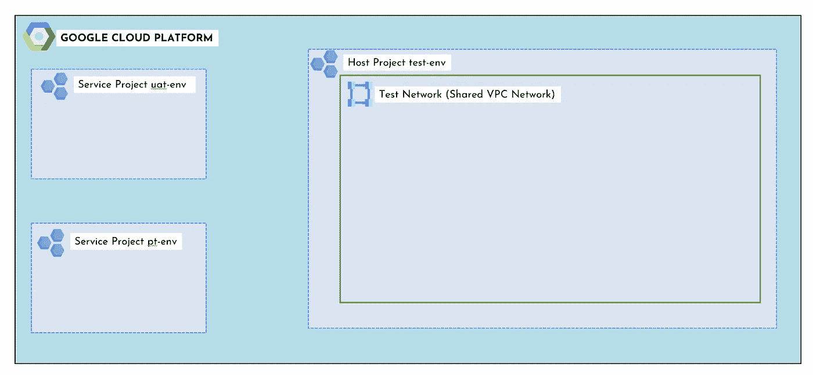
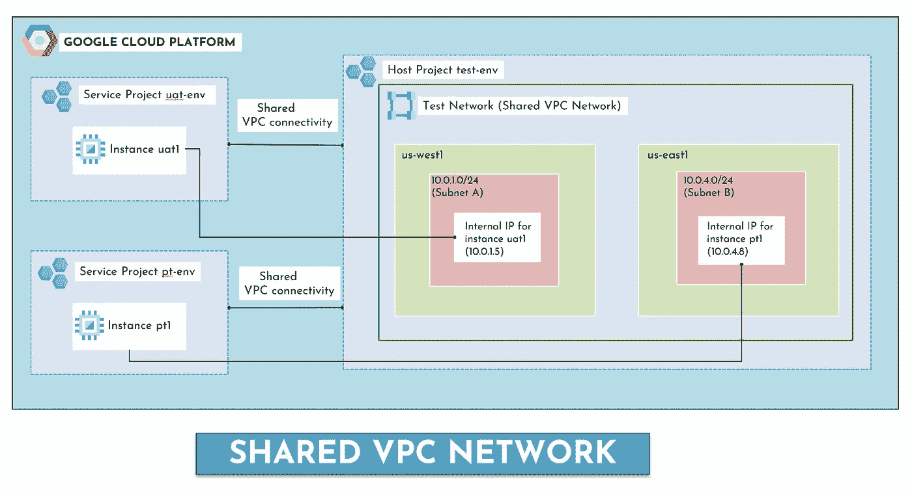
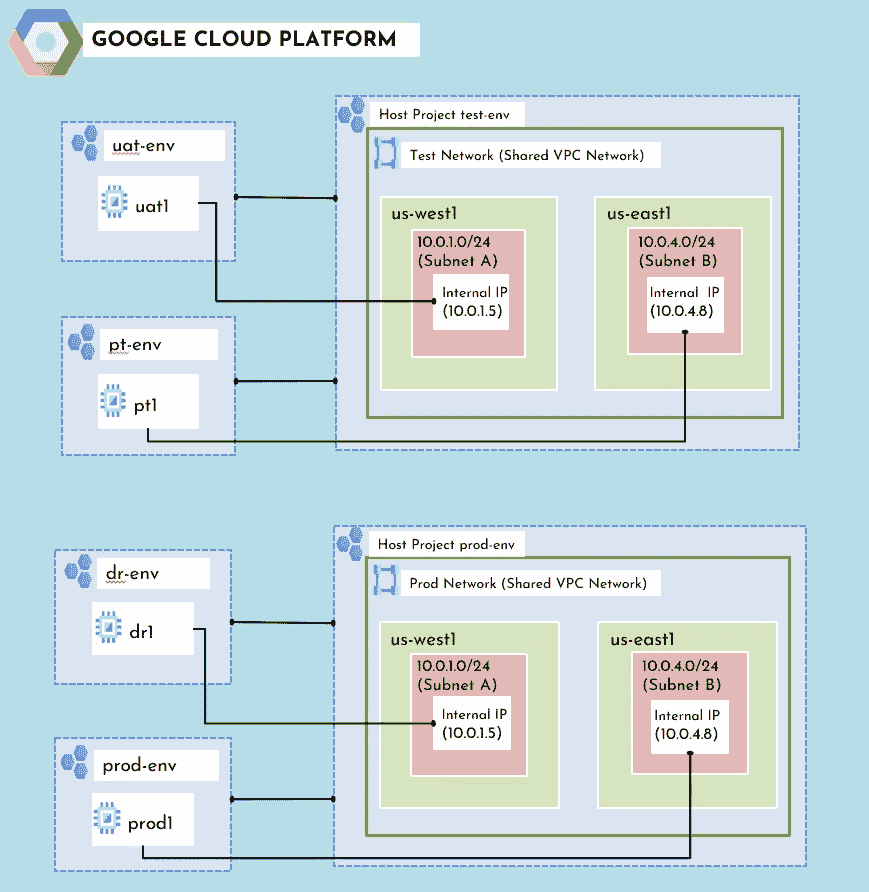

# 在谷歌云中共享 VPC

> 原文：<https://medium.com/google-cloud/shared-vpc-in-google-cloud-64527e0a409e?source=collection_archive---------0----------------------->

**共享 VPC** 允许组织将多个项目的资源连接到一个通用的虚拟专用云(VPC)网络，以便他们可以使用该网络的内部 IP 安全高效地相互通信。

> 与 VPC 对等不同，共享 VPC 连接同一个 T2 组织内的项目。

但是，当我们有 VPC 对等时，为什么还要使用共享 VPC 呢？🤔

**与 VPC 对等相比，使用共享 VPC 有很多好处:**

*   您不必处理不同项目中 VPC 之间 VPC 网络对等的复杂性和开销。
*   它简化了到本地环境的混合云网络链接，因为它只需要在共享 VPC 中创建，然后就可以由多个 VPC 使用。
*   您可以在一个中心位置管理所有网络路由、防火墙和子网，并且可以由专门的网络工程师团队来处理。

**用简单的语言概述共享 VPC:😎**

当您使用共享 VPC 时，您将一个项目指定为一个**主机项目**，并将一个或多个其他**服务项目**附加到它。

> 在上图中，组织的共享 VPC 管理员已经创建了一个**主机项目**并附加了两个**服务项目**。

主机项目中的 VPC 网络称为共享 VPC 网络。服务项目中合格的资源可以使用共享 VPC 网络中的子网。服务项目 uat-env 可以配置为访问共享 VPC 测试网络中的全部或部分子网。

共享 VPC 网络

*   管理员在美国西部地区的一个区域中创建了实例 uat1。该实例从 **10.0.1.0/24** CIDR 模块接收其内部 IP 地址 **10.0.1.5** 。
*   同样，Admin 在 zone us-east1 区域中创建了实例 pt1。该实例从 CIDR **10.0.4.0/24** 接收其内部 IP**10 . 0 . 4 . 8**

**让我们看看另一个有多个主机项目的例子:**

您可以创建和使用多个宿主项目；但是，每个服务项目只能附加到一个宿主项目。

**结论:**

虽然共享 VPC 提供了很多好处，但它可能不是所有情况下的最佳解决方案。确保您理解了用例，然后只使用符合需求的共享 VPC。例如，如果项目的所有管理员都想维护他们自己的网络，那么共享 VPC 就不太合适。

请随意观看下面关于 VPC 对等和共享 VPC 的视频。此视频是从云工程师助理认证考试的角度出发，针对 GCP 初学者制作的。

如果你喜欢上面的博客，欢迎鼓掌并关注我在云和 DevOps 上的精彩内容。