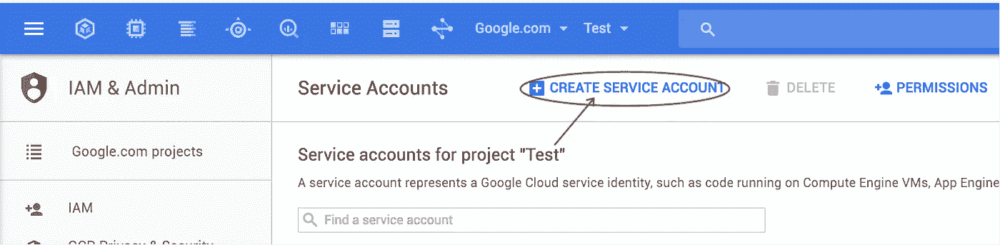
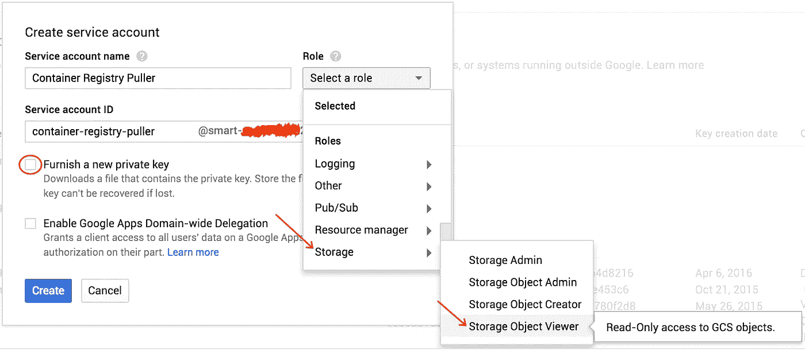

# 在 Google 容器注册表中共享 Docker 容器

> 原文：<https://medium.com/google-cloud/sharing-docker-containers-in-google-container-registry-1e816b88eae9?source=collection_archive---------0----------------------->

**想象一下这个场景:**

您正在遵循 Google Cloud 最佳实践，并且有一个针对您的开发环境的项目和一个针对您的生产环境的项目。您希望使用 Docker 来确保在 dev 中运行的代码与在 prod 中运行的代码相同。

你写你的代码，把它归档，然后测试它。太棒了，成功了！现在您想将其部署到生产环境中。您将容器推送到开发项目中的 [Google 容器注册表](http://gcr.io)。但是，如何将它引入到您的 prod 项目中呢？

如果您从源代码控制中取出源代码并再次重新创建 Docker 容器，您将为存储支付双倍的费用，并为您的部署管道带来更多的复杂性。呸！

您需要的是一种从您的开发环境中安全地提取 Docker 容器的方法。幸运的是，谷歌容器注册使这变得容易！

# 步骤 1:获取服务帐户

转到您的**开发项目中的 [IAM 服务帐户部分](http://console.cloud.google.com/iam-admin/serviceaccounts)，或者您的 Docker 容器被推送到的地方**。

创建一个新的服务帐户，将其命名为“Container Registry Puller”，赋予它“Storage Object Viewer”角色，并确保提供一个新的私钥。



当你点击“创建”时，一个 JSON 文件将被下载到你的计算机上。这是您的服务帐户密钥，将用于提取您的 Docker 图像。确保不要泄露这个键(不要将其签入源代码控制)，否则任何拥有它的人都可以拉你所有的容器和你存储在 GCS 中的其他对象！

将这个文件重命名为 **docker_key.json**

# 第二步:拉你的容器

我们现在可以在 Docker 中直接使用这个密钥文件。

在与您的 **docker_key.json** 相同的目录中，运行这个*命令:*

```
docker login -u _json_key -p “$(cat docker_key.json)” [https://gcr.io](https://gcr.io)
```

此时，您可以使用 Docker 来拉动和运行您的容器。你不需要做其他任何事情！

例如，如果您有一个名为“my-app:0.1”的容器，您可以使用以下命令来提取它:

```
docker pull gcr.io/<project-id>/my-app:0.1
```

就是这样！