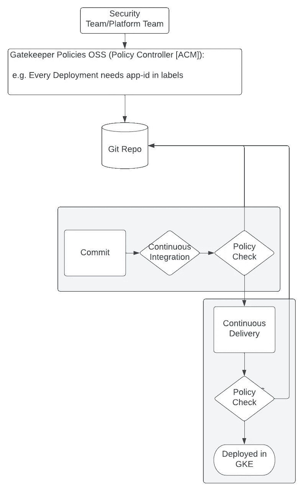
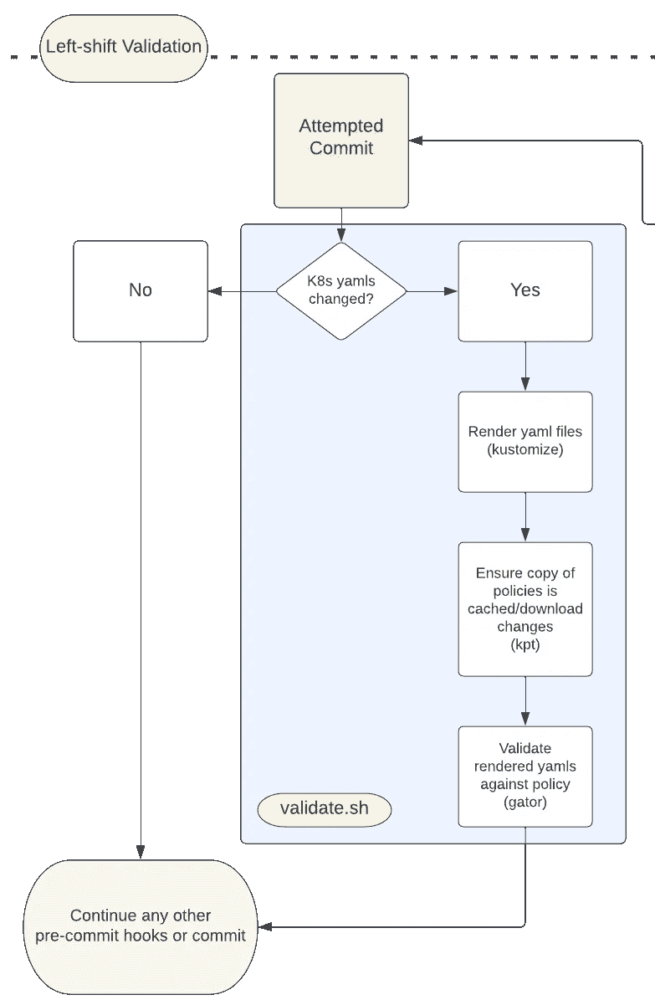
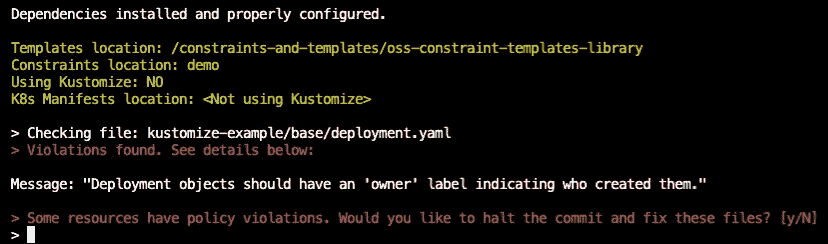

# Kubernetes 资源合规性左移(甚至更远)

> 原文：<https://medium.com/google-cloud/shifting-even-further-left-on-kubernetes-resource-compliance-8f96fb8c72eb?source=collection_archive---------2----------------------->

随着基础设施即代码在越来越多的组织中占据主导地位，代码开发的过程也在不断发展。这种新的现状，本质上包括更快的开发周期和每个新版本的质量改进，通常被称为“左移”

左移到底是什么意思？这有点难以定义。简单来说，左移指的是越来越多的开发管道自动化的过程，以便让开发人员对他们所做的事情有更多的控制权。这种增加的自由随后由资源的自动化测试来管理，例如，确保每次推送到存储库的高标准的遵从性和质量。

我前面提到了基础设施即代码(IaC)。在云环境中，实际的计算资源相当混乱。我们不再自己进入数据中心，设备管理和维护的所有方面都由云提供商处理。这种方法的好处是实际的基础设施变成了象征性的。我们说“我想在 AWS EC2 上运行四台 C6g 机器来承载这个工作负载”，或者“我想将我的 Google Kubernetes 引擎集群调整到 10 个节点。”注意这些短语有多像命令。那是 IaC。

# 让我们谈谈 Kubernetes 资源定义

我知道我开始听起来像是在介绍 [Terraform](https://www.terraform.io/) ，所以我会让我们回到正轨。Kubernetes 资源定义是以声明方式更新 Kubernetes 集群状态的 yaml 文件。让我们看一下这个例子:

```
**# Sample nginx deployment on Kubernetes:
apiVersion**: apps/v1
**kind**: Deployment
**metadata**:
  **name**: nginx-deployment
**spec**: 
  **replicas:** 3 **selector**:
    **matchLabels**:
      **app**: nginx 
      **owner:** "Bob Robertson"
  **template**:
    **metadata**:
      **labels**:
        **app**: nginx 
        **owner:** "Bob Robertson"
    **spec**:
      **containers**:
      - **name**: nginx
        **image**: nginx:1.14.2
        **ports**:
        - **containerPort**: 80
```

在这个文件中，我们可以看到我们的集群将寻找的大量数据点，例如资源的类型(在本例中是部署)、部署的名称、拥有该部署的人、要运行的应用程序的副本数量、标签以及要运行的容器映像。然后我们可以使用 ***kubectl apply*** 在集群中部署这个资源。想想看，我们正在使用这个文件来控制基础设施！

是的，Kubernetes 集群可能不是一个实际的计算机物理集群(它可能只是一台机器中包含的一群虚拟机)，但我们使用代码来控制、管理、更新和维护计算资源，无论它们可能有多混乱。多酷啊。非常酷。直到**“X”公司**的某个开发人员决定在这个部署上使用 ***kubectl apply*** :

```
**# Sample nginx deployment on Kubernetes:
apiVersion**: apps/v1
**kind**: Deployment
**metadata**:
  **name**: nginx-deployment
  **labels**:
    **app**: nginx
**spec**:
  **replicas**: 3
  **selector**:
    **matchLabels**:
      **app**: nginx
  **template**:
    **metadata**:
      **labels**:
        **app**: nginx
    **spec**:
      **containers**:
      - **name**: nginx
        **image**: nginx:1.14.2
        **ports**:
        - **containerPort**: 80
```

你发现问题了吗？也许你看到了两个 yaml 文件的区别，但是不要相信这种差异特别有问题。嗯，很抱歉打断你，但你怎么想真的不重要。如果这个特定的开发人员也不认为这是一个问题，这也没有关系。

## 缺失的“所有者”标签

“X”公司的工程经理一再告诉我们的开发人员，要为他们创建的任何资源添加所有者标签，以达到问责的目的。他们不太高兴这个错误就这样溜走了，并进入了生产环境。有哪些可能的方法来防止将来发生类似的事情？也许你可以:

1.  要求对“X”公司的代码库的每次提交进行人工代码审查，或者
2.  编写便笺提醒，让开发人员贴在他们的显示器上，或者甚至
3.  在他们的团队面前公开骂我们的开发者，通过无休止的羞辱给他们上了重要的一课。

自动化策略检查怎么样？如果“X”公司可以维护一个组织策略和约束的存储库，然后 Kubernetes 集群可以用它来验证每一个资源变更，那会怎么样？这就是像[开放策略代理](https://www.openpolicyagent.org/)和网守这样的工具发挥作用的地方。

# 自动化安全性和合规性

试图手动确保 Kubernetes 的资源合规性是容易出错和令人沮丧的。自动化策略实施可确保一致性，通过即时反馈降低开发延迟，并通过允许开发人员独立操作而不牺牲合规性来提高敏捷性。

在 Kubernetes 中，您可以通过[准入控制器 webhooks](https://kubernetes.io/docs/reference/access-authn-authz/extensible-admission-controllers/) 将策略决策从 API 服务器中分离出来，每当创建、更新或删除一个资源时都会执行 webhooks。[网守](https://open-policy-agent.github.io/gatekeeper/website/docs/)利用这些准入控制器 webhooks 来实施由[开放策略代理](https://github.com/open-policy-agent/opa)执行的基于自定义资源定义的策略，开放策略代理是用于云本地环境的策略引擎。

通常，组织的安全团队会维护一个网关守护设备资源的存储库，这些资源可以通过它们的种类标签来识别，例如 ConstraintTemplate:

```
**apiVersion:** templates.gatekeeper.sh/v1
**kind:** ConstraintTemplate
```

或者自定义策略标签:

```
**apiVersion**: constraints.gatekeeper.sh/v1beta1
**kind**: K8sRequiredLabels
```

然后，Gatekeeper 使用这些模板和约束来确定资源应该如何、何时以及为什么检查失败，以及当它失败时会发生什么。Gatekeeper 模板包含针对 Kubernetes 资源的特定更新的语言。这个逻辑是用[减压阀](http://openpolicyagent.org/docs/latest/policy-language/)编写的，重点是为引用嵌套文档提供强大的支持，确保查询正确无误。当一个资源被应用到一个集群时，Gatekeeper 可以在它有机会造成损害之前确定它是否真正属于那里。这是非常强大的东西，我确信它将真正帮助**“X”公司的**开发团队。

## **速度呢？**

我刚才描述的方式，听起来好像看门人只能存在于集群本身。那不完全正确。例如，有许多代码变更的敏捷组织可能会使用持续集成/持续部署(CI/CD)架构。CI/CD 管道将自动构建代码、编译二进制文件、运行单元测试，并安全地部署应用程序的新版本。有时这一切都是自动化的，但大多数时候，至少有一组人会在将提议的变更部署到生产环境之前对其进行检查。这些管道为开发人员完成了所有繁重的工作，同时还确保了不干涉的安全性和合规性。听起来好像很多，但是有一个问题:

**慢了**。我见过管道运行数小时后最终失灵。幸运的是，我只经历了几分钟的等待，但是 CI/CD 管道仍然需要一些时间来运行所有的测试和构建步骤。

然而，必须等待几分钟，直到我的管道向我显示 Gatekeeper 在我的一个部署中发现了违规，这仍然是不理想的。我需要纠正错误，重新提交我的提交，然后再次等待，看看它是否成功通过。

# 在本地运行网关守护设备测试

我听说许多组织也面临这个问题。显然，能够自动化安全性(或安全性的某些部分)是非常好的，但是速度在具有敏捷开发周期的组织中总是至关重要的。

幸运的是，Gatekeeper 项目中有一个名为 [Gator](https://open-policy-agent.github.io/gatekeeper/website/docs/gator) 的衍生项目。Gator 是一个命令行实用程序(CLI ),用于在本地环境中评估网关守护设备约束模板和约束，无需本地 Kubernetes 开发集群。因为 Gator 是 Gatekeeper 开源项目的一部分，所以社区一直在对它进行维护和改进。它还具有很高的性能，可以在几秒钟的约束下验证 Kubernetes 资源。这就是为什么它是我和我的朋友兼同事[珍妮·巴里安](https://github.com/janinebar)一起从事的一个特殊项目的主要成分。我们称之为[预验证](https://github.com/tdesrosi/pre-validate)，但是如果你能想出一个更吸引人/时髦的名字，请告诉我们！如果你有兴趣为代码做贡献，请随意[分叉库](https://github.com/tdesrosi/pre-validate)并尝试一下！

## [预验证](https://github.com/tdesrosi/pre-validate)

Pre-Validate 使用 Gator、 [Kpt](https://kpt.dev/guides/rationale) 和 [Kustomize](https://kustomize.io/) 等工具，在任何时候将更改的资源提交到分支时，自动对 Kubernetes 资源运行符合性测试。它将 CI/CD 管道的策略验证步骤带到了管道的开始，这有助于通过提供关于他们的工作是否符合组织策略的快速、一致的反馈来增强开发人员的能力。

它通过向 Git 的“hooks”文件夹中写入 Bash 脚本来工作。提交前脚本由 Git 自动运行，然后才能提交(顾名思义)。该脚本将定位已更改的 Kubernetes 资源，下载并组织网关守护设备策略模板和约束，然后使用 Gator 根据这些模板和约束测试每个资源。

这是一个典型的 CI/CD 管道，在整个过程中都有 OSS 策略验证。在这种情况下，我们使用 Gatekeeper 来定义约束和 ConstraintTemplates，它们存储在一个 Git Repo 中，可以通过管道(Jenkins，Google Cloud Build 等)访问。).



典型的 CI/CD 渠道，包括贯穿始终的策略验证步骤。

左移验证所做的是将这些多余的验证步骤扩展到开发人员的本地开发环境中，在管道的更早期，就像这样:



开发人员尝试提交，预验证处理剩下的事情！

# 需要注意的重要事项

## 左移验证是一种增强，而不是替代

我们不打算让左移验证取代其他自动化策略控制系统。相反，这个项目可以通过增强交付管道来帮助支持开发 Kubernetes 清单的开发人员。使用左移验证意味着，如果您的部署将在几秒钟而不是几分钟或几小时内失败，您可以了解到*。*

如果不使用左移验证来左移自动策略验证，唯一会发生的事情是，如果有问题，您需要花更长的时间来了解。仅此而已！



剧本在发挥作用！我提交了我们开发人员有问题的代码…

## 结束语

虽然左移可能听起来像是噱头，但它为优化我们对完全托管的云环境以及随之而来的所有托管服务的使用提供了一个有用的框架。Kubernetes 已经存在了一段时间，但是由于硬件在许多情况下非常混乱，所以很难真正理解管理不当的资源的安全含义。

像 Open Policy Agent 和 Gatekeeper 这样的工具可以帮助组织对这些新环境做出响应，它们都是自动化法规遵从性的绝佳案例。他们依靠他们的社区，他们的社区也依靠他们。珍妮和我非常高兴能在如此接近这些世界的地方工作，我们都希望在未来很长一段时间内继续我们的工作。

感谢您的时间，如果您对我们的项目有任何反馈，请访问 Github！我们一直在寻求帮助和改进建议。