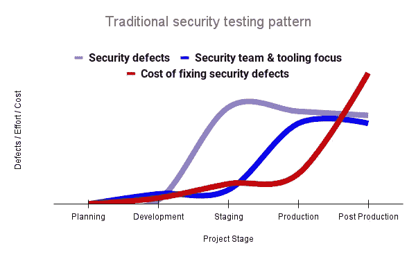
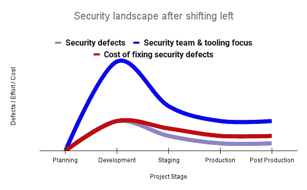
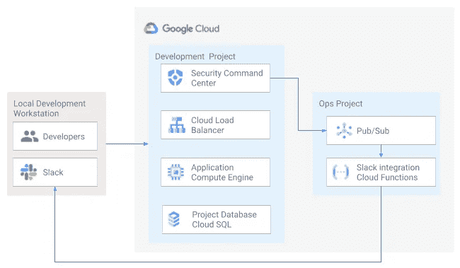
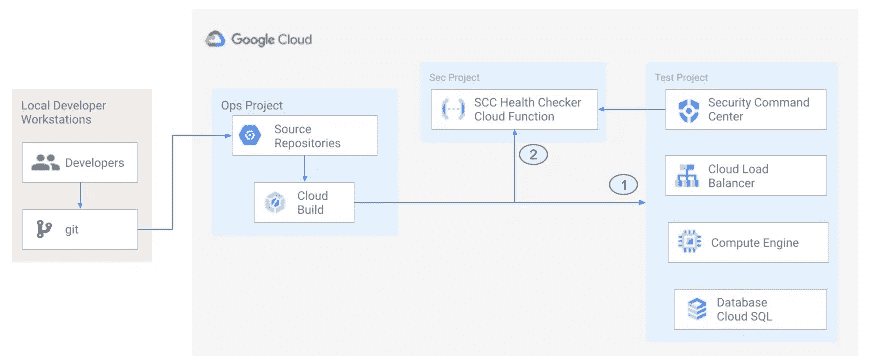

# 谷歌云基础设施的安全性左移

> 原文：<https://medium.com/google-cloud/shifting-left-on-security-with-google-cloud-infrastructure-1cddf583d46?source=collection_archive---------0----------------------->

*(本文由 Jason Bisson、Bakh Inamov、Jeff Levine、Lanre Ogunmola、Luis Urena 和 Holly Willey 共同撰写，他们都是谷歌云的安全合规专家&。)*

T “左移”的概念在软件开发生命周期中得到了广泛的推广。这个概念背后的思想是，在开发过程中更早地(“向左”)引入安全性将导致生产中更少的与软件相关的安全缺陷。

当组织在云中部署他们的环境时，他们必须考虑由于与云相关的错误配置而产生的安全缺陷。在这篇博客中，我们将探讨如何通过在开发周期的早期识别此类缺陷来“左移”云，并提高生产部署的安全性。

# 一些背景

谷歌的 DevOps 研究和评估(DORA)团队在 2016 年[DevOps 报告](https://services.google.com/fh/files/misc/state-of-devops-2016.pdf)中首次强调了将安全性集成到 devo PS 中的重要性。该报告讨论了测试(包括安全测试)在软件开发生命周期中的位置。特别是，大多数安全测试工作和工具的使用都发生在一个版本开发完成之后。一旦确定了这些缺陷，补救可能涉及架构变更和额外的集成测试，从而导致额外的成本和延迟，如图 1 所示。例如，生产中的安全缺陷可能导致违反 GDPR，罚款高达全球年收入的 4% 。

图 1 —左移前的缺陷/努力/成本

在更改开发生命周期并将安全测试插入到开发阶段之后，我们可以更早地识别安全缺陷，并更快地执行相应的补救措施。这使得后期制作中的缺陷更少，并减少了补救工作和架构更改。这个在早期引入安全性的过程被称为“左移”

图 2—左移后的缺陷/努力/成本

请注意图 2 中安全团队时间和工具的投资发生得更早，导致缺陷数量和与延迟相关的成本的减少。此外，DORA 的 DevOps 报告指出了自动化测试的好处。自动化测试提供了一致性测试的性能，而不需要开发人员的额外技能或干预。开发人员可以继续快速迭代，而团队领导和项目经理可以确信常见的缺陷正在被识别和修复。

# 从代码到云

DORA 团队关于*代码安全*的发现也可以应用到*云安全*上。随着越来越多的组织将其工作负载部署到云，考虑测试云基础架构本身的安全性的好处非常重要。云资源的错误配置会导致安全事故，进而导致数据丢失。这种错误配置的示例包括过于宽松的防火墙规则、弱密码，或者对服务帐户和存储桶不正确的身份和访问管理(IAM)权限。我们可以利用谷歌云服务在开发过程的早期识别这些错误配置，并防止此类错误在生产中出现，以降低未来补救的成本。

我们工具库中的关键工具是[安全指挥中心](https://cloud.google.com/security-command-center)和[云构建](https://cloud.google.com/build)。安全指挥中心提供对 Google 云组织内的错误配置、漏洞和威胁的可见性。当保护您的云基础架构(虚拟机、容器、web 应用程序)免受威胁或确定与合规性框架(如 CIS 基准、PCI-DSS、NIST 800–53 或 ISO 27001)的潜在差距时，这些信息至关重要。Security Command Center 通过允许单个开发人员在项目级别上看到安全发现，同时仍然允许安全操作的全局可见性，进一步支持将安全转移到左侧的概念。云构建支持创建云原生 CI/CD 管道。您可以在管道中插入自定义健康检查，以评估某些条件(如安全指标)，并在检测到异常时使管道失败。我们现在将探索利用这些工具的两个用例

# 安全健康检查器

安全健康检查器背后的想法是持续监控 Google 云项目的安全健康，并及时通知项目成员安全发现。图 3 显示了开发人员与包含网络、计算和数据库组件的 Google 云环境的交互。安全指挥中心已配置为监控项目的运行状况。

当安全指挥中心发现问题时，它会将问题发送到云发布/订阅主题。然后，云功能将发布到该主题的发现发送到由基础设施开发人员监控的松弛通道。由于拼写检查器对拼写错误提供及时的反馈，因此安全健康检查器对 Google Cloud 项目中可能导致部署失败或后期制作妥协的安全错误配置提供及时的反馈。开发者不需要额外的努力。

**图 3:谷歌云环境中的安全指挥中心**

# 安全管道检查器

除了在开发过程中使用 Security Command Center 及时通知安全问题之外，我们还可以通过使用 Security Command Center 和 Cloud Build 将安全检查集成到 CI/CD 管道中，如图 4 所示。

**图 4:安全管道检查器架构**

管道从开发人员将一些代码签入 git 存储库开始。这个存储库被镜像到[云资源存储库](https://cloud.google.com/source-repositories)。构建触发器将开始构建过程。构建管道将包括几分钟的短暂等待时间，以便安全指挥中心有机会识别安全漏洞。虽然乍一看，短暂的延迟似乎是不可取的，但在此期间进行的分析可以减少生产后的安全缺陷。在等待期结束时，作为安全健康检查器的[云功能](https://cloud.google.com/functions)将评估来自安全指挥中心的发现(图 4 中的连接器 1)。如果验证器确定存在不可接受的安全发现，验证器将向管道中注入一个失败指示，以终止构建过程(图 4 中的连接器 2)。在将代码成功部署到生产环境之前，开发人员将能够看到故障触发器并修复它们。这与 2016 年开发运维状况报告中的发现形成了鲜明对比，在该报告中，没有将安全性集成到开发运维流程中的组织在补救安全问题上花费的时间比那些在安全性方面“左移”的组织多 50%。

# 结束语

DORA 的 2016 年 DevOps 报告指出了安全“左移”的必要性，在开发过程中更早地引入安全，以尽早识别安全漏洞，减少后期制作的缓解工作。该报告还指出了自动化测试的必要性和好处。我们研究了使用谷歌云服务实现这些目标的两种方式。安全健康检查器使用安全命令中心和 Slack 向开发人员提供反馈，以便在开发人员进行开发活动时通知他们安全发现。安全管道检查器使用安全命令中心作为云构建管道的一部分，以便在构建过程中发现漏洞时终止构建管道。如果您想实现安全健康检查器和安全管道检查器，请查看 [GitHub 库](https://github.com/google/terraform-google-security-health-checker)。我们希望这些例子能帮助你使用谷歌云服务“左移”。编码快乐！