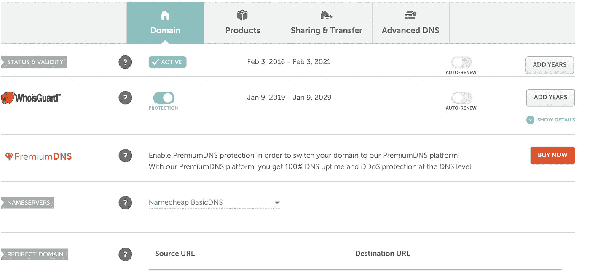
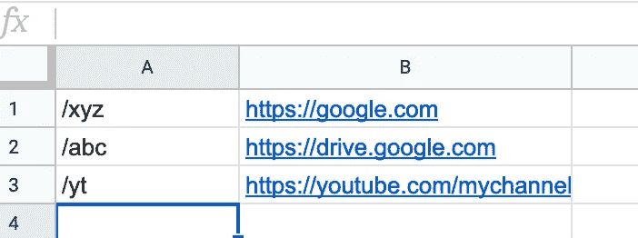

# 使用谷歌功能和谷歌表单缩短网址

> 原文：<https://medium.com/google-cloud/shortening-urls-with-google-functions-and-google-sheets-da3a2003557a?source=collection_archive---------1----------------------->

我们都偶然发现了像 bit.ly、tinyurl.com 或 goo.gl 这样的网址缩短服务(最后一个不久前被关闭了)。它们让我们不必交流难以拼写或太长的 URL(有人试图通过电话口述 Google Drive 文件夹的 URL 吗？).因为如果你可以复制/粘贴一个 url，这可能很容易，但如果你需要以有限长度的文本(如短信)发送给某人，或者你想将其编码为二维码(较短的字符串更容易扫描)，最好有一个像 http://bit.ly/something 这样的 url(随机 URL，似乎会导致带有歌曲的 MP3)而不是像这样的 URL[https://drive . Google . com/drive/folders/0 by wo 0 ao1ei _ Mn 1 bed 3 vnruzenku](https://drive.google.com/drive/folders/0ByWO0aO1eI_MN1BEd3VNRUZENkU)(半随机驱动器链接)

像这样的服务只需要一个数据库，将短 url(/上例中的某个东西)与长 URL([https://static . stereogum . com/blogs . dir/2/files/MP3/Glen % 20 hansard % 20-% 20 hair shirt % 20(同一示例中的 Late % 20 night % 20 with % 20 Jimmy % 20 Fallon). MP3](https://static.stereogum.com/blogs.dir/2/files/mp3/Glen%20Hansard%20-%20Hairshirt%20(Late%20Night%20With%20Jimmy%20Fallon).mp3))关联起来，并且在接收到对短 URL 的请求时，将向请求客户端发出 HTTP 302 重定向。

在设置中，我建议这个数据库的角色由 Google Sheet 来完成(我应该从一开始就提到，这更多的是一个个人 URL 缩短列表，而不是公开的东西——尽管最终公开它只是意味着给任何人对所述 Google Sheet 的写访问权),并且查找逻辑由一个 [Google Cloud 函数](https://console.cloud.google.com/functions/list)来实现。

# 域设置

为了使它完全无服务器，我们可以使用域名注册商的功能(我用的是 [Namecheap](http://www.namecheap.com) )来批量解析特定域/子域的请求到预定义的 URL(你的云功能的 URL)。对于 name price，此功能适用于在管理(针对相应的域)/重定向域下使用其基本 DNS 的任何域



廉价域名管理

假设这个管理页面是针对 **short.domain** 的，我们可以通过在源 URL 中输入 short.domain 并在目标 URL 中输入函数的 URL(我们将在下面获得)来添加一个重定向。

# 谷歌工作表

由于我们的“数据库”将是一个 Google Sheet，只需在 Google Drive 中创建一个电子表格文档，命名第一个(默认)电子表格“链接”,并通过在列 A 中输入短 URL 和在列 B 中输入长 URL 来填充它，就像这样



Google 工作表中的 URL 映射

在这个例子中，http://short.domain/xyz 将不得不导致[https://google.com](https://google.com)而 http://short.domain/yt 到 YouTube 的链接列在那里。你需要注意(并写/复制)的是文档 id(g sheet 的 url 看起来类似于 https://docs.google.com/spreadsheets/d/123abcdef/edit#gid=0 的，使得 123abcdef 成为文档 id)

# 谷歌云控制台

如果你还没有一个项目，你需要一个在[谷歌云平台](https://console.cloud.google.com/projectcreate)中定义的项目。创建项目后，将为其创建一个类似于 my-url-project@appspot.gserviceaccount.com 的服务帐户(my-url-project 是这个新项目的项目 ID)。将此电子邮件添加到对上面创建的电子表格具有读取权限的帐户列表中(打开文档并单击右上角的 Share)。

从那以后就一帆风顺了，如果你从这里使用代码。

简而言之，代码的作用是:

*   公开一个从环境中读取一些参数的函数(getLink 见[此处](https://github.com/fixone/navigator/blob/master/index.js#L37))(您也可以通过命令行传递这些参数，但前提是您自己在某个服务器上运行它——这违背了无服务器的目的)。我们将在 GCF 定义中使用这个导出的函数。
*   这个函数读取文档中的一个工作表，并从中获取列 A 和 B。
*   然后，它继续遍历 A 列中的项目，查找 req.url 中收到的 url。如果找到匹配项，它将发送一个重定向到 b 列中相应的项目。否则，它将把用户重定向到一个默认的 URL。
*   您需要提交(使用 [Git](https://git-scm.com/) )两个文件(index.js 和 package.json)到您自己在[Google Cloud Source Repositories](https://source.cloud.google.com/)上的 repo。我们在部署阶段需要这个。据推测，如果是公开回购，你也可以使用 github.com(但我没有尝试过，它可能不会工作)
*   一旦完成，你将需要部署它——这可以通过 [GCF 控制台](https://console.cloud.google.com/functions/add)或使用 [gcloud](https://cloud.google.com/sdk/gcloud) 来实现。我更喜欢后者，因为它可以更快地进行重新部署(例如，如果您需要在一次新的提交后更改函数)。部署命令是这样的

```
gcloud functions deploy **navigator** --set-env-vars DOC_ID=123abcdef,SHEET_NAME=links,DEFAULT_URL=https://docs.google.com --allow-unauthenticated --memory 128MB --project my-url-project --region europe-west2 --timeout 10s --runtime nodejs8 --source https://source.developers.google.com/projects/my-url-project/repos/navigator/moveable-aliases/master/paths/ --trigger-http --entry-point **getLink**
```

正如您所猜测的那样——第一个粗体项目是函数名(触发器 url 将包含它),最后一个粗体项目是函数名(取自提交源代码的存储库中的源代码)。命令中出现的其他参数有

*   运行时:这是一个 nodejs v8 函数(用于编写逻辑的语言)
*   trigger-http:该函数应该通过 HTTP/S 来触发
*   区域:在哪里部署此功能
*   set-env-vars:我们传递三个变量 DOC_ID(在 Drive 中创建文档时检索)、SHEET_NAME(带有链接的工作表的名称)、DEFAULT_URL(如果不匹配，重定向到哪里)

部署后，GCP 将为该功能创建一个触发器，如下所示

[https://Europe-west 2-my-URL-project . cloud functions . net/navigator](https://europe-west2-my-url-project.cloudfunctions.net/navigator)

(europe-west2 是因为我们部署在该地区，my-url-project 是因为这是我们的项目名称，最后一部分是 navigator，因为这是我们想要调用的函数)。

现在，任何对例如[https://Europe-west 2-my-URL-project . cloud functions . net/navigator/ABC](https://europe-west2-my-url-project.cloudfunctions.net/navigator/abc)(假设电子表格如上定义)的调用都会将用户重定向到[https://drive.google.com。](https://drive.google.com.)注意(如果你以前使用过 expressJS，可能会不太直观)req.url 将被设置为/abc，即使该函数响应/navigator/abc。

那都是乡亲们！